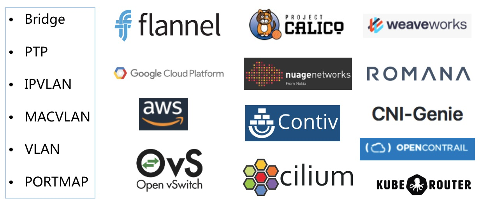

Calico Cni code learning


### CNI 标准


#### 1. 开源标准

[CNI标准](https://github.com/containernetworking/cni)

[plugins](https://github.com/containernetworking/plugins)

[转载自jimmysong](https://jimmysong.io/kubernetes-handbook/concepts/cni.html)

CNI（Container Network Interface）是CNCF旗下的一个项目，由一组用于配置Linux容器的网络接口的规范和库组成，同时还包含了一些插件。CNI仅关心容器创建时的网络分配，和当容器被删除时释放网络资源。通过此链接浏览该项目：https://github.com/containernetworking/cni。

Kubernetes源码的`vendor/github.com/containernetworking/cni/libcni`目录中已经包含了CNI的代码，也就是说kubernetes中已经内置了CNI。

## 接口定义

CNI的接口中包括以下几个方法：

```go
type CNI interface {
    AddNetworkList(net *NetworkConfigList, rt *RuntimeConf) (types.Result, error)
    DelNetworkList(net *NetworkConfigList, rt *RuntimeConf) error

    AddNetwork(net *NetworkConfig, rt *RuntimeConf) (types.Result, error)
    DelNetwork(net *NetworkConfig, rt *RuntimeConf) error
}
Copy
```

该接口只有四个方法，添加网络、删除网络、添加网络列表、删除网络列表。

## 设计考量

CNI设计的时候考虑了以下问题：

- 容器运行时必须在调用任何插件之前为容器创建一个新的网络命名空间。
- 然后，运行时必须确定这个容器应属于哪个网络，并为每个网络确定哪些插件必须被执行。
- 网络配置采用JSON格式，可以很容易地存储在文件中。网络配置包括必填字段，如`name`和`type`以及插件（类型）。网络配置允许字段在调用之间改变值。为此，有一个可选的字段`args`，必须包含不同的信息。
- 容器运行时必须按顺序为每个网络执行相应的插件，将容器添加到每个网络中。
- 在完成容器生命周期后，运行时必须以相反的顺序执行插件（相对于执行添加容器的顺序）以将容器与网络断开连接。
- 容器运行时不能为同一容器调用并行操作，但可以为不同的容器调用并行操作。
- 容器运行时必须为容器订阅ADD和DEL操作，这样ADD后面总是跟着相应的DEL。 DEL可能跟着额外的DEL，但是，插件应该允许处理多个DEL（即插件DEL应该是幂等的）。
- 容器必须由ContainerID唯一标识。存储状态的插件应该使用（网络名称，容器ID）的主键来完成。
- 运行时不能调用同一个网络名称或容器ID执行两次ADD（没有相应的DEL）。换句话说，给定的容器ID必须只能添加到特定的网络一次。

## CNI插件

CNI插件必须实现一个可执行文件，这个文件可以被容器管理系统（例如rkt或Kubernetes）调用。

CNI插件负责将网络接口插入容器网络命名空间（例如，veth对的一端），并在主机上进行任何必要的改变（例如将veth的另一端连接到网桥）。然后将IP分配给接口，并通过调用适当的IPAM插件来设置与“IP地址管理”部分一致的路由。

### 参数

CNI插件必须支持以下操作：

#### 将容器添加到网络

参数：

- **版本**。调用者正在使用的CNI规范（容器管理系统或调用插件）的版本。
- **容器ID** 。由运行时分配的容器的唯一明文标识符。一定不能是空的。
- **网络命名空间路径**。要添加的网络名称空间的路径，即`/proc/[pid]/ns/net`或绑定挂载/链接。
- **网络配置**。描述容器可以加入的网络的JSON文档。架构如下所述。
- **额外的参数**。这提供了一个替代机制，允许在每个容器上简单配置CNI插件。
- **容器内接口的名称**。这是应该分配给容器（网络命名空间）内创建的接口的名称；因此它必须符合Linux接口名称上的标准限制。

结果：

- **接口列表**。根据插件的不同，这可以包括沙箱（例如容器或管理程序）接口名称和/或主机接口名称，每个接口的硬件地址以及接口所在的沙箱（如果有的话）的详细信息。
- **分配给每个接口的IP配置**。分配给沙箱和/或主机接口的IPv4和/或IPv6地址，网关和路由。
- **DNS信息**。包含nameserver、domain、search domain和option的DNS信息的字典。

#### 从网络中删除容器

参数：

- **版本**。调用者正在使用的CNI规范（容器管理系统或调用插件）的版本。
- **容器ID** ，如上所述。
- **网络命名空间路径**，如上定义。
- **网络配置**，如上所述。
- **额外的参数**，如上所述。
- **上面定义的容器**内的接口的名称。

- 所有参数应与传递给相应的添加操作的参数相同。
- 删除操作应释放配置的网络中提供的containerid拥有的所有资源。

报告版本

- 参数：无。
- 结果：插件支持的CNI规范版本信息。

```json
{
“cniVersion”：“0.3.1”，//此输出使用的CNI规范的版本
“supportedVersions”：[“0.1.0”，“0.2.0”，“0.3.0”，“0.3.1”] //此插件支持的CNI规范版本列表
}
Copy
```

CNI插件的详细说明请参考：[CNI SPEC](https://github.com/containernetworking/cni/blob/master/SPEC.md)。

### IP分配

作为容器网络管理的一部分，CNI插件需要为接口分配（并维护）IP地址，并安装与该接口相关的所有必要路由。这给了CNI插件很大的灵活性，但也给它带来了很大的负担。众多的CNI插件需要编写相同的代码来支持用户需要的多种IP管理方案（例如dhcp、host-local）。

为了减轻负担，使IP管理策略与CNI插件类型解耦，我们定义了IP地址管理插件（IPAM插件）。CNI插件的职责是在执行时恰当地调用IPAM插件。 IPAM插件必须确定接口IP/subnet，网关和路由，并将此信息返回到“主”插件来应用配置。 IPAM插件可以通过协议（例如dhcp）、存储在本地文件系统上的数据、网络配置文件的“ipam”部分或上述的组合来获得信息。

#### IPAM插件

像CNI插件一样，调用IPAM插件的可执行文件。可执行文件位于预定义的路径列表中，通过`CNI_PATH`指示给CNI插件。 IPAM插件必须接收所有传入CNI插件的相同环境变量。就像CNI插件一样，IPAM插件通过stdin接收网络配置。

## 可用插件

### Main：接口创建

- **bridge**：创建网桥，并添加主机和容器到该网桥
- **ipvlan**：在容器中添加一个[ipvlan](https://www.kernel.org/doc/Documentation/networking/ipvlan.txt)接口
- **loopback**：创建一个回环接口
- **macvlan**：创建一个新的MAC地址，将所有的流量转发到容器
- **ptp**：创建veth对
- **vlan**：分配一个vlan设备

### IPAM：IP地址分配

- **dhcp**：在主机上运行守护程序，代表容器发出DHCP请求
- **host-local**：维护分配IP的本地数据库

### Meta：其它插件

- **flannel**：根据flannel的配置文件创建接口
- **tuning**：调整现有接口的sysctl参数
- **portmap**：一个基于iptables的portmapping插件。将端口从主机的地址空间映射到容器。

## 参考

- https://github.com/containernetworking/cni
- https://github.com/containernetworking/plugins
- [Container Networking Interface Specification](https://github.com/containernetworking/cni/blob/master/SPEC.md#container-networking-interface-specification)
- [CNI Extension conventions](https://github.com/containernetworking/cni/blob/master/CONVENTIONS.md)


### 如何自定义CNI


### k8s 启动pod分配ip流程

Kubernetes Pod 中的其他容器都是Pod所属pause容器的网络，创建过程如下：

1. kubelet县创建pause容器生成network  namespace
2. 调用网络CNI driver
3. CNI driver 根据配置调用具体的cni插件
4. cni插件给pause容器配置网络
5. pod中其他的容器都适用pause容器的网络

所有CNI插件均支持通过环境变量和标准输入传入参数：

```shell
$ echo '{"cniVersion":"0.3.1","name":"mynet","type":"macvlan","bridge":"cni0","isGateway":true,"ipMasq":true,"ipam":{"type":"host-local","subnet":"10.244.1.0/24","routes":[{"dst":"0.0.0.0/0"}]}}'|sudo CNI_COMMAND=ADD CNI_NETNS=/var/run/netns/a CNI_PATH=./bin CNI_IFNAME=eth0 CNI_CONTAINERID=a CNI_VERSION=0.3.1 ./bin/bridge
```

常见的CNI网络插件：




### Calico 简介


### CNI-plugin


