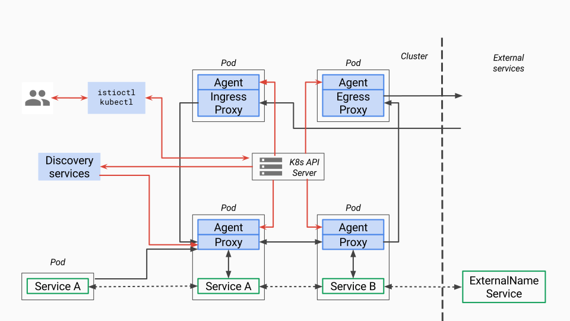

[转载来源](https://www.servicemesher.com/blog/istio-service-mesh-source-code-pilot-agent-deepin/)

​	

所谓的pilot包含两个组件：`pilot-agent`和`pilot-discovery`。图里的agent对应pilot-agent二进制，proxy对应envoy二进制，它们两个在同一个容器中，discovery service对应pilot-discovery二进制，在另外一个跟应用分开部署的单独的deployment中。

1. **discovery service**：从Kubernetes apiserver list/watch service/endpoint/pod/node等资源信息，监听istio控制平面配置信息（Kubernetes CRD），翻译为envoy可以直接理解的配置格式。
2. **proxy**：也就是envoy，直接连接discovery service，间接地从Kubernetes apiserver等服务注册中心获取集群中微服务的注册情况
3. **agent**：本文分析对象pilot-agent，生成envoy配置文件，管理envoy生命周期
4. **service A/B**：使用了istio的应用，如Service A/B的进出网络流量会被proxy接管

> 对于模块的命名方法，本文采用模块对应源码main.go所在包名称命名法。其他istio分析文章有其他命名方法。比如pilot-agent也被称为istio pilot，因为它在Kubernetes上的部署形式为一个叫istio-pilot的deployment。

## pilot-agent的部署存在形式

`pilot-agent`在pilot/cmd包下面，是个单独的二进制。

`pilot-agent`跟`envoy`打包在同一个docker镜像里，镜像由Dockerfile.proxy定义。Makefile（include了tools/istio-docker.mk）把这个dockerfile build成了`${HUB}/proxy:${TAG}`镜像，也就是Kubernetes里跟应用放在同一个pod下的sidecar。非Kubernetes情况下需要把pilot-agent、envoy跟应用部署在一起，这个就有点“污染”应用的意思了。

> 支持v2 api的sidecar镜像为proxyv2，镜像中包含的pilot-agent和envoy二进制文件和proxy镜像中的完全相同，只是使用不同的envoy bootstrap配置（envoy_bootstrap_tmpl.json vs. envoy_bootstrap_v2.json）。但是当前仅完成部分开发工作，makefile中build proxyv2镜像的target默认也不会自动执行。
>
> 以上的HUB和TAG是编译istio源码过程中makefile中的一些变量，HUB对应镜像保存的仓库，TAG默认为istio版本号，如0.8.0。

## pilot-agent功能简述

在proxy镜像中，`pilot-agent`负责的工作包括：

1. **生成envoy的配置**
2. **启动envoy**
3. **监控并管理envoy的运行状况，比如envoy出错时pilot-agent负责重启envoy，或者envoy配置变更后reload envoy**

而**envoy负责接受所有发往该pod的网络流量**，**分发所有从pod中发出的网络流量**。

> 根据代码中的sidecar-injector-configmap.yaml（用来配置如何自动化地inject istio sidecar），inject过程中，除了proxy镜像作为sidecar之外，每个pod还会带上initcontainer（Kubernetes中的概念），具体镜像为proxy_init。proxy_init通过注入iptables规则改写流入流出pod的网络流量规则，使得流入流出pod的网络流量重定向到proxy的监听端口，而应用对此无感。

## pilot-agent主要功能分析之一：生成envoy配置

`envoy`的配置主要在`pilot-agent`的`init`方法与`proxy`命令处理流程的前半部分生成。其中`init`方法为pilot-agent二进制的命令行配置大量的flag与flag默认值，而`proxy`命令处理流程的前半部分负责将这些flag组装成为envoy的配置`ProxyConfig`对象。下面分析几个相对重要的配置。

### role

`pilot-agent`的`role`类型为model包下的`Proxy`，决定了pilot-agent的“角色”，role包括以下属性：

1. `Type` pilot-agent有三种运行模式。根据`role.Type`变量定义，类型为model.Proxy，定义在context.go文件中，允许的3个取值范围为：
   1. `“sidecar”` 默认值，可以在启动pilot-agent，调用proxy命令时覆盖。**Sidecar type is used for sidecar proxies in the application containers**
   2. `“ingress”` Ingress type is **used for cluster ingress proxies**
   3. `“router”` Router type is **used for standalone proxies acting as L7/L4 routers**
2. `IPAddress`,` ID`, `Domain` 它们都可以通过`pilot-agent`的proxy命令的对应flag来提供用户自定义值。如果用户不提供，则会在proxy命令执行时，**根据istio连接的服务注册中心（service registry）类型的不同，会采用不同的配置方式**。**agent当前使用的服务注册中心类型保存在pilot-agent的registry变量里**，在`init`函数中初始化为默认值`Kubernetes`。当前只处理以下三种情况：
   1. Kubernetes
   2. Consul
   3. Other

| registry值 | role.IPAddress           | rule.ID                                | role.Domain                             |
| :--------- | :----------------------- | :------------------------------------- | :-------------------------------------- |
| Kubernetes | 环境变量INSTANCE_IP      | 环境变量POD_NAME.环境变量POD_NAMESPACE | 环境变量POD_NAMESPACE.svc.cluster.local |
| Consul     | private IP,默认127.0.0.1 | IPAddress.service.consul               | service.consul                          |
| Other      | private IP,默认127.0.0.1 | IPAddress                              | “”                                      |

其中的private ip通过`WaitForPrivateNetwork`函数获得。


**Istio需要从服务注册中心（service registry）获取微服务注册的情况**。

当前版本中istio可以对接的服务注册中心类型包括：

**Mock**

MockRegistry is a service registry that contains 2 hard-coded test services

**Config**

ConfigRegistry is a service registry that listens for service entries in a backing ConfigStore

**Kubernetes**

KubernetesRegistry is a service registry backed by k8s API server

**Consul**

ConsulRegistry is a service registry backed by Consul

**Eureka**

EurekaRegistry is a service registry backed by Eureka

**CloudFoundry**

CloudFoundryRegistry is a service registry backed by Cloud Foundry.

> [官方文档](https://istio.io/zh/docs/concepts/what-is-istio/)说当前支持Kubernetes、Nomad with Consul，未来准备支持 Cloud Foundry、Apache Mesos。另外根据[官方的feature成熟度文档](https://istio.io/zh/about/feature-stages/)，当前只有Kubernetes的集成达到stable程度，Consul、Eureka和Cloud Foundry都还是alpha水平。

### envoy配置文件及命令行参数

agent.waitForExit会调用envoy.Run方法启动envoy进程，为此需要获取envoy二进制所在文件系统路径和flag两部分信息：

1. envoy二进制所在文件系统路径：evony.Run通过proxy.config.BinaryPath变量得知envoy二进制所在的文件系统位置，proxy就是envoy对象，config就是pilot-agent的main方法在一开始初始化的proxyConfig对象。里面的BinaryPath在pilot-agent的init方法中被初始化，初始值来自`pilot/pkg/model/context.go`的`DefaultProxyConfig`函数，值是`/usr/local/bin/envoy`
2. envoy的启动flag形式为下面的`startupArgs`，包含一个`-c`指定的配置文件，还有一些flag。除了下面代码片段中展示的这些flag，还可以根据启动agent时的flag，再加上`--concurrency`, `--service-zone`等flag。

```go
startupArgs := []string{"-c", fname,
		"--restart-epoch", fmt.Sprint(epoch),
		"--drain-time-s", fmt.Sprint(int(convertDuration(proxy.config.DrainDuration) / time.Second)),
		"--parent-shutdown-time-s", fmt.Sprint(int(convertDuration(proxy.config.ParentShutdownDuration) / time.Second)),
		"--service-cluster", proxy.config.ServiceCluster,
		"--service-node", proxy.node,
		"--max-obj-name-len", fmt.Sprint(MaxClusterNameLength), 
	}
```

关于以上启动envoy的flag及其值的解释：

1. `--restart-epoch`：epoch决定了envoy hot restart的顺序，在后面会有详细描述，第一个envoy进程对应的epoch为0，后面新建的envoy进程对应epoch顺序递增1
2. `--drain-time-s`：在pilot-agent init函数中指定默认值为2秒，可通过pilot-agent proxy命令的drainDuration flag指定
3. `--parent-shutdown-time-s`：在pilot-agent init函数中指定默认值为3秒，可通过pilot-agent proxy命令的parentShutdownDuration flag指定
4. `--service-cluster`：在pilot-agent init函数中指定默认值为”istio-proxy”，可通过pilot-agent proxy命令的serviceCluster flag指定
5. `--service-node`：将agent.role的Type,IPAddress,ID和Domain用”~“连接起来

而上面的`-c`指定的envoy配置文件有几种生成的方式：

1. 运行pilot-agent时，用户不指定customConfigFile参数（agent init时默认为空），但是制定了templateFile参数（agent init时默认为空），这时agent的main方法会根据templateFile帮用户生成一个customConfigFile，后面就视作用户制定了customConfigFile。这个流程在agent的main方法里
2. 如果用户制定了customConfigFile，那么就用customConfigFile
3. 如果用户customConfigFile和templateFile都没指定，则调用pilot/pkg包下的bootstrap_config.go中的WriteBootstrap自动生成一个配置文件，默认将生成的配置文件放在`/etc/istio/proxy/envoy-rev%d.json`，这里的`%d`会用epoch序列号代替。WriteBootstrap在envoy.Run方法中被调用

举个例子的话，根据参考文献中某人实验，第一个envoy进程启动参数为：

```bash
-c /etc/istio/proxy/envoy-rev0.json --restart-epoch 0
--drain-time-s 45 --parent-shutdown-time-s 60
--service-cluster sleep 
--service-node sidecar~172.00.00.000~sleep-55b5877479-rwcct.default~default.svc.cluster.local 
--max-obj-name-len 189 -l info --v2-config-only
```

如果使用第三种方式自动生成默认的envoy配置文件，如上面例子中的envoy-rev0.json，那么pilot-agent的proxy命令处理流程中前半部分整理的大量envoy参数中的一部分会被写入这个配置文件中，比如`DiscoveryAddress`，`DiscoveryRefreshDelay`，`ZipkinAddress`，`StatsdUdpAddress`。

### 证书文件

agent会监控chainfile，keyfile和rootcert三个证书文件的变化，如果是Ingress工作模式，则还会加入ingresscert、ingress key这两个证书文件。

## pilot-agent主要功能分析之二：envoy监控与管理

为envoy生成好配置文件之后，pilot-agent还要负责envoy进程的监控与管理工作，包括：

1. 创建envoy对象，结构体包含proxyConfig（前面步骤中为envoy生成的配置信息），role.serviceNode(似乎是agent唯一标识符），loglevel和pilotsan（service account name）
2. 创建agent对象，包含前面创建的envoy结构体，一个epochs的map，3个channel：configCh, statusCh和abortCh
3. 创建watcher并启动协程执行watcher.Run  watcher.Run首先启动协程执行agent.Run（**agent的主循环**），然后调用watcher.Reload(kickstart the proxy with partial state (in case there are no notifications coming))，**Reload会调用agent.ScheduleConfigUpdate，并最终导致第一个envoy进程启动，见后面分析**。然后监控各种证书，如果证书文件发生变化，则调用ScheduleConfigUpdate来reload envoy，然后watcher.retrieveAZ(TODO)
4. 创建context，调用cmd.WaitSignal以等待进程接收到SIGINT, SIGTERM信号，接受到信号之后通过context通知agent，agent接到通知后调用terminate来kill所有envoy进程，并退出agent进程

> 上面的pilot/pkg/proxy包下的agent中采用Proxy接口管理pilot/pkg/proxy/envoy包下的envoy对象，从理论上来说也可以把envoy换成其他proxy实现管理。不过此事还牵扯discovery service等其他组件。

上面第三步启动协程执行的agent.Run是agent的主循环，会一直通过监听以下几个channel来监控envoy进程：

1. agent的configCh:如果配置文件，主要是那些证书文件发生变化，则调用agent.reconcile来reload envoy
2. statusCh:这里的status其实就是exitStatus，处理envoy进程退出状态，处理流程如下：
   1. 把刚刚退出的epoch从agent维护的两个map里删了，后面会讲到这两个map。把agent.currentConfig置为agent.latestEpoch对应的config，因为agent在reconcile的过程中只有在desired config和current config不同的时候才会创建新的epoch，所以这里把currentConfig设置为上一个config之后，必然会造成下一次reconcile的时候current与desired不等，从而创建新的envoy
   2. 如果exitStatus.err是errAbort，表示是agent让envoy退出的（这个error是调用agent.abortAll时发出的），这时只要log记录epoch序列号为xxx的envoy进程退出了
   3. 如果exitStatus.err并非errAbort，则log记录epoch异常退出，并给所有当前正在运行的其他epoch进程对应的abortCh发出errAbort，所以后续其他envoy进程也都会被kill掉，并全都往agent.statusCh写入exitStatus，当前的流程会全部再为每个epoch进程走一遍
   4. 如果是其他exitStatus（什么时候会进入这个否则情况？比如exitStatus.err是wait epoch进程得到的正常退出信息，即nil），则log记录envoy正常退出
   5. 调用envoy.Cleanup，删除刚刚退出的envoy进程对应的配置文件，文件路径由ConfigPath和epoch序列号串起来得到
   6. 如果envoy进程为非正常退出，也就是除了“否则”描述的case之外的2中情况，则试图恢复刚刚退出的envoy进程（可见前面向所有其他进程发出errAbort消息的意思，并非永远停止envoy，pilot-agent接下来马上就会重启被abort的envoy）。恢复方式并不是当场启动新的envoy，而是schedule一次reconcile。如果启动不成功，可以在得到exitStatus之后再次schedule（每次间隔时间为 $2^n*200$ 毫秒 ），最多重试10次（budget），如果10次都失败，则退出整个golang的进程（os.Exit）,由容器环境决定如何恢复pilot-agent。所谓的schedule，就是往agent.retry.restart写入一个预定的未来的某个时刻，并扣掉一次budget（budget在每次reconcile之前都会被重置为10），然后就结束当前循环。在下一个开始的时候，会检测agent.retry.restart，如果非空，则计算距离reconcile的时间delay
3. time.After（delay）:监听是否到时间执行schedule的reconcile了，到了则执行agent.reconcile
4. ctx.Done:执行agent.terminate terminate方法比较简单，向所有的envoy进程的abortCh发出errAbort消息，造成他们全体被kill（Cmd.Kill），然后agent自己return，退出当前的循环，这样就不会有人再去重启envoy

## pilot-agent主要功能分析之三：envoy启动流程

1. 前面pilot-agent proxy命令处理流程中，watcher.Run会调用agent.ScheduleConfigUpdate，这个方法只是简单地往configCh里写一个新的配置，所谓的配置是所有certificate算出的sha256哈希值

2. configCh的这个事件会被agent.Run监控到，然后调用agent.reconcile。

3. reconcile方法会

   启动协程执行agent.waitForExit从而启动envoy

    

   看reconcile方法名就知道是用来保证desired config和current config保持一致的。reconcile首先会检查desired config和current config是否一致，如果是的话，就不用启动新的envoy进程。否则就启动新的envoy。在启动过程中，agent维护两个map来管理一堆envoy进程，在调用waitForExit之前会将desiredConfig赋值给currentConfig，表示reconcile工作完成：

   1. 第一个map是agent.epochs，它将整数epoch序列号映射到agent.desiredConfig。这个序列号从0开始计数，也就是第一个envoy进程对应epoch 0，后面递增1。但是如果有envoy进程异常退出，它对应的序列号并非是最大的情况下，这个空出来的序列号不会在计算下一个新的epoch序列号时（agent.latestEpoch方法负责计算当前最大的epoch序列号）被优先使用。所以从理论上来说序列号是会被用光的
   2. 第二个map是agent.abortCh，它将epoch序列号映射到与envoy进程一一对应的abortCh。abortCh使得pilot-agent可以在必要时通知对应的envoy进程推出。这个channel初始化buffer大小为常量10，至于为什么需要10个buffer，代码中的注释说buffer aborts to prevent blocking on failing proxy，也就是万一想要abort某个envoy进程，但是envoy卡住了abort不了，有buffer的话，就不会使得管理进程也卡住。

4. waitForExit会调用agent.proxy.Run，也就是**envoy的Run方法**，**这里会启动envoy**。envoy的Run方法流程如下：

   1. 调用exec.Cmd.Start方法(启动了一个新进程)，并将envoy的标准输出和标准错误置为os.Stdout和Stderr。
   2. 持续监听前面说到由agent创建并管理的，并与envoy进程一一对应的abortCh，如果收到abort事件通知，则会调用Cmd.Process.Kill方法杀掉envoy，如果杀进程的过程中发生错误，也会把错误信息log一下，然后把从abortCh读到的事件返回给waitForExit。waitForExit会把该错误再封装一下，加入epoch序列号，然后作为envoy的exitStatus，并写入到agent.statusCh里
   3. 启动一个新的协程来wait刚刚启动的envoy进程，并把得到的结果写到done channel里，envoy结构体的Run方法也会监听done channel，并把得到的结果返回给waitForExit

这里我们总结启动envoy过程中的协程关系：agent是全局唯一一个agent协程，它在启动每个envoy的时候，会再启动一个waitForExit协程，waitForExit会调用Command.Start启动另外一个进程运行envoy，然后waitForExit负责监听abortCh和envoy进程执行结果。

> Cmd.Wait只能用于等待由Cmd.Start启动的进程,如果进程结束并范围值为0，则返回nil，如果返回其他值则返回ExitError，也可能在其他情况下返回IO错误等，Wait会释放Cmd所占用的所有资源

每次配置发生变化，都会调用agent.reconcile，也就会启动新的envoy，这样envoy越来越多，老的envoy进程怎么办？agent代码的注释里已经解释了这问题，原来agent不用关闭老的envoy，同一台机器上的多个envoy进程会通过unix domain socket互相通讯，即使不同envoy进程运行在不同容器里，也一样能够通讯。而借助这种通讯机制，可以自动实现新envoy进程替换之前的老进程，也就是所谓的envoy hot restart。

> 代码注释原文：Hot restarts are performed by launching a new proxy process with a strictly incremented restart epoch. It is up to the proxy to ensure that older epochs gracefully shutdown and carry over all the necessary state to the latest epoch. The agent does not terminate older epochs.

而为了触发这种hot restart的机制，让新envoy进程替换之前所有的envoy进程，新启动的envoy进程的epoch序列号必须比之前所有envoy进程的最大epoch序列号大1。

> 代码注释原文：The restart protocol matches Envoy semantics for restart epochs: to successfully launch a new Envoy process that will replace the running Envoy processes, the restart epoch of the new process must be exactly 1 greater than the highest restart epoch of the currently running Envoy processes.

## pilot-discovery的部署存在形式

pilot-discovery是单独二进制，被封装在`Dockerfile.pilot`里，在`istio-docker.mk`里被build成`$(HUB)/pilot:$(TAG)`镜像。

根据`istio-pilot.yaml.tmpl`，在Kubernetes环境下，pilot镜像并非sidecar的一部分，也不是daemonset在每个机器上都有，而是单独部署成一个replica=1的deployment。

## pilot-discovery的功能简述

pilot-discovery扮演服务注册中心、istio控制平面到Envoy之间的桥梁作用。pilot-discovery的主要功能包括：

1. 监控服务注册中心（如Kubernetes）的服务注册情况。在Kubernetes环境下，会监控`service`、`endpoint`、`pod`、`node`等资源信息。监控istio控制面信息变化，在Kubernetes环境下，会监控包括`RouteRule`、`VirtualService`、`Gateway`、`EgressRule`、`ServiceEntry`等以Kubernetes CRD形式存在的istio控制面配置信息。
2. 将上述两类信息合并组合为Envoy可以理解的（即遵循Envoy data plane api的）配置信息，并**将这些信息以gRPC协议提供给Envoy**.

## pilot-discovery主要功能分析之一：初始化

pilot-discovery的初始化主要在pilot-discovery的`init`方法和在`discovery`命令处理流程中调用的`bootstrap.NewServer`完成：

1. pilot-discovery的`init`方法为pilot-discovery的`discovery`命令配置一系列flag及其默认值。flag值被保存在bootstrap包的`PilotArgs`对象中
2. `bootstrap.NewServer`利用`PilotArgs`构建bootstrap包下的`server`对象

`bootstrap.NewServer`工作流程如下。

### 1. 创建Kubernetes apiserver client（initKubeClient方法）

根据服务注册中心配置是否包含Kubernetes（一个istio service mesh可以连接多个服务注册中心）创建`kubeClient`，保存在`Server.kubeClient`成员中。`kubeClient`有两种创建方式：

1. 用户提供kubeConfig文件，可以在pilot-discovery的`discovery`命令的`kubeconfig` flag中提供文件路径，默认为空。
2. 当用户没有提供kubeConfig配置文件时，使用in cluster config配置方式，也就是让pilot-discovery通过所在的运行环境，也就是运行着的Kubernetes pod环境，感知集群上下文，自动完成配置。client-go库的注释说这种方式可能有问题：Using the inClusterConfig. This might not work

### 2. 多集群Kubernetes配置（initClusterRegistryies方法）

istio支持使用一个istio control plane来管理跨多个Kubernetes集群上的service mesh。这个叫“multicluster”功能的具体描述参考[官方文档](https://istio.io/docs/setup/Kubernetes/multicluster-install/)，当前此特性成熟度仅是[alpha水平](https://istio.io/about/feature-stages/)。Istio的控制平面组件（如pilot-discovery）运行所在的Kubernetes集群叫本地集群，通过这个istio控制面板连接的其他Kubernetes集群叫远程集群（remote cluster）。remote cluster信息被保存在`Server.clusterStore`成员中，里面包含一个map，将`Metadata`映射成`RemoteCluster`对象。`clusterStore`的具体创建流程如下：

1. 检测上一步骤是否创建好`kubeClient`。否，则直接报错返回
2. 检测服务注册中心中是否包含Mock类型，是的话直接返回
3. 如果pilot-discovery `discovery`命令的flag `clusterRegistriesConfigMap`不为空，则从本地Kubernetes集群中读取一个包含远程Kubernetes集群访问信息的configmap（configmap所在的默认命名空间为`“istio-system”`，名字通过discovery命令flag `clusterRegistriesConfigMap`设定）。

这个configmap包含Kubernetes远程集群的访问信息，其形式为键值对。其key为cluster唯一标识符，value为一个使用yaml或json编码的`Cluster`对象。 `Cluster`对象的Annotations指定一个本地Kubernetes集群中的secret（secret所在命名空间对应的annotation key为`config.istio.io/accessConfigSecret`，默认为`istio-system`，secret名称对应annotation key为`config.istio.io/accessConfigSecretNamespace`）。 到本地Kubernetes集群中读取secret内容，根据这个内容构建保存在`clusterStore`中的RemoteCluster对象，对应一个远程Kubernetes集群。

### 3. 读取mesh配置（initMesh方法）

mesh配置由`MeshConfig`结构体定义，包含`MixerCheckServer`、`MixerReportServer`、`ProxyListenPort`、`RdsRefreshDelay`、`MixerAddress`等一些列配置。这里读取默认mesh配置文件”/etc/istio/config/mesh”（用户可以通过discovery命令的flag `meshConfig`提供自定义值）。如果配置文件读取失败，也可以从Kubernetes集群中读取configmap获得默认的配置。作为测试，这里也读取flag来覆盖mesh配置的`MixerCheckServer`和`MixerReportServer`（但是这两个flag在pilot-discovery的init方法中并没有配置）

### 4. 配置MixerSan（initMixerSan方法）

如果mesh配置中的控制平面认证策略为mutual TLS(默认为none)，则配置mixerSan

### 5. 初始化与配置存储中心的连接（initConfigController方法）

对istio做出的各种配置，比如route rule、virtualservice等，需要保存在配置存储中心（config store）内，istio当前支持2种形式的config store:

**i) 文件存储**

通过pilot-discovery `discovery`命令的`configDir` flag来设置配置文件的文件系统路径，默认为`“configDir”`。后续使用pilot/pkg/config/memory包下的controller和pilot/pkg/config/monitor持续监控配置文件的变化。

**ii) Kubernetes CRD**

以Kubernetes apiserver作为config store的情况下，config store的初始化流程如下：

1. 读取pilot-discovery `discovery`命令的`kubeconfig` flag配置的kubeconfig配置文件，flag默认为空。
2. 注册Kubernetes CRD资源。注册的资源类型定义在bootstrap包下的全局变量`ConfigDescriptor`变量里，包括:`RouteRule`、 `VirtualService`、 `Gateway`、 `EgressRule`、 `ServiceEntry`、 `DestinationPolicy`、 `DestinationRule`、 `HTTPAPISpec`、 `HTTPAPISpecBinding`、 `QuotaSpec`、 `QuotaSpecBinding`、 `AuthenticationPolicy`, `AuthenticationMeshPolicy`、 `ServiceRole`、 `ServiceRoleBinding`、 `RbacConfig`。其中`RouteRule`、 `EgressRule`、 `DestinationPolicy`、 `HTTPAPISpec`、 `HTTPAPISpecBinding`、 `QuotaSpec`、 `QuotaSpecBinding`、 `ServiceRole`、 `ServiceRoleBinding`、 `RbacConfig`对应istio v1alpha2版本api，`VirtualService`、`Gateway`、`ServiceEntry`、`DestinationRule`对应istio v1alpha3版本api

以文件作为config store显然不灵活，所以我们可以说istio的流量管理策略等控制面信息存储依赖Kubernetes的apiserver。那么当使用cloud foundry等其他非Kubernetes平台作为服务注册中心的时候，istio就需要实现一个“假的”Kubernetes apiserver，不过目前这个工作并没完成，详见社区的一些[相关讨论](https://groups.google.com/forum/#!topic/istio-dev/bhMpHikwrp0)。

CRD资源注册完成之后将创建config controller，搭建对CRD资源Add、Update、Delete事件的处理框架。对该框架的处理会在本文”pilot-discovery主要功能分析之二：istio控制面信息监控与处理”中描述。

### 6. 配置与服务注册中心（service registry）的连接（initServiceControllers方法）

istio需要从服务注册中心（service registry）获取服务注册的情况。代表pilot-discovery的server对象包含一个`ServiceController`对象，一个`ServiceController`对象包含一个或多个service controller(是的，这两个名字只有大小写区别)。每个service controller负责连接服务注册中心并同步相关的服务注册信息。

当前istio支持的服务注册中心类型包括ConfigRegistry, MockRegistry, Kubernetes, Consul, Eureka和CloudFoundry。不过仅对Kubernetes服务注册中心的支持成熟度达到stable水平，其他服务注册中心的集成工作成熟度还都处于alpha水平。

`ServiceController`对象的结构体定义在aggregate包下，从包名可以看出一个`ServiceController`对象是对多个service controller的聚合。所谓聚合，也就是当对`ServiceController`操作时，会影响到其聚合的所有service controller。比如，当我们向`ServiceController`注册一个服务注册信息变更事件处理handler时，实际上会将handler注册到所有的service controller上。

具体service controller对服务注册信息的变更处理流程框架将在本文“pilot-discovery主要功能分析之三：服务注册信息监控与处理”中描述。

### 7. 初始化discovery服务（initDiscoveryService）

istio service mesh中的envoy sidecar通过连接pilot-discovery的discovery服务获取服务注册情况、流量控制策略等控制面的控制信息。discovery服务的初始化主要包括如下几步：

**i) 创建对外提供REST协议的discovery服务的discovery service对象**

istio代码在2018年6月的一次commit （e99cad5）中删除了大量与Envoy v1版本的data plane api相关代码。当前版本的istio中，作为sidecar的Envoy已经不再使用REST协议获取控制面信息。与v1版本Envoy data plane api相关的`cds`、`rds`、`lds`相关代码都已被删除，仅残留`sds`部分代码。因此作为`sds`的残留功能，用户依然可以访问`"/v1/registration"`URL访问与服务`endpoint`相关的信息，但Envoy并不会访问这个URL。discovery service默认通过8080端口对外提供服务，可以通过pilot-discovery的`discovery`命令的`httpAddr` flag自定义端口

**ii) 创建对外提供gRPC协议discovery服务的Envoy xds server**

所谓的`xds`代表Envoy v2 data plane api中的`eds`、 `cds`、 `rds`、 `lds`、 `hds`、 `ads`、 `kds`等一系列api。Envoy xds server默认通过15010和15012端口对外提供服务，可以通过pilot-discovery的`discovery`命令的`grpcAddr` 、`secureGrpcAddr`flag自定义端口。

与Envoy xds server相关代码分析我们将在系列文章的下一篇分析。

### 8. 打开运行情况检查端口（initMonitor方法）

pilot-discovery默认打开9093端口（端口号可以通过pilot-discovery discovery命令的`monitoringAddr` flag自定义），对外提供HTTP协议的自身运行状态检查监控功能。当前提供`/metrics`和`/version`两个运行状况和基本信息查询URL。

### 9. 监控多Kubernetes集群中远程集群访问信息变化（initMultiClusterController方法）

当使用一个istio控制面构建跨多个Kubernetes集群的service mesh时，远程Kubernetes集群的访问信息保存在secret中，此处使用list/watch监控secret资源的变化。

> 关于上面第五点说的两种config store，代码里实际上还有第三种，通过`PilotArgs.Config.Controller`配置。但pilot-discovery的`init`函数里没找到对应flag。

以上一系列初始化不候通过bootstrap包的`NewServer`函数带起，在此过程中pilot-discovery已经启动一部分协程，开始一些控制逻辑的循环执行。比如在上述第九步中的多Kubernetes集群访问信息（secret资源）的监控，在`initMonitor`方法中，实际上已经启动协程，利用client-go库开始对secret信息的监控（list/watch）与处理。

而pilot-discovery的其他控制逻辑则要在bootstrap包下的`Server.Start`方法启动，而`Start`方法的逻辑是顺序执行之前初始化过程中在`server`对象上注册的一系列启动函数（`startFunc`）。 本文接下来分析pilot-discovery的其他主要控制逻辑。 TODO 整理有哪些startfunc

## pilot-discovery主要功能分析之二：istio控制面信息监控与处理

istio的用户可以通过istioctl创建`route rule`、`virtualservice`等实现对服务网络中的流量管理等配置建。而这些配置需要保存在config store中。在当前的istio实现中，config store以Kubernetes CRD的形式将`virtualservice`等存储在Kubernetes apiserver之后的etcd中。

在前面pilot-discovery初始化第五步骤中pilot-discovery已经完成了`RouteRule`、`VirtualService`等CRD资源在Kubernetes apiserver上的注册，接下来pilot-discovery还需要在initConfigController方法中通过config controller搭建CRD资源对象处理的框架。config controller包含以下3个部分：

**1. client**

client是一个rest client集合，用于连接Kubernetes apiserver，实现对istio CRD资源的list/watch。具体而言，为每个CRD资源的group version (如`config.istio.io/v1alpha2`、`networking.istio.io/v1alpha3`)创建一个rest client。该rest client里包含了连接Kubernetes apiserver需要用到的`apimachinary`、`client-go`等库里的对象，如`GroupVersion`、`RESTClient`等。

**2. queue**

用于缓存istio CRD资源对象（如`virtual-service`、`route-rule`等）的Add、Update、Delete事件的队列，等待后续由config controller处理。详见本文后续描述

**3. kinds**

为每种CRD资源（如`virtual-service`、`route-rule`等）创建一个用于list/watch的SharedIndexInformer（Kubernetes client-go库里的概念）。

pilot-discovery在完成config controller的创建之后，向server对象注册`startFunc`，从而在后续server start的时候启动config controller的主循环逻辑（config controller的Run方法），完成与istio控制面信息相关的监控与处理。config controller主循环主要包括两方面：

1. 利用`client-go`库里的SharedIndexInformer实现对CRD资源的list/watch，为每种CRD资源的Add、Update、Delete事件创建处理统一的流程框架。 这个流程将Add、Update、Delete事件涉及到的CRD资源对象封装为一个Task对象，并将之push到config controller的queue成员里。Task对象除了包含CRD资源对象之外，还包含事件类型（如Add、Update、Delete等），以及处理函数ChainHandler。ChainHandler支持多个处理函数的串联。
2. 启动协程逐一处理CRD资源事件（queue.run），处理方法是调用每个从queue中取出的Task对象上的ChainHandler

这个流程执行结束之后，只是搭建了CRD资源对象变更事件的处理框架，真正CRD变更事件的处理逻辑要等到下面在discovery service中将相应的handler注册到ChainHandler当中。

## pilot-discovery主要功能分析之三：服务注册信息监控与处理

istio需要从服务注册中心（service registry）获取服务注册的情况。当前版本中istio可以对接的服务注册中心类型包括Kubernetes、Consul等。本小节以Kubernetes服务注册中心为例，分析istio对服务注册信息的变更处理流程框架。

pilot-discovery初始化第六步中通过构建service controller实现对Kubernetes服务注册信息的监控。pilot-discovery在完成service controller的创建之后，会向server对象（server对象代表pilot-discovery组件）注册`startFunc`，从而在后续server start的时候启动service controller的主循环逻辑（service controller的Run方法），完成服务注册信息的监控与处理。service controller主循环主要包括两方面：

**1.** 利用`client-go`库里的`SharedIndexInformer`监控Kubernetes中的`service`，`endpoints`, `node`和`pod`资源（默认resync间隔为60秒，可以通过pilot-discovery discovery命令的`resync` flag配置）。与config controller对于CRD资源的处理方式类似，所有`service`，`endpoints`等资源的Add，Update和Delete事件都采用统一处理框架。

**i) 将事件封装为Task对象，包含：**

 a) 事件涉及的资源对象

 b) 事件类型：Add、Update和Delete

 c) Handler：ChainHandler。ChainHandler支持多个处理函数的串联

**ii) 将Task对象push到service controller的queue成员里。**

**2.** 启动协程逐一处理服务注册信息变更事件（queue.run），处理方法是调用每个从queue中取出的Task对象上的ChainHandler

这个流程执行结束之后，只是搭建了服务注册信息变更事件的处理框架，真正服务注册变更事件的处理逻辑要等到下面在discovery service中将相应的handler注册到ChainHandler当中。

## pilot-discovery主要功能分析之四：Envoy控制面信息服务

pilot-discovery创建Envoy xds server对外提供gRPC协议discovery服务。所谓的`xds`代表Envoy v2 data plane api中的`eds`、 `cds`、 `rds`、 `lds`、 `hds`、 `ads`、 `kds`等api。与Envoy xds server相关代码分析我们将在系列文章的下一篇分析。


## pilot-discovery的统一存储模型（Abstract Model）


根据上面官方的pilot-discovery架构图，pilot-discovery有两个输入信息（黄色部分）

1. 来自istioctl的控制面信息，也就是图中的Rules API，如route rule、virtual service等，这些信息以Kubernetes CRD资源形式保存
2. 来自服务注册中心的服务注册信息，也就是图上的Kubernetes、Mesos、Cloud Foundry等。在Kubernetes环境下包括`pod` 、`service`、`node`、`endpoint`

为了实现istio对不同服务注册中心的支持，如Kubernetes、consul、Cloud Foundry等，pilot-discovery需要对以上两个输入来源的数据有一个统一的存储格式，也就是图中的Abstract Model，这种格式就定义在pilot/pkg/model包下。

举例，下面列表罗列了istio Abstract Model中service的一些成员如何跟根据Kubernetes服务注册信息中的service对象转化得到：

1. `HostName`：`<name>.<namespace>.svc.cluster.local` 其中`name`和`namespace`分别为Kubernetes service对象的name和所属的namespace。cluster.local为默认domain suffix，可以通过proxy-discovery `discovery`命令的`domain` flag提供自定义值。
2. `Ports`： 对应Kubernetes service的spec.ports。
3. `Address`: 对应Kubernetes service的spec.ClusterIP。
4. `ExternalName`: 对应Kubernetes service的spec.ExternalName。
5. `ServiceAccounts`: 对应Kubernetes service的annotation中key值为alpha.istio.io/kubernetes-serviceaccounts和alpha.istio.io/canonical-serviceaccounts的annotation信息。
6. `Resolution`: 根据情况可以设置为client side LB、DNS Lb和Passthrough。比如对于ClusterIP类型的Kubernetes service，Resolution设置为client side LB，表示应用发出的请求由sidecar（也就是Envoy）负责做负载均衡，而对于Kubernetes中的headless service则设置为Passthrough。

上面pilot-discovery架构图中的Platform Adaptor负责实现服务注册中心数据到Abstract Model之间的数据转换，在代码里，Platform Adaptor包含两部分：

1. pilot/pkg/serviceregistry/kube/conversion.go里包括一系列将Kubernetes服务注册中心中的`label`、`pod`、`service`、`service port`等Kubernetes资源对象转换为Abstract Model中的对应资源对象的函数
2. pilot/pkg/config/kube/crd/conversion.go里包括将`DestinationRule`等CRD转换为Abstract Model中的`Config`对象的函数

在`pilot/pkg/bootstrap`包下的`Server`结构体代表pilot-discovery，其中包含3个重要成员负责这两类信息的获取、格式转换、以及构建数据变更事件的处理框架：

1. `ConfigStoreCache` `ConfigStoreCache`对象中embed了`ConfigStore`对象。`ConfigStore`对象利用client-go库从Kubernetes获取route rule、virtual service等CRD形式存在控制面信息，转换为model包下的`Config`对象，对外提供`Get`、`List`、`Create`、`Update、Delete`等CRUD服务。而`ConfigStoreCache`在此基础之上还允许注册控制面信息变更处理函数。
2. `IstioConfigStore` IstioConfigStore封装了embed在ConfigStoreCache中的同一个ConfigStore对象。其主要目的是为访问route rule、virtual service等数据提供更加方便的接口。相对于ConfigStore提供的`Get`、`List`、`Create`、`Update、Delete`接口，IstioConfigStore直接提供更为方便的RouteRules、VirtualServices接口。
3. `ServiceController` 利用client-go库从Kubernetes获取`pod` 、`service`、`node`、`endpoint`，并将这些CRD转换为model包下的Service、ServiceInstance对象。

> 在istio中，使用istioctl配置的VirtualService、DestinationRule等被称为configuration，而从Kubernetes等服务注册中心获取的信息被称为service信息。所以从名称看`ConfigStoreCache`、`IstioConfigStore`负责处理第一类信息，`ServiceController`负责第二类。

## pilot-discovery为Envoy提供的`xds`服务

### 所谓`xds`

基于上面介绍的统一数据存储格式Abstract Model，pilot-discovery为数据面（运行在sidecar中的Envoy等proxy组件）提供控制信息服务，也就是所谓的discovery service或者`xds`服务。这里的x是一个代词，类似云计算里的XaaS可以指代IaaS、PaaS、SaaS等。在istio中，`xds`包括`cds`(cluster discovery service)、`lds`(listener discovery service)、`rds`(route discovery service)、`eds`(endpoint discovery service)，而`ads`(aggregated discovery service)是对这些服务的一个统一封装。

以上cluster、endpoint、route等概念的详细介绍和实现细节可以参考Envoy在社区推广的data plane api（https://github.com/envoyproxy/data-plane-api），这里只做简单介绍：

1. **endpoint**：一个具体的“应用实例”，对应ip和端口号，类似Kubernetes中的一个pod。
2. **cluster**：一个cluster是一个“应用集群”，它对应提供相同服务的一个或多个endpoint。cluster类似Kubernetes中service的概念，即一个Kubernetes service对应一个或多个用同一镜像启动，提供相同服务的pod。
3. **route**：当我们做灰度发布、金丝雀发布时，同一个服务会同时运行多个版本，每个版本对应一个cluster。这时需要通过route规则规定请求如何路由到其中的某个版本的cluster上。

以上这些内容实际上都是对Envoy等proxy的配置信息，而所谓的cluster discovery service、route discovery service等xxx discovery service就是Envoy等从pilot-discovery动态获取endpoint、cluster等配置信息的协议和实现。为什么要做动态配置加载，自然是为了使用`istioctl`等工具统一、灵活地配置service mesh。

而为什么要用`ads`来“聚合”一系列`xds`，并非仅为了在同一个gRPC连接上实现多种`xds`来省下几个网络连接，`ads`还有一个非常重要的作用是解决`cds`、`rds`信息更新顺序依赖的问题，从而保证以一定的顺序同步各类配置信息，这方面的讨论可以详见[Envoy官网](https://www.envoyproxy.io/docs/envoy/latest/configuration/overview/v2_overview#aggregated-discovery-service)。

> Envoy有篇博客叫The universal data plane API。按照Envoy的设想，社区中无论是是实现控制面的团队（比如istio自己），还是实现数据面的团队（比如Envoy、nginx等），大家都能参与并采用github.com/envoyproxy/data-plane-api上规定的这套控制面与数据面之间的data plane api接口。所以虽然repo叫data plane api，但博客的名字加上了universal这个形容词。

### `xds`在pilot-discovery中的实现框架

pilot-discovery在初始化discovery service（`xds`服务）的过程中（`initDiscoveryService`方法），创建了discovery server对象，由它负责启动了两个gRPC服务：`eds`（endpoint discovery service）和`ads`（aggregated discovery service）。其中单独存在的`eds` gRPC服务仅仅是为了向后兼容老版本istio而存在，0.8版本的istio主要对外的discovery service就是指`ads`，而其中已经整合了`eds`。本文主要的分析的`xds`就是指`ads`。

> 本系列文章的上一篇中说明，pilot-discovery在初始化discovery service的过程中创建了两个服务对象，其中第一个discovery server对象负责为Envoy提供gRPC协议的discovery service，而第二个discovery service对象则负责为Envoy提供REST协议的discovery service。

根据Envoy的data plane api定义，`ads`需要对外提供的gRPC接口`AggregatedDiscoveryServiceServer`只有`StreamAggregatedResources`一个方法。在discovery service初始化过程中创建的pilot/pkg/proxy/envoy/v2包下的`DiscoveryServer`对象实现了gRPC server端接口。

> envoy为方便第三方开发者开发控制面，提供了go-control-plane库。基于go-control-plane库，开发者可以方便地实现基于gRPC协议的discovery service。istio 0.8版使用的go-control-plane版本commit号为`bc01fbf`，在这个版本中`AggregatedDiscoveryServiceServer`接口就只有`StreamAggregatedResources`一个方法。但是在go-control-plane 2018年7月的一次commit中又为`AggregatedDiscoveryServiceServer`接口增加了`IncrementalAggregatedResources`方法，支持更为灵活的discovery service和Envoy之间的交互。

discovery server的主要逻辑，就是在与每一个Envoy建立一个双向streaming的gRPC连接（Bidirectional streaming RPC）之后：

1. 启动一个协程从gRPC连接中读取来自Envoy的请求
2. 在原来的协程中处理来自各gRPC连接的请求。

discovery server从Envoy收到的请求类型为go-control-plane库下的`DiscoveryRequest`。`DiscoveryRequest`几个相对重要的成员如下：

1. `VersionInfo` Envoy在收到一个`DiscoveryResponse`之后会马上再发送一个`DiscoveryRequest`作为ACK/NACK，从而告诉discovery service消息是否成功处理。`VersionInfo`用来表示Envoy端到目前为止成功处理的最新的消息版本。

2. `Node.Id`**连上discovery service的Envoy的唯一标识**。标识符当istio部署在不同的服务注册中心（service registry）时会有不同的形式。在Kubernetes作为服务注册中心时，一个可能的Id值为

   ```
   sidecar~172.00.00.000~sleep-55b5877479-rwcct.default~default.svc.cluster.local
   ```

   。以“~”为分割符，可以将

   ```
   Node.Id
   ```

   解析为4部分：

   1. `Type`：表示Envoy sidecar扮演的角色，如Sidecar，Ingress，Router等
   2. `IPAddress`：Envoy sidecar所在pod的IP地址
   3. `ID`：Envoy sidecar所在pod的name和namespace，中间用”.“连接，也就是上面例子中的sleep-55b5877479-rwcct.default
   4. `Domain`：Envoy sidecar所在pod的namespace加svc.cluster.local，中间用“.”连接，也就是上面例子中的`default.svc.cluster.local` 关于这四个域的说明的更多信息，详见本系列文章第一篇中关于pilot-agent中role的说明。

3. `ResourceName` Envoy sidecar关注的资源列表，对于`cds`、`lds`来说，`ResourceName`通常是空的，因为Envoy总是需要知道所有的相关数据。而对于`eds`，`rds`来讲，Envoy则可以选择性的指明需要监控的资源对象列表。

4. `TypeUrl` `ads`服务将原来分开的单独`xds`服务，如`cds`、`lds`等，合并在同一个双向streaming的gRPC连接上。所以当Envoy向discovery server发送`DiscoveryRequest`时，需要使用`TypeUrl`来指明当前请求的服务类型。`TypeUrl`值可以是`cds`、`lds`等。

5. `ReponseNonce` discovery service的`StreamAggregatedResources`方法提供的双向streaming `ads`服务中，discovery service可以连续向Envoy发送多个`DiscoveryResponse`。当Envoy收到`DiscoveryResponse`后，会发送`DiscoveryRequest`来ACK之前的`DiscoveryResponse`。为了减少歧义，Envoy使用`ReponseNonce`指定当前`DiscoveryRequest`ACK的是之前的哪个`DiscoveryResponse`。具体设置方式就是把`ReponseNonce`指定为需要ACK的`DiscoveryResponse`中的`Nonce`值，关于discovery server如何在`DiscoveryResponse`中设置`Nonce`，详见下文的分析。

6. `ErrorDetail` 当Envoy处理来自discovery server的`DiscoveryResponse`的过程中发生错误时，会在ACK/NACK的`DiscoveryRequest`中带上具体错误信息`ErrorDetail`。

根据discovery server收到的`DiscoveryRequest`中指定的请求服务类型（`TypeUrl`），istio的`ads`服务统一封装了`cds`、`lds`、`rds`和`eds`4种服务，即在同一个双向streaming的gRPC连接上提供这4种服务。

接下来本文按照`ads`在配置发生变更时对外的push `xds`信息的顺序，分别描述`cds`、`eds`。由于篇幅限制，`rds`和`lds`且听下回分解。

### `cds`服务

如本文前面介绍，`cds`，即cluster discovery service，是pilot-discovery为Envoy动态提供cluster相关信息的协议。Envoy可以向pilot-discovery的gRPC server发送一个`DiscoveryRequest`，并将需要获取的配置信息类型（`TypeUrl`）设置为`cds`。discovery server，即`ads`服务的实现类，在收到`DiscoveryRequest`后，将Abstract Model中保存的相关信息组装成cluster，然后封装在`DiscoveryResponse`返回给Envoy。

discovery server为了组装出cluster信息，需要从Abstract Model中提取以下两类信息类型；

1. **服务注册信息**：如从Kubernetes中的服务注册信息转化而来的service
2. 通过istioctl提供的**配置信息**，如`DestinationRule`

**discovery server将这两类信息组装成cluster信息的流程大致如下：**

1. 获取abstract model中保存的service信息，为每个service创建一个“空白”的cluster对象 以Kubernetes作为服务注册中心的情况为例，abstract model中的service信息主要有两个来源：
   1. **在Kubernetes中定义的service资源对象**
   2. **通过istioctl配置的`ServiceEntry` 资源对象，用来代表那些没有注册在服务注册中心的服务**，比如运行在Kubernetes之外的一个数据库。这些资源对象也保存在Kubernetes中，以CRD的形式存在。
2. 设置cluster名称，形式为：`outbound|service端口号||Hostname` 其中的service端口号对应Kubernetes中service对象的端口号，而Hostname就是service mesh中客户端方用来访问服务方的地址，形式为`<name>.<namespace>.svc.cluster.local`。其中`name`和`namespace`分别为Kubernetes service对象的name和所属的namespace，`cluster.local`为默认domain suffix。其中第三项对cluster来说是空白信息，只对subcluster有效，详见下面的分析。
3. **设置cluster的默认流量控制策略**，如：默认的负载均衡策略为round robin，默认的timeout时间等。
4. **配置与该cluster相关的`eds`更新方式**。istio中每个cluster都可以[单独配置相关`eds`的更新方式](https://groups.google.com/forum/#!topic/envoy-users/DDn_R6Tfiks)，即告诉Envoy下次请求`eds`信息时，应该采用何种方式。从istio 2018年4月的一个commit（67be0412）开始统一使用`ads`作为`eds`更新方法，而不是单独与discovery server建立gRPC连接来更新`eds`信息。
5. **根据service的`HostName`属性查找对应的`DestinationRule`。**根据`DestinationRule`中定义的`subset`创建subcluster。 使用istioctl创建的`DestinationRule`资源可以用来表达同一个服务的多个版本。比如下面的DestinationRule定义了`reviews`服务的3个`subset`，每个`subset`对应`reviews`服务的一个版本：v1、v2和v3。在Kubernetes环境下翻译过来就是具有label version=v1的service是v1版本的reviews服务，具有label version=v2的service是v2版本的reviews服务，以此类推。 针对这里的每个版本（subset），需要创建一个单独的subcluster（其实就是一个独立的cluster），subcluster具有跟前面创建的cluster有类似的名称，形式为`outbound|service端口号|subset名称|Hostname`，注意这里的第三项不再是空白。

```yaml
   apiVersion: networking.istio.io/v1alpha3
   kind: DestinationRule
   metadata:
     name: reviews
   spec:
     host: reviews
     trafficPolicy:
       loadBalancer:
         simple: RANDOM
     subsets:
     - name: v1
       labels:
         version: v1
     - name: v2
       labels:
         version: v2
       trafficPolicy:
         loadBalancer:
           simple: ROUND_ROBIN
     - name: v3
       labels:
         version: v3
```

*6*. **根据DestinationRule里定义的traffic policy，为cluster、subcluster配置流量控制策略,包括connection pool、outlier detection、负载均衡策略， upstream tls设置等。** 仔细看上面定义的叫`reviews`的`DestinationRule`，我们可以看到里面定义了2个traffic policy，第一个traffic policy定义了整体负载均衡策略为`RANDOM`，第二个traffic policy专门针对subset v2，设置负载均衡为ROUND_ROBIN。定义在顶层的`RANDOM`整体负载均衡策略会影响到每个subcluster。

discovery server在组装完成上述cluster对象之后，将得到的所有cluster封装在一个`DiscoveryResponse`中，将`DiscoveryResponse`的类型（即`TypeUrl`）设置为`type.googleapis.com/envoy.api.v2.Cluster`， `Nonce`设置为当前时间（nonce的解释见本文前面部分）, 启动单独的协程通过与Envoy建立的双向stream gRPC连接发送给Envoy，发送超时为5秒。

### `eds`服务

**Envoy通过`cds`服务获取service mesh中的cluster（应用集群）信息之后，还需要知道每个cluster所代表的应用集群中的成员信息，即endpoint。**因此，**Envoy可以在向discovery server调用`cds`服务之后，继续向discovery server发送`TypeUrl`为`eds`的`DiscoveryRequest`，从而请求endpoint信息。**

Envoy发给discovery server的`DiscoveryRequest`中会在`ResourceNames`成员中包含它所关注的cluster的名称列表，当前istio支持两种cluster命名方法：

1. `outbound|<port>|<subset name>|<name>.<namespace>` 其中`port`为int型的服务端口号，subset name来自对应的DestinationRule中定义的subset的名称，`name`和`namespace`分别为service的名称和所属的namespace。
2. `<name>.<namespace>.svc.cluster.local|<port name>|<label>` 这是被deprecated的cluster命名方法，在代码中被戏称为是来自古希腊时代的命名方式。其中`name`和`namespace`是对应service的name和所属的namespace，`cluster.local`是domain suffix，`port name`是用“,”分隔的一个或多个端口名称，`label`是用“;”分隔的`key=value`形式的一个或多个键值对。

Discovery server处理`eds`类型的`DiscoveryRequest`的逻辑相对简单，流程如下：

1. 根据cluster的名称，把对应Kubernetes中service对象的name和所属的namespace解析出来。使用Kubernetes的client-go库中的`SharedIndexInformer`获取Kubernetes中的service对象。
2. 使用`SharedIndexInformer`获取Kubernetes中的endpoint所有对象（`SharedIndexInformer`包含了本地缓机制，所以并非每次处理`eds`类型的`DiscoveryRequest`都需要从Kubernetes同步大量数据），选择其中name和namespace匹配的endpoint。
3. 使用subset中的label（不知道subset中的label代表什么意思的同学，请回忆前面分析`cds`中关于subcluster构建过程），比如`version=v1`，再次过滤上步被筛选过的endpoint。
4. 获取endpoint的ip、端口和可用域（availability zone）等信息。其中的可用域由endpoint对应的pod所运行的node上的两个“著名”label的value构成（中间用”/“分隔），label的key分别为：`"failure-domain.beta.kubernetes.io/region"`和`"failure-domain.beta.kubernetes.io/zone"`。
5. 根据可用域信息（locality）将endpoint分组，每个locality对应一个`LocalityLbEndpoints`对象

Discovery server在获取endpoint之后，将他们封装在`DiscoveryResponse`中，将`DiscoveryResponse`的类型（即`TypeUrl`）设置为`type.googleapis.com/envoy.api.v2.ClusterLoadAssignment`，`Nonce`设置为当前时间（nonce的解释见本文前面部分）, 启动单独的协程通过与Envoy建立的双向stream gRPC连接发送给Envoy，发送超时为5秒。