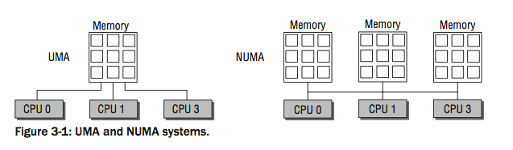
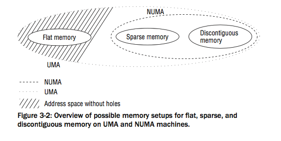
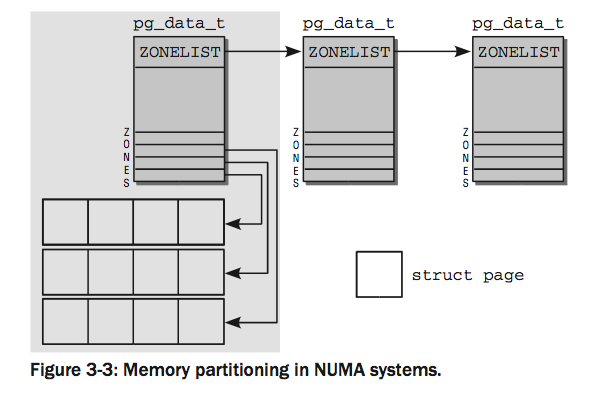

---

title: 深入理解Linux内核(2):内存管理
subtitle: 内存管理
layout: post
tags: [linux,memory,kernel]
---

linux内核相关的内存管理，巩固之前现代操作系统中的知识点，增强对linux中关于内存方面的理解。有助于应用的开发、性能的优化、性能问题的定位。

个人读书笔记，以备后面回味咀嚼。

Memory management is one of the most complex and at the same time most important parts of the
kernel. It is characterized by the strong need for cooperation between the processor and the kernel
because **the tasks to be performed** require them to **collaborate very closely**.  处理器和内核需要紧密的合作。

## OverView

Memory management implementation covers many areas: 

❑  Management of physical pages in memory . 管理内存中的物理页

❑  The buddy system to allocate memory in large chunks. 伙伴系统用于分配大的内存块。

❑  The slab, slub, and slob allocators to allocate smaller chunks of memory.  slab、slub、slob用于分配更小的内存块。

❑  The `vmalloc` mechanism to allocate non-contiguous blocks of memory.  vmalloc机制分配不相邻的内存块。

❑  The address space of processes. 进程的地址空间

As we know, **the virtual address space of the processor** is in general **divided into two parts** by the Linux kernel. 

- The lower and larger part is available to user processes

- The upper part is reserved for the kernel. 

  

Whereas **the lower part is modified during a context switch (between two user processes), the kernel part of virtual address space always remains the same**. 

The available physical memory is mapped into the address space of the kernel.

 **Accesses with virtual addresses** whose offset to the start of the kernel area does not exceed the size of the available RAM are therefore *automatically* associated with physical page frames. 

This is practical because memory allocations in the kernel area always land in physical RAM when this scheme is adopted. 

**However, there is one problem.** **The virtual address space portion of the kernel is necessarily smaller than the maximum theoretical address space of the CPU.** 

If there is more physical RAM than can be mapped into the kernel address space, the kernel must resort to the `highmem` method to manage ‘‘super fluous‘‘ memory. On IA-32 systems, up to 896 MiB of RAM can be managed directly; anything above this figure (up to a maximum of 4 GiB) can only be addressed by means of `highmem`. 

> 4 *GiB is the maximum memory size that can be addressed on* 32*-bit systems (*232 = 4 *GiB). If a trick is used, modern IA-32 implementations — Pentium PRO and higher — can manage up to 64 GiB of memory if PAE mode is enabled. PAE stands for page address extension *and provides additional bits for memory pointers. However, not all* 64 *GiB can be addressed at the same time, only sections of* 4 *GiB each.* 
>
> *Because most memory management data structures can only be allocated in the range between* 0 *and* 1 *GiB, there is a practical limit to the maximum memory size and this is less than* 64 *GiB. The exact value varies according to kernel configuration. For example, it is possible to allocate third-level page table entries in highmem to reduce the load on the normal zone.* 
>
> *Because IA-32 systems with memory in excess of* 4 *GiB are a rarity and the* 64*-bit architecture AMD64 that has for all practical purposes replaced IA-32 offers a much cleaner solution to this problem, I won’t bother discussing the second highmem mode here.* 

**Highmem mod**e is not required on 64-bit machines because the available address space is gigantic, even if physical addressing is limited to a smaller number of bits, for example, 48 or 52. Given that exactly the same was thought of the 4-GiB address space on 32-bit systems just a few years ago, one could argue that it would merely seem to be a matter of time before the limits of 64-bit systems are reached, although 16 EiB *should* suffice for some time. But you never know . . . . 

> **The use of highmem pages is problematic only for the kernel itself. The kernel
> must first invoke the** **kmap** **and** **kunmap** **functions discussed below to map the
> highmem pages into its virtual address space before it can use them — this is not
> necessary with normal memory pages. However, for userspace processes, it makes
> absolutely no difference if the pages are highmem or normal pages because they are
> always accessed via page tables and never directly.**

There are two types of machine that manage physical memory in different ways: 

1. UMA machines (*uniform memory access*) organize available memory in a contiguous相邻 fashion (possibly with small gaps). Each processor (in a symmetric multiprocessor system) is able to access each memory area equally quickly. 

2. NUMA machines (*non-uniform memory access*) are always multiprocessor machines. **Local RAM is available to each CPU of the system to support particularly fast access**. The processors are **linked via a bus to support access to <u>the local RAM of other CPUs</u>** — this is naturally slower than accessing local RAM. 通过总线获取其他CPU的RAM，这个比本地的Ram访问起来慢很多。

   Examples of such systems are Alpha-based WildFire servers and NUMA-Q machines from IBM. 

Figure 3-1 illustrates the difference between the two approaches.



In fact, the kernel distinguishes three configuration options — FLATMEM, DISCONTIGMEM, and SPARSEMEM. 

SPARSEMEM and DISCONTIGMEM serve practically the same purpose, but in the view of developers, differ in the quality of their code — SPARSEMEM is regarded as more experimental and less stable but does feature performance optimizations. Discontiguous memory is presumed to be more stable, but is not prepared for new features like memory hotplugging. 

**In the following sections, we restrict ourselves largely to FLATMEM because this memory organization type is used on most configurations and is also usually the kernel default.** 

The fact that we do not discuss the other options is no great loss because all memory models make use of practically the same data structures. 

Real **NUMA** systems will set the configuration option **CONFIG_NUMA**, and the memory management codes will differ between the two variants. Since the flat memory model will not make sense on NUMA machines, only discontiguous and sparse memory will be available. 

Notice that the configuration option NUMA_EMU allows AMD64 systems with a flat memory to enjoy the full complexities of NUMA systems by splitting the memory into fake NUMA zones. This can be useful for development when no real NUMA machine is available — for some reason, these tend to be rather costly. 

**This book focuses on the UMA case, and does not consider CONFIG_NUMA.** This does not mean
 that the NUMA data structures can be completely neglected. Since UMA systems can choose the configuration option **CONFIG_DISCONTIGMEM** if their address space contains large holes, then more than one memory node can also be available on systems that do not employ NUMA techniques otherwise. 

Figure 3-2 summarizes the various possible choices for the configuration options related to memory layout. 

Notice that we will come across the term *allocation order* quite often in the following discussion. It denotes the binary logarithm of the number of pages that are contained in a memory region. An order 0 allocation consists of one page, an order two allocation of 21 = 2 pages, an order three allocation of 22 = 4 pages, and so on. 



### Organization in the (N)UMA Model

The kernel uses identical data structures for machines with uniform and non-uniform memory access so
that the individual algorithms need make little or no distinction between the various forms of memory
arrangement. On UMA systems, a single NUMA node is introduced to help manage the entire system
memory. The other parts of memory management are led to believe that they are working with a pseudo-
NUMA system.

### OverView

首先，介绍一下NUMA相关的术语，如下图，给出了内存划分的图示。

首先，内存划分为**节点**。每一个节点关联到系统中的一个处理器，在内核中表示为pa_data_t 的实例。

各个**节点**又划分为**内存域**，是内存的进一步细分。



内核引入了下列的常量来枚举系统中的所有**内存域**：

```c
<mmzone.h> 

enum zone_type {
#ifdef CONFIG_ZONE_DMA 
	ZONE_DMA,
#endif 

#ifdef CONFIG_ZONE_DMA32
	ZONE_DMA32, 
#endif

 ZONE_NORMAL, 

#ifdef CONFIG_HIGHMEM
	ZONE_HIGHMEM, 
#endif
 ZONE_MOVABLE, 
 MAX_NR_ZONES 

}; 
```


- ❑  **ZONE_DMA** for **DMA-suitable memory**. The size of this region depends on the processor type. ON IA-32 machines, the limit is the classical 16 MiB boundary imposed by ancient ISA devices. But also, more modern machines can be affected by this. 
- ❑  **ZONE_DMA32** for **DMA-suitable memory in a 32-bit addressable area**. Obviously, there is only a difference between the two DMA alternatives on 64-bit systems. On 32-bit machines, this zone is empty; that is, its size is 0 MiB. On Alphas and AMD64 systems, for instance, this zone ranges from 0 to 4 GiB. 
- ❑  **ZONE_NORMAL** for **normal memory mapped directly in the kernel segment**. This is the only zone guaranteed to be possible present on all architectures. It is, however, not guaranteed that the zone must be equipped with memory. If, for instance, an AMD64 system has 2 GiB of RAM, then all of it will belong to ZONE_DMA32, and ZONE_NORMAL will be empty. 
- ❑  **ZONE_HIGHMEM** for physical memory that extends beyond the kernel segment超出了内核段的物理内存. 

除了这些之外还提供了一个伪内存域ZONE_MOVABLE。在防止物理内存碎片的机制中需要用到该内存域。

MAX_NR_ZONES 充当结束标记，在内核想要迭代系统中的所有内存域时，会用到该常量。

各个内存域关联了一个数组，用来组织术语该内存域的物理内存页（称为页帧）。对每个页帧，都分配了一个`struct page`实例以及所需的管理数据。

各内存节点保存在一个单链表中，供内核遍历。

再为进程分配内存时，内核总是试图在当前运行的CPU相关的NUMA节点上进行。但这并不总是可行的，比如，该节点的内存可能已经耗没有了。针对这种情况，每个节点都提供了一个备用列表（`struct zonelist`）。该列表包含了其他节点，可用于代替当前节点分配内存。列表项的位置越靠后，就越不适合分配。

在UMA系统上，这里只有一个节点。3-3里面灰色背景的内存节点减少为一个，其他的不变。

### 数据结构

#### 1. 结点管理

pg_data_t 适用于表示结点的基本元素，定义如下：

```c
<mmzone.h>

typedef struct pglist_data {
struct zone node_zones[MAX_NR_ZONES];
struct zonelist node_zonelists[MAX_ZONELISTS];
int nr_zones;
struct page *node_mem_map;
struct bootmem_data *bdata;
unsigned long node_start_pfn;
unsigned long node_present_pages; /* total number of physical pages */
unsigned long node_spanned_pages; /* total size of physical page
																			range, including holes */
int node_id;
struct pglist_data *pgdat_next;
wait_queue_head_t kswapd_wait;
struct task_struct *kswapd;
int kswapd_max_order;
} pg_data_t;

```

- ❑  `node_zones` is an array that holds the data structures of the zones in the node. 

- ❑  `node_zonelists` specifies alternative nodes and their zones in the order in which they are used 

  for memory allocation if no more space is available in the current zone. 

- ❑  The number of different zones in the node is held in `nr_zones`. 

- ❑  `node_mem_map` is a pointer to an array of page instances used to describe all physical pages of the node. It includes the pages of all zones in the node. 

- ❑  During system boot, the kernel needs memory even before memory management has been ini- tialized (memory must also be reserved to initialize memory management). To resolve this prob- lem, the kernel uses the boot memory allocator described in Section 3.4.3. bdata points to the instance of the data structure that characterizes the boot memory allocator. 

- ❑  `node_start_pfn` is the logical number of the first page frame of the NUMA node. The page frames of *all* nodes in the system are numbered consecutively, and each frame is given a number that is globally unique (not just unique to the node). 

  `node_start_pfn` is always 0 in a UMA system because there is only one node whose first page frame is therefore 0. `node_present_pages` specifies the number of page frames in the zone and `node_spanned_pages` the size of the zone in page frames. This value need not necessarily be the same as `node_present_pages` because there may be holes in the zone that are not backed by a real page frame. 

- ❑  `node_id` is a global node identifier. All NUMA nodes in the system are numbered starting from 0. 

- ❑  `pgdat_next` links the nodes in the system on a singly linked list whose end is indicated, as usual, by a null pointer. 

- ❑  `kswapd_wait` is the wait queue for the swap daemon needed when swapping frames out of the zone (Chapter 18 deals with this at length). kswapd points to the task structure of the swap dae- mon responsible for the zone. `kswapd_max_order` is used in the implementation of the swapping subsystem to define the size of the area to be freed and is currently of no interest. 

  The association between the node and the zones it contains and the fallback list shown in Figure 3-3 is established by means of arrays at the beginning of the data structure. 

The zones of the node are held in node_zones[MAX_NR_ZONES]. The array always has three entries, even if the node has fewer zones. If the latter is the case, the remaining entries are filled with null elements. 

#### 结点状态管理

If more than one node can be present on the system, **the kernel keeps a bitmap** that provides state information for each node. The states are specified with a bitmask, and the following values are possible: 

```c
<nodemask.h>
enum node_states { 
  N_POSSIBLE,/* The node could become online at some point */ 
  N_ONLINE,/* The node is online */
  N_NORMAL_MEMORY, /* The node has regular memory */
#ifdef CONFIG_HIGHMEM
	N_HIGH_MEMORY, /* The node has regular or high memory */
#else
	N_HIGH_MEMORY = N_NORMAL_MEMORY, 
#endif
	N_CPU, /* The node has one or more cpus */
  NR_NODE_STATES
};

```

The states N_POSSIBLE, N_ONLINE, and N_CPU are required for CPU and memory hotplugging, but these features are not considered in this book.

Essential for memory management are the flags **N_HIGH_MEMORY** and **N_NORMAL_MEMORY**. While the first one announces that the zone is equipped with memory that may be either regular or high memory, **N_NORMAL_MEMORY** is only set if non-highmem memory is present on a node.
Two auxiliary functions are provided to set or clear, respectively, a bit in the bit-field or a specific node: 

```c
<nodemask.h> 

  void node_set_state(int node, enum node_states state)
  void node_clear_state(int node, enum node_states state) 
```

Additionally, the macro `for_each_node_state(__node, __state)` allows for iterating over all nodes that are in a specific state, and `for_each_online_node(node)` iterates over all active nodes. 

If the kernel is compiled to support only a single node, that is, using the flat memory model, the node bitmap is not present, and the functions to manipulate it resolve to empty operations that simply do nothing. 

### Memory Zones

The kernel uses the `zones` structure to describe a zone. It is defined as follows:

```c
<mmzone.h>
struct zone {
/* Fields commonly accessed by the page allocator */
unsigned long pages_min, pages_low, pages_high;
unsigned long lowmem_reserve[MAX_NR_ZONES];
struct per_cpu_pageset pageset[NR_CPUS];
/*
* free areas of different sizes
*/
spinlock_t lock;
struct free_area free_area[MAX_ORDER];
ZONE_PADDING(_pad1_)

/* Fields commonly accessed by the page reclaim scanner */
spinlock_t lru_lock;
struct list_head  active_list;
struct list_head  inactive_list;
unsigned long  nr_scan_active;
unsigned long  nr_scan_inactive;
unsigned long  pages_scanned;  /* since last reclaim */

unsigned long flags; /* zone flags, see below */
/* Zone statistics */
atomic_long_t vm_stat[NR_VM_ZONE_STAT_ITEMS]; 

int prev_priority; 

ZONE_PADDING(_pad2_)
 /* Rarely used or read-mostly fields */ 

wait_queue_head_t wait_table;
unsigned long wait_table_hash_nr_entries;
unsigned long wait_table_bits;

/* Discontig memory support fields. */ 

struct pglist_data *zone_pgdat;
unsigned long  zone_start_pfn; 

unsigned long present_pages; /* amount of memory (excluding holes) */ 
unsigned long spanned_pages; /* total size, including holes */

/*
 * rarely used fields: 
 */ 
char *name; 
 } ____cacheline_maxaligned_in_smp; 
```


The striking aspect of this structure is that it is divided into several sections separated by **ZONE_PADDING**. This is because zone structures are very frequently accessed. On multiprocessor systems, it commonly occurs that different CPUs try to access structure elements at the same time. 

Locks (examined in Chapter 5) are therefore used to prevent them interfering with each, and giving rise to errors and inconsistencies. The two spinlocks of the structure —` zone->lock` and` zone->lru_lock` — are often acquired because the kernel very frequently accesses the structure.1 

Data are processed faster they are is held in a cache of the CPU. 

**Caches are divided into lines, and each line is responsible for various memory areas.** The kernel invokes the **ZONE_PADDING** macro to generate ‘‘padding‘‘ that is added to the structure to ensure that each lock is in its own cache line. The compiler keyword `__cacheline_maxaligned_in_smp` is also used to achieve optimal cache alignment. 

The last two sections of the structure are also separated from each other by padding.

As neither includes a lock, the primary aim is to keep the data in a cache line for quick access and thus to dispense with the need for loading the data from RAM memory, which is a slow process. The increase in size due to the padding structures is negligible可忽略不计, particularly as there are relatively few instances of zone structures in kernel memory. 

What is the meaning of the structure elements? Since memory management is a complex and comprehensive part of the kernel, it is not possible to cover the exact meaning of all elements at this point — a good part of this and of following chapters will be devoted to understanding the associated data structures and mechanisms. What I can provide, however, is an overview that gives a taste of the problems I am about to discuss. A large number of forward references is nevertheless unavoidable. 

The locks are therefore known as *hotspots*. In Chapter 17, some tricks that are used by the kernel to reduce the pressure on these hotspots are discussed. 

- ❑  `pages_min`, `pages_high`, and `pages_low` are ‘‘**watermarks**‘‘used when pages are swapped out. **The kernel can write pages to hard disk if insufficient RAM memory is available**. These three elements influence the behavior of the swapping daemon. 

  - ❑  If **more than `pages_high` pages are free,** the state of the zone is ideal. 

  - ❑  If **the number of free pages falls below `pages_low`,** the kernel begins to swap pages out onto 

    the hard disk. 

  - ❑  If **the number of free pages falls below pages_min,** the pressure to reclaim pages is increased because free pages are urgently needed in the zone. Chapter 18 will discuss various means of the kernel to find relief. 

    The importance of these watermarks will mainly show in Chapter 18, but they also come into play in Section 3.5.5. 

- ❑  The `lowmem_reserve` array specifies several pages for each memory zone that are reserved for critical allocations that must not fail under any circumstances. Each zone contributes according to its importance. The algorithm to calculate the individual contributions is discussed in Section 3.2.2. 

- ❑  `pageset` is an array to implement per-CPU hot-n-cold page lists. **The kernel uses these lists to store fresh pages that can be used to satisfy implementations.** However, they are distinguished by their cache status: Pages that are most likely still cache-hot and can therefore be quickly accessed are separated from cache-cold pages. The next section discusses the struct per_ cpu_pageset data structure used to realize this behavior. 

- ❑  `free_area` is an array of data structures of the same name used to implement the buddy system. Each array element stands for contiguous memory areas of a fixed size. Management of free memory pages contained in each area is performed starting from `free_area`. 

  The employed data structures merit a discussion of their own, and Section 3.5.5 covers the imple- mentation details of the buddy system in depth. 

- ❑  The elements of the second section are responsible for cataloging the pages used in the zone according to activity. A page is regarded as *active* by the kernel if it is accessed frequently; an inactive page is obviously the opposite. This distinction is important when pages need to be swapped out. If possible, frequently used pages should be left intact, but superfluous inactive pages can be swapped out without impunity. 

  The following elements are involved: 

  - ❑  `active_list` collects the active pages, and inactive_list the inactive pages (page instances). 

  - ❑  `nr_scan_active` and `nr_scan_inactive` specify how many active and inactive pages are to be scanned when reclaiming memory. 

  - ❑  `pages_scanned` specifies how many pages were unsuccessfully scanned since the last time a page was swapped out. 

  - ❑ ` flags` describes **the current status of the zone.** The following flags are allowed: 

    ```c
    <mmzone.h> 
    
    typedef enum {
     ZONE_ALL_UNRECLAIMABLE, /* all pages pinned */
     ZONE_RECLAIM_LOCKED, /* prevents concurrent reclaim */ 
     ZONE_OOM_LOCKED, /* zone is in OOM killer zonelist */
    } zone_flags_t;
    ```

    It is also possible that none of these flags is set. This is the normal state of the zone. **ZONE_ALL_UNRECLAIMABLE** is a state that can occur when the kernel tries to reuse some pages of the zone (*page reclaim*, see Chapter 18), but this is not possible at all because
     all pages are *pinned*. For instance, a userspace application could have used the mlock system call to instruct the kernel that pages must not be removed from physical memory, for example, by swapping them out. Such a page is said to be pinned. If all pages in a zone suffer this fate, the zone is unreclaimable, and the flag is set. To waste no time, the swapping daemon scans zones of this kind very briefly when it is looking for pages to reclaim.2 

    On SMP systems, multiple CPUs could be tempted to reclaim a zone concurrently. The flag **ZONE_RECLAIM_LOCKED** prevents this: If A CPU is reclaiming a zone, it set the flag. This prevents other CPUs from trying. 

    **ZONE_OOM_LOCKED** is reserved for an unfortunate situation: If processes use up so much memory that essential operations cannot be completed anymore, then the kernel will try to select the worst memory eater and kill it to obtain more free pages. The flag prevents multiple CPUs from getting into their way in this case. 

    The kernel provides three auxiliary functions to test and set zone flags: 

    ```c
    <mmzone.h> 
    
    void zone_set_flag(struct zone *zone, zone_flags_t flag)
    int zone_test_and_set_flag(struct zone *zone, zone_flags_t flag)
    void zone_clear_flag(struct zone *zone, zone_flags_t flag) 
    ```

    zone_set_flag and zone_clear_flag set and clear a certain flag, respectively. zone_test_ and_set_flag first tests if a given flag is set and does so if not. The old state of the flag is returned to the caller. 

    - ❑  vm_stat keeps a plethora of statistical information about the zone. Since most of the infor- mation kept in there will not make much sense at the moment, a detailed discussion is deferred to Section 17.7.1. For now, it suffices to know that the information is updated from places all over the kernel. The auxiliary function zone_page_state allows for reading the information in vm_stat: 

      <vmstat.h> 

      static inline unsigned long zone_page_state(struct zone *zone, enum zone_stat_item item) 

      item can, for instance, be NR_ACTIVE or NR_INACTIVE to query the number of active and inactive pages stored on active_list and inactive_list discussed above. The number of free pages in the zone is obtained with NR_FREE_PAGES. 

    - ❑  prev_priority stores the priority with which the zone was scanned in the last scan oper- ation until sufficient page frames were freed in try_to_free_pages (see Chapter 17). As you shall also see in Chapter 17, the decision as to whether mapped pages are swapped out depends on this value. 

    - ❑  wait_table, wait_table_bits, and wait_table_hash_nr_entries implement a wait queue for processes waiting for a page to become available. While the details of this mechanism are shown in Chapter 14, the intuitive notion holds pretty well: Processes queue up in a line to wait for some condition. When this condition becomes true, they are notified by the kernel and can resume their work. 

    - ❑  The association between a zone and the parent node is established by zone_pgdat, which points to the corresponding instance of pg_list_data. 

    - ❑  zone_start_pfn is the index of the first page frame of the zone. 

    - ❑  The remaining three fields are rarely used, so they’ve been placed at the end of the data structure.
      name is a string that holds a conventional name for the zone. Three options are available at 

      present: Normal, DMA, and HighMem. 

      spanned_pages specifies the total number of pages in the zone. However, not all need be usable since there may be small holes in the zone as already mentioned. A further counter (present_ pages) therefore indicates the number of pages that are actually usable. Generally, the value of this counter is the same as that for spanned_pages. 


### 计算Zone水位线

Before calculating the various watermarks, the kernel first determines the minimum memory space that must remain free for critical allocations. This value scales nonlinearly with the size of the available RAM. It is stored in the global variable min_free_kbytes. Figure 3-4 provides an overview of the scaling behavior, and the inset — which does not use a logarithmic scale for the main memory size in contrast to the main graph — shows a magnification of the region up to 4 GiB. Some exemplary values to provide a feeling for the situation on systems with modest memory that are common in desktop environments are collected in Table 3-1. An invariant is that not less than 128 KiB but not more than 64 MiB may be used. Note, however, that the upper bound is only necessary on machines equipped with a *really* satisfactory amount of main memory.3 The file /proc/sys/vm/min_free_kbytes allows reading and adapting the value from userland. 

Filling the watermarks in the data structure is handled by init_per_zone_pages_min, which is invoked during kernel boot and need not be started explicitly.4 

setup_per_zone_pages_min sets the pages_min, pages_low, and pages_high elements of struct zone. After the total number of pages outside the highmem zone has been calculated (and stored in lowmem_ pages), the kernel iterates over all zones in the system and performs the following calculation: 

```c
mm/page_alloc.c 

void setup_per_zone_pages_min(void) { 

 unsigned long pages_min = min_free_kbytes >> (PAGE_SHIFT - 10);
 unsigned long lowmem_pages = 0;
 struct zone *zone;
 unsigned long flags; 
 ...
 for_each_zone(zone) {
      u64 tmp;
      tmp = (u64)pages_min * zone->present_pages;
      do_div(tmp,lowmem_pages);
      if (is_highmem(zone)) {
          int min_pages;
          min_pages = zone->present_pages / 1024; if (min_pages < SWAP_CLUSTER_MAX)
          min_pages = SWAP_CLUSTER_MAX; if (min_pages > 128)
          min_pages = 128; zone->pages_min = min_pages;
      } else {
          zone->pages_min = tmp;
      }
      zone->pages_low = zone->pages_min + (tmp >> 2);
      zone->pages_high = zone->pages_min + (tmp >> 1);
  }
}
```


#### Hot-N-Cold Pages


#### Page Frames


### Page Tables


### 数据结构


#### 内存地址分类


#### 页表格式


