套接字现在用于定义和建立网络连接，以便可以用操作inode的普通方法来访问网络。从程序员的角度来看，创建套接字的最终结果是一个文件描述符，它不仅提供所有的标准函数，还包含几个增强的函数。用于实际数据交换的接口对所有的协议和地址簇都是同样的。

在创建套接字时，需要区分地址和协议簇，还需要指定是基于流的通信还是数据报的通信。

### 1. 创建套接字

创建套接字必须指定所需要的地址和协议类型的组合。套接字是使用socket库函数生成的，该函数通过一个系统调用与内核通信。除了地址簇和通信类型（流或数据报）之外，还可以使用第三个参数来选择协议。

因特网地址由ip地址和端口号唯一定义：

```c
<in.h>
  struct sockaddr_in{
    sa_family_t sin_family;/*地址簇*/
    __be16	sin_port;/*端口号*/
    struct in_addr sin_addr;/*因特网地址*/
    ...
  }

```

内核提供了集中数据类型：`__be16`、`__be32`、`__be64`表示位长为16、32、64位的大端序数据类型。

### 2. 使用套接字


#### 1. echo客户端


#### 2. echo服务端


一个四元组（ip1:port1,ip2:port2）用来唯一标识一个连接。前两个字段时服务器本地系统的地址和端口号，后两个字段时客户端的地址和端口号。

如果元组中某个字段没有确定，则用*表示。比如，`ip1:port1,xin:xin`。在服务器调用fork复制自身来处理某个连接之后，在内核中注册了两个套接字对，如下：

| 监听                      | 连接建立之后                        |
| ------------------------- | ----------------------------------- |
| 192.168.1.20:777，xin:xin | 192.168.1.20:777，192.168.1.10:3506 |

虽然两个服务器进程的套接字具有相同的IP地址/端口组合，但是二者对应的四元组是不同的。

因此，内核在分配输入和输出TCP/IP分组时，必须注意到四元组的所有4个字段，才能确保正确。该任务称为**多路复用**。

netstat工具可以显示并检查系统上所有TCP/IP连接的状态。如果有两个客户端连接到服务器，将生成下面的输出：

```shell
root@local>netstat -na
Active Internet connections (servers and established)
Proto Recv-Q Send-Q Local Address    Foreign Address    State
tcp		0				0			192.168.1.20:7777	0.0.0.0:*					Listen
tcp		0				0			192.168.1.20:7777	192.168.1.10:3506	Listen
tcp		0				0			192.168.1.20:7777	192.168.1.10:3506	Listen

```

### 3. 数据报套接字

- UDP是面向分组的。在发送数据之前，无须建立显示的连接。
- 分组可以在传输期间丢失。不保证数据一定能到达其目的地。
- 分组接收的次序不一定与发送的次序相同。

UDP通常用于视频会议、音频流及类似的服务。在这类环境下，丢失几个分组并不重要，用户只会注意到多媒体序列内容中出现短暂的丢帧。但是，UDP保证分组到达目的地时，其内容不会发生改变。

分别使用TCP和UDP协议的进程，可以同时使用同样的IP地址和端口号。在多路复用时，内核会根据分组的传输协议类型，将其转发得到适当的进程。

## 网络实现的分层模型


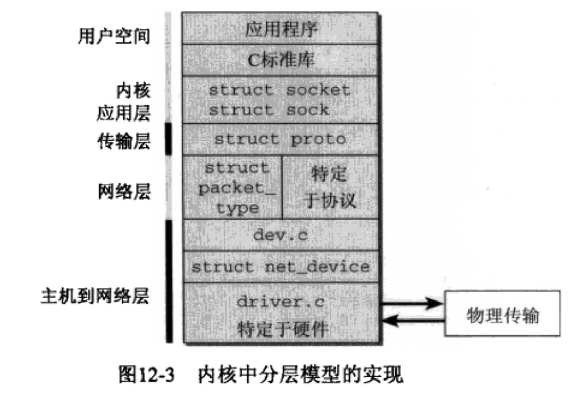

网络子系统是内核中涉及面最广、要求最高的部分之一。该子系统处理了大量特定于协议的细节。

分层模型不仅反映在网络子系统的设计上，而且也反映在数据传输的方式上，即对各层产生和传输的数据进行封装的方式。各层的数据都由首部和数据两部分组成。

- 首部部分包含了与数据部分 有关的元数据（目标地址、长度、传输协议类型等），数据部分包含有用数据。
- 传输的基本单位是（以太网）帧，网卡以帧为单位发送数据。帧首部部分的主数据项是目标系统的硬件地址，这是数据传输的目的地，通过电缆传输数据时也需要该数据项。
- 高层协议的数据在封装到以太网帧时，将协议产生的首部和数据二元组封装袋帧的数据部分。在因特网网络上，这是互联网络层数据。

## 网络命名空间

对一个**特定的网络设备**来说，如果它在一个命名空间中可见，在另外一个命名空间中不一定可见。

跟踪所有可用的命名空间数据结构，定义如下：

```c
include/net/net_namespace.h
  struct net {
    atomic_t count;//用于判断何时释放网络命名空间
    ...
    struct list_head list;//网络命名空间的链表
    ...
    struct proc_dir_entry *proc_net;
    struct proc_dir_entry *proc_net_stat;
    struct proc_dir_entry *proc_net_root;
    
    struct net_device *loopback_dev;/*环回接口设备*/
    
    struct list_head dev_base_head;
    struct hlist_head *dev_name_head;
    struct hlist_head *dev_index_head;
    
  };
```

- 在count降低到0时，将释放该命名空间，并将其从系统中删除。
- **所有可用的命名空间都保存在一个双链表**上，表头是net_namespace_list。list用作链表元素。copy_net_ns函数向该链表添加一个新的命名空间。在用create_new_namespace创建一组新的命名空间是，会自动调用该函数。
- 由于每个命名空间都包含不同的网络设备。相关内容可以在procfs的文件系统里面。各命名空间的处理需要三个数据项：/proc/net由proc_net表示，而/proc/net/stats由proc_net_stats表示，proc_net_root指向当前命名空间的procfs实例的根节点，即/proc。
- 每个命名空间都可以有一个不同的环回设备，而loopback_dev指向对应的虚拟网络设备。
- 网络设备由net_device数据结构表示。与特定命名空间关联的所有设备都保存在一个双链表上，表头为dev_base_head。各个设备还通过另外两个链表维护：一个将设备名用作散列键（dev_name_head）,另一个将接口索引用作散列键（dev_index_head）。

**设备**表示提供物理传输能力的硬件设备，而**接口**可以是纯虚拟的实体，可能在真正的设备上实现。比如，一个网卡可以提供两个接口。

每个网络命名空间由几个部分组成。比如，在procfs中的表示。每当创建一个新的网络网络命名空间时，必须初始化这些部分。在删除命名空间时，需要清楚掉这些。内核采用下列结构来跟踪所有必需的初始化/清理元组。

```c
include/net/net_namespace.h
struct pernet_operations{
	struct list_head list;
	int (*init)(struct net *net);
	void (*exit)(struct net *net);
}
```

这个结构没什么特别之处：init存储了初始化函数，清理工作由exit处理。所有可用的pernet_operation实例通过一个链表维护，表头为pernet_list，list用作链表元素。辅助函数register_pernet_subsys和unregister_pernet_subsys分别向链表添加和删除数据元素。每当创建一个新的网络命名空间时，内核将遍历pernet_operations的链表，用表示新命名空间的net实例作为参数来初始化函数。在删除网络命名空间时，清理工作的处理是类似的。


## 套接字缓冲区

在内核分析收到的网络分组时，底层协议的数据将传递到更高的层。发送数据时顺序相反，各种协议产生的数据（首部和负载）依次向更低的层传递，直到最终发送。这些操作的速度对网络子系统的性能有决定性的影响，因此内核使用了一种数据结构，套接字缓冲区（socket buffer）。

定义如下：

```c
<skbuff.h>
struct sk_buff {
	struct sk_buff *next;
	struct sk_buff *prev;
	
	struct sock *sk;
	ktime_t tstamp;
	struct net_device *dev;
	struct dst_entry *dst;
	
	char cb[48];
	unsigned int len,data_len;
	__u16 mac_len,hdr_len;
	
	union {
		__wsum csum;
		struct {
			__u16 csum_start;
			__u16 csum_offset;
		};
	};
	__u32 priority;
	__u8 local_df:1,
			  cloned:1,
			  ip_summed:2,
			  nohdr:1,
			  nfctinfo:3;
	__u8	pkt_type:3,
				fclone:2,
				ipvs_property:1;
				nf_trace:1;
	
	__be16	protocol;
	...
	void	(*destructor)(struct sk_buff *skb);
	...
	int	iif;
	...
	sk_buff_data_t	transport_header;
	sk_buff_data_t	network_header;
	sk_buff_data_t	mac_header;
	
	//这些成员必须在末尾，详见alloc_skb()
	sk_buff_data_t	tail;
	sk_buff_data_t	end;
	unsigned char	*head,*data;
	
	unsigned int	truesize;
	atomic_t	users;
	
}
```

**套接字缓冲区**用于**在网络实现的各个层次之间交换数据**，而**无需复制分组数据**，对性能的提供很可观。套接字结构是网络子系统的基石之一，在各个协议层次上都需要处理该结构。

### 1. 使用套接字缓冲区管理数据

套接字缓冲区的基本思想是，通过操作指针来增删协议头部。

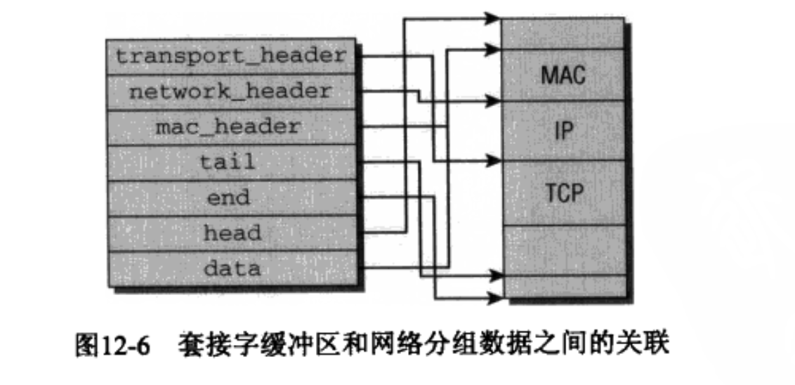

```c
<skbuff.h>
typedef unsigned char *sk_buff_data_t;
```

在一个**新分组**产生时，TCP层首先在用户空间中分配内存来容纳该分组数据（首部和payload）。分配的空间大于数据实际需要的长度，因此较低的协议层可以进一步增加首部。（分配的空间为底层的协议预留了头部协议的空间）。

分配一个套接字缓冲区，使得head和end分别指向上述内存区的起始和结束地址，而TCP数据位于data和tail之间。

在套接字缓冲区传递到互联网络层时，必须新增一层（IP）。只需要向已经分配但尚未占用的那部分内存空间卸乳数据即可，除了data之外所有的指针都不变，data现在指向IP首部的起始处，下面的各层会重复同样的操作，直至分组完成（即将通过网络发送）。

对接收的分组进行分析的过程是相似的。**分组数据**复制到内核分配的一个内存区中，并**在整个分析期间一直处于该内存区中**。与该分组相关联的套接字缓冲区在各层之间顺序传递，各层依次将其中的各个指针设置为正确值。

内核提供了一些用于操作套接字缓冲区的标准函数，具体如下：

| 函数                 | 语义                                                         |
| -------------------- | ------------------------------------------------------------ |
| alloc_skb            | 分配一个新的sk_buff实例                                      |
| sky_copy             | 创建套接字缓冲区和相关数据的一个副本                         |
| skb_clone            | 创建套接字缓冲区的一个副本，但**原本和副本将使用同一分组数据** |
| skb_tailroom         | 返回数据末端空闲空间的长度                                   |
| skb_headroom         | 返回数据起始处空闲空间的长度                                 |
| skb_realloc_headroom | 在数据起始处创建更多的空闲空间。现存数据不变                 |

套接字缓冲区需要很多指针来表示缓冲区中内容的不同部分。网络子系统必须保证较低的内存占用和较高的处理速度，因而对struct sk_buff来说，我们需要保持该结构的长度竟可能小。在64位CPU上，可使用小技巧来节省一些空间。sk_buff_data_t的定义改为整型变量：

```c
<skbuff.h>
typedef unsigned int sk_buff_data_t;
```

整型变量占用的内存只有指针变量的一半，该结构的长度缩减了20字节。但套接字缓冲区中包含的信息仍然是同样的。

```c
<skbuff.h>
static inline unsigned char *skb_transport_header(const struct sk_buff *skb)
{
		return	skb->head+skb_transport_header;
}
```


### 2. 管理 套接字缓冲区数据

套接字缓冲区结构不仅包含上述指针，还包含用于处理相关的数据和管理套接字缓冲区自身的其他成员。

其中不常见的成员在本章中遇到时才会讨论。下面列出的是一些重要的成员。

- tstamp保存可分组到达的时间。
- dev指定了处理分组的网络设备。dev在处理分组的过程中可能会改变，比如，在外来某个时候，分组可能通过计算机的另一个设备发出。
- 输入设备的接口索引号总是保存在iif中。
- sk是一个指针，指向用于处理该分组的套接字对应的socket实例。
- dst表示接下来该分组通过内核网络实现的路由。
- next、prev用于将套接字缓冲区保存到一个双链表中。这里没有使用内核的标准链表实现，而是使用了一个手工实现的版本。

使用一个表头来实现套接字缓冲区的等待队列。其结构定义如下：

```c
<skbuff.h>
struct sk_buff_head {
	struct sk_buff *next;
	struct sk_buff *prev;
	
	__u32	qlen;
	spinlock_t	lock;
}
```

qlen指定了**等待队列**的长度，即队列中成员的数目。套接字缓冲区的list成员指回到表头。

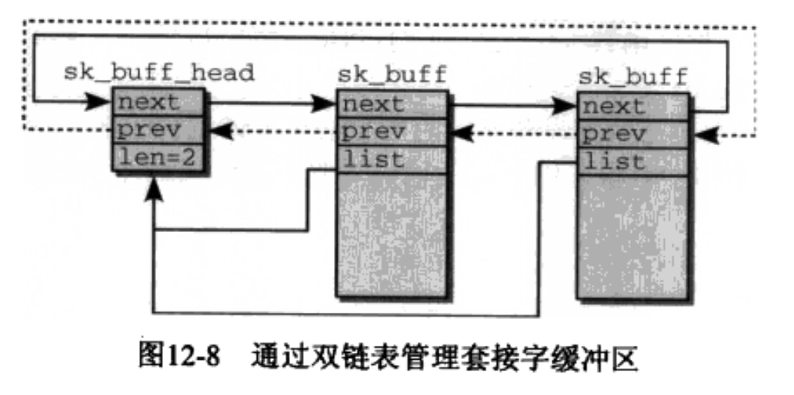

分组通常放置在等待队列中，比如分组等待处理时或需要重新组合已经分析过的分组时。


## 网络访问层

网络访问层，主要负责在计算机之间传输信息，与网卡的设备驱动程序直接协作。

### 1. 网络设备的表示

在内核中，每个网络设备都表示为net_device结构的一个实例。在分配并填充该结构的一个实例之后，必须用net/core/dev.c中的register_netdev函数将其注册到内核。该函数完成一些初始化任务，并将该设备注册到通用设备机制内。这会创建一个sysfs项 /sys/class/net/<device>，关联到该设备对应的目录。如果系统包含一个PCI网卡和一个环回接口设备，则在/sys/class/net中有两个对应项：

```shell
root@dev# ls -l /sys/class/net
total 0
lrwxrwxrwx 1 root root 0 2008 09:12 eth0 -> ../../devices/pci000:00/0000:00:1c.5/0000:02:00.0/net/eth0
lrwxrwxrwx 1 root root 0 2008 09:12 lo -> ../../devices/virtual/net/lo
```

#### 1. 数据结构

在详细讨论struct net_device的内容之前，先阐述一下内核如何跟踪可用的网络设备。以及如何查找特定的网络设备。这些设备不是全局的，而是按照命名空间进行管理的。每个命名空间（net实例）中有如下3个极致可用。

- 所有的网络设备都保存在一个单链表中，表头为dev_base。
- 按设备名hash。辅助函数dev_get_by_name(struct net *net,const char * name)根据设备名在该散列表上查找网络设备。
- 按照接口索引hash。辅助函数dev_get_by_index(struct net *net,int ifindex)根据给定的接口索引查找net_device实例。

Net_device结构包含了与特定设备相关的所有信息。该结构的定义有200多行代码，是内核之中最大的数据结构。因为该结构中有很多细节，这不详细描述。

```c
<netdevice.h>
struct net_device{
	char name[IFNAMSIZ];
	struct hlist_node name_hlist;//设备名散列链表的链表元素
	
	//IO相关字段
	unsigned long mem_end;//共享内存结束位置
  unsigned long mem_start;//共享内存起始位置
  unsigned long base_addr; //设备IO地址
  unsigned int irq;  //设备IRQ编号
  
  unsigned long state;
  struct list_head dev_list;
  int (*init)(struct net_device *dev);
  
  //接口索引。唯一的设备标识符
  int ifindex;
  
  struct net_device_stats* (*get_status)(struct net_device *dev);
  
  //硬件首部描述
  const struct header_ops *header_ops;
  
  unsigned short flags;//接口标志
  unsigned 			 mtu;//接口MTU值
  unsigned short	type;/接口硬件类型
  unsigned short	hard_header_len;//硬件首部长度
  
  
  //接口地址信息
  unsigned char perm_addr[MAX_ADDR_LEN];//持久硬件地址
  unsigned	char addr_len; //硬件地址长度
  int	promiscuity;
  
  //协议相关指针
  void *atalk_ptr;//AppleRalk相关指针
  void *ip_ptr; //IPv4相关数据
  void *dn_ptr;//DECnet相关数据
  void *ip6_ptr;//IPv6相关数据
  void *ec_ptr;	//Econet相关数据
  
  unsigned long last_rx; //上一次接受操作的时间
  unsigned long trans_start;// jiffies为单位
  
  //eth_type_trans()所用的接口地址信息
  unsigned char	broadcast[MAX_ADD_LEN];//硬件多播地址
  unsigned char	dev_addr[MAX_ADD_LEN];//硬件地址
  
  int (*hard_Start_xmit) (struct sk_buff *skb,struct net_device *dev);
  
  
  //在设备与网络断开后调用
  void (*uninit)(struct net_device *dev);
  //在最后一个用户应用消失后调用
  void (*destructor)(struct net_device *dev);
  
  //指向接口服务例程是我指针
  int (*open)(struct net_device *dev);
  int (*stop)(struct net_device *dev);
  
  void (*set_multicast_list)(struct net_device *dev);
  int (*set_mac_address)(struct net_device *dev,void *addr);
  
  int (*do_ioctl)(struct net_device *dev,struct ifreq *ifr,int cmd);
  int (*set_config)(struct net_device *dev,struct ifmap *map);
  
  void (*tx_timeout)(struct net_device *dev);
  int (*neigh_setup)(struct net_device *dev,struct neigh_params *);
  
  //该设备所在的网络命名空间
  struct net *nd_net;
  
  //class/net/name项
  struct device dev;
  
  ...
}
```

该结构中出现的缩写rx和tx会经常用于函数名、变量名和注释中。二者分别是Receive和Transmit的缩写，即接收和发送。

网络设备的名称存储在name中。它是一个字符串，末尾的数字用于区分同一个类型的多个适配器（如系统有两个以太网卡）。

| 名称  | 设备类别                                 |
| ----- | ---------------------------------------- |
| ethX  | 以太网适配器，无论电缆类别和传输速度如何 |
| pppX  | 通过调制解调器建立的PPP连接              |
| isdnX | ISDN卡                                   |
| atmX  | 异步传输模式，高速网卡的接口             |
| lo    | 环回设备，用于与本地计算机通信           |

net_device结构的大多数成员为函数指针，执行与网卡相关的典型任务。虽然不同适配器的实现不同，但是调用的语法是一样的。这些成员表示了与下一个协议层次的抽象接口。这些接口使得**内核能够用同一组接口函数来访问所有的网卡，而网卡的驱动程序负责实现细节**。

- open和stop分别**初始化和终止网卡**。这些操作通常在内核外部通过调用ifconfig命令触发。open负责**初始化硬件寄存器**并**注册系统资源**，如中断、DMA、IO端口等。close释放这些资源，并停止传输。
- hard_start_xmit用于从等待队列删除已经完成的分组并将其发送出去。
- header_ops是一个**指向结构的指针**，**该结构提供了更多的函数指针**，用于操作硬件首部。其中重要的是header_ops->create和header_ops->parse，前者创建一个新的硬件首部，后者解析一个给定的硬件首部。
- get_stats查询统计数据，并将数据封装到一个类型为net_deice_stats是结构中返回。该结构的成员有20多个，都是一些数值，如发送、接收、出错、丢弃的分组的数目等。因为net_device结构没有提供存储net_device_stats对象的专用字段，**各个设备驱动程序必须在私有数据区保存该对象**。
- 调用tx_timeout来解决分组传输失败的问题。
- do_ioctl将特定于设备的命令发送到网卡。
- nd_det是一个指针，指向设备所属的网路命名空间。

除了上面饿函数。内核还提供了默认实现。

- change_mtu，负责修改最大传输单位。
- header_ops-create的默认实现是eth_header。该函数为现存的分组数据生成网络访问层首部。

可以使用ioctl应用到套接字的文件描述符，从用户空间修改对应的网络设备的配置。

网络设备分两个方向工作，即发送和接收。内核源代码包含了两个驱动程序框架，可用作网络驱动程序的模版。

#### 2. 注册网络设备

每个网络设备都按照如下过程注册。

1. alloc_netdev分配一个新的struct net_device实例，一个特定于协议的函数用典型值填充该结构。对于以太网设备，该函数是ether_setup。其他的协议会使用如XX_setup的函数。内核中的一些伪设备在不绑定到硬件的情况下实现了特定的接口，它们也使用了net_device框架。例如，ppp_setup根据PPP协议初始化设备。
2. 在struct net_device填充完毕后，需要用register_netdev和register_netdevice注册。这两个函数的区别在于，前者可处理用作接口名称的格式串。在net_device->dev中给出的名称可以包含格式说明符%d。在设备注册时，内核会选择一个唯一的数字来代替%d。比如，以太网设备可以指定eth%d，而内核随后会创建设备eth0、eth1...

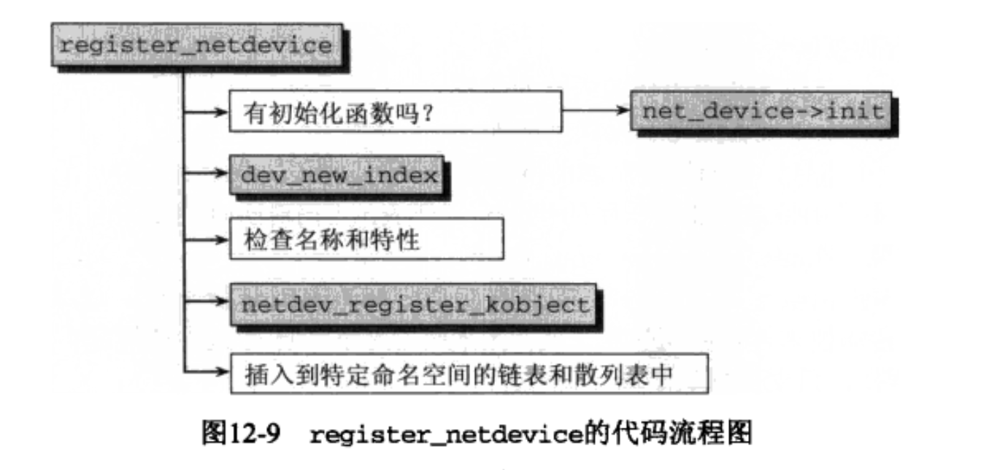

### 2. 接收分组segment

分组到达内核的时间是不可预测的。所有现代的设备驱动程序都使用中断来通知内核有分组到达。**网络驱动程序对特定于设备的中断设置了一个处理例程**，因此每当该中断被引发时（即分组到达），内核都调用该处理程序，将数据从网卡传输到物理内存，或者通知内核在一定时间后进行处理。

几乎所有的网卡都支持DMA模式，能够自行将数据传输到物理内存。但这些数据仍然需要解释和处理。

#### 1. 传统方法

当前，内核为分组的接收提供了两个框架。其中一个很早就集成到内核中了，因而称为传统方法。和超高速网络适配器协作时，该API会出现问题。因此，设计了一种新的API（NAPI）。

传统方法如下，下图给出了一个分组到达网络适配器之后，该分组穿过内核到达网络层函数的路径。

因为分组是在**中断上下文**中接收到的，所以处理例程只能执行一些基本的任务，避免系统的其他任务延迟太长时间。

在中断上下文中，数据由3个短函数处理，执行了下列任务。

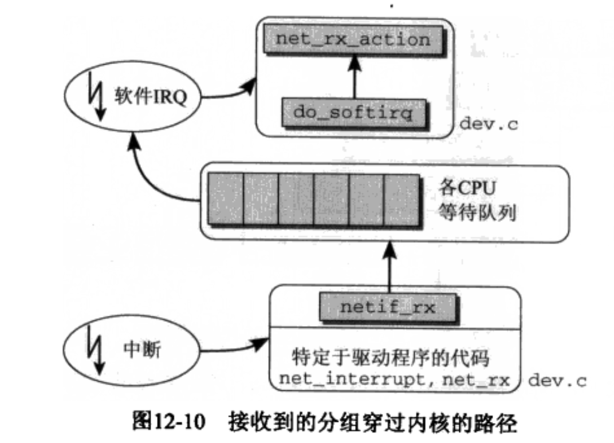

1. net_interrupt是由设备驱动程序设置的中断处理程序。他将确定该中断是否真的是由接收到的分组引发的。如果确实如此，则控制将转移到net_rx.
2. net_rx函数也是和特定的网卡相关。首先创建一个新的套接字缓冲区。分组的内容接下来从网卡传输到缓冲区（物理内存），然后使用内核源代码中针对各种传输类型的库函数来分析首部数据。这项分析将确定分组数据所使用的网络层协议，比如IP协议。
3. 和上面的两个方式不同，netif_rx函数不是特定于网络驱动程序的，该函数位于net/core/dev.c。调用该函数，标志着控制由特定于网卡的代码转移到了网络层的通用接口部分。

该函数的作用在于，将接收到的分组放置到一个特定于CPU的等待队列上，并退出中断上下文，使得CPU可以执行其他任务。

内核在全局定义的softnet_data数组中管理进出分组的等待队列，数组类型为softnet_data.为提高多处理器系统的性能，对每个CPU都会创建 等待队列，支持分组的并行处理。

```c
<netdevice.h>
struct softnet_data{
...
	struct sk_buff_head	input_pkt_queue;
...
}
```

input_pkt_queue使用上文提到的sk_buff_head表头，对所有进入的分组建立一个链表。netif_rx在结束工作之前将软中断NET_RX_SOFTIRQ标记为即将执行，然后退出中断上下文。

net_rx_action用作该软中断的处理程序。

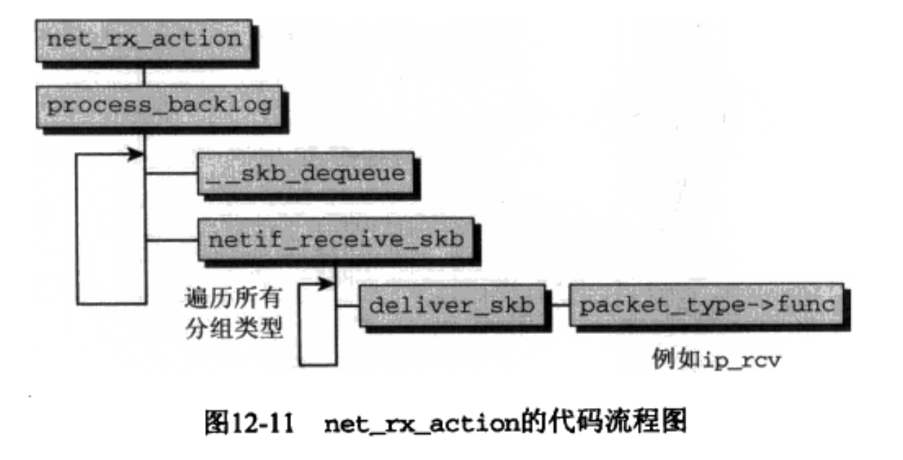

在准备任务完成之后，工作转移到process_backlog，该函数在循环中执行一下啊步骤。为简化描述，假定循环一直进行，直到所有的待解决分组都处理完成，不会被其他情况中断。

1. __skb_dequeue从等待队列移除一个套接字缓冲区，该缓冲区管理着一个接收到的分组。
2. 由netif_receive_skb函数分析组件分类，以便根据分组类型将分组传递给网络层的接收函数（即传递到网络系统的更高一层）。

**接下来deliver_skb函数使用一个特定于分组类型的处理函数func，承担对分组的更高层的处理。**

所有用于从底层的网络访问层接收数据的网络层函数都注册在一个散列表中，通过全局数组ptype_base实现。

新的协议添加通过dev_add_pack增加。各个数组项的类型为struct packet_type，定义如下：

```c
<netdevice.h>
struct packet_type{
	__be16	type;//
	struct net_device *dev;//NULL在这里表示通配符
	int	(*func)(struct sk_buff *,struct net_device *,struct packet_type *,struct net_device *);
	
	...
	void *af_packet_priv;
	struct list_head list;
}
```

type指定了协议的标识符，处理程序会使用该标识符。dev将一个协议处理程序绑定到特定的网卡。

func是该结构的主要成员。它是一个指向网络层函数的指针，如果分组的类型适当，将其传递给该函数。其中一个处理程序就是ip_rcv，用于给予IPv4的协议。

netif_receive_skb对给定的套接字缓冲区查找适当的处理程序，并调用其func函数，将处理分组的职责委托给网络层，这是网络实现中更高的一层。

#### 2. 对高速接口的支持

如果设备不支持过高的传输率，那么前面的方式可以很好的解决。将分组从网络设备传输到内核的更高层。每次一个以太网帧到达时，都使用一个IRQ来通知内核。对于低速设备来说，在下一个分组到达之前，IRQ的处理通常已经结束。如果在下一个分组通过IRQ通知，如果前一个分组的IRQ尚未处理完成，则会导致问题。

NAPI使用了IRQ和轮询的组合。

假定某个网络适配器此前没有分组到达，但从现在开始，分组将以高频到达。这就是NAPI设备的情况，如下：

1. 第一个分组将导致网络适配器发出IRQ。为防止进一步的分组导致发出更多的IRQ，驱动程序会关闭该适配器的Rx IRQ。并将该适配器放置到一个轮询表上。
2. 只要适配器上还有分组需要处理，内核就一直对轮询表上的设备进行轮询。
3. 重启Rx中断。

如果在新的分组到达时，旧的分组仍然处于处理过程中，工作不会因额外的中断而减速。虽然对设备驱动程序来说轮询是一个很差的方法，但在这里该方法没有什么不好的地方：在没有分组还需要处理时，将停止轮询，设备将恢复到通常的IRQ驱动的运行方式。在没有中断支持的情况下，轮询空的接收队列将不必浪费时间，但NAPI不是这样的。

NAPI的另一个优点，可以高效的丢弃分组。如果内核确信因为有很多其他工作需要处理，而导致无法处理任何新的分组，那么网络适配器可以直接都起分组，无须复制到内核。

只有设备满足如下两个条件时，才能实现NAPI方法。

1. 设备必须能够保留多个接收的分组，例如保存到DMA环形缓冲区中。下文将该缓冲区称为Rx缓冲区。
2. 该设备必须能够禁用用于 分组接收的IRQ。而且，发送分组或 其他可能通过IRQ进行的操作，都依然必须是启用的。

如果系统中有多个设备。这是通过循环轮询各个设备来解决的。

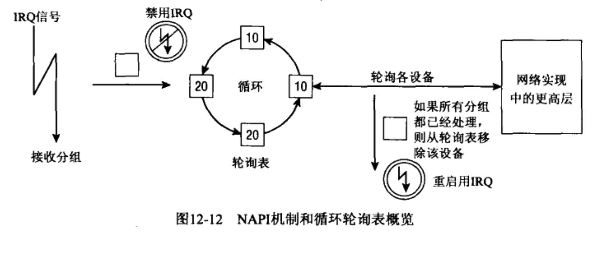

如果一个分组到达一个空的Rx缓冲区，则将相应的设备至于轮询表中。由于链表特征，轮询表可以包含各个设备。

内核以循环方式处理链表上的所有设备：内核依次轮询各个设备，如果已经花费了一定的时间来处理某个设备，则选择下一个设备进行处理。此外，某个设备都带有一个相对权重，表示与轮询表中其他设备相比，该设备的相对重要性。较快的设备权重比较大，较慢的设备权重比较低。

支持NAPI的设备必须提供一个poll函数。该方法是特定于设备的，在用netif_napi_add注册网卡时指定。调用该函数注册，表明设备可以且必须用新方法处理。

```c
<netdevice.h>
static inline void netif_napi_add(struct net_device *dev,struct napi_struct *napi,int (*poll)(struct napi_struct *,int),int weigth);
```

dev指向所述设备的net_device实例，poll指定了在IRQ禁止时用来轮询设备的函数，weight制定了设备接口的相对权重。

struct napi_struct实例用于管理轮询表上的设备。定义如下：

```c
<netdevice.h>
struct napi_struct{
	struct list_head poll_list;
	
	unsigned long state;
	int weight;
	int (*poll)(struct napi_struct *,int);
};
```

轮询通过一个标准的内核双链表实现，poll_list用作链表元素。weight和poll的语义同上文一样。state可以是NAPI_STATE_SCHED或NAPI_STATE_DISABLE，前者表示设备将在内核的下一次循环时被轮询，后者表示轮询已经结束了且没有更多的分组等待处理，但设备尚未从轮询表移除。

##### 实现poll函数

poll函数需要两个参数：一个指向napi_struct实例的指针和一个指定了“预算”的整数，预算表示内核允许驱动程序处理的分组数目。


### 发送分组


## 网络层

网络层不仅负责发送和接收数据，还负责在彼此不直接连接的系统之间转发和路由分组。查找最佳路由并选择适当的网络设备来发送分组，也涉及对底层地址簇的处理（如特定于硬件的MAC地址），这是该层至少要与网卡松耦合的原因。在网络层地址和网络访问层之间的指派是由这一层完成的，也是互联网络层无法与硬件完全脱离的原因。

如果不考虑底层硬件，是无法将较大的分组分割为较小单位的。实际上硬件的性质是需要分割分组的首要原因。因为每一种传输技术所支持的分组长度都有一个最大值，IP协议必须方法将较大的分组划分为较小的单位，由接收方重新组合，更高协议不会注意到这一点。划分后分组的长度取决于特定传输协议的能力。

### 1. IPv4

IP分组使用的协议首部如下图：

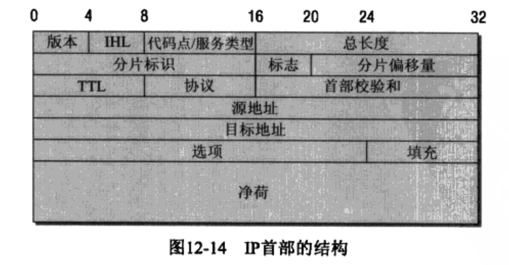

结构中各部分语义：

- version：制定了所用IP协议的版本。
- IHL（IP首部长度）定义了首部的长度，由于选项数量可变，这个值并不总是相同的。
- Codepoint或type of service用于更复杂的协议选项。
- Length制定了**分组的总长度**，即**首部加数据的长度**。
- fragment Id（分片标识）**标识了一个分片的IP分组的各个部分**。分片方法将同一个分片ID指定到**同一原始分组的各个数据片**，使之可标识为同一分组的成员。**各个部分的相对位置**由fragment offset（分片偏移量）字段定义。
- 有三个状态标识位用于启动或禁用特定的特性，目前只使用其中两个。
  - DF：don't fragment，即指定分组不可拆分为更小的单位。
  - MF：表示当前分组是一个更大分组的分片，后面还有其他分片（除了最后一个分片之外，所有分片都会设置该标志位）。
  - 第三个标志位“保留供未来使用”。
- TTL，Time to Live，制定了从发送者到接收者的传输路径上中间站点的最大数目。
- Protocol标识了IP分组承载的高层协议（传输层）。例如，TCP、UDP都有对应的唯一值。
- Checksum包含了一个校验和，根据首部和数据的内容计算。
- src和dest指定了源和目标的32位IP地址。
- options用于扩展IP选项。
- data保存了分组数据。

IP首部中所有的数值都以网络字节序存储（大端序）。

首部iphdr数据结构如下：

```c
<ip.h>
struct iphdr{
#if defined(__LITTLE_ENDIAN_BITFIELD)
		__u8	ihl:4,
					version:4;
#elif	defined	(__BIG_ENDIAN_BITFIELD)
		__u8	version:4,
					ihl:4;
#endif

		__u8	tos;
		__u16	tot_len;
		__u16	id;
		__u16	frag_off;
		__u8	ttl;
		__u8	protocol;
		__u16	check;
		__u32	saddr;
		__u32	daddr;
		//选项从这里开始
					
}
```

ip_rcv函数是网络层的入口点。分组向上穿过内核的路线如下图所示：

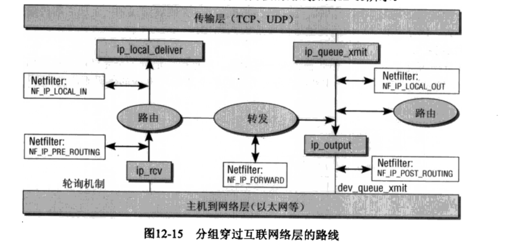

发送和接收操作的程序流程并不是分离的，如果分组只通过当前计算机转发，那么发送和接收操作是交织的。这种分组不会传递到更高的协议层，而是立即离开计算机发往新的目的地。

###  2. 接收分组

在分组转发到ip_rcv之后，必须进行检查收到的信息，确保它是正确的。主要检查计算的校验和与首部中存储的校验和是否一致。其他的检查包括分组是否达到了IP首部的最小长度，分组的协议是否确实是IPv4.

进行了校验之后，内核并不立即继续对分组的处理，而是**调用了一个 netfilter挂钩，使得用户空间可以对分组数据进行操作**。netfilter挂钩插入到内核源代码中定义好的各个位置，使得分组能够被外部动态操作。挂钩存在于网络子系统的各个位置，每种挂钩都有一个特别的标记，比如NF_IP_POST_ROUTING。

在内核到达一个挂钩位置时，将**在用户空间调用对该标记支持的例程**。接下来，在另一个内核函数中继续内核端的处理（分组可能被修改过）。

在下一步中，接收到的分组到达一个十字路口，此时需要判断该分组的目的地是本读系统还是远程计算机。根据对分组目的地的判断，需要将分组转发到更高层，或者转到互联网络层的输出路径上。

ip_route_input负责选择路由。判断路由的结果，选择一个函数，进行进一步的分组处理。可用的函数是ip_local_delover和ip_forward。

### 3. 交付到本地传输层

如果分组的目的地是本地计算机，ip_local_deliver必须设法找到一个适合的传输层韩式，将分组转送过去。IP分组通常对用的传输层协议是TCP或UDP。

#### 1. 分片合并

由于IP分组可能是分片的，因此会带来一些困难。该函数的第一项任务，就是通过ip_defrag重新组合分片分组的各个部分。代码的流程图如下：

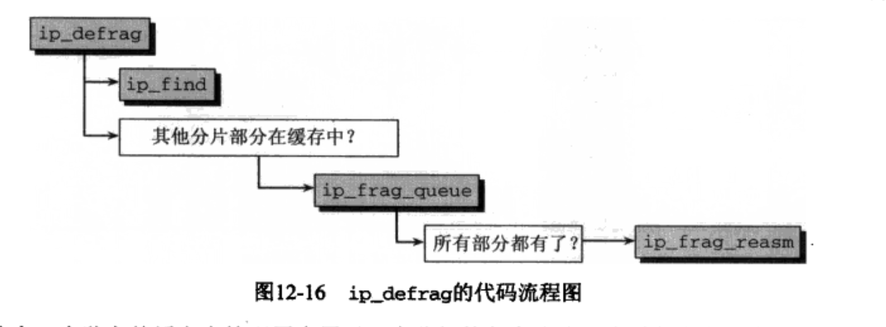

内核在一个**独立的缓存**中管理原本**属于一个分组的各个分片**，该缓存称为*分片缓存*。在缓存中，**属于同一个分组的各个分片保存在一个独立的等待队列中**，**直至该分组的所有分片都到达**。

接下来调用ip_find函数。**它使用一个基于分片ID、源地址、目标地址、分组的协议表示的散列过程，检查是否已经为对应的分组创建了等待队列**。如果没有，则建立一个新的队列，并将当前处理的分组放到这个里面。否则返回现存队列的地址，以便ip_frag_queue将分组至于队列上。

在分组的所有分片都进入缓存（即第一个和最后一个分片都已经到达，且所有分片中数据的长度之和等于分组预期的总长度）后，ip_frag_reasm将各个分片重新组合起来。

接下来释放套接字缓冲区，给其他使用。

如果分组的分片尚未全部到达，则ip_defrag返回一个NULL指针，终止互联网络层的分组处理。在所有分片都到达之后，将恢复处理。

#### 2. 交付到传输层

下面返回到ip_local_deliver。在分组的分片合并完成之后，调用NET_IP_LOCAL_IN，恢复在ip_local_deliver_finish函数中的处理。

在其中，根据分组的协议标识符确定一个传输层的函数，将分组传递给该函数。所有基于互联网络层的协议都有一个net_protocol结构的实例，该结构定义如下：

```c
include/net/protocol.h
struct net_protocol{
...
	int (*handler)(struct sk_buff *skb);
	void (*err_handler)(struct sk_buff *skb,u32 info);
...
}
```

- handler是协议例程，分组将被传递到该例程进行下一步处理。
- 在接收到ICMP错误信息并需要传递到更高层时，需要调用err_handler。

inet_add_protocol标准函数用于将上述的结构实例（指针）存储到inet_protos数组中，通过散列的方法确定存储具体协议的索引位置。

在套接字缓冲区中通过通常的指针操作“删除”IP首部后，剩下的工作就是调用传输层对应的接收历程，其函数执政存储在inet_protocol的handler字段中，例如，接收TCP分组的tcp_v4_rcv例程和用于接收UDP分组的udp_rcv。


### 分组转发

IP分组可能如上所述交付给本地计算机处理，它们也可能离开互联的网络层，转发到另外一台计算机，不涉及本地计算机的高层协议实例。分组的目标地址可以分为以下两种。

- 目标计算机在某个本地网络中，**发送计算机**与**该网络**有连接。
- 目标计算机在地理上属于远程计算机，不连接本地网络，只能通过网关访问。

第二种场景稍微复杂一点。首先必须找到剩余路由中的第一个站点，将分组转发到该站点上，这是想最终目标地址的第一步传输。不仅需要计算机网络所属本地网络结构的相关信息，还需要相邻网络结构和相关外出路径的信息。

这些信息由路由表提供，路由表由内核通过多种数据结构实现并管理，相关内容在后面讨论。在接收分组时调用的ip_route_input函数充当路由实现的接口，一方面这个函数能够识别出分组时交付到本地还是转发出去，另一方面该函数能够找到通向目标地址的路由。目标地址存储在套接字缓冲区的dst字段中。

这个使ip_forward的工作比较简单。

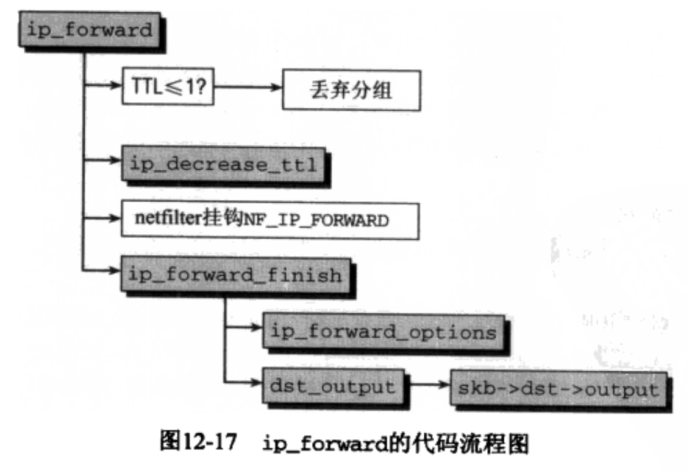


- 首先，该函数根据TTL字段来检查当前分组是否允许传输到下一跳。如果ttl小雨等于1，则丢弃分组。否则，将TTL计数器值减一。ip_decrease_ttl负责该工作，修改TTL字段的同时，分组的校验和也会发生变化，通向需要修改。
- 在调用netfilter挂钩NF_IP_FORWARD后，内核在ip_forward_options中恢复处理。该函数将其工作委托给如下两个函数。
  - 如果分组包含额外的选项，则在ip_forward_options中处理。
  - dst_pass将分组传递到在路由期间选择、保存在skb->dst->output中的发送函数。通常使用ip_out，该函数将分组传递到与目标地址匹配的网络适配器。


### 发送分组

内核提供了几个通过互联网络层发送数据的函数，可由较高协议层使用。其中ip_queue_xmit是最常使用的一个。具体流程图如下图所示。

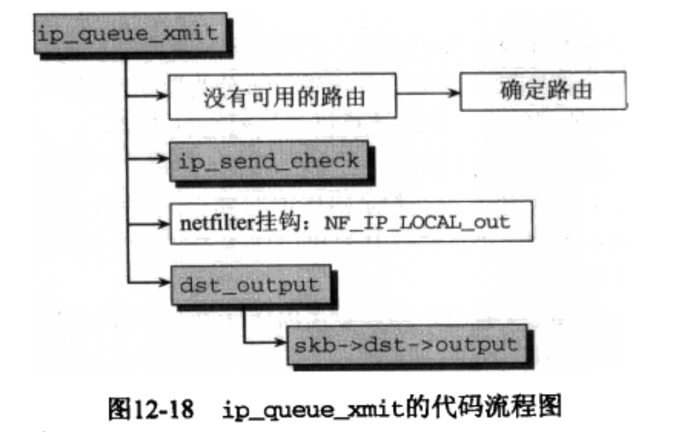

第一个任务是查找可用于该分组的路由。内核利用了如下：起源于同一个套接字的所有分组的目标地址是相同的，这样不用每次都重新确定路由。下面将讨论指向相应数据结构的一个指针，它与套接字数据结构相关联。在发送第一个分组时，内核需要查找一个新的路由。

在ip_send_check为分组生成校验和之后，内核调用netfilter挂钩NF_IP_LOCAL_OUT。接下来调用dst_output函数。该函数基于确定路由期间找到的skb_dst->output函数。后者位于套接字缓冲区中，与目标地址相关。通常，该函数指针指向ip_output，本地产生和转发的分组将在该函数中汇集。

#### 1. 转移到网络访问层

ip_output函数的代码流程图如下：

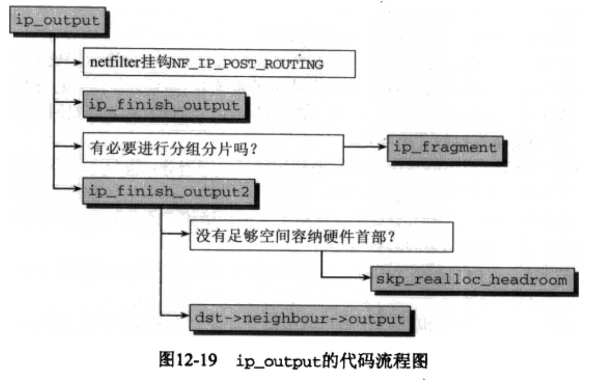


其中根据分组是否需要分片，将代码路径分为两个部分。

首先调用netfilter挂钩NF_IP_POST_ROUTING,接下来是ip_finish_output。首先，考察分组长度不大于传输介质MTU、无须分片的情况。在这种情况下，直接调用了ip_finish_output2。该函数检查套接字缓冲区是否仍然有足够的空间容纳产生的引荐首部。如有必要，则用skb_realloc_headroom分配额外的空间。为完成到网络访问层的转移，调用由路由层设置的函数dst->neighbour->output，该函数指针通常指向dev_queue_xmit。

#### 2. 分组分片

ip_fragment将IP分组划分为更小的单位，如下图：

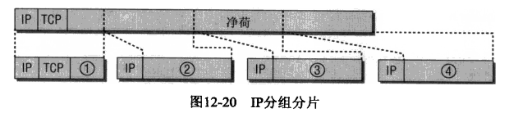

在循环的每一轮中，都抽取出一个数据分组，其长度与对应的MTU兼容。创建一个新的套接字缓冲区来保存抽取的数据分片，旧的IP首部可以稍作修改后重用。所有的分片都会分配一个共同的分片ID，以便在目标系统上重新组装分组。分片的顺序基于分片偏移量建立，此时也需要适当的设置。MF标志位也需要设置。只有序列中的最后一个分片可以将标志位设置为0 。每个分片都在使用ip_send_check产生校验和之后，用ip_output发送。

#### 3. 路由

在任何IP实现中，路由都是一个重要的部分，不仅在转发外部分组时需要，而且也用于发送本地计算机产生的分组。查找数据从计算机“外出”的正确路径的问题，不仅在处理分本地地址是会遇到，在本读计算机有几个网络接口时，也会有此类问题。即使只有一个物理上的网络适配器，也可能有环回设备这样的虚拟接口，同样会导致该问题。

每个接收到的分组都属于下列3个类别之一。

1. 其目标是本地主机。
2. 其目标是当前主机直接连接的计算机。
3. 其目标是远程计算机，只能经由中间系统到达。

如果分组的目标系统与本地主机直接连接，路由通常特化为查找对应的网卡。否则，必须根据路由选择信息来查找网关系统以及与网关相关联的网卡，分组需要通过网关来发送。

路由的起始点是ip_route_input函数，他首先在路由缓冲中查找路由。

ip_route_input_slow用于根据内核的数据来建立一个新的路由。基本上，该例程依赖于fib_lookup，后者的隐式返回值是一个fib_result结构的实例，包含了我们需要的信息。fib代表转发信息库，是一个表，用于管理内核保存的路由选择信息。

路由结果关联到一个套接字缓冲区，套接字缓冲区中的dst成员指向了一个dest_entry结构的实例，该实例的内容是在路由查找期间填充的。该数据结构定义如下：

```c
include/net/dst.h
struct dst_entry{
	struct net_device *dev;
	int	(*input)(struct sk_buff *);
	int	(*output)(struct sk_buff *);
	struct	neighbour *neighbour;
};
```

- input和output分别用于处理进入和外出的分组，如上所述。
- dev指定了用于处理该分组的网络设备。

根据分组的类型，会对input和output指定不同的函数。

- 对需要交付到本地的分组，input设置为ip_local_deliver，而output设置为ip_rt_bug
- 对于需要转发的分组，input设置为ip_forward，而output设置为ip_output函数。

neighbour成员存储了计算机在本地网络中的IP和硬件地址，这可以通过网络访问层直接到达。

```c
include/net/neighbour.h
struct neighbour{
	struct net_device *dev;
	unsigned	char	ha[ALIGN(MAX_ADDR_LEN,sizeof(unsigned long))];
	int	(*output)(struct sk_buff *skb);
}
```

dev保存了网络设备的数据结构，ha是设备的硬件地址。output是指向适当的内核函数的指针，在通过网络适配器传输分组是必须调用。neighbour实例由内核中实现ARP的ARP层创建，ARP协议负责将IP地址转换为硬件地址。


### netfilter

netfilter是一个Linux内核框架，可以根据动态定义的条件来过滤和操作分组。这显著增加了可能的网络选项的数目，从简单的防火墙，到对网络通信数据的详细分析，到复杂的、依赖于状态的分组过滤器。


#### 1. 扩展网络功能

netfilter框架向内核添加了以下功能。

- 根据状态及其他条件，对不同数据流方向（进入、流出、转发）进行分组过滤（packet filtering）
- NAT，根据某些规则来转换源地址和目标地址。
- 分组处理（packet manghing）和操作（manipulation），根据特定的规则拆分和修改分组。


#### 2. 调用挂钩函数


#### 3. 扫描挂钩列表


#### 4. 激活挂钩函数


## 传输层

### 1. UDP

ip_local_deliver负责**分发IP分组传输的数据内容**。net/ipv4/udp.c中的udp_rcv用于进一步的处理UDP数据报。相关的代码流程图如下。

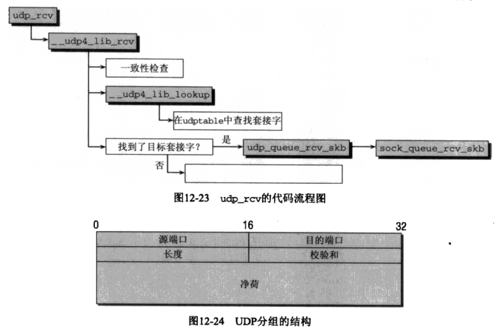

udp_rcv只是__udp4_lib_rcv的一个包装器。

该函数的输入参数是一个套接字缓冲区。在确认分组未经串改之后，必须用__udp4_lib_lookup查找与之匹配的监听套接字。连接参数可以从UDP首部获取，其结构如上。

上图中的原端口和目的端口分别指定了分组的源系统和目标系统的端口号，可接受的值为0～65535.长度是分组的总长度（首部和数据），按字节计算，校验和保存的是一个可选的校验和。

UDP分组的首部在内核中有下列数据结构表示：

```c
<udp.h>
struct udphdr {
	__be16 source;
	__be16 dest;
	__be16 len;
	__be16 check;
}
```

net/ipv4/udp.c中的__udp4_lib_lookup用于查找与分组目标匹配的内核的内核内部的套接字。在有某个监听进程对该分组感兴趣时，在udphash全局数组中则会有与分组目标端口匹配的sock结构实例，__udp4_lib_lookup可采用散列方法查找并返回该实例。如果找不到这样的套接字，则向源系统发送一个“目标不可达”的消息，并丢弃分组的内容。

数据最终要使用套接字传输到用户空间。内核中有两种数据结构用于表示套接字。sock是到网络访问层的接口，而socket是到用户空间的接口。下面对sock结构中用于向下一个更高层次转发数据的方法感兴趣。这些方法必须将接收到的数据放置在一个特定于套接字的等待队列上，并通知接收进程有新数据到达。当前，sock结构可以简化为下面：

```c
include/net/sock.h
struct sock {
	wait_queue_head_t	*sk_sleep;
	struct sk_buff_head	sk_receive_queue;
	
	void	(*sk_data_ready)(struct sock *sk,int bytes);
}
```

在udp_rcv查找到适当的sock实例后，控制转移到udp_queue_rcv_skb，之后又立即到sock_queue_rcv_skb，其中会执行两个重要的操作，完成到应用层的数据交付。

- 等待通过套接字交付数据的进程，在sk_sleep等待队列上睡眠；
- 调用skb_queue_tail将包含分组数据的套接字缓冲区插入到sk_receive_queue链表末端，其表头保存在特定于套接字的sock结构中。
- **调用sk_data_ready指向的函数**，**通知套接字有新数据到达**。**唤醒在sk_sleep队列上睡眠、等到数据到达所有进程。**


### 2. TCP

TCP支持数据流安全传输的面向连接的通信模型。TCP连接总处于某个明确定义的状态.

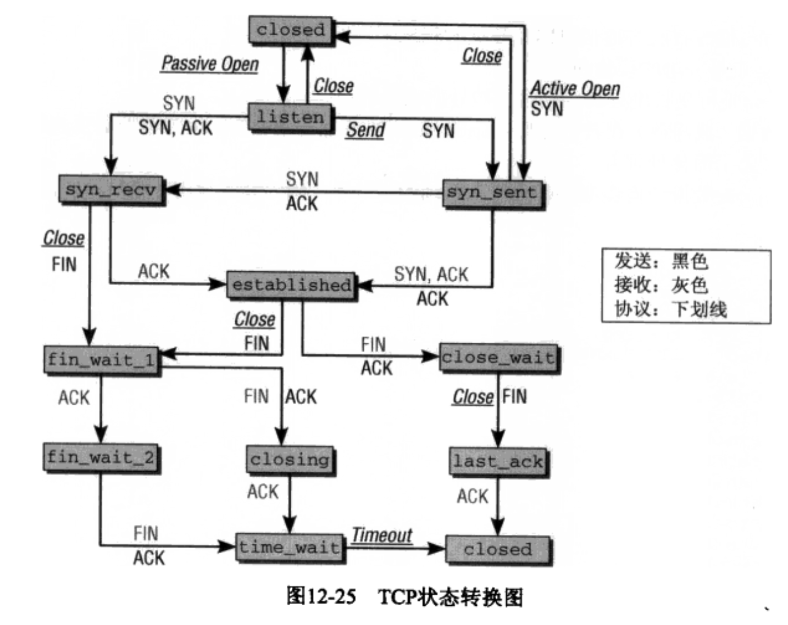

#### 1. TCP首部

TCP分组packet的首部包含了状态数据和其他连接信息。首部的结构如下图：

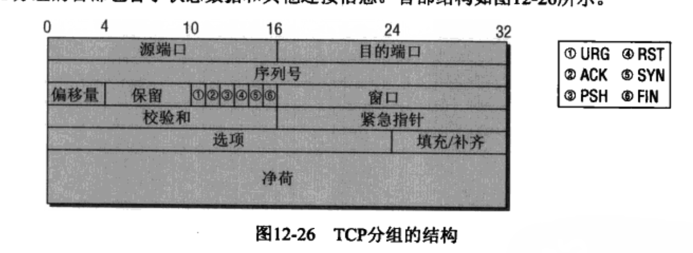

- source和dest制定了所用的端口号。类似于UDP。
- seq是一个序列号。他制定了TCP分组在数据流中的位置，在数据丢失需要重新传输的时候很重要。
- ack_seq包含了一个序列号，在确认收到TCP分组时使用。
- doff表示数据偏移量并指定了TCP首部结构的长度，由于一些选项是可变的，其值并不总是相同的。
- reserved不可用。
- urg紧急、ack确认、psh推、rst重置、sync同步和fin都是标志控制，用于检查、建立和结束连接。
- window告诉连接的另一方，在接收方的缓冲区满之前，可以发送多少字节。这用于在快速的发送方与低速接收方通信时防止数据的积压。
- checksum是分组的校验和。
- options是可变长度列表，包含额外的连接选项。
- 实际数据在首部之后。options字段可能要补齐，满足数据必须起始于32位边界位置。

首部由tcphdr数据结构实现。需要注意系统的字节序，因为其中使用了位域字段。

```c
<tcp.h>
struct tcphdr{
	__be16	source;
	__be16	dest;
	__be32	seq;
  __be32	acl_seq;
  #if defined(__LITTLE_ENDIAN_BITFIELD)
  	__u16	resl:4,
  	doff:4,
  	fin:1,
  	syn:1,
  	rst:1,
  	psh:1,
  	ack:1,
  	urg:1,
  	ece:1,
  	cwr:1;
  #elif	defined(__BIG_ENDIAN_BITFIELD)
  	__u16	doff:4,
  	resl:4,
  	cwr:1,
  	ece:1,
  	urg:1,
  	ack:1,
  	psh:1,
  	rst:1,
  	syn:1,
  	fin:1;
  #else
  #error "xxx"
  #endif
  	__be16 window;
  	__sum16	check;
  	__be16	urg_ptr;
}
```

#### 2. 接收TCP数据

所有TCP操作（连接建立和关闭，数据传输）都是通过发送带有各种属性和标志的分组来进行。在讨论状态迁移之前，必须确定TCP数据是如何传递到传输层的，且首部中的信息在何处进行分析。

在互联网络层处理分组之后，tcp_v4_rcv是TCP层的入口。代码流程图在下图中给出。

系统中的每个TCP套接字都归入三个散列表之一，分别接受下列状态的套接字。

- 完全连接的套接字；
- 等待连接（监听状态）的套接字；
- 处于建立连接过程中的套接字。

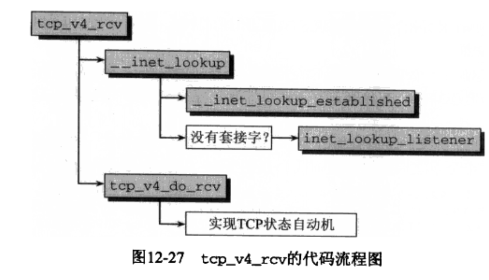

在对分组数据进行各种检查并将首部中的信息复制到套接字缓冲区的控制块之后，内核将查找等待该分组的套接字的工作委托给__inet_lookup函数。该函数的唯一作用就是调用另外两个函数，扫描各种散列表。`inet_lookup_established` 试图返回一个一连接的套接字。如果没有找到合适的结构，则调用 `inet_look_listener` 函数检查所有的监听套接字。

在两种情况下，这些函数合并考虑了对应连接的各种不同因素，通过散列函数来查找一个前面说的sock类型实例。在搜索监听套接字时，会针对与通配符匹配的几个套接字，应用计分方法来查找最佳的候选者。

在找到对应的sock实例之后，工作才刚刚开始。取决于连接的状态，按照状态迁移。tcp_v4_do_rcv是一个多路分解器，基于套接字状态将代码控制流划分到不同的分支。


#### 3. 三次握手

在使用TCP链路之前，必须在客户端和主机之间显示的建立连接。主动active和被动passive连接的建立方式是有区别的。

内核在连接建立之前，客户端进程的套接字状态为CLOSED，服务端套接字的状态为LISTEN。

建立TCP连接的过程需要交换3个TCP分组（packet），称为三次握手。


#### 4.被动连接建立

被动连接建立并不是源于内核，而是在接收到一个连接请求的SYN分组后触发。因而其起点时tcp_v4_rcv函数，如上所述，该函数查找一个监听套接字，并将控制权转移到tcp_v4_do_rcv,代码流程如下：

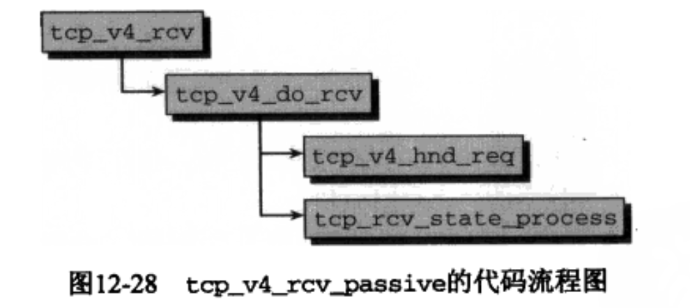


调用tcp_v4_hnd_req来执行网络层中建立新连接所需要的各种初始化任务。实际的状态转移发生在tcp_rcv_state_process中，还函数有一个长的switch/case语句组成，区分各种kennel的套接字状态来调用适当的函数。

#### 5. 主动连接建立

主动连接建立发送时，是通过用户空间应用程序调用open库函数，发出socketcall系统调用到达内核函数tcp_v4_connect，其代码流程如下：

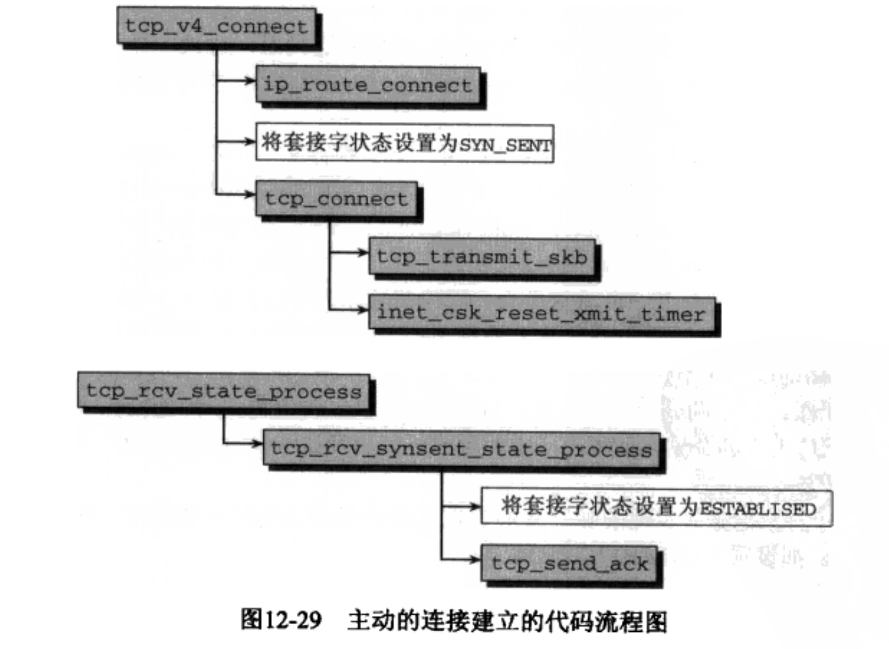

#### 6. 分组传输 packet transport

建立了一个连接之后，数据可以在计算机之间传输。该过程在某些状态下很麻烦。因为TCP有几个特性，要求在相互通行的主机之间进行广泛的控制和提供一些安全过程。如下所述：

- 按可保证的次序传输字节流；
- 通过自动化机制重传丢失的分组；
- 每个方向上的数据流都独立控制，并与对应的主机的速度匹配。

因为大多数的连接属于TCP的，实现的速度和效率是关键的，因此Linux内核借助于技巧和优化。

对于数据的丢失主要依赖这些解决方案。

基于序号来确认分组的概念，也用于普通的分组。但是与上文提到的内容相比，序列号揭示了有关数据传输的更多东西。序列号根据那种发难生成分配？在建立连接时，生成一个随机数，接下来使用一种系统化的方法来支持对所有进入分组的确认。

TCP使用一种累积式确认方案。这意味着一次确认将涵盖一个连续的字节范围。通过ack字段发送的数字将确认数据流在上一个ACK数目和当前ACK数目之间的所有字节。ACK数目确认了此前所有字节，其中最后一个字节的索引号比ACK数目小1，因此ACK数目也表示下一个字节的索引号。

该机制也用于跟踪丢失的分组。请注意，TCP没有提供显式的重传请求机制。


#### 7. 接收分组


#### 8. 发送分组


### 应用层


内核和用户空间套接字之间的接口实现在C标准库中，使用了socketcall系统调用。该函数充当了多路分解器，将各种任务分配由不同的过程执行，比如打开一个套接字、绑定或发送数据。

Linux采用了内核套接字的概念，使得用户空间中的套接字的通信简单。对程序使用的每个套接字来说，都对应一个socket结构和sock结构的实例。二者分别充当向下（到内核）和向上的（到用户空间）接口。

#### 1. socket数据结构

socket结构定义如下：

```c
<net.h>
struct socket {
	socket_state state;
  unsigned long flags;
  const struct proto_ops *ops;
  struct file *file;
  struct sock *sk;
  short type;
};
```

- type指定所用协议类型的数字标识符。
- state表示套接字的连接状态，可使用下列值（SS代表套接字状态，即socket state的缩写）：

```c
<net.h>
typedef enum{
  SS_FREE=0,//未分配
  SS_UNCONNECTED,
  SS_CONNECTED,
  SS_CONNENTING,
  SS_DISCONNECTING
} socket_state;
```

与传输层协议在建立和关闭连接时使用的状态值毫不相关。它们表示与外界（即用户程序）相关的一般性状态。

- file是一个指针，指向一个伪文件的file实例，用于和套接字通行。

socket的定义并未绑定到具体协议。这也说明了为什么需要用proto_ops指针指向一个数据结构，其中包含用于处理套接字的特定于协议的函数：

```c
<net.h>
struct proto_ops {
	int family;
  struct module *owner;
  int (*release) (struct socket *sock);
  int (*bind) (struct socket *sock,struct sockaddr *myaddr,int socket_len);
  
  int (*connect) (struct socket *sock,struct sockaddr *vaddr);
  
  int (*socketpair) (struct socket *sock1,struct socket sock2);
  
  int (*accept) (struct socket *sock,struct socket *newsock,int fllages);
  
  int (*getname) (struct socket *sock,struct socketaddr *addr);
  
  unsigned int (*poll) (struct file *file,struct socket *sock,struct poll_table_struct *wait);
  
  int (*ioctl) (struct socket *sock,unsigned int cmd,unsigned long arg);
  
  int (*compat_ioctl) (struct socket *sock,unsigned int cmd,unsigned long arg);
  
  int (*listen) (struct socket *sock,int len);
  
  int (*shutdown) (struct socket *sock,int flags);
  
  int (*setsockopt) (struct socket *sock,int level,int optname,char __user *optval,int __user *optlen);
  
  int (*getsockopt) (struct socket *sock,int level,int optname,char __user *optval,int __user *optlen);
  
    int (*compact_setsockopt) (struct socket *sock,int level,int optname,char __user *optval,int __user *optlen);
  
    int (*compact_getsockopt) (struct socket *sock,int level,int optname,char __user *optval,int __user *optlen);
  
  int (*sendmsg) (struct kiocb *iocb,struct socket *sock,struct msghdr *m,size_t total_len);
  
  int (*recvmsg) (struct kiocb *iocb,struct socket *sock,struct msghdr *m,size_t total_len,int flags);
  
  int (*mmap) (struct file *file,struct socket *sock,struct vm_area_struct *vma);
  
  ssize_t (*sendpage) (struct socket *sock,struct page *page,int offset,size_t size,int flags);
  
}
```


