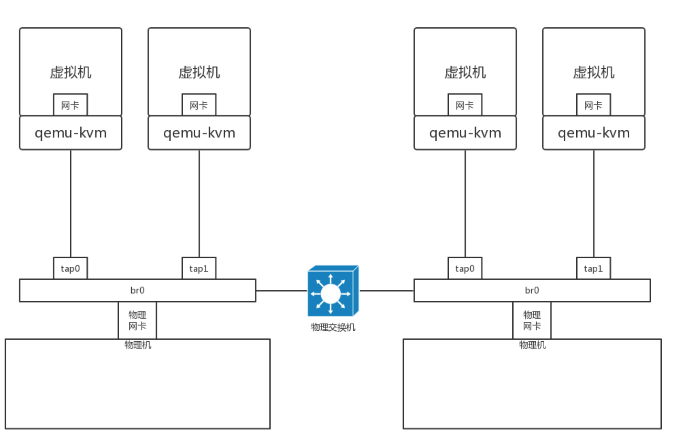
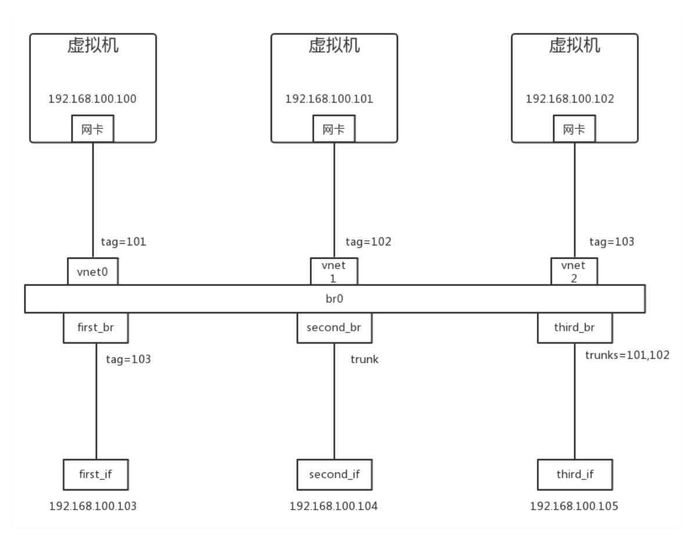
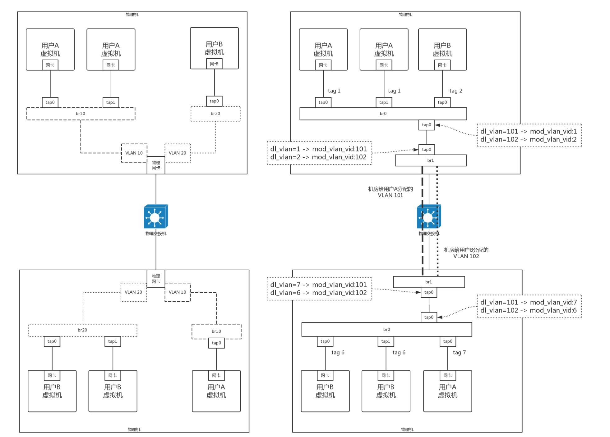
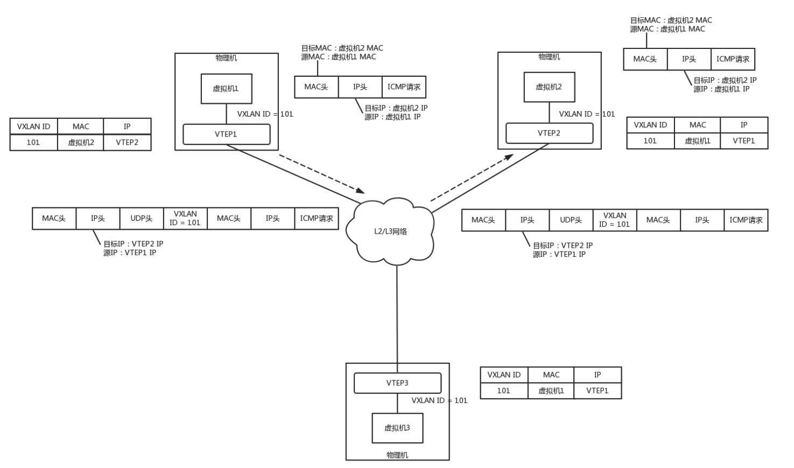

通过这篇文章，回顾学习一下基础的网络协议。


**网络协议相关分层**

| 协议层 | 包含协议                                    |
| ------ | ------------------------------------------- |
| 应用层 | DHCP、HTTP、HTTPS、P2P、DNS、GTP、RPC、RTMP |
| 传输层 | UDP、TCP                                    |
| 网络层 | CIMP、IP、BGP、GRE、ICMP、OSPF、IPSec       |
| 链路层 | ARP、VLAN、STP                              |
| 物理层 | 网络跳线                                    |


下面我们会从底向上的方向详细讲解，分析相关的网络协议。


### 一、 网络分层的真实含义

网络为什么要分层? 

```
这里我们先探讨第一个问题，网络为什么要分层?因为，是个复杂的程序都要分层。
```

理解计算机网络中的概念，一个很好的角度是，想象网络包就是一段 Buffer，或者一块内存，是有格式的。同时，想象自己是一个处理网络包的程序，而且这个程序可以跑在电脑上，可以跑在服务器上，可以跑在交换机上，也可以跑在路由器上。**你想象自己有很多的网口，从某个口拿进一个网络包来，用自己的程序处理一下，再从另一个网口发送出去**。

当然网络包的格式很复杂，这个程序也很复杂。**复杂的程序都要分层，这是程序设计的要求**。比如，复杂的电商还会分数据库层、缓存层、Compose 层、Controller 层和接入层，每一层专注做本层的事情。


```
当一个网络包从一个网口经过的时候，你看到了，首先先看看要不要请进来，处理一把。有的网口配置
了混杂模式，凡是经过的，全部拿进来。
```

拿进来以后，就要交给一段程序来处理。于是，你调用`process_layer2(buffer)`。当然，这是一个假的函 数。但是你明白其中的意思，知道肯定是有这么个函数的。那这个函数是干什么的呢?从 Buffer 中，摘掉二层的头，看看，应该根据头里面的内容做什么操作。 

假设你发现这个包的 MAC 地址和你的相符，那说明就是发给你的，于是需要调用`process_layer3(buffer)`。这个时候，Buffer 里面往往就没有二层的头了，因为已经在上一个函数的处理过程中拿掉了，或者将开始的偏移量移动了一下。在这个函数里面，摘掉三层的头，**看看到底是发送给自己的，还是希望自己转发出去的**。

如何判断呢?如果 IP 地址不是自己的，那就应该转发出去;如果 IP 地址是自己的，那就是发给自己的。根据 IP 头里面的标示，拿掉三层的头，进行下一层的处理，到底是调用 `process_tcp(buffer)` 呢，还是调用 `process_udp(buffer)` 呢?

假设这个地址是 TCP 的，则会调用`process_tcp(buffer)`。这时候，Buffer 里面没有三层的头，就需要**查看四层的头**，**看这是一个发起，还是一个应答，又或者是一个正常的数据包**，**然后分别由不同的逻辑进行处理**。如果是发起或者应答，接下来可能要发送一个回复包;如果是一个正常的数据包，就需要交给上层了。交给谁呢?是不是有 `process_http(buffer) `函数呢?

没有的，如果你是一个网络包处理程序，你不需要有 `process_http(buffer)`，而是应该交给应用去处理。交给哪个应用呢?在四层的头里面有端口号，不同的应用监听不同的端口号。如果发现浏览器应用在监听这个端口，那你发给浏览器就行了。至于浏览器怎么处理，和你没有关系。

浏览器自然是解析 HTML，显示出页面来。电脑的主人看到页面很开心，就点了鼠标。点击鼠标的动作被浏览器捕获。浏览器知道，又要发起另一个 HTTP 请求了，于是使用端口号，将请求发给了你。

你应该调用`send_tcp(buffer)`。不用说，Buffer 里面就是 HTTP 请求的内容。这个函数里面加一个 TCP的头，记录下源端口号。浏览器会给你目的端口号，一般为 80 端口。

然后调用`send_layer3(buffer)`。Buffer 里面已经有了 HTTP 的头和内容，以及 TCP 的头。在这个函数里面加一个 IP 的头，记录下源 IP 的地址和目标 IP 的地址。

然后调用`send_layer2(buffer)`。Buffer 里面已经有了 HTTP 的头和内容、TCP 的头，以及 IP 的头。这个函数里面要加一下 MAC 的头，记录下源 MAC 地址，得到的就是本机器的 MAC 地址和目标的 MAC地址。不过，这个要看当前知道不知道，知道就直接加上;不知道的话，就要通过一定的协议处理过程，找到 MAC 地址。反正要填一个，不能空着。

万事俱备，只要 Buffer 里面的内容完整，就可以从网口发出去了，你作为一个程序的任务就算告一段落了。


**揭秘层与层之间的关系** 

**这里要记住一点**:**只要是在网络上跑的包，都是完整的。可以有下层没上层，绝对不可能有上层没下层。**

所以，对 TCP 协议来说，三次握手也好，重试也好，只要想发出去包，就要有 IP 层和 MAC 层，不然 是发不出去的。 

所谓的二层设备、三层设备，都是这些设备上跑的程序不同而已。一个 HTTP 协议的包经过一个二层设备，二层设备收进去的是整个网络包。这里面 HTTP、TCP、 IP、 MAC 都有。什么叫二层设备呀，就是只把 MAC 头摘下来，看看到底是丢弃、转发，还是自己留着。那什么叫三层设备呢?就是把 MAC头摘下来之后，再把 IP 头摘下来，看看到底是丢弃、转发，还是自己留着。

### 二、DHCP与PXE：IP怎么来的？怎么没的？

如何配置ip地址？

我们可以使用命令行自己配置一个地址。可以使用`ifconfig`，也可以使用`ip addr`。设置好之后使用这些命令，将网卡up一下就好了，就可以开始工作了。

使用`net-tools`:

```shell
sudo ifconfig eth1 10.0.0.1/24
sudo ifconfig eth1 up
```

使用`iproute2`:

```shell
sudo ip addr add 10.0.0.1/24 dev eht1
sudo ip link set up eht1
```


Linux 首先会判断，要去的这个地址和我是一个网段的吗，或者和我的一个网卡是同一网段的吗?只有是一个网段的，它才会发送 ARP 请求，获取 MAC 地址。如果发现不是呢?

Linux 默认的逻辑是，如果这是一个跨网段的调用，它便不会直接将包发送到网络上，而是企图将包发送到网关。

如果你配置了网关的话，Linux 会获取网关的 MAC 地址，然后将包发出去。对于 192.168.1.6 这台机器来讲，虽然路过它家门的这个包，目标 IP 是它，但是无奈 MAC 地址不是它的，所以它的网卡是不会把包收进去的。

如果没有配置网关呢?那包压根就发不出去。

如果将网关配置为 192.168.1.6 呢?不可能，Linux 不会让你配置成功的，因为**网关要和当前的网络至少一个网卡是同一个网段**的，怎么可能 16.158.23.6 的网关是 192.168.1.6 呢?

所以，**当你需要手动配置一台机器的网络 IP 时**，一定要好好问问你的网络管理员。如果在机房里面，要去网络管理员那里申请，让他给你分配一段正确的 IP 地址。当然，**真正配置的时候，一定不是直接用命令配置的，而是放在一个配置文件里面**。不同系统的配置文件格式不同，但是无非就是 **CIDR、子网掩码、广播地址和网关地址**。

#### 1. 动态主机配置协议(DHCP)

原来配置 IP 有这么多门道儿啊。你可能会问了，配置了 IP 之后一般不能变的，配置一个服务端的机器还可以，但是如果是客户端的机器呢?我抱着一台笔记本电脑在公司里走来走去，或者白天来晚上走，每次使用都要配置 IP 地址，那可怎么办?还有人事、行政等非技术人员，如果公司所有的电脑都需要 IT人员配置，肯定忙不过来啊。

因此，我们需要有一个**自动配置的协议**，也就是称**动态主机配置协议**(Dynamic Host Configuration Protocol)，简称**DHCP**。

有了这个协议，网络管理员就轻松多了。他只需要配置一段共享的 IP 地址。每一台新接入的机器都通过DHCP 协议，来这个共享的 IP 地址里申请，然后自动配置好就可以了。等人走了，或者用完了，还回去，这样其他的机器也能用。

所以说，如果是**数据中心里面的服务器，IP 一旦配置好，基本不会变**，这就相当于买房自己装修。DHCP 的方式就相当于租房。你不用装修，都是帮你配置好的。你暂时用一下，用完退租就可以了。

##### **解析 DHCP 的工作方式** 

当一台机器新加入一个网络的时候，肯定一脸懵，啥情况都不知道，**只知道自己的 MAC 地址**。怎么 办?先吼一句，我来啦，有人吗?这时候的沟通基本靠“吼”。这一步，我们称为**DHCP Discover**。 

新来的机器使用 IP 地址 0.0.0.0 发送了一个广播包，目的 IP 地址为 255.255.255.255。**广播包封装在 UDP 里**面，`UDP` 封装在` BOOTP` 里面。其实` DHCP `是 `BOOTP `的增强版，但是如果你去抓包的话，很 可能看到的名称还是 BOOTP 协议。 

在这个广播包里面，新人大声喊:我是新来的(Boot request)，我的 MAC 地址是这个，我还没有 IP，谁能给租给我个 IP 地址! 

格式就像这样: 

如果一个网络管理员在网络里面配置了**DHCP Server**的话，他就相当于这些 IP 的管理员。他立刻能知道 来了个“新人”。这个时候，我们可以体会 MAC 地址唯一的重要性了。当一台机器带着自己的 MAC 地址加入一个网络的时候，MAC 是它唯一的身份，如果连这个都重复了，就没办法配置了。 

**只有 MAC 唯一，IP 管理员才能知道这是一个新人，需要租给它一个 IP 地址，这个过程我们称为DHCP Offer**。同时，**DHCP Server** 为此客户保留为它提供的 IP 地址，从而不会为其他 DHCP 客户分配此 IP 地址。 

**DHCP Offer 的格式**就像这样，里面有给新人分配的地址。 

​	

**DHCP Server** 仍然**使用广播地址作为目的地址**，因为，**此时请求分配 IP 的新人还没有自己的 IP**。DHCP Server 回复说，我分配了一个可用的 IP 给你，你看如何?**除此之外，服务器还发送了子网掩码、网关和 IP 地址租用期**等信息。

新来的机器很开心，它的“吼”得到了回复，并且有人愿意租给它一个 IP 地址了，这意味着它可以在网络上立足了。当然更令人开心的是，**如果有多个 DHCP Server，这台新机器会收到多个IP 地址**，简直受宠若惊。 

**它会选择其中一个** **DHCP Offer**，**一般是最先到达的那个，并且会向网络发送一个 DHCP Request 广播 数据包，包中包含客户端的 MAC 地址、接受的租约中的 IP 地址、提供此租约的 DHCP 服务器地址等，并告诉所有 DHCP Server 它将接受哪一台服务器提供的 IP 地址，告诉其他 DHCP 服务器，谢谢你们的接纳，并请求撤销它们提供的 IP 地址，以便提供给下一个 IP 租用请求者**。 


此时，**由于还没有得到 DHCP Server 的最后确认**，客户端仍然使用 0.0.0.0 为源 IP 地址、255.255.255.255 为目标地址进行广播。在 BOOTP 里面，接受某个 DHCP Server 的分配的 IP。

**当 DHCP Server 接收到客户机的 DHCP request 之后**，会广播返回给客户机一个 **DHCP ACK 消息包**，**表明已经接受客户机的选择，并将这一 IP 地址的合法租用信息和其他的配置信息都放入该广播包**，发给客户机，欢迎它加入网络大家庭。

最终租约达成的时候，还是需要广播一下，让大家都知道。


##### IP 地址的收回和续租 

既然是租房子，就是有租期的。租期到了，管理员就要将 IP 收回。 

如果不用的话，收回就收回了。就像你租房子一样，如果还要续租的话，不能到了时间再续租，而是要 提前一段时间给房东说。DHCP 也是这样。 

**客户机会在租期过去 50% 的时候，直接向为其提供 IP 地址的DHCP Server 发送 DHCP request 消息包。客户机接收到该服务器回应的 DHCP ACK 消息包，会根据包中所提供的新的租期以及其他已经更新 的 TCP/IP 参数，更新自己的配置。这样，IP 租用更新就完成了**。 

好了，一切看起来完美。DHCP 协议大部分人都知道，但是其实里面隐藏着一个细节，很多人可能不会 去注意。接下来，我就讲一个有意思的事情:**网络管理员不仅能自动分配 IP 地址，还能帮你自动安装操作系统**! 


#### 预启动执行环境(PXE)

普通的笔记本电脑，一般不会有这种需求。因为你拿到电脑时，就已经有操作系统了，即便你自己重装操作系统，也不是很麻烦的事情。但是，在数据中心里就不一样了。**数据中心里面的管理员可能一下子就拿到几百台空的机器，一个个安装操作系统，会累死的**。

所以管理员希望的不仅仅是自动分配 IP 地址，还要自动安装系统。装好系统之后自动分配 IP 地址，直接启动就能用了，这样当然最好了! 

这事儿其实仔细一想，还是挺有难度的。安装操作系统，应该有个光盘吧。数据中心里不能用光盘吧，想了一个办法就是，**可以将光盘里面要安装的操作系统放在一个服务器上，让客户端去下载**。但是客户端放在哪里呢?它怎么知道去哪个服务器上下载呢?客户端总得安装在一个操作系统上呀，可是这个客户端本来就是用来安装操作系统的呀?

其实，**这个过程和操作系统启动的过程有点儿像**。**首先，启动 BIOS。这是一个特别小的小系统，只能干 特别小的一件事情。其实就是读取硬盘的 MBR 启动扇区，将 GRUB 启动起来;然后将权力交给 GRUB，GRUB 加载内核、加载作为根文件系统的 initramfs 文件;然后将权力交给内核;最后内核启动，初始化整个操作系统**。 

那我们安装操作系统的过程，**只能插在 BIOS 启动之后**了。**因为没安装系统之前，连启动扇区都没有**。 因而这个过程叫做**预启动执行环境**(Pre-boot Execution Environment)，简称**PXE**。 

**PXE 协议**分为客户端和服务器端，**由于还没有操作系统，只能先把客户端放在 BIOS 里面**。当计算机启动时，BIOS 把 PXE 客户端调入内存里面，就可以连接到服务端做一些操作了。 

首先，**PXE** 客户端自己也需要有个 IP 地址。**因为 PXE 的客户端启动起来，就可以发送一个 DHCP 的请求，让 DHCP Server 给它分配一个地址。**PXE 客户端有了自己的地址，那它怎么知道 PXE 服务器在哪 里呢?对于其他的协议，都好办，要么人告诉他。例如，告诉浏览器要访问的 IP 地址，或者在配置中告 诉它;例如，微服务之间的相互调用。 

但是 PXE 客户端启动的时候，啥都没有。**好在 DHCP Server 除了分配 IP 地址以外，还可以做一些其他的事情。**这里有一个 DHCP Server 的一个样例配置: 

```shell
ddns-update-style interim;
ignore client-updates;
allow booting;
allow bootp;
subnet 192.168.1.0 netmask 255.255.255.0
{
option routers 192.168.1.1;
option subnet-mask 255.255.255.0;
option time-offset -18000;
default-lease-time 21600;
max-lease-time 43200;
range dynamic-bootp 192.168.1.240 192.168.1.250;
filename "pxelinux.0";
next-server 192.168.1.180;
}
```

按照上面的原理，默认的 DHCP Server 是需要配置的，无非是我们配置 IP 的时候所需要的 IP 地址段、 子网掩码、网关地址、租期等。如果想使用 PXE，则需要配置 next-server，指向 PXE 服务器的地址， 另外要配置初始启动文件 filename。 

**这样 PXE 客户端启动之后，发送 DHCP 请求之后，除了能得到一个 IP 地址，还可以知道 PXE 服务器在 哪里，也可以知道如何从 PXE 服务器上下载某个文件，去初始化操作系统**。 

##### 解析 PXE 的工作过程 

接下来我们来**详细看一下 PXE 的工作过程**。 

首先，启动 PXE 客户端。第一步是通过 DHCP 协议告诉 DHCP Server，我刚来，一穷二白，啥都没有。DHCP Server 便租给它一个 IP 地址，**同时也给它 PXE 服务器的地址、启动文件 pxelinux.0**。 

其次，**PXE 客户端知道要去 PXE 服务器下载这个文件后，就可以初始化机器**。于是便开始下载，下载的时候使用的是 TFTP 协议。所以 PXE 服务器上，往往还需要有一个 TFTP 服务器。PXE 客户端向 TFTP 服务器请求下载这个文件，TFTP 服务器说好啊，于是就将这个文件传给它。 

然后，**PXE 客户端收到这个文件后，就开始执行这个文件。这个文件会指示 PXE 客户端，向 TFTP 服务 器请求计算机的配置信息 pxelinux.cfg。TFTP 服务器会给 PXE 客户端一个配置文件，里面会说内核在哪里、initramfs 在哪里。PXE 客户端会请求这些文件**。 

最后，启动 Linux 内核。一旦启动了操作系统，以后就啥都好办了。


### 三、从物理层到MAC层

#### 1. 第一层(物理层) 

使用路由器，是在第三层上。我们先从第一层物理层开始说。
**物理层能折腾啥?**现在的同学可能想不到，我们当时去学校配电脑的地方买网线，卖网线的师傅都会问，你的网线是要电脑连电脑啊，还是电脑连网口啊?

我们要的是电脑连电脑。这种方式就是一根网线，有两个头。一头插在一台电脑的网卡上，另一头插在 另一台电脑的网卡上。但是在当时，普通的网线这样是通不了的，所以水晶头要做交叉线，用的就是所 谓的1-3、2-6 交叉接法。 

水晶头的第 1、2 和第 3、6 脚，它们分别起着收、发信号的作用。将一端的 1 号和 3 号线、2 号和 6 号线互换一下位置，就能够在物理层实现一端发送的信号，另一端能收到。 

**当然电脑连电脑，除了网线要交叉，还需要配置这两台电脑的 IP 地址、子网掩码和默认网关**。这三个概 念上一节详细描述过了。要想两台电脑能够通信，这三项必须配置成为一个网络，可以一个是 192.168.0.1/24，另一个是 192.168.0.2/24，否则是不通的。 

等到第三个哥们也买了一台电脑，怎么把三台电脑连在一起呢?

先别说交换机，当时交换机也贵。有一个叫作**Hub**的东西，也就是**集线器**。**这种设备有多个口，可以将 宿舍里的多台电脑连接起来。但是，和交换机不同，集线器没有大脑，它完全在物理层工作。它会将自 己收到的每一个字节，都复制到其他端口上去**。**这是第一层物理层联通的方案**。 

#### 2. 第二层(数据链路层)

Hub 采取的是广播的模式，如果每一台电脑发出的包，宿舍的每个电脑都能收 到，那就麻烦了。这就需要解决几个问题: 

1. **这个包是发给谁的?谁应该接收?**

2. **大家都在发，会不会产生混乱?有没有谁先发、谁后发的规则?** 

3. **如果发送的时候出现了错误，怎么办?** 

   

这几个问题，都是第二层，数据链路层，也即 MAC 层要解决的问题。MAC的全称是Medium Access Contr**ol，即媒体访问控制。**控制什么呢?其实就是控制在往媒体上发数据的时候，谁先发、谁后发的问题。防止发生混乱。

这**解决的是第二个问题**。这个问题中的规则，学名叫**多路访问**。有很多算法可以解决这个问题。就像车管所管束马路上跑的车，能想的办法都想过了。

比如接下来这三种方式: 

 **方式一**:分多个车道。每个车一个车道，你走你的，我走我的。这在计算机网络里叫作**信道划分**;
 **方式二**:今天单号出行，明天双号出行，轮着来。这在计算机网络里叫作**轮流协议**;
 **方式三**:不管三七二十一，有事儿先出门，发现特堵，就回去。错过高峰再出。我们叫作**随机接入协议**。著名的以太网，用的就是这个方式。

解决了第二个问题，就是解决了媒体接入控制的问题，MAC 的问题也就解决好了。这和 MAC 地址没什 么关系。 

接下来要**解决第一个问题**:发给谁，谁接收?这里用到一个物理地址，叫作链路层地址。但是因为第二层主要解决媒体接入控制的问题，所以它常被称为MAC 地址。

解决第一个问题就牵扯到第二层的网络包格式。对于以太网，第二层的最开始，就是目标的 MAC 地址和源的MAC 地址。


​	接下来是类型，大部分的类型是 IP 数据包，然后 IP 里面包含 TCP、UDP，以及 HTTP 等，这都是里层 封装的事情。 

​	有了这个目标 MAC 地址，数据包在链路上广播，MAC 的网卡才能发现，这个包是给它的。MAC 的网 卡把包收进来，然后打开 IP 包，发现 IP 地址也是自己的，再打开 TCP 包，发现端口是自己，也就是 80，而 nginx 就是监听 80。 

​	于是将请求提交给 nginx，nginx 返回一个网页。然后将网页需要发回请求的机器。然后层层封装，最后到MAC 层。因为来的时候有源 MAC 地址，返回的时候，源 MAC 就变成了目标 MAC，再返给请求 的机器。 

​	**对于以太网，第二层的最后面是CRC，也就是循环冗余检测**。通过 XOR 异或的算法，来计算整个包是否 在发送的过程中出现了错误，主要**解决第三个问题**。 

​	这里还有一个没有解决的问题，**当源机器知道目标机器的时候，可以将目标地址放入包里面，如果不知道呢?**一个广播的网络里面接入了 N 台机器，我怎么知道每个 MAC 地址是谁呢?**这就是ARP 协议，也就是已知 IP 地址，求 MAC 地址的协议。**


在一个局域网里面，当知道了 IP 地址，不知道 MAC 怎么办呢?靠“吼”。


广而告之，发送一个广播包，谁是这个 IP 谁来回答。具体询问和回答的报文就像下面这样:


为了避免每次都用 ARP 请求，**机器本地也会进行 ARP 缓存**。当然机器会不断地上线下线，IP 也可能会变，所以 **ARP 的 MAC 地址缓存过一段时间就会过期**。

一旦机器数目增多，问题就出现了。**因为 Hub 是广播 的，不管某个接口是否需要，所有的 Bit 都会被发送出去，然后让主机来判断是不是需要**。这种方式路 上的车少就没问题，车一多，产生冲突的概率就提高了。**而且把不需要的包转发过去，纯属浪费**。看来 Hub 这种不管三七二十一都转发的设备是不行了，需要点儿智能的。因为每个口都只连接一台电脑，这台电脑又不怎么换 IP 和 MAC 地址，**只要记住这台电脑的 MAC 地址，如果目标 MAC 地址不是这台电 脑的，这个口就不用转发了**。 

**谁能知道目标 MAC 地址是否就是连接某个口的电脑的 MAC 地址呢?这就需要一个能把 MAC 头拿下 来，检查一下目标 MAC 地址，然后根据策略转发的设备**，按第二节课中讲过的，这个设备显然是个二 层设备，我们称为**交换机。** 

交换机怎么知道每个口的电脑的 MAC 地址呢?**这需要交换机会学习。** 

一台 MAC1 电脑将一个包发送给另一台 MAC2 电脑，**当这个包到达交换机的时候，一开始交换机也不 知道 MAC2 的电脑在哪个口，所以没办法，它只能将包转发给出了来的那个口之外的其他所有的口**。但是，这个时候，交换机会干一件非常聪明的事情，就是**交换机会记住，MAC1 是来自一个明确的口**。以后有包的目的地址是 MAC1 的,直接发送到这个口就可以了。

​	当交换机作为一个关卡一样，**过了一段时间之后，就有了整个网络的一个结构了，这个时候，基本上不**
**用广播了，全部可以准确转发**。当然，每个机器的 IP 地址会变，所在的口也会变，因而**交换机上的学习的结果**，我们称为**转发表，是有一个过期时间的**。

​	我们来总结一下，有三个重点需要你记住:
第一，**MAC层是用来解决多路访问的堵车问题**的;
第二，**ARP 是通过吼的方式来寻找目标 MAC 地址的**，**吼完之后记住一段时间，这个叫作缓存**;
第三，**交换机是有 MAC 地址学习能力的，学完了它就知道谁在哪儿了，不用广播了**。


### 四、交换机和VLAN

#### 1.**拓扑结构是怎么形成的?** 

​	我们常见到的办公室大多是一排排的桌子，每个桌子都有网口，一排十几个座位就有十几个网口，一个楼层就会有几十个甚至上百个网口。如果算上所有楼层，这个场景自然比你宿舍里的复杂多了。具体哪里复杂呢?我来给你具体讲解。
​	首先，这个时候，**一个交换机肯定不够用，需要多台交换机，交换机之间连接起来，就形成一个稍微复杂的拓扑结构**。


​	我们先来看两台交换机的情形。两台交换机连接着三个局域网，每个局域网上都有多台机器。如果机器 1 只知道机器 4 的 IP 地址，当它想要访问机器 4，把包发出去的时候，它必须要知道机器 4 的 MAC 地 址。 

​	于是机器 1 发起广播，机器 2 收到这个广播，但是这不是找它的，所以没它什么事。**交换机 A 一开始是不知道任何拓扑信息的，在它收到这个广播后，采取的策略是，除了广播包来的方向外，它还要转发给其他所有的网口**。于是机器 3 也收到广播信息了，但是这和它也没什么关系。 

​	当然，**交换机 B 也是能够收到广播信息的，但是这时候它也是不知道任何拓扑信息的，因而也是进行广 播的策略，将包转发到局域网三**。这个时候，机器 4 和机器 5 都收到了广播信息。**机器 4 主动响应说，这是找我的，这是我的 MAC 地址。于是一个 ARP 请求就成功完成了**。 

​	在上面的过程中，交换机 A 和交换机 B 都是能够学习到这样的信息**:机器 1 是在左边这个网口的**。当了 解到这些拓扑信息之后，情况就好转起来。**当机器 2 要访问机器 1 的时候，机器 2 并不知道机器 1 的 MAC 地址**，所以机器 2 会发起一个 ARP 请求。**这个广播消息会到达机器 1，也同时会到达交换机 A**。 **这个时候交换机 A 已经知道机器 1 是不可能在右边的网口的，所以这个广播信息就不会广播到局域网二 和局域网三**。 

​	当机器 3 要访问机器1的时候，也需要发起一个广播的 ARP 请求。这个时候交换机 A 和交换机 B 都能够收到这个广播请求。**交换机 A 当然知道主机 A 是在左边这个网口的，所以会把广播消息转发到局域网 一。同时，交换机 B 收到这个广播消息之后，由于它知道机器 1 是不在右边这个网口的，所以不会将消息广播到局域网三**。 

#### 2.如何解决常见的环路问题?

​	这样看起来，两台交换机工作得非常好。随着办公室越来越大，交换机数目肯定越来越多。当整个拓扑结构复杂了，这么多网线，绕过来绕过去，不可避免地会出现一些意料不到的情况。其中常见的问题就是环路问题。

​	例如这个图，当两个交换机将两个局域网同时连接起来的时候。你可能会觉得，这样反而有了高可用性。但是却不幸地出现了环路。出现了环路会有什么结果呢?


​	我们来想象一下机器1访问机器2的过程。一开始，机器1并不知道机器2的MAC地址，所以它需要发起一个ARP的广播。广播到达机器2，机器2会把MAC地址返回来，看起来没有这 两个交换机什么事情。 

​	但是问题来了，这两个交换机还是都能够收到广播包的。交换机A一开始是不知道机器2在哪个局域网的，所以它会把广播消息放到局域网二，在局域网二广播的时候，交换机B右边 这个网口也是能够收到广播消息的。交换机B会将这个广播息信息发送到局域网一。局域网一的这个广播消息，又会到达交换机A左边的这个接口。交换机A这个时候还是不知道机 器2在哪个局域网，于是将广播包又转发到局域网二。左转左转左转，好像是个圈哦。 

**可能有人会说，当两台交换机都能够逐渐学习到拓扑结构之后，是不是就可以了?**

​	**别想了，压根儿学不会的。**机器1的广播包到达交换机A和交换机B的时候，本来两个交换机都学会了机器1是在局域网一的，但是当交换机A将包广播到局域网二之后，交换机B右边 的网口收到了来自交换机A的广播包。根据学习机制，**这彻底损坏了交换机B的三观**，刚才机器1还在左边的网口呢，怎么又出现在右边的网口呢?哦，那肯定是机器1换位置了，于是就误会了，交换机B就学会了，机器1是从右边这个网口来的，把刚才学习的那一条清理掉。同理，交换机A右边的网口，也能收到交换机B转发过来的广播包，同样也误会了，于是也学会了，机器1从右边的网口来，不是从左边的网口来。 

​	然而当广播包从左边的局域网一广播的时候，两个交换机再次刷新三观，原来机器1是在左边的，过一会儿，又发现不对，是在右边的，过一会，又发现不对，是在左边的。 这还是一个包转来转去，每台机器都会发广播包，交换机转发也会复制广播包，当广播包越来越多的时候，按照上一节讲过一个共享道路的算法，也就是**路会越来越堵，最后谁也别想走**。所以，必须有一个方法解决环路的问题，怎么破除环路呢?


#### 3. STP协议中那些难以理解的概念

​	在数据结构中，有一个方法叫作**最小生成树**。**有环的我们常称为图**。**将图中的环破了，就生成了树**。在计算机网络中，**生成树的算法叫作STP**，全称**Spanning Tree Protocol**。 

​	STP协议比较复杂，一开始很难看懂，但是其实这是一场血雨腥风的武林比武或者华山论剑，最终决出五岳盟主的方式。 


在STP协议里面有很多概念，译名就非常拗口，但是我一作比喻，你很容易就明白了。

-  **Root Bridge**，也就是**根交换机**。这个比较容易理解，可以比喻为“掌门”交换机，是某棵树的老大，是掌门，最大的大哥。 

- **Designated Bridges**，有的翻译为**指定交换机**。这个比较难理解，可以想像成一个“小弟”，对于树来说，就是一棵树的树枝。所谓“指定”的意思是，我拜谁做大哥，其他交换机通 过这个交换机到达根交换机，也就相当于拜他做了大哥。这里注意是树枝，不是叶子，因为叶子往往是主机。 

- **Bridge Protocol Data Units (BPDU)** ，**网桥协议数据单元**。可以比喻为**“相互比较实力”的协议**。行走江湖，比的就是武功，拼的就是实力。当两个交换机碰见的时候，也就是相 连的时候，就需要互相比一比内力了。BPDU只有掌门能发，**已经隶属于某个掌门的交换机只能传达掌门的指示**。 

- **Priority Vector**，**优先级向量**。可以比喻为实力 (值越小越牛)。实力是啥?就是一组ID数目，[**Root Bridge ID**, **Root Path Cost**, **Bridge ID**, **and Port ID**]。为什么这样设计呢?这是因为要看怎么来比实力。先看Root Bridge ID。拿出老大的ID看看，发现掌门一样，那就是师兄弟;再比Root Path Cost，也即我距离我的老大的距离，也就是拿和掌门关系比，看同一个门派内谁和老大的关系最铁；最后比 Bridge ID，比我自己的ID，拿自己的本事比。


**STP的工作过程**：

- 一开始，江湖纷争，异常混乱。大家都觉得自己是掌门，谁也不服谁。于是，所有的交换机都认为自己是掌门，每个网桥都被分配了一个ID。这个ID里有管理员分配的优先级，当然网络管理员知道哪些交换机贵，哪些交换机好，就会**给它们分配高的优先级**。这种交换机生下来武功就很高，起步就是乔峰。

​	

- 既然都是掌门，互相都连着网线，就互相发送BPDU来比功夫呗。这一比就发现，有人是岳不群，有人是封不平，赢的接着当掌门，输的就只好做小弟了。当掌门的还会继续发BPDU，而输的人就没有机会了。它们只有在收到掌门发的BPDU的时候，转发一下，表示服从命令。

   

- 数字表示优先级。就像这个图，5和6碰见了，6的优先级低，所以乖乖做小弟。于是一个小门派形成，5是掌门，6是小弟。其他诸如1-7、2-8、3-4这样的小门派，也诞生了。于是江湖出现了很多小的门派，小的门派，接着合并。

**合并的过程会出现以下四种情形，我分别来介绍**。

**情形一：掌门遇到掌门**

​	当5碰到了1，掌门碰见掌门，1觉得自己是掌门，5也刚刚跟别人PK完成为掌门。这俩掌门比较功夫，最终1胜出。于是输掉的掌门5就会率领所有的小弟归顺。结果就是1成为大掌门。


**情形二：同门相遇**

​	同门相遇可以是掌门与自己的小弟相遇，这说明存在“环”了。这个小弟已经通过其他门路拜在你门下，结果你还不认识，就PK了一把。结果掌门发现这个小弟功夫不错，不应该级别这么低，就把它招到门下亲自带，那这个小弟就相当于升职了。

​	我们再来看，假如1和6相遇。6原来就拜在1的门下，只不过6的上司是5，5的上司是1。1发现，6距离我才只有2，比从5这里过来的5（=4+1）近多了，那6就直接汇报给我吧。于是，5和6分别汇报给1。


​	同门相遇还可以是小弟相遇。这个时候就要比较谁和掌门的关系近，当然近的当大哥。刚才5和6同时汇报给1了，后来5和6再比较功夫的时候发现，5你直接汇报给1距离是4，如果5汇报给6再汇报给1，距离只有2+1=3，所以5干脆拜6为上司。

**情形三：掌门与其他帮派小弟相遇**

​	小弟拿本帮掌门和这个掌门比较，赢了，这个掌门拜入门来。输了，会拜入新掌门，并且逐渐拉拢和自己连接的兄弟，一起弃暗投明。

 

​	例如，2和7相遇，虽然7是小弟，2是掌门。就个人武功而言，2比7强，但是7的掌门是1，比2牛，所以没办法，2要拜入7的门派，并且连同自己的小弟都一起拜入。

**情形四：不同门小弟相遇**

​	各自拿掌门比较，输了的拜入赢的门派，并且逐渐将与自己连接的兄弟弃暗投明。


​	例如，5和4相遇。虽然4的武功好于5，但是5的掌门是1，比4牛，于是4拜入5的门派。后来当3和4相遇的时候，3发现4已经叛变了，4说我现在老大是1，比你牛，要不你也来吧， 于是3也拜入1。

​	最终，生成一棵树，武林一统，天下太平。但是天下大势，分久必合，合久必分，天下统一久了，也会有相应的问题。

#### 4.**如何解决广播问题和安全问题？**

​	毕竟机器多了，交换机也多了，就算交换机比Hub智能一些，但是还是难免有广播的问题，一大波机器，相关的部门、不相关的部门，**广播一大堆，性能就下来了**。就像一家公司， 创业的时候，一二十个人，坐在一个会议室，有事情大家讨论一下，非常方便。但是如果变成了50个人，全在一个会议室里面吵吵，就会乱的不得了。

​	你们公司有不同的部门，有的部门需要保密的，比如人事部门，肯定要讨论升职加薪的事儿。由于在同一个广播域里面，很多包都会在一个局域网里面飘啊飘，碰到了一个会抓包的程序员，就能抓到这些包，如果没有加密，就能看到这些敏感信息了。还是上面的例子，50个人在一个会议室里面七嘴八舌的讨论，其中有两个HR，那他们讨论的问题，肯定被其他人偷偷听走了。

​	那咋办，分部门，分会议室呗。那我们就来看看怎么分。

​	有两种分的方法，一个是**物理隔离**。每个部门设一个单独的会议室，对应到网络方面，就是**每个部门有单独的交换机，配置单独的子网，这样部门之间的沟通就需要路由器了**。路由器咱们还没讲到，以后再说。这样的问题在于，有的部门人多，有的部门人少。人少的部门慢慢人会变多，人多的部门也可能人越变越少。

​	如果每个部门有单独的交换机，口多了浪费，少了又不够用。

​	另外一种方式是**虚拟隔离**，就是用我们常说的VLAN，或者叫**虚拟局域网**。使用VLAN，一个交换机上会连属于多个局域网的机器，那交换机怎么区分哪个机器属于哪个局域网呢？


​	我们只需要**在原来的二层的头上加一个TAG，里面有一个VLAN ID，一共12位**。为什么是12位呢?因为12位可以划分**4096个VLAN。这样是不是还不够啊**。现在的情况证明，目前云计算厂商里面绝对不止4096个用户。当然每个用户需要一个VLAN了啊，怎么办呢，这个我们在后面的章节再说。

​	如果我们买的交换机是支持VLAN的，**当这个交换机把二层的头取下来的时候，就能够识别这个VLAN ID**。这样**只有相同VLAN的包，才会互相转发**，不同VLAN的包，是看不到的。
​	这样广播问题和安全问题就都能够解决了。


​	我们可以设置交换机每个口所属的VLAN。如果某个口坐的是程序员，他们属于VLAN 10;如果某个口坐的是人事，他们属于VLAN 20;如果某个口坐的是财务，他们属于VLAN30。这样，财务发的包，交换机只会转发到VLAN 30的口上。程序员啊，你就监听VLAN 10吧，里面除了代码，啥都没有。

​	而且对于交换机来讲，每个VLAN的口都是可以重新设置的。一个财务走了，把他所在的作为的口从VLAN 30移除掉，来了一个程序员，坐在财务的位置上，就把这个口设置 为VLAN 10，十分灵活。 

​	有人会问**交换机之间怎么连接呢?**将两个交换机连接起来的口应该设置成什么VLAN呢?**对于支持VLAN的交换机，有一种口叫作Trunk 口。它可以转发属于任何VLAN的口。交换机之间可以通过这种口相互连接**。 

#### 五、Traceroute：ICMP协议---探查

**Traceroute**:差错报文类型的使用 那其他的类型呢?是不是只有真正遇到错误的时候，才能收到呢?那也不是，有一个程序 Traceroute，是个“大骗子”。它会使用 ICMP 的规则，故意制造一些能够产生错误的场景。 

​	所以，Traceroute 的第一个作用就是故意设置特殊的 TTL，来追踪去往目的地时沿途经过的路由器。 Traceroute 的参数指向某个目的 IP 地址，它会发送一个 UDP 的数据包。将 TTL 设置成 1，也就是说一 旦遇到一个路由器或者一个关卡，就表示它“牺牲”了。 

​	如果中间的路由器不止一个，当然碰到第一个就“牺牲”。于是，返回一个 ICMP 包，也就是网络差错 包，类型是时间超时。那大军前行就带一顿饭，试一试走多远会被饿死，然后找个哨探回来报告，那我 就知道大军只带一顿饭能走多远了。 

​	接下来，将 TTL 设置为 2。第一关过了，第二关就“牺牲”了，那我就知道第二关有多远。如此反复， 直到到达目的主机。这样，Traceroute 就拿到了所有的路由器 IP。当然，有的路由器压根不会回这个 ICMP。这也是 Traceroute 一个公网的地址，看不到中间路由的原因。 

​	怎么知道 UDP 有没有到达目的主机呢?Traceroute 程序会发送一份 UDP 数据报给目的主机，但它会 选择一个不可能的值作为 UDP 端口号(大于 30000)。当该数据报到达时，将使目的主机的 UDP 模块 产生一份“端口不可达”错误 ICMP 报文。如果数据报没有到达，则可能是超时。 

​	这就相当于故意派人去西天如来那里去请一本《道德经》，结果人家信佛不信道，消息就会被打出来。 被打的消息传回来，你就知道西天是能够到达的。为什么不去取《心经》呢?因为 UDP 是无连接的。也 就是说这人一派出去，你就得不到任何音信。你无法区别到底是半路走丢了，还是真的信佛遁入空门 了，只有让人家打出来，你才会得到消息。 

​	**Traceroute 还有一个作用是故意设置不分片，从而确定路径的 MTU**。要做的工作首先是发送分组，并 设置“不分片”标志。发送的第一个分组的长度正好与出口 MTU 相等。如果中间遇到窄的关口会被卡 住，会发送 ICMP 网络差错包，类型为“需要进行分片但设置了不分片位”。其实，这是人家故意的好 吧，每次收到 ICMP“不能分片”差错时就减小分组的长度，直到到达目标主机。 

**ICMP** 相当于网络世界的侦察兵。

我讲了两种类型的 ICMP 报文，一种是主动探查的查询报文，一种异常报告的差错报文;
**ping** 使用**查询报**文，**Traceroute** 使用**差错报文**。


### 六、网关


世界这么大，我想出网关:欧洲十国游与玄奘西行


### 七、路由协议:西出网关无故人，敢问路在何方

​	俗话说得好，在家千日好，出门一日难。网络包一旦出了网关，就像玄奘西行一样踏上了江湖漂泊的路。
​	上一节我们描述的是一个相对简单的情形。出了网关之后，只有一条路可以走。但是，网络世界复杂得多，**一旦出了网关，会面临着很多路由器，有很多条道路可以选**。**如何选择一个更快速的道路求取真经呢?**这里面还有很多门道可以讲。

#### 1. **如何配置路由?** 

​	通过上一节的内容，你应该已经知道，**路由器就是一台网络设备，它有多张网卡**。**当一个入口的网络包送到路由器时，它会根据一个本地的转发信息库，来决定如何正确地转发流量。**这个转发信息库通常被称为**<u>路由表</u>**。
​	一张路由表中会有多条路由规则。每一条规则至少包含这三项信息。

- **目的网络**:这个包想去哪儿?
-  **出口设备**:将包从哪个口扔出去?
-  **下一跳网关**:下一个路由器的地址。

通过 **route** 命令和 **ip route** 命令都可以进行查询或者配置。 

​	例如，我们设置` ip route add 10.176.48.0/20 via 10.173.32.1 dev eth0`，就说明要去 `10.176.48.0/20` 这个目标网络，要从 **eth0** 端口出去，经过 `10.173.32.1`。 

​	上一节的例子中，网关上的路由策略就是按照这三项配置信息进行配置的。**这种配置方式的一个核心思想是:根据目的 IP 地址来配置路由**。	

#### 2.如何配置策略路由? 

​	当然，在真实的复杂的网络环境中，**除了可以根据目的 ip 地址配置路由外，还可以根据多个参数来配置路由**，这就称为**策略路由**。 

​	**可以配置多个路由表，可以根据源 IP 地址、入口设备、TOS 等选择路由表，然后在路由表中查找路由**。 这样可以使得来自不同来源的包走不同的路由。 

​	例如，我们设置: 

```shell
ip rule add from 192.168.1.0/24 table 10
ip rule add from 192.168.2.0/24 table 20
```

​	表示从 192.168.1.10/24 这个网段来的，使用 table 10 中的路由表，而从 192.168.2.0/24 网段来的， 使用 table20 的路由表。 

​	在一条路由规则中，也可以走多条路径。例如，在下面的路由规则中:

```shell
ip route add default scope global nexthop via 100.100.100.1 weight 1 nexthop via 200.200.200.1 weight 2
```

​	下一跳有两个地方，分别是 100.100.100.1 和 200.200.200.1，权重分别为 1 比 2。

​	默认的路由走慢的，谁让你不付钱。
​	上面说的都是静态的路由，一般来说网络环境简单的时候，在自己的可控范围之内，自己捣鼓还是可以的。但是有时候网络环境复杂并且多变，如果总是用静态路由，一旦网络结构发生变化，让网络管理员手工修改路由太复杂了，因而需要动态路由算法。


##### 动态路由算法

​	使用动态路由路由器，可以根据路由协议算法生成动态路由表，随网络运行状况的变化而变化。那路由算法是什么样的呢?
​	我们可以想象唐僧西天取经，需要解决两大问题，一个是在每个国家如何找到正确的路，去换通关文牒、吃饭、休息;一个是在国家之间，野外行走的时候，如何找到正确的路、水源的问题。

​	

​	无论是一个国家内部，还是国家之间，**我们都可以将复杂的路径，抽象为一种叫作图的数据结构**。至于
唐僧西行取经，肯定想走得路越少越好，道路越短越好，因而这就转化成为如何在途中找到最短路径的问题。

​	咱们在大学里面学习计算机网络与数据结构的时候，知道**求最短路径常用的有两种方法**，一种是**Bellman-Ford** 算法，一种是 **Dijkstra** 算法。在**<u>计算机网络中基本也是用这两种方法计算</u>**的。	

1. **距离矢量路由算法**

   

​          第一大类的算法称为**距离矢量路由**(distance vector routing)。它是基于 Bellman-Ford 算法的。 这种算法的**基本思路是，每个路由器都保存一个路由表，包含多行，每行对应网络中的一个路由器，每一行包含两部分信息，一个是要到目标路由器，从那条线出去，另一个是到目标路由器的距离。**由此可以看出，每个路由器都是知道全局信息的。那这个信息如何更新呢?每个路由器都知道自己和邻居之间的距离，每过几秒，每个路由器都将自己所知的到达所有的路由器的距离告知邻居，每个路由器也能从邻居那里得到相似的信息。

​	每个路由器根据新收集的信息，计算和其他路由器的距离，比如自己的一个邻居距离目标路由器的距离是 M，而自己距离邻居是 x，则自己距离目标路由器是 x+M。 

​	**这个算法比较简单，但是还是有问题。**
​	第一个问题就是好消息传得快，坏消息传得慢。如果有个路由器加入了这个网络，它的邻居就能很快发现它，然后将消息广播出去。要不了多久，整个网络就都知道了。但是一旦一个路由器挂了，挂的消息是没有广播的。当每个路由器发现原来的道路到不了这个路由器的时候，感觉不到它已经挂了，而是试图通过其他的路径访问，直到试过了所有的路径，才发现这个路由器是真的挂了。

​	原来的网络包括两个节点，B 和 C。A 加入了网络，它的邻居 B 很快就发现 A 启动起来了。于是它将自 己和 A 的距离设为 1，同样 C 也发现 A 起来了，将自己和 A 的距离设置为 2。但是如果 A 挂掉，情况 就不妙了。B 本来和 A 是邻居，发现连不上 A 了，但是 C 还是能够连上，只不过距离远了点，是 2，于 是将自己的距离设置为 3。殊不知 C 的距离 2 其实是基于原来自己的距离为 1 计算出来的。C 发现自己 也连不上 A，并且发现 B 设置为 3，于是自己改成距离 4。依次类推，数越来越大，直到超过一个阈 值，我们才能判定 A 真的挂了。 

​	这个道理有点像有人走丢了。当你突然发现找不到这个人了。于是你去学校问，是不是在他姨家呀?找到他姨家，他姨说，是不是在他舅舅家呀?他舅舅说，是不是在他姥姥家呀?他姥姥说，是不是在学校呀?总归要问一圈，或者是超过一定的时间，大家才会认为这个人的确走丢了。如果这个人其实只是去见了一个谁都不认识的网友去了，当这个人回来的时候，只要他随便见到其中的一个亲戚，这个亲戚就会拉着他到他的家长那里，说你赶紧回家，你妈都找你一天了。

​	**这种算法的第二个问题**是，**每次发送的时候，要发送整个全局路由表**。网络大了，谁也受不了，所以最 早的路由协议 RIP 就是这个算法。**它适用于小型网络(小于 15 跳)。当网络规模都小的时候，没有问题**。现在一个数据中心内部路由器数目就很多，因而不适用了。 

所以上面的两个问题**，限制了距离矢量路由的网络规模**。


2. **链路状态路由算法**

   第二大类算法是**链路状态路由(link state routing)，基于 Dijkstra 算法**。 

这种算法的**基本思路**是:当一个路由器启动的时候，首先是发现邻居，向邻居 say hello，邻居都回复。 然后计算和邻居的距离，发送一个 echo，要求马上返回，除以二就是距离。然后将自己和邻居之间的链 路状态包广播出去，发送到整个网络的每个路由器。**这样每个路由器都能够收到它和邻居之间的关系的信息。因而，每个路由器都能在自己本地构建一个完整的图，然后针对这个图使用 Dijkstra 算法，找到 两点之间的最短路径**。 

​	**不像距离距离矢量路由协议那样，更新时发送整个路由表。链路状态路由协议只广播更新的或改变的网络拓扑，这使得更新信息更小，节省了带宽和 CPU 利用率**。而且一旦一个路由器挂了，它的邻居都会广播这个消息，**可以使得坏消息迅速收敛**。 


##### 1. 动态路由协议

**1. 基于链路状态路由算法的 OSPF**

​	**OSPF(Open Shortest Path First，开放式最短路径优先)**就是这样一个基于链路状态路由协议，广泛应用在数据中心中的协议。**由于主要用在数据中心内部，用于路由决策，因而称为内部网关协议** (Interior Gateway Protocol，简称**IGP**)。 

​	**内部网关协议的重点就是找到最短的路径**。在一个组织内部，路径最短往往最优。**当然有时候 OSPF 可以发现多个最短的路径，可以在这多个路径中进行负载均衡，这常常被称为等价路由**。 


​	这一点非常重要。**有了等价路由，到一个地方去可以有相同的两个路线，可以分摊流量，还可以当一条路不通的时候，走另外一条路。**这个在后面我们讲数据中心的网络的时候，**一般应用的接入层会有负载均衡 LVS。它可以和 OSPF 一起，实现高吞吐量的接入层设计**。

​	有了内网的路由协议，在一个国家内，唐僧可以想怎么走怎么走了，两条路选一条也行。


**2.基于距离矢量路由算法的 BGP**

​	但是外网的路由协议，也即国家之间的，又有所不同。我们称为**外网路由协议**(Border Gateway Protocol，简称**BGP**)。 

​	在一个国家内部，有路当然选近的走。但是国家之间，不光远近的问题，还有政策的问题。例如，唐僧去西天取经，有的路近。但是路过的国家看不惯僧人，见了僧人就抓。例如灭法国，连光头都要抓。这样的情况即便路近，也最好绕远点走。

​	**对于网络包同样，每个数据中心都设置自己的 Policy。**例如，哪些外部的 IP 可以让内部知晓，哪些内部的 IP 可以让外部知晓，哪些可以通过，哪些不能通过。这就好比，虽然从我家里到目的地最近，但是不能谁都能从我家走啊! 

​	**在网络世界，这一个个国家成为自治系统AS(Autonomous System)**。

自治系统分几种类型。

 **Stub AS:**对外只有一个连接。这类 AS 不会传输其他 AS 的包。例如，个人或者小公司的网络。 

**Multihomed AS:**可能有多个连接连到其他的 AS，但是大多拒绝帮其他的 AS 传输包。例如一些大 公司的网络。 

**Transit AS**:有多个连接连到其他的 AS，并且可以帮助其他的 AS 传输包。例如主干网。 **每个自治系统都有边界路由器，通过它和外面的世界建立联系**。 


**BGP 又分为两类，eBGP 和 iBGP**。

​	自治系统间，**边界路由器之间使用 eBGP 广播路由**。

​	内部网络也需要访问其他的自治系统。**边界路由器如何将 BGP 学习到的路由导入到内部网络呢?**就是通过运行 **iBGP**， **使得内部的路由器能够找到到达外网目的地的最好的边界路由器**。 

​	**BGP 协议使用的算法是路径矢量路由协议(path-vector protocol)。它是距离矢量路由协议的升级版**。 

​	前面说了距离矢量路由协议的缺点。其中一个是收敛慢。在 BGP 里面，除了下一跳 hop 之外，还包括了自治系统 AS 的路径，从而可以避免坏消息传的慢的问题，也即上面所描述的，B 知道 C 原来能够到达 A，是因为通过自己，一旦自己都到达不了 A 了，就不用假设 C 还能到达 A 了。 

​	另外，**在路径中将一个自治系统看成一个整体，不区分自治系统内部的路由器，这样自治系统的数目是非常有限的。**就像大家都能记住出去玩，从中国出发先到韩国然后到日本，只要不计算细到具体哪一站，就算是发送全局信息，也是没有问题的。

**好了，这一节就到这里了，我来做个总结:**

1. 路由分**静态路由**和**动态路由**，静态路由可以配置复杂的策略路由，控制转发策略;

2. 动态路由主流算法有两种，**距离矢量算法**和**链路状态算**法。基于两种算法产生两种协议，**BGP 协议**和 **OSPF 协议**。 


### 八、UDP协议：因性善而简单，难免碰到城会玩

​	讲完了 IP 层以后，接下来我们开始讲传输层。传输层里比较重要的两个协议，一个是 TCP，一个是UDP。对于不从事底层开发的人员来讲，或者对于开发应用的人来讲，最常用的就是这两个协议。由于面试的时候，这两个协议经常会被放在一起问，因而我在讲的时候，也会结合着来讲。

#### **1.TCP 和 IP 有哪些区别?**
​	 一般面试的时候我问这两个协议的区别，大部分人会回答，TCP 是**面向连接**的，UDP 是**面向无连接**的。 

​	**什么叫面向连接，什么叫无连接呢?**在互通之前，**面向连接的协议会先建立连接**。例如，TCP 会三次握 手，而 UDP 不会。为什么要建立连接呢?你 TCP 三次握手，我 UDP 也可以发三个包玩玩，有什么区别吗? 

​	**所谓的建立连接，是为了在客户端和服务端维护连接，而<u>建立一定的数据结构来维护双方交互的状态</u>，用这样的数据结构来保证所谓的面向连接的特性。**

​	例如，**TCP 提供可靠交付。通过 TCP 连接传输的数据，无差错、不丢失、不重复、并且按序到达。我们都知道 IP 包是没有任何可靠性保证的，一旦发出去，就像西天取经，走丢了、被妖怪吃了，都只能随它去。但是 TCP 号称能做到那个连接维护的程序做的事情，这个下两节我会详细描述。而UDP 继承了 IP 包的特性，不保证不丢失，不保证按顺序到达**。 

​	再如，**TCP 是面向字节流的**。发送的时候发的是一个流，没头没尾。IP 包可不是一个流，而是一个个的IP包。**之所以变成了流，这也是 TCP 自己的状态维护做的事情。而UDP 继承了 IP 的特性，基于数据报的，一个一个地发，一个一个地收**。

​	还有**TCP 是可以有拥塞控制的。它意识到包丢弃了或者网络的环境不好了，就会根据情况调整自己的行为，看看是不是发快了，要不要发慢点。UDP 就不会，应用让我发，我就发，管它洪水滔天**。

​	因而**TCP 其实是一个有状态服务**，通俗地讲就是有脑子的，**里面精确地记着发送了没有，接收到没有， 发送到哪个了，应该接收哪个了，错一点儿都不行**。而**UDP 则是无状态服务**。通俗地说是没脑子的，天 真无邪的，发出去就发出去了。 

​	我们可以这样比喻，如果 **<u>MAC 层定义了本地局域网的传输行为</u>**，**<u>IP 层定义了整个网络端到端的传输行为</u>**，**这两层基本定义了这样的基因**:**<u>网络传输是以包为单位的</u>**，**二层叫帧，网络层叫包，传输层叫段**。 我们笼统地称为包。包单独传输，自行选路，在不同的设备封装解封装，不保证到达。基于这个基因， 生下来的孩子 UDP 完全继承了这些特性，几乎没有自己的思想。 

#### 2. UDP包头是什么样的? 我们来看一下 UDP 包头

​	前面章节我已经讲过包的传输过程，这里不再赘述。**当我发送的 UDP 包到达目标机器后，发现 MAC地址匹配，于是就取下来，将剩下的包传给处理 IP 层的代码。把 IP 头取下来，发现目标 IP 匹配，接下来呢?**这里面的数据包是给谁呢? 

​	发送的时候，我知道我发的是一个 UDP 的包，收到的那台机器咋知道的呢?所以**在 IP头里面有个 8 位协议，这里会存放，数据里面到底是 TCP 还是 UDP，当然这里是 UDP**。于是，如果我们知道 UDP 头 的格式，就能从数据里面，将它解析出来。解析出来以后呢?数据给谁处理呢? 

​	**处理完传输层的事情，内核的事情基本就干完了，里面的数据应该交给应用程序自己去处理，可是一台机器上跑着这么多的应用程序，应该给谁呢?**

​	无论**应用程序写的使用 TCP 传数据，还是 UDP 传数据，都要监听一个端口**。**正是这个端口，用来区分应用程序，要不说端口不能冲突呢**。两个应用监听一个端口，到时候包给谁呀?所以，按理说，无论是 TCP 还是 UDP 包头里面应该有端口号，根据端口号，将数据交给相应的应用程序。 


​	当我们看到 UDP 包头的时候，发现的确有端口号，有源端口号和目标端口号。因为是两端通信嘛，这很好理解。但是你还会发现，UDP 除了端口号，再没有其他的了。和下两节要讲的 TCP 头比起来，这个简直简单得一塌糊涂啊!

  #### 3. UDP 的三大特点


​	**第一**，沟通简单，不需要一肚子花花肠子(大量的数据结构、处理逻辑、包头字段)。前提是它相信网络世界是美好的，秉承性善论，相信网络通路默认就是很容易送达的，不容易被丢弃的。
​	**第二**，轻信他人。它不会建立连接，虽然有端口号，但是监听在这个地方，谁都可以传给他数据，他也可以传给任何人数据，甚至可以同时传给多个人数据。
​	**第三**，愣头青，做事不懂权变。不知道什么时候该坚持，什么时候该退让。它不会根据网络的情况进行发包的拥塞控制，无论网络丢包丢成啥样了，它该怎么发还怎么发。


#### 4.  UDP 的三大使用场景


​	**第一，需要资源少，在网络情况比较好的内网，或者对于丢包不敏感的应用。**这很好理解，就像如果你是领导，你会让你们组刚毕业的小朋友去做一些没有那么难的项目，打一些没有那么难的客户，或者做一些失败了也能忍受的实验性项目。

​	我们在第四节讲的 DHCP 就是基于 UDP 协议的。一般的获取 IP 地址都是内网请求，而且一次获取不到 IP 又没事，过一会儿还有机会。我们讲过 PXE 可以在启动的时候自动安装操作系统，操作系统镜像的下 载使用的 TFTP，这个也是基于 UDP 协议的。在还没有操作系统的时候，客户端拥有的资源很少，不适 合维护一个复杂的状态机，而是因为是内网，一般也没啥问题。 

​	**第二，不需要一对一沟通，建立连接，而是可以广播的应用。**咱们小时候人都很简单，大家在班级里面，谁成绩好，谁写作好，应该表扬谁惩罚谁，谁得几个小红花都是当着全班的面讲的，公平公正公开。长大了人心复杂了，薪水、奖金要背靠背，和员工一对一沟通。

​	**UDP 的不面向连接的功能，可以使得可以承载广播或者多播的协议。**DHCP 就是一种广播的形式，就是 基于 UDP 协议的，而广播包的格式前面说过了。 

​	对于多播，我们在讲 IP 地址的时候，讲过一个 D 类地址，也即组播地址，使用这个地址，可以将包组播给一批机器。**当一台机器上的某个进程想监听某个组播地址的时候，需要发送 IGMP 包，所在网络的 路由器就能收到这个包，知道有个机器上有个进程在监听这个组播地址。当路由器收到这个组播地址的 时候，会将包转发给这台机器，这样就实现了跨路由器的组播**。 

​	**在后面云中网络部分，有一个协议 VXLAN，也是需要用到组播，也是基于 UDP 协议的。** 

​	**第三，需要处理速度快，时延低，可以容忍少数丢包，但是要求即便网络拥塞，也毫不退缩，一往无前的时候。**记得曾国藩建立湘军的时候，专门招出生牛犊不怕虎的新兵，而不用那些“老油条”的八旗兵，就是因为八旗兵经历的事情多，遇到敌军不敢舍死忘生。

​	同理，UDP 简单、处理速度快，不像 TCP 那样，操这么多的心，各种重传啊，保证顺序啊，前面的不收到，后面的没法处理啊。不然等这些事情做完了，时延早就上去了。而 TCP 在网络不好出现丢包的时候，拥塞控制策略会主动的退缩，降低发送速度，这就相当于本来环境就差，还自断臂膀，用户本来就卡，这下更卡了。 

​	**当前很多应用都是要求低时延的，它们可不想用 TCP 如此复杂的机制，而是想根据自己的场景，实现自己的可靠和连接保证。**例如，如果应用自己觉得，有的包丢了就丢了，没必要重传了，就可以算了，有的比较重要，则应用自己重传，而不依赖于 TCP。有的前面的包没到，后面的包到了，那就先给客户展示后面的嘛，干嘛非得等到齐了呢?如果网络不好，丢了包，那不能退缩啊，要尽快传啊，速度不能降 下来啊，要挤占带宽，抢在客户失去耐心之前到达。 


​	**由于 UDP 十分简单，基本啥都没做，也就给了应用“城会玩”的机会。**就像在和平年代，每个人应该有 独立的思考和行为，应该可靠并且礼让;但是如果在战争年代，往往不太需要过于独立的思考，而需要 士兵简单服从命令就可以了。 

​	曾国藩说哪支部队需要诱敌牺牲，也就牺牲了，相当于包丢了就丢了。两军狭路相逢的时候，曾国藩说上，没有带宽也要上，这才给了曾国藩运筹帷幄，城会玩的机会。**同理如果你实现的应用需要有自己的连接策略，可靠保证，时延要求，使用 UDP，然后再应用层实现这些是再好不过了**。 


#### 5. 基于UDP的城会玩的五个例子 我列举几种“城会玩”的例子


#####  城会玩一: 网页或者  PP 的访问 

​	原来访问网页和手机 APP 都是基于 HTTP 协议的。HTTP 协议是基于 TCP 的，建立连接都需要多次交互，对于时延比较大的目前主流的移动互联网来讲，建立一次连接需要的时间会比较长，然而既然是移动中，TCP 可能还会断了重连，也是很耗时的。而且目前的 HTTP 协议，往往采取多个数据通道共享一个连接的情况，这样本来为了加快传输速度，但是 TCP 的严格顺序策略使得哪怕共享通道，前一个不来，后一个和前一个即便没关系，也要等着，时延也会加大。 

​	而**QUIC**(全称**Quick UDP Internet Connections**，快速 UDP 互联网连接)是 **Google 提出的一种基于 UDP 改进的通信协议，其目的是降低网络通信的延迟，提供更好的用户互动体验**。 

​	QUIC 在应用层上，会自己实现快速连接建立、减少重传时延，自适应拥塞控制，是应用层“城会玩”的代表。这一节主要是讲 UDP，QUIC 我们放到应用层去讲。 


##### 城会玩二:流媒体的协议 

​	现在直播比较火，**直播协议多使用 RTMP**，这个协议我们后面的章节也会讲，而**这个 RTMP 协议也是基 于 TCP 的**。TCP 的严格顺序传输要保证前一个收到了，下一个才能确认，如果前一个收不到，下一个就 算包已经收到了，在缓存里面，也需要等着。**<u>对于直播来讲，这显然是不合适的，因为老的视频帧丢了其实也就丢了，就算再传过来用户也不在意了，他们要看新的了，如果老是没来就等着，卡顿了，新的也看不了，那就会丢失客户，所以直播，实时性比较比较重要，宁可丢包，也不要卡顿的。</u>** 

​	另外，对于丢包，其实对于视频播放来讲，有的包可以丢，有的包不能丢，因为视频的连续帧里面，有的帧重要，有的不重要，如果必须要丢包，隔几个帧丢一个，其实看视频的人不会感知，但是如果连续丢帧，就会感知了，因而在网络不好的情况下，应用希望选择性的丢帧。

​	**还有就是当网络不好的时候，TCP 协议会主动降低发送速度，这对本来当时就卡的看视频来讲是要命的，应该应用层马上重传，而不是主动让步。**因而，**<u>很多直播应用，都基于 UDP 实现了自己的视频传输协议</u>**。

 

#####  城会玩 三:实时游戏 

​	游戏有一个特点，就是实时性比较高。快一秒你干掉别人，慢一秒你被别人爆头，所以很多职业玩家会买非常专业的鼠标和键盘，争分夺秒。

​	**因而，实时游戏中客户端和服务端要建立长连接，来保证实时传输。但是游戏玩家很多，服务器却不多。由于维护 TCP 连接需要在内核维护一些数据结构，因而一台机器能够支撑的 TCP 连接数目是有限 的，然后 UDP 由于是没有连接的，在异步 IO 机制引入之前，常常是应对海量客户端连接的策略**。 

​	**另外还是 TCP 的强顺序问题，对战的游戏，对网络的要求很简单，玩家通过客户端发送给服务器鼠标和 键盘行走的位置，服务器会处理每个用户发送过来的所有场景，处理完再返回给客户端，客户端解析响应，渲染最新的场景展示给玩家**。 

​	如果出现一个数据包丢失，所有事情都需要停下来等待这个数据包重发。客户端会出现等待接收数据， 然而玩家并不关心过期的数据，激战中卡 1 秒，等能动了都已经死了。 

​	**游戏对实时要求较为严格的情况下，采用自定义的可靠 UDP 协议，自定义重传策略，能够把丢包产生的延迟降到最低，尽量减少网络问题对游戏性造成的影响。** 


#####  城会玩 四:IoT 物联网 

​	**一方面，物联网领域终端资源少，很可能只是个内存非常小的嵌入式系统，而维护 TCP 协议代价太大;** **另一方面，物联网对实时性要求也很高，而 TCP 还是因为上面的那些原因导致时延大**。Google 旗下的 Nest 建立Thread Group，**推出了物联网通信协议 Thread，就是基于 UDP 协议的**。 


#####  城会玩 五:移动通信领域 

​	在 4G 网络里，**移动流量上网的数据面对的协议 GTP-U 是基于 UDP 的**。因为移动网络协议比较复杂， 而 GTP 协议本身就包含复杂的手机上线下线的通信协议。如果基于 TCP，TCP 的机制就显得非常多余，这部分协议我会在后面的章节单独讲解。 

#### 6. 小结 

​	如果将 TCP 比作成熟的社会人，UDP 则是头脑简单的小朋友。TCP 复杂，UDP 简单;TCP 维护连 接，UDP 谁都相信;TCP 会坚持知进退;UDP 愣头青一个，勇往直前; 

​	UDP 虽然简单，但它有简单的用法。它可以用在环境简单、需要多播、应用层自己控制传输的地方。 例如 **DHCP、VXLAN、QUIC** 等。 


### 九、 **TCP协议(上):因性恶而复杂，先恶后善反轻松**

​	网络环境是恶劣的，丢包、乱序、重传，拥塞都是常有的事情，一言不合就可能送达不了，因而要从算法层面来保证可靠性。

#### 1.TCP 包头格式
​	我们先来看 TCP 头的格式。从这个图上可以看出，它比 UDP 复杂得多。


​	**首先，源端口号和目标端口号是不可少的**，这一点和 UDP 是一样的。如果没有这两个端口号。数据就不知道应该发给哪个应用。 

​	**接下来是包的序号。为什么要给包编号呢?当然是为了解决乱序的问题。**不编好号怎么确认哪个应该先来，哪个应该后到呢。编号是为了解决乱序问题。既然是社会老司机，做事当然要稳重，一件件来，面临再复杂的情况，也临危不乱。

​	**还应该有的就是确认序号**。发出去的包应该有确认，要不然我怎么知道对方有没有收到呢?如果没有收到就应该重新发送，直到送达。这个可以解决不丢包的问题。作为老司机，做事当然要靠谱，答应了就要做到，暂时做不到也要有个回复。

​	**TCP 是靠谱的协议，但是这不能说明它面临的网络环境好**。从 IP 层面来讲，如果网络状况的确那么差， 是没有任何可靠性保证的，而作为 IP 的上一层 TCP 也无能为力，唯一能做的就是更加努力，不断重传，通过各种算法保证。也就是说，对于 TCP 来讲，IP 层你丢不丢包，我管不着，但是我在我的层面上，会努力保证可靠性。 

​	这有点像如果你在北京，和客户约十点见面，那么你应该清楚堵车是常态，你干预不了，也控制不了，你唯一能做的就是早走。打车不行就改乘地铁，尽力不失约。

​	**接下来有一些状态位**。例如 **SYN 是发起一个连接**，**ACK 是回复**，**RST 是重新连接**，**FIN 是结束连接** 等。**<u>TCP 是面向连接的，因而双方要维护连接的状态，这些带状态位的包的发送，会引起双方的状态变更</u>**。 

​	不像小时候，随便一个不认识的小朋友都能玩在一起，人大了，就变得礼貌，优雅而警觉，人与人遇到
会互相热情的寒暄，离开会不舍的道别，但是人与人之间的信任会经过多次交互才能建立。

​	还有一个重要的就是**窗口大小**。**TCP 要做流量控制，通信双方各声明一个窗口，标识自己当前能够的处理能力**，别发送的太快，撑死我，也别发的太慢，饿死我。 

​	作为老司机，做事情要有分寸，待人要把握尺度，既能适当提出自己的要求，又不强人所难。**<u>除了做流量控制以外，TCP 还会做拥塞控制</u>**，对于真正的通路堵车不堵车，它无能为力，唯一能做的就是控制自己，也即控制发送的速度。不能改变世界，就改变自己嘛。
​	作为老司机，要会自我控制，知进退，知道什么时候应该坚持，什么时候应该让步。
​	**通过对 TCP 头的解析，我们知道要掌握 TCP 协议，重点应该关注以下几个问题**:

- **顺序问题** ，稳重不乱;
- **丢包问题**，承诺靠谱;
- **连接维护**，有始有终;
- **流量控制**，把握分寸;
- **拥塞控制**，知进知退。

#### 2. TCP 的三次握手

 	所有的问题，首先都要先建立一个连接，所以我们先来看连接维护问题。 

​	**TCP 的连接建立，我们常常称为三次握手**。 

A: 您好，我是 A。
B: 您好 A，我是 B。
A: 您好 B。

​	我们也常称为“**请求 -> 应答 -> 应答之应答**”的三个回合。这个看起来简单，其实里面还是有很多的学问，很多的细节。

​	**首先，为什么要三次，而不是两次?按说两个人打招呼，一来一回就可以了啊?为了可靠，为什么不是四次?**

​	我们还是假设这个通路是非常不可靠的，A 要发起一个连接，当发了第一个请求杳无音信的时候，会有很多的可能性，比如第一个请求包丢了，再如没有丢，但是绕了弯路，超时了，还有 B 没有响应，不想和我连接。 

​	A不能确认结果，于是再发，再发。终于，有一个请求包到了 B，但是请求包到了 B 的这个事情，目前 A 还是不知道的，A 还有可能再发。 

​	B 收到了请求包，就知道了 A 的存在，并且知道 A 要和它建立连接。如果 B 不乐意建立连接，则 A 会 重试一阵后放弃，连接建立失败，没有问题;如果 B 是乐意建立连接的，则会发送应答包给 A。 

​	**当然对于 B 来说，这个应答包也是一入网络深似海，不知道能不能到达 A。这个时候 B 自然不能认为连接是建立好了，因为应答包仍然会丢，会绕弯路，或者 A 已经挂了都有可能。** 

​	**而且这个时候 B 还能碰到一个诡异的现象就是，A 和 B 原来建立了连接，做了简单通信后，结束了连接。还记得吗?A 建立连接的时候，请求包重复发了几次，有的请求包绕了一大圈又回来了，B 会认为这也是一个正常的的请求的话，因此建立了连接，可以想象，这个连接不会进行下去，也没有个终结的时候，纯属单相思了。因而两次握手肯定不行。** 

​	**B 发送的应答可能会发送多次，但是只要一次到达 A，A 就认为连接已经建立了，因为对于 A 来讲，他的消息有去有回。A 会给 B 发送应答之应答，而 B 也在等这个消息，才能确认连接的建立，只有等到了这个消息，对于 B 来讲，才算它的消息有去有回**。 

​	当然 A 发给 B 的应答之应答也会丢，也会绕路，甚至 B 挂了。按理来说，还应该有个应答之应答之应答，这样下去就没底了。**所以四次握手是可以的，四十次都可以，关键四百次也不能保证就真的可靠了。只要双方的消息都有去有回，就基本可以了**。

​	**好在大部分情况下，A 和 B 建立了连接之后，A 会马上发送数据的，一旦 A 发送数据，则很多问题都得到了解决。例如 A 发给 B 的应答丢了，当 A 后续发送的数据到达的时候，B 可以认为这个连接已经建立，或者 B 压根就挂了，A 发送的数据，会报错，说 B 不可达，A 就知道 B 出事情了**。

​	当然你可以说 A 比较坏，就是不发数据，建立连接后空着。我们在程序设计的时候，可以要求开启 keepalive 机制，即使没有真实的数据包，也有探活包。 

​	另外，你作为服务端 B 的程序设计者，对于 A 这种长时间不发包的客户端，可以主动关闭，从而空出资 源来给其他客户端使用。 

​	**三次握手除了双方建立连接外，主要还是为了沟通一件事情，就是<u>TCP 包的序号</u>的问题。**

​	**A 要告诉 B，我这面发起的包的序号起始是从哪个号开始的，B 同样也要告诉 A，B 发起的包的序号起始是从哪个号开始的。为什么序号不能都从 1 开始呢?因为这样往往会出现冲突**。 

​	例如，A 连上 B 之后，发送了 1、2、3 三个包，但是发送 3 的时候，中间丢了，或者绕路了，于是重新 发送，后来 A 掉线了，重新连上 B 后，序号又从 1 开始，然后发送 2，但是压根没想发送 3，但是上次绕路的那个 3 又回来了，发给了 B，B 自然认为，这就是下一个包，于是发生了错误。 

​	因而，**每个连接都要有不同的序号。这个序号的起始序号是随着时间变化的，可以看成一个 32 位的计数器，每 4ms 加一，**如果计算一下，如果到重复，需要 4 个多小时，那个绕路的包早就死翘翘了，因为我们都知道 IP 包头里面有个 TTL，也即生存时间。 

​	好了，**双方终于建立了信任，建立了连接**。前面也说过，**为了维护这个连接，双方都要维护一个状态机，在连接建立的过程中，双方的状态变化时序图就像这样**。


​	**一开始，客户端和服务端都处于 CLOSED 状态**。**先是服务端主动监听某个端口，处于 LISTEN 状态**。然后**客户端主动发起连接 SYN**，**之后处于 SYN-SENT 状态**。**服务端收到发起的连接，返回 SYN，并且ACK 客户端的 SYN，之后处于 SYN-RCVD 状态**。**客户端收到服务端发送的 SYN 和 ACK 之后，发送ACK 的 ACK，之后处于 ESTABLISHED 状态，因为它一发一收成功了。服务端收到 ACK 的 ACK 之后，处于 ESTABLISHED 状态，因为它也一发一收了**。

#### 3. TCP 四次挥手

​	好了，说完了连接，接下来说一说“拜拜”，好说好散。这常被称为四次挥手。 

A: B 啊，我不想玩了。 

B: 哦，你不想玩了啊，我知道了。 

​	**这个时候，还只是 A 不想玩了，也即 A 不会再发送数据，但是 B 能不能在 ACK 的时候，直接关闭呢? 当然不可以了，很有可能 A 是发完了最后的数据就准备不玩了，但是 B 还没做完自己的事情，还是可以发送数据的**，所以称为**<u>半关闭的状态</u>**。 

​	这个时候 **A 可以选择不再接收数据了，也可以选择最后再接收一段数据，等待 B 也主动关闭**。 

 B:A 啊，好吧，我也不玩了，拜拜。
 A:好的，拜拜。 

​	**这样整个连接就关闭了。但是这个过程有没有异常情况呢?**当然有，上面是和平分手的场面。 

​	A 开始说“不玩了”，B 说“知道了”，这个回合，是没什么问题的，因为在此之前，双方还处于合作的状态，如果A 说“不玩了”，没有收到回复，则 A 会重新发送“不玩了”。但是这个回合结束之后， 就有可能出现异常情况了，因为已经有一方率先撕破脸。 

​	一种情况是，A 说完“不玩了”之后，直接跑路，是会有问题的，因为 B 还没有发起结束，而如果 A 跑路，B 就算发起结束，也得不到回答，B 就不知道该怎么办了。另一种情况是，A 说完“不玩了”，B 直接跑路，也是有问题的，因为 A 不知道 B 是还有事情要处理，还是过一会儿会发送结束。 

​	那怎么解决这些问题呢?TCP 协议专门设计了几个状态来处理这些问题。我们来看断开连接的时候的状态时序图。 


​	断开的时候，我们可以看到，当 A 说“不玩了”，就进入 FIN_WAIT_1 的状态，B 收到“A 不玩”的消 息后，发送知道了，就进入 CLOSE_WAIT 的状态。 

​	A 收到“B 说知道了”，就进入 FIN_WAIT_2 的状态，如果这个时候 B 直接跑路，则 A 将永远在这个状 态。TCP 协议里面并没有对这个状态的处理，但是 Linux 有，可以调整 tcp_fin_timeout 这个参数，设 置一个超时时间。 

​	如果 B 没有跑路，发送了“B 也不玩了”的请求到达 A 时，A 发送“知道 B 也不玩了”的 ACK 后，从 FIN_WAIT_2 状态结束，按说 A 可以跑路了，但是最后的这个 ACK 万一 B 收不到呢?则 B 会重新发一 个“B 不玩了”，这个时候 A已经跑路了的话，B 就再也收不到 ACK 了，因而 TCP 协议要求 A 最后等 待一段时间 TIME_WAIT，这个时间要足够长，长到如果 B 没收到 ACK 的话，“B 说不玩了”会重发 的，A 会重新发一个 ACK 并且足够时间到达 B。 

​	A 直接跑路还有一个问题是，A 的端口就直接空出来了，但是 B 不知道，B 原来发过的很多包很可能还 在路上，如果 A 的端口被一个新的应用占用了，这个新的应用会收到上个连接中 B 发过来的包，虽然序 列号是重新生成的，但是这里要上一个双保险，防止产生混乱，因而也需要等足够长的时间，等到原来 B 发送的所有的包都死翘翘，再空出端口来。 

​	等待的时间设为 2MSL，MSL是Maximum Segment Lifetime，报文最大生存时间，它是任何报文在网 络上存在的最长时间，超过这个时间报文将被丢弃。因为 TCP 报文基于是 IP 协议的，而 IP 头中有一个 TTL 域，是 IP 数据报可以经过的最大路由数，每经过一个处理他的路由器此值就减 1，当此值为 0 则数 据报将被丢弃，同时发送 ICMP 报文通知源主机。协议规定 MSL 为 2 分钟，实际应用中常用的是 30 秒，1 分钟和 2 分钟等。 

​	还有一个异常情况就是，B 超过了 2MSL 的时间，依然没有收到它发的 FIN 的 ACK，怎么办呢? 按照TCP 的原理，B 当然还会重发 FIN，这个时候 A 再收到这个包之后，A 就表示，我已经在这里等了这么长时间了，已经仁至义尽了，之后的我就都不认了，于是就直接发送 RST，B 就知道 A 早就跑了。

#### 3. TCP 状态机

将连接建立和连接断开的两个时序状态图综合起来，就是这个著名的 TCP 的状态机。学习的时候比较建议将这个状态机和时序状态机对照着看，不然容易晕。 


在这个图中，加黑加粗的部分，是上面说到的主要流程，其中阿拉伯数字的序号，是连接过程中的顺序，而大写中文数字的序号，是连接断开过程中的顺序。加粗的实线是客户端 A 的状态变迁，加粗的虚线是服务端 B 的状态变迁。


### 十、TCP策略算法

​	我们前面说到玄奘西行，要出网关。既然出了网关，那就是在公网上传输数据，公网往往是不可靠的，因而需要很多的机制去保证传输的可靠性，这里面需要恒心，也即各种重传的策略，还需要有智慧，也就是说，**这里面包含着大量的算法**。

#### 1. 如何做个靠谱的人?

​		TCP 想成为一个成熟稳重的人，成为一个靠谱的人。那一个人怎么样才算靠谱呢?咱们工作中经常就有 这样的场景，比如你交代给下属一个事情以后，下属到底能不能做到，做到什么程度，什么时候能够交 付，往往就会有应答，有回复。这样，处理事情的过程中，一旦有异常，你也可以尽快知道，而不是交 代完之后就石沉大海，过了一个月再问，他说，啊我不记得了。 

​		对应到网络协议上，就是客户端每发送的一个包，服务器端都应该有个回复，如果服务器端超过一定的时间没有回复，客户端就会重新发送这个包，直到有回复。

​		这个发送应答的过程是什么样呢?可以是上一个收到了应答，再发送下一个。这种模式有点像两个人直接打电话，你一句，我一句。但是这种方式的缺点是效率比较低。如果一方在电话那头处理的时间比较长，这一头就要干等着，双方都没办法干其他事情。咱们在日常工作中也不是这样的，不能你交代你的下属办一件事情，就一直打着电话看着他做，而是应该他按照你的安排，先将事情记录下来，办完一件回复一件。在他办事情的过程中，你还可以同时交代新的事情，这样双方就并行了。

​		如果使用这种模式，其实需要你和你的下属就不能靠脑子了，而是要都准备一个本子，你每交代下属一个事情，双方的本子都要记录一下。
​		当你的下属做完一件事情，就回复你，做完了，你就在你的本子上将这个事情划去。同时你的本子上每件事情都有时限，如果超过了时限下属还没有回复，你就要主动重新交代一下:上次那件事情，你还没回复我，咋样啦?

​	既然多件事情可以一起处理，那就需要给每个事情编个号，防止弄错了。例如，程序员平时看任务的时候，都会看 JIRA 的 ID，而不是每次都要描述一下具体的事情。在大部分情况下，对于事情的处理是按 照顺序来的，先来的先处理，这就给应答和汇报工作带来了方便。等开周会的时候，每个程序员都可以 将 JIRA ID 的列表拉出来，说以上的都做完了，而不用一个个说。 


#### 2. 如何实现一个靠谱的协议?

​		TCP 协议使用的也是同样的模式。为了保证顺序性，每一个包都有一个 ID。在建立连接的时候，会商定起始的 ID 是什么，然后按照 ID 一个个发送。为了保证不丢包，对于发送的包都要进行应答，但是这个应答也不是一个一个来的，而是**会应答某个之前的 ID，表示都收到了，这种模式称为累计确认或者累计应答**(cumulative acknowledgment)。 

​		**为了记录所有发送的包和接收的包，TCP 也需要发送端和接收端分别都有缓存来保存这些记录**。发送端的缓存里是按照包的 ID 一个个排列，根据处理的情况分成四个部分。 

​		**第一部分**:发送了并且已经确认的。这部分就是你交代下属的，并且也做完了的，应该划掉的。
​		**第二部分**:发送了并且尚未确认的。这部分是你交代下属的，但是还没做完的，需要等待做完的回复之后，才能划掉。
​		**第三部分**:没有发送，但是已经等待发送的。这部分是你还没有交代给下属，但是马上就要交代的。
​		**第四部分**:没有发送，并且暂时还不会发送的。这部分是你还没有交代给下属，而且暂时还不会交代给下属的。
​		**这里面为什么要区分第三部分和第四部分呢?没交代的，一下子全交代了不就完了吗?**
​		这就是我们上一节提到的十个词口诀里的“流量控制，把握分寸”。**作为项目管理人员，你应该根据以往的工作情况和这个员工反馈的能力、抗压力等，先在心中估测一下，这个人一天能做多少工作。**如果工作布置少了，就会不饱和;如果工作布置多了，他就会做不完;如果你使劲逼迫，人家可能就要辞职了。

​		**到底一个员工能够同时处理多少事情呢?**在 TCP 里，**接收端会给发送端报一个窗口的大小**，叫 `Advertised window`。**这个窗口的大小应该等于上面的第二部分加上第三部分，就是已经交代了没做完 的加上马上要交代的**。超过这个窗口的，接收端做不过来，就不能发送了。 

​		于是，**发送端需要保持下面的数据结构**。


- **LastByteAcked**:第一部分和第二部分的分界线
- **LastByteSent**:第二部分和第三部分的分界线
- **LastByteAcked** + **AdvertisedWindow**:第三部分和第四部分的分界线

​      

​		 **对于接收端来讲，它的缓存里记录的内容要简单一些。**

**第一部分**:接受并且确认过的。也就是我领导交代给我，并且我做完的。
**第二部分**:还没接收，但是马上就能接收的。也即是我自己的能够接受的最大工作量。
**第三部分**:还没接收，也没法接收的。也即超过工作量的部分，实在做不完。

​		对应的数据结构就像这样。


- **MaxRcvBuffer**:最大缓存的量;
- **LastByteRead**之后是已经接收了，但是还没被应用层读取的; 
- **NextByteExpected** 是第一部分和第二部分的分界线。

**第二部分的窗口有多大呢?**

`NextByteExpected `和` LastByteRead` 的差其实是还没被应用层读取的部分占用掉的 `MaxRcvBuffer` 的量，我们定义为 A。 

`AdvertisedWindow `其实是` MaxRcvBuffer` 减去 A。 也就是:`AdvertisedWindow=MaxRcvBuffer-((NextByteExpected-1)-LastByteRead)`。 

​		**那第二部分和第三部分的分界线在哪里呢?**NextByteExpected 加 AdvertisedWindow 就是第二部分和 第三部分的分界线，其实也就是 LastByteRead 加上 MaxRcvBuffer。 

​	:star:	**其中第二部分里面，由于受到的包可能不是顺序的，会出现空挡，只有和第一部分连续的，可以马上进行回复，中间空着的部分需要等待，哪怕后面的已经来了**。

#### 3.**顺序问题与丢包问题** 

​		接下来我们结合一个例子来看。

​		还是刚才的图，在发送端来看，1、2、3 已经发送并确认;4、5、6、7、8、9 都是发送了还没确认; 10、11、12 是还没发出的;13、14、15 是接收方没有空间，不准备发的。 

​		在接收端来看，1、2、3、4、5 是已经完成 ACK，但是没读取的;**6、7 是等待接收的;**8、9 是已经接收，但是没有 ACK 的。 

**发送端和接收端当前的状态如下:**

1、2、3 没有问题，双方达成了一致。 

4、5 接收方说 ACK 了，但是发送方还没收到，有可能丢了，有可能在路上。 

**6、7、8、9 肯定都发了，但是 8、9 已经到了，但是 6、7 没到，出现了乱序，缓存着但是没办法 ACK**。 


​		根据这个例子，我们可以知道，顺序问题和丢包问题都有可能发生，所以我们先来看确认与重发的机制。

​		**假设 4 的确认到了，不幸的是，5 的 ACK 丢了，6、7 的数据包丢了，这该怎么办呢?** 

​		一种方法就是**超时重试，**也即对每一个发送了，但是没有 ACK 的包，都有设一个定时器，超过了一定的时间，就重新尝试。但是这个超时的时间如何评估呢?**这个时间不宜过短，时间必须大于往返时间 RTT，否则会引起不必要的重传**。**也不宜过长，这样超时时间变长，访问就变慢了**。 

​		**估计往返时间，需要 TCP 通过采样 RTT 的时间，然后进行加权平均，算出一个值，而且这个值还是要 不断变化的，因为网络状况不断的变化。除了采样 RTT，还要采样 RTT 的波动范围，计算出一个估计的超时时间。**由于**重传时间是不断变化**的，我们称为**自适应重传算法(Adaptive Retransmission Algorithm)**。 

​		如果过一段时间，5、6、7 都超时了，就会重新发送。接收方发现 5 原来接收过，于是丢弃 5;6 收到了，发送 ACK，要求下一个是 7，7 不幸又丢了。当 7 再次超时的时候，**有需要重传的时候，TCP 的策略是超时间隔加倍**。每当遇到一次超时重传的时候，都会将下一次超时时间间隔设为先前值的两倍。**两次超时，就说明网络环境差，不宜频繁反复发送**。 

​		**超时触发重传存在的问题是，超时周期可能相对较长**。那是不是可以有更快的方式呢?

​		有一个可以**快速重传的机制，当接收方收到一个序号大于下一个所期望的报文段时，就检测到了数据流中的一个间格，于是发送三个冗余的 ACK，客户端收到后，就在定时器过期之前，重传丢失的报文段**。 

​		例如，接收方发现 6、8、9 都已经接收了，就是 7 没来，那肯定是丢了，于是发送三个 6 的 ACK，要 求下一个是 7。客户端收到 3 个，就会发现 7 的确又丢了，不等超时，马上重发。 

​		还有一种方式称为**Selective Acknowledgment (SACK)**。这种方式需要在 TCP 头里加一个 SACK 的 东西，可以将缓存的地图发送给发送方。例如可以发送 ACK6、SACK8、SACK9，有了地图，发送方一 下子就能看出来是 7 丢了。


#### 4.流量控制问题

​		**在对于包的确认中，同时会携带一个窗口的大小。**

​		我们先假设窗口不变的情况，窗口始终为 9。4 的确认来的时候，会右移一个，这个时候第 13 个包也可 以发送了。 


​		这个时候，假设发送端发送过猛，会将第三部分的 10、11、12、13 全部发送完毕，之后就停止发送了，未发送可发送部分为 0。


​		当对于包 5 的确认到达的时候，在客户端相当于窗口再滑动了一格，这个时候，才可以有更多的包可以发送了，例如第 14 个包才可以发送。

​		如果接收方实在处理的太慢，导致缓存中没有空间了，可以通过确认信息修改窗口的大小，甚至可以设置为 0，则发送方将暂时停止发送。

​		我们假设一个极端情况，接收端的应用一直不读取缓存中的数据，当数据包 6 确认后，窗口大小就不能再是 9 了，就要缩小一个变为 8。


这个新的窗口 8 通过 6 的确认消息到达发送端的时候，你会发现窗口没有平行右移，而是仅仅左面的边右移了，窗口的大小从 9 改成了 8。


如果接收端还是一直不处理数据，则随着确认的包越来越多，窗口越来越小，直到为 0。


​		当这个窗口通过包 14 的确认到达发送端的时候，发送端的窗口也调整为 0，停止发送。


​		如果这样的话，发送方会定时发送窗口探测数据包，看是否有机会调整窗口的大小。当接收方比较慢的时候，要防止低能窗口综合征，别空出一个字节来就赶快告诉发送方，然后马上又填满了，可以当窗口太小的时候，不更新窗口，直到达到一定大小，或者缓冲区一半为空，才更新窗口。这就是我们常说的流量控制。

#### 5.拥塞控制问题 

​		最后，我们看一下拥塞控制的问题，也是通过窗口的大小来控制的，**前面的滑动窗口 rwnd 是怕发送方 把接收方缓存塞满，而拥塞窗口 cwnd，是怕把网络塞满**。 

​		这里有一个公式 **LastByteSent - LastByteAcked <= min {cwnd, rwnd}** ，是拥塞窗口和滑动窗口共同 控制发送的速度。 

​		那发送方怎么判断网络是不是满呢?这其实是个挺难的事情，因为对于 TCP 协议来讲，他压根不知道整个网络路径都会经历什么，对他来讲就是一个黑盒。TCP 发送包常被比喻为往一个水管里面灌水，而 TCP 的拥塞控制就是在不堵塞，不丢包的情况下，尽量发挥带宽。 

​		水管有粗细，网络有带宽，也即每秒钟能够发送多少数据;水管有长度，端到端有时延。在理想状态 下，水管里面水的量 = 水管粗细 x 水管长度。对于到网络上，通道的容量 = 带宽 × 往返延迟。 

​	如果我们设置发送窗口，使得发送但未确认的包为为通道的容量，就能够撑满整个管道。	 


​		如图所示，假设往返时间为 8s，去 4s，回 4s，每秒发送一个包，每个包 1024byte。已经过去了 8s， 则 8 个包都发出去了，其中前 4 个包已经到达接收端，但是 ACK 还没有返回，不能算发送成功。5-8 后四个包还在路上，还没被接收。这个时候，整个管道正好撑满，在发送端，已发送未确认的为 8 个 包，正好等于带宽，也即每秒发送 1 个包，乘以来回时间 8s。 

​		**如果我们在这个基础上再调大窗口，使得单位时间内更多的包可以发送，会出现什么现象呢?**

​		我们来想，原来发送一个包，从一端到达另一端，假设一共经过四个设备，每个设备处理一个包时间耗费 1s，所以到达另一端需要耗费 4s，如果发送的更加快速，则单位时间内，会有更多的包到达这些中间 设备，这些设备还是只能每秒处理一个包的话，多出来的包就会被丢弃，这是我们不想看到的。 

​		这个时候，我们可以想其他的办法，例如这个四个设备本来每秒处理一个包，但是我们在这些设备上加缓存，处理不过来的在队列里面排着，这样包就不会丢失，但是缺点是会增加时延，这个缓存的包，4s 肯定到达不了接收端了，如果时延达到一定程度，就会超时重传，也是我们不想看到的。 

​		**于是 TCP 的拥塞控制主要来避免两种现象，包丢失和超时重传**。一旦出现了这些现象就说明，发送速度 太快了，要慢一点。但是一开始我怎么知道速度多快呢，我怎么知道应该把窗口调整到多大呢? 

​		如果我们通过漏斗往瓶子里灌水，我们就知道，不能一桶水一下子倒进去，肯定会溅出来，要一开始慢慢的倒，然后发现总能够倒进去，就可以越倒越快。这叫作**慢启动**。

​		一条 TCP 连接开始，cwnd 设置为一个报文段，一次只能发送一个;当收到这一个确认的时候，cwnd加一，于是一次能够发送两个;当这两个的确认到来的时候，每个确认 cwnd 加一，两个确认 cwnd 加二，于是一次能够发送四个;当这四个的确认到来的时候，每个确认 cwnd 加一，四个确认 cwnd 加四，于是一次能够发送八个。可以看出这是指数性的增长。

​		涨到什么时候是个头呢?有一个值 ssthresh 为 65535 个字节，当超过这个值的时候，就要小心一点了，不能倒这么快了，可能快满了，再慢下来。

​		每收到一个确认后，cwnd 增加 1/cwnd，我们接着上面的过程来，一次发送八个，当八个确认到来的时 候，每个确认增加 1/8，八个确认一共 cwnd 增加 1，于是一次能够发送九个，变成了线性增长。 

​		但是线性增长还是增长，还是越来越多，直到有一天，水满则溢，出现了拥塞，这时候一般就会一下子降低倒水的速度，等待溢出的水慢慢渗下去。

​		拥塞的一种表现形式是丢包，需要超时重传，这个时候，将 sshresh 设为 cwnd/2，将 cwnd 设为 1， 重新开始慢启动。这真是一旦超时重传，马上回到解放前。但是这种方式太激进了，将一个高速的传输 速度一下子停了下来，会造成网络卡顿。 

​		前面我们讲过快速重传算法。当接收端发现丢了一个中间包的时候，发送三次前一个包的 ACK，于是发送端就会快速的重传，不必等待超时再重传。TCP 认为这种情况不严重，因为大部分没丢，只丢了一小 部分，cwnd 减半为 cwnd/2，然后 sshthresh = cwnd，当三个包返回的时候，cwnd = sshthresh + 3，也就是没有一夜回到解放前，而是还在比较高的值，呈线性增长。 


​		就像前面说的一样，正是这种知进退，使得时延很重要的情况下，反而降低了速度。但是如果你仔细想一下，TCP 的拥塞控制主要来避免的两个现象都是有问题的。

第一个问题是**丢包并不代表着通道满了，也可能是管子本来就漏水**。例如公网上带宽不满也会丢包，这个时候就认为拥塞了，退缩了，其实是不对的。

第二个问题是 **TCP 的拥塞控制要等到将中间设备都填充满了，才发生丢包，从而降低速度，这时候已经晚了**。其实 TCP 只要填满管道就可以了，不应该接着填，直到连缓存也填满。

​		 为了优化这两个问题，后来有了**TCP BBR 拥塞算法**。它企图找到一个平衡点，就是通过不断的加快发送速度，将管道填满，但是不要填满中间设备的缓存，因为这样时延会增加，在这个平衡点可以很好的达到高带宽和低时延的平衡。


### 十一、套接字Socket

​		在讲 TCP 和 UDP 协议的时候，我们分客户端和服务端，在写程序的时候，我们也同样这样分。 

​		Socket 这个名字很有意思，可以作插口或者插槽讲。虽然我们是写软件程序，但是你可以想象为弄一根网线，一头插在客户端，一头插在服务端，然后进行通信。所以在通信之前，双方都要建立一个 Socket。 

​		在建立 Socket 的时候，应该设置什么参数呢?Socket 编程进行的是端到端的通信，往往意识不到中间经过多少局域网，多少路由器，因而能够设置的参数，也只能是端到端协议之上网络层和传输层的。 

​		在网络层，Socket 函数需要指定到底是 IPv4 还是 IPv6，分别对应设置为 AF_INET 和 AF_INET6。另外，还要指定到底是 TCP 还是 UDP。还记得咱们前面讲过的，**TCP 协议是基于数据流的**，所以设置为 SOCK_STREAM，而 **UDP 是基于数据报**的，因而设置为 SOCK_DGRAM。 

#### 1.基于 TCP 协议的 Socket 程序函数调用过程
​		两端创建了 Socket 之后，接下来的过程中，TCP 和 UDP 稍有不同，我们先来看 TCP。

​		**TCP 的服务端要先监听一个端口，一般是先调用 bind 函数，给这个 Socket 赋予一个 IP 地址和端口**。为什么需要端口呢?要知道，你写的是一个应用程序，当一个网络包来的时候，内核要通过 TCP 头里面的这个端口，来找到你这个应用程序，把包给你。为什么要 IP 地址呢?有时候，一台机器会有多个网卡，也就会有多个 IP 地址，你可以选择监听所有的网卡，也可以选择监听一个网卡，这样，只有发给这个网卡的包，才会给你。

​		**当服务端有了 IP 和端口号，就可以调用 listen 函数进行监听**。在 TCP 的状态图里面，有一个 listen 状 态，当调用这个函数之后，服务端就进入了这个状态，这个时候客户端就可以发起连接了。 

​		**在内核中，为每个 Socket 维护两个队列。一个是已经建立了连接的队列，这时候连接三次握手已经完 毕，处于 established 状态;一个是还没有完全建立连接的队列，这个时候三次握手还没完成，处于 syn_rcvd 的状态**。 

​		接下来，服务端调用 accept 函数，拿出一个已经完成的连接进行处理。如果还没有完成，就要等着。 

​		**在服务端等待的时候，客户端可以通过 connect 函数发起连接。先在参数中指明要连接的 IP 地址和端口号，然后开始发起三次握手。内核会给客户端分配一个临时的端口。一旦握手成功，服务端的 accept 就会返回另一个 Socket**。 

​		这是一个经常考的知识点，就是**监听的 Socket 和真正用来传数据的 Socket 是两个**，一个叫作监听 Socket，一个叫作已连接 Socket。 

​		**连接建立成功之后，双方开始通过 read 和 write 函数来读写数据**，就像往一个文件流里面写东西一样。 这个图就是基于 TCP 协议的 Socket 程序函数调用过程。 


​		说 TCP 的 Socket 就是一个文件流，是非常准确的。因为，**Socket 在 Linux 中就是以文件的形式存在的**。除此之外，**还存在文件描述符**。**写入和读出，也是通过文件描述符**。

​		**在内核中，Socket 是一个文件，那对应就有文件描述符**。每一个进程都有一个**数据结构 task_struct，里面指向一个文件描述符数组，来列出这个进程打开的所有文件的文件描述符**。文件描述符是一个整数，是这个数组的下标。

​		这个**数组中的内容是一个指针**，**指向内核中所有打开的文件的列表**。**既然是一个文件，就会有一个inode，只不过 Socket 对应的 inode 不像真正的文件系统一样，保存在硬盘上的，而是在内存中的**。在这个 inode 中，**指向了 Socket 在内核中的 Socket 结构**。

​		**在这个结构里面，主要的是两个队列，一个是发送队列，一个是接收队列**。在这两个队列里面保存的是一个缓存 **sk_buff**。**这个缓存里面能够看到完整的包的结构**。看到这个，是不是能和前面讲过的收发包的场景联系起来了?


#### 2. 基于 UDP 协议的 Socket 程序函数调用过程

​		对于 UDP 来讲，过程有些不一样。**UDP 是没有连接的，所以不需要三次握手，也就不需要调用 listen和 connect，但是，UDP 的的交互仍然需要 IP 和端口号，因而也需要 bind。UDP 是没有维护连接状态的，因而不需要每对连接建立一组 Socket，而是只要有一个 Socket，就能够和多个客户端通信**。也正是因为没有连接状态，每次通信的时候，都调用 sendto 和 recvfrom，都可以传入 IP 地址和端口。 

​		这个图的内容就是基于 UDP 协议的 Socket 程序函数调用过程。 


#### 3.服务器如何接更多的项目?

​		会了这几个基本的 Socket 函数之后，你就可以轻松地写一个网络交互的程序了。就像上面的过程一样， 在建立连接后，进行一个 while 循环。客户端发了收，服务端收了发。 

​		当然这只是万里长征的第一步，因为如果使用这种方法，基本上只能一对一沟通。如果你是一个服务器，同时只能服务一个客户，肯定是不行的。这就相当于老板成立一个公司，只有自己一个人，自己亲自上来服务客户，只能干完了一家再干下一家，这样赚不来多少钱。那作为老板你就要想了，我最多能接多少项目呢?当然是越多越好。

我们先来算一下理论值，也就是最大连接数，系统会用一个四元组来标识一个 TCP 连接。

**{本机 IP, 本机端口, 对端 IP, 对端端口}**

​		**服务器通常固定在某个本地端口上监听，等待客户端的连接请求**。因此，**服务端端 TCP 连接四元组中只有对端 IP, 也就是客户端的 IP 和对端的端口，也即客户端的端口是可变的**，因此，最大 TCP 连接数 = **客户端 IP 数×客户端端口数**。对 IPV4，客户端的 IP 数最多为 2 的 32 次方，客户端的端口数最多为 2 的 16 次方，也就是服务端单机最大 TCP 连接数，约为 2 的 48 次方。 

​		当然，**服务端最大并发 TCP 连接数远不能达到理论上限。首先主要是文件描述符限制，按照上面的原理，Socket 都是文件，所以首先要通过 ulimit 配置文件描述符的数目**;**另一个限制是内存，按上面的数 据结构，每个 TCP 连接都要占用一定内存，操作系统是有限的**。 

​		所以，作为老板，**在资源有限的情况下，要想接更多的项目，就需要降低每个项目消耗的资源数目**。


##### 方式一:将项目外包给其他公司(多进程方式)

​		这就相当于你是一个代理，在那里监听来的请求。一旦建立了一个连接，就会有一个已连接 Socket，这时候你可以创建一个子进程，然后将基于已连接 Socket 的交互交给这个新的子进程来做。就像来了一个新的项目，但是项目不一定是你自己做，可以再注册一家子公司，招点人，然后把项目转包给这家子公 司做，以后对接就交给这家子公司了，你又可以去接新的项目了。 

​		**这里有一个问题是，如何创建子公司，并如何将项目移交给子公司呢?**

​		**在 Linux 下，创建子进程使用 fork 函数**。通过名字可以看出，这是在父进程的基础上完全拷贝一个子进程。在 Linux 内核中，**会复制文件描述符的列表，也会复制内存空间，还会复制一条记录当前执行到了 哪一行程序的进程**。显然，**复制的时候在调用 fork，复制完毕之后，父进程和子进程都会记录当前刚刚 执行完 fork**。这两个进程刚复制完的时候，几乎一模一样，只是根据 fork 的返回值来区分到底是父进程，还是子进程。如果返回值是 0，则是子进程;如果返回值是其他的整数，就是父进程。 

​		**进程复制过程我画在这里。**


​		**因为复制了文件描述符列表，而文件描述符都是指向整个内核统一的打开文件列表的，因而父进程刚才因为 accept 创建的已连接 Socket 也是一个文件描述符，同样也会被子进程获得**。

​		**接下来，子进程就可以通过这个已连接 Socket 和客户端进行互通了，当通信完毕之后，就可以退出进程，那父进程如何知道子进程干完了项目，要退出呢?还记得 fork 返回的时候，如果是整数就是父进程吗?这个整数就是子进程的 ID，父进程可以通过这个 ID 查看子进程是否完成项目，是否需要退出**。 


##### 方式二:将项目转包给独立的项目组(多线程方式)
​		上面这种方式你应该也能发现问题，如果每次接一个项目，都申请一个新公司，然后干完了，就注销掉这个公司，实在是太麻烦了。毕竟一个新公司要有新公司的资产，有新的办公家具，每次都买了再卖，不划算。

​		于是你应该想到了，**我们可以使用线程。相比于进程来讲，这样要轻量级的多。如果创建进程相当于成立新公司，购买新办公家具，而创建线程，就相当于在同一个公司成立项目组**。一个项目做完了，那这个项目组就可以解散，组成另外的项目组，办公家具可以共用。

​		在 Linux 下，**通过 pthread_create 创建一个线程，也是调用 do_fork。不同的是，虽然新的线程在 task 列表会新创建一项，但是很多资源，例如文件描述符列表、进程空间，还是共享的，只不过多了一 个引用而已**。 


​		新的线程也可以通过已连接 Socket 处理请求，从而达到并发处理的目的。 

​		上面基于进程或者线程模型的，其实还是有问题的。新到来一个 TCP 连接，就需要分配一个进程或者线程。一台机器无法创建很多进程或者线程。有个C10K，它的意思是一台机器要维护 1 万个连接，就要创 建 1 万个进程或者线程，那么操作系统是无法承受的。如果维持 1 亿用户在线需要 10 万台服务器，成本也太高了。 

​		**其实 C10K 问题就是，你接项目接的太多了，如果每个项目都成立单独的项目组，就要招聘 10 万人， 你肯定养不起，那怎么办呢?** 


#####方式三:一个项目组支撑多个项目(IO 多路复用，一个线程维护多个 Socket) 

​		当然，一个项目组可以看多个项目了。这个时候，每个项目组都应该有个项目进度墙，将自己组看的项目列在那里，然后每天通过项目墙看每个项目的进度，一旦某个项目有了进展，就派人去盯一下。

​		**由于 Socket 是文件描述符，因而某个线程盯的所有的 Socket，都放在一个文件描述符集合 fd_set 中， 这就是项目进度墙，然后调用 select 函数来监听文件描述符集合是否有变化**。**一旦有变化，就会依次查看每个文件描述符。那些发生变化的文件描述符在 fd_set 对应的位都设为 1，表示 Socket 可读或者可写，从而可以进行读写操作，然后再调用 select，接着盯着下一轮的变化**。

#####方式四:一个项目组支撑多个项目(IO 多路复用，从“派人盯着”到“有事通知”) 

​		**上面 select 函数还是有问题的**，因为每次 Socket 所在的文件描述符集合中有 Socket 发生变化的时 候，都需要通过轮询的方式，也就是需要将全部项目都过一遍的方式来查看进度，这大大影响了一个项 目组能够支撑的最大的项目数量。**因而使用 select，能够同时盯的项目数量由 FD_SETSIZE 限制**。 

​		**如果改成事件通知的方式，情况就会好很多，项目组不需要通过轮询挨个盯着这些项目，而是当项目进度发生变化的时候，主动通知项目组，然后项目组再根据项目进展情况做相应的操作。**

​		**能完成这件事情的函数叫 epoll，它在内核中的实现不是通过轮询的方式，而是通过注册 callback 函数 的方式，当某个文件描述符发送变化的时候，就会主动通知**。 


​		如图所示，**假设进程打开了 Socket m, n, x 等多个文件描述符，现在需要通过 epoll 来监听是否这些 Socket 都有事件发生。**其中 `epoll_create` 创建一个 **epoll 对象，也是一个文件，也对应一个文件描述 符，同样也对应着打开文件列表中的一项。**在这项里面有一个红黑树，**在红黑树里，要保存这个 epoll 要监听的所有 Socket**。 

​		**当 epoll_ctl 添加一个 Socket 的时候，其实是加入这个红黑树，同时红黑树里面的节点指向一个结构， 将这个结构挂在被监听的 Socket 的事件列表中**。**当一个 Socket 来了一个事件的时候，可以从这个列表 中得到 epoll 对象，并调用 call back 通知它。** 

​		这种通知方式使得监听的 Socket 数据增加的时候，效率不会大幅度降低，能够同时监听的 Socket 的数目也非常的多了。上限就为系统定义的、进程打开的最大文件描述符个数。因而，epoll 被称为解决 C10K 问题的利器。 


### 十二、HTTP协议

​		HTTP 协议，几乎是每个人上网用的第一个协议，同时也是很容易被人忽略的协议。 既然说看新闻，咱们就先登录 http://www.163.com 。 

​		http://www.163.com 是个 URL，叫作**统一资源定位符**。之所以叫统一，是因为它是有格式的。HTTP 称为协议，www.163.com 是一个域名，表示互联网上的一个位置。有的 URL 会有更详细的位置标识， 例如 http://www.163.com/index.html 。正是因为这个东西是统一的，所以当你把这样一个字符串输 入到浏览器的框里的时候，浏览器才知道如何进行统一处理。 

#### 1.HTTP 请求的准备 

​		浏览器会将 www.163.com 这个**域名发送给 DNS 服务器，让它解析为 IP 地址**。有关 DNS 的过程，其实非常复杂，这个在后面专门介绍 DNS 的时候，我会详细描述，这里我们先不管，反正它会被解析成为 IP 地址。那接下来是发送 HTTP 请求吗? 

​		不是的，**HTTP 是基于 TCP 协议的，当然是要先建立 TCP 连接了**，怎么建立呢?还记得第 11 节讲过的 三次握手吗? 

​		目前使用的 HTTP 协议大部分都是 1.1。在 1.1 的协议里面，默认是开启了 Keep-Alive 的，这样建立的 TCP 连接，就可以在多次请求中复用。 

​		学习了 TCP 之后，你应该知道，TCP 的三次握手和四次挥手，还是挺费劲的。如果好不容易建立了连接，然后就做了一点儿事情就结束了，有点儿浪费人力和物力。 

​		**HTTP 请求的构建 建立了连接以后，浏览器就要发送 HTTP 的请求。** 

​		请求的格式就像这样。 

​	

​		HTTP 的报文大概分为三大部分。第一部分是请求行，第二部分是请求的首部，第三部分才是请求的正 文实体。 

**第一部分:请求行** 

​		在请求行中，URL 就是 http://www.163.com ，版本为 HTTP 1.1。这里要说一下的，就是方法。方法 有几种类型。 

​		对于访问网页来讲，**最常用的类型就是GET**。顾名思义，GET 就是去服务器获取一些资源。对于访问网页来讲，要获取的资源往往是一个页面。其实也有很多其他的格式，比如说返回一个 JSON 字符串，到底要返回什么，是由服务器端的实现决定的。 

​		例如，在云计算中，如果我们的服务器端要提供一个基于 HTTP 协议的 API，获取所有云主机的列表， 这就会使用 GET 方法得到，返回的可能是一个 JSON 字符串。字符串里面是一个列表，列表里面是一项 的云主机的信息。 

​		**另外一种类型叫做POST**。它需要主动告诉服务端一些信息，而非获取。要告诉服务端什么呢?一般会放在正文里面。正文可以有各种各样的格式。常见的格式也是 JSON。 

​		例如，我们下一节要讲的支付场景，客户端就需要把“我是谁?我要支付多少?我要买啥?”告诉服务 器，这就需要通过 POST 方法。 

​		再如，在云计算里，如果我们的服务器端，要提供一个基于 HTTP 协议的创建云主机的 API，也会用到 POST 方法。这个时候往往需要将“我要创建多大的云主机?多少 CPU 多少内存?多大硬盘?”这些信 息放在 JSON 字符串里面，通过 POST 的方法告诉服务器端。 

​		**还有一种类型叫PUT**，就是**向指定资源位置上传最新内容**。但是，HTTP 的服务器往往是不允许上传文件的，所以 PUT 和 POST 就都变成了要传给服务器东西的方法。 

​		在实际使用过程中，这两者还会有稍许的区别。**POST 往往是用来创建一个资源的，而 PUT 往往是用来修改一个资源的**。 

​		例如，云主机已经创建好了，我想对这个云主机打一个标签，说明这个云主机是生产环境的，另外一个云主机是测试环境的。那怎么修改这个标签呢?往往就是用 PUT 方法。 

​		再有一种常见的就是**DELETE**。这个顾名思义就是**用来删除资源的**。例如，我们要删除一个云主机，就会 调用 DELETE 方法。 

**第二部分:首部字段** 

​		请求行下面就是我们的首部字段。首部是 key value，通过冒号分隔。这里面，往往保存了一些非常重要 的字段。 

​		例如，**Accept-Charset**，表示客户端可以接受的字符集。防止传过来的是另外的字符集，从而导致出现码。 

再如，Content-Type是指正文的格式。例如，我们进行 POST 的请求，如果正文是 JSON，那么我们就应该将这个值设置为 JSON。 

​		这里需要重点说一下的就是缓存。为啥要使用缓存呢?那是因为一个非常大的页面有很多东西。例如，我浏览一个商品的详情，里面有这个商品的价格、库存、展示图片、使用手册等等。商品的展示图片会保持较长时间不变，而库存会根据用户购买的情况经常改变。如果图片非常大，而库存数非常小，如果我们每次要更新数据的时候都要刷新整个页面，对于服务器的压力就会很大。
​		对于这种高并发场景下的系统，在真正的业务逻辑之前，都需要有个接入层，将这些静态资源的请求拦在最外面。

​		这个架构的图就像这样。

 

​		其中 DNS、CDN 我在后面的章节会讲。和这一节关系比较大的就是 Nginx 这一层，它如何处理 HTTP 协议呢?**对于静态资源，有 Vanish 缓存层。当缓存过期的时候，才会访问真正的 Tomcat 应用集群**。 

​		**在 HTTP 头里面，Cache-control是用来控制缓存的。**当客户端发送的请求中包含 max-age 指令时，如果判定缓存层中，资源的缓存时间数值比指定时间的数值小，那么客户端可以接受缓存的资源;当指定 max-age 值为 0，那么缓存层通常需要将请求转发给应用集群。 

​		另外，**If-Modified-Since也是一个关于缓存的。也就是说，如果服务器的资源在某个时间之后更新了， 那么客户端就应该下载最新的资源;如果没有更新，服务端会返回“304 Not Modified”的响应，那客户端就不用下载了，也会节省带宽**。 

​		到此为止，我们仅仅是拼凑起了 HTTP 请求的报文格式，接下来，浏览器会把它交给下一层传输层。怎 么交给传输层呢?其实也无非是用 Socket 这些东西，只不过用的浏览器里，这些程序不需要你自己写， 有人已经帮你写好了。 

#### 2.HTTP 请求的发送

​		HTTP 协议是基于 TCP 协议的，所以它使用面向连接的方式发送请求，通过 stream 二进制流的方式传给对方。当然，到了 TCP 层，它会把二进制流变成一个的报文段发送给服务器。 

​		在发送给每个报文段的时候，都需要对方有一个回应 ACK，来保证报文可靠地到达了对方。如果没有回应，那么 TCP 这一层会进行重新传输，直到可以到达。同一个包有可能被传了好多次，但是 HTTP 这一 层不需要知道这一点，因为是 TCP 这一层在埋头苦干。 

​		TCP 层发送每一个报文的时候，都需要加上自己的地址(即源地址)和它想要去的地方(即目标地 址)，将这两个信息放到 IP 头里面，交给 IP 层进行传输。 

​		IP 层需要查看目标地址和自己是否是在同一个局域网。如果是，就发送 ARP 协议来请求这个目标地址对应的 MAC 地址，然后将源 MAC 和目标 MAC 放入 MAC 头，发送出去即可;如果不在同一个局域网，就需要发送到网关，还要需要发送 ARP 协议，来获取网关的 MAC 地址，然后将源 MAC 和网关 MAC放入 MAC 头，发送出去。

​		网关收到包发现 MAC 符合，取出目标 IP 地址，根据路由协议找到下一跳的路由器，获取下一跳路由器 的 MAC 地址，将包发给下一跳路由器。 

​		这样路由器一跳一跳终于到达目标的局域网。这个时候，最后一跳的路由器能够发现，目标地址就在自 己的某一个出口的局域网上。于是，在这个局域网上发送 ARP，获得这个目标地址的 MAC 地址，将包 发出去。 

​		目标的机器发现 MAC 地址符合，就将包收起来;发现 IP 地址符合，根据 IP 头中协议项，知道自己上 一层是 TCP 协议，于是解析 TCP 的头，里面有序列号，需要看一看这个序列包是不是我要的，如果是 就放入缓存中然后返回一个 ACK，如果不是就丢弃。 

​		TCP 头里面还有端口号，HTTP 的服务器正在监听这个端口号。于是，目标机器自然知道是 HTTP 服务器这个进程想要这个包，于是将包发给 HTTP 服务器。HTTP 服务器的进程看到，原来这个请求是要访问一个网页，于是就把这个网页发给客户端。

#### 3.HTTP 返回的构建

HTTP 的返回报文也是有一定格式的。这也是基于 HTTP 1.1 的。


​		状态码会反应 HTTP 请求的结果。“200”意味着大吉大利;而我们最不想见的，就是“404”，也就 是“服务端无法响应这个请求”。然后，短语会大概说一下原因。 

​		接下来是返回首部的key value。 

​		这里面，Retry-After表示，告诉客户端应该在多长时间以后再次尝试一下。“503 错误”是说“服务暂 时不再和这个值配合使用”。 

​		在返回的头部里面也会有Content-Type，表示返回的是 HTML，还是 JSON。构造好了返回的 HTTP 报文，接下来就是把这个报文发送出去。还是交给 Socket 去发送，还是交给 TCP 层，让 TCP 层将返回的 HTML，也分成一个个小的段，并且保证每个段都可靠到达。 

​		这些段加上 TCP 头后会交给 IP 层，然后把刚才的发送过程反向走一遍。虽然两次不一定走相同的路 径，但是逻辑过程是一样的，一直到达客户端。 

​		客户端发现 MAC 地址符合、IP 地址符合，于是就会交给 TCP 层。根据序列号看是不是自己要的报文 段，如果是，则会根据 TCP 头中的端口号，发给相应的进程。这个进程就是浏览器，浏览器作为客户端也在监听某个端口。 

​		当浏览器拿到了 HTTP 的报文。发现返回“200”，一切正常，于是就从正文中将 HTML 拿出来。 HTML 是一个标准的网页格式。浏览器只要根据这个格式，展示出一个绚丽多彩的网页。 

​		这就是一个正常的 HTTP 请求和返回的完整过程。 

#### 4.HTTP 2.0 

​		当然 HTTP 协议也在不断地进化过程中，在 HTTP1.1 基础上便有了 HTTP 2.0。 

​		**HTTP 1.1 在应用层以纯文本的形式进行通信**。**每次通信都要带完整的 HTTP 的头，而且不考虑 pipeline 模式的话，每次的过程总是像上面描述的那样一去一回。这样在实时性、并发性上都存在问题**。 

​		**为了解决这些问题，HTTP 2.0 会对 HTTP 的头进行一定的压缩，将原来每次都要携带的大量 key value 在两端建立一个索引表，对相同的头只发送索引表中的索引**。 

​		另外，**HTTP 2.0 协议将一个 TCP 的连接中，切分成多个流，每个流都有自己的 ID，而且流可以是客户端发往服务端，也可以是服务端发往客户端。它其实只是一个虚拟的通道。流是有优先级的**。 

​		**HTTP 2.0 还将所有的传输信息分割为更小的消息和帧，并对它们采用二进制格式编码。常见的帧有 Header 帧，用于传输 Header 内容，并且会开启一个新的流。再就是Data 帧，用来传输正文实体。多个 Data 帧属于同一个流**。 

​		通过这两种机制，HTTP 2.0 的客户端可以将多个请求分到不同的流中，然后将请求内容拆成帧，进行二 进制传输。这些帧可以打散乱序发送， 然后根据每个帧首部的流标识符重新组装，并且可以根据优先级，决定优先处理哪个流的数据。 

​		我们来举一个例子。 

​		假设我们的一个页面要发送三个独立的请求，一个获取 css，一个获取 js，一个获取图片 jpg。**如果使用 HTTP 1.1 就是串行的，但是如果使用 HTTP 2.0，就可以在一个连接里，客户端和服务端都可以同时发送多个请求或回应，而且不用按照顺序一对一对应**。 


HTTP 2.0 其实是将三个请求变成三个流，将数据分成帧，乱序发送到一个 TCP 连接中。


**HTTP 2.0 成功解决了 HTTP 1.1 的队首阻塞问题**，同时，也不需要通过 HTTP 1.x 的 pipeline 机制用多条 TCP 连接来实现并行请求与响应;减少了 TCP 连接数对服务器性能的影响，同时将页面的多个数据css、js、 jpg 等通过一个数据链接进行传输，能够加快页面组件的传输速度。


#### 5.QUIC 协议的“城会玩”
 		HTTP 2.0 虽然大大增加了并发性，但还是有问题的。因为 HTTP 2.0 也是基于 TCP 协议的，**TCP 协议在处理包时是有严格顺序的**。

​		**当其中一个数据包遇到问题，TCP 连接需要等待这个包完成重传之后才能继续进行**。虽然 HTTP 2.0 通 过多个 stream，使得逻辑上一个 TCP 连接上的并行内容，进行多路数据的传输，然而这中间并没有关联的数据。一前一后，前面 stream 2 的帧没有收到，后面 stream 1 的帧也会因此阻塞。 

​		于是，就又到了**从 TCP 切换到 UDP，进行“城会玩”的时候了。这就是 Google 的 QUIC 协议，接下 来我们来看它是如何“城会玩”的**。 


#####机制一:自定义连接机制 

​		我们都知道，**一条 TCP 连接是由四元组标识的，分别是源 IP、源端口、目的 IP、目的端口**。**一旦一个元素发生变化时，就需要断开重连，重新连接**。**在移动互联情况下，当手机信号不稳定或者在 WIFI 和 移动网络切换时，都会导致重连，从而进行再次的三次握手，导致一定的时延**。 

​		这在 TCP 是没有办法的，但是**基于 UDP，就可以在 QUIC 自己的逻辑里面维护连接的机制，不再以四元组标识，而是以一个 64 位的随机数作为 ID 来标识，而且 UDP 是无连接的，所以当 IP 或者端口变化 的时候，只要 ID 不变，就不需要重新建立连接**。 

#####机制二:自定义重传机制
​		 前面我们讲过，**TCP 为了保证可靠性，通过使用序号和应答机制，来解决顺序问题和丢包问题**。 

​		任何一个序号的包发过去，都要在一定的时间内得到应答，否则一旦超时，就会重发这个序号的包。那怎么样才算超时呢?还记得我们提过的自适应重传算法吗?**这个超时是通过采样往返时间 RTT不断调整的**。 

​		其实，**在 TCP 里面超时的采样存在不准确的问题**。例如，发送一个包，序号为 100，发现没有返回，于 是再发送一个 100，过一阵返回一个 ACK101。这个时候客户端知道这个包肯定收到了，但是往返时间 是多少呢?是 ACK 到达的时间减去后一个 100 发送的时间，还是减去前一个 100 发送的时间呢?事实 是，**第一种算法把时间算短了，第二种算法把时间算长了。** 

​		**QUIC 也有个序列号，是递增的。**任何一个序列号的包只发送一次，下次就要加一了。例如，发送一个 包，序号是 100，发现没有返回;再次发送的时候，序号就是 101 了;如果返回的 ACK 100，就是对第 一个包的响应。如果返回 ACK 101 就是对第二个包的响应，RTT 计算相对准确。 

​		但是这里有一个问题，就是怎么知道包 100 和包 101 发送的是同样的内容呢?**QUIC 定义了一个 offset概念。QUIC 既然是面向连接的，也就像 TCP 一样，是一个数据流，发送的数据在这个数据流里面有个偏移量 offset，可以通过 offset 查看数据发送到了哪里，这样只要这个 offset 的包没有来，就要重发;如果来了，按照 offset 拼接，还是能够拼成一个流**。


#####机制三:无阻塞的多路复用

有了自定义的连接和重传机制，我们就可以解决上面 HTTP 2.0 的多路复用问题。 

**同 HTTP 2.0 一样，同一条 QUIC 连接上可以创建多个 stream，来发送多个 HTTP 请求。**但是，**QUIC 是基于UDP 的，一个连接上的多个 stream 之间没有依赖。这样，假如 stream2 丢了一个 UDP 包，后面跟着 stream3 的一个 UDP 包，虽然 stream2 的那个包需要重传，但是 stream3 的包无需等待，就 可以发给用户**。 

#####机制四:自定义流量控制 

​		TCP 的流量控制是通过滑动窗口协议。QUIC 的流量控制也是通过 window_update，来告诉对端它可 以接受的字节数。但是 QUIC 的窗口是适应自己的多路复用机制的，不但在一个连接上控制窗口，还在 一个连接中的每个 steam 控制窗口。 

​		还记得吗?在 TCP 协议中，接收端的窗口的起始点是下一个要接收并且 ACK 的包，即便后来的包都到 了，放在缓存里面，窗口也不能右移，因为 TCP 的 ACK 机制是基于序列号的累计应答，一旦 ACK 了一 个系列号，就说明前面的都到了，所以只要前面的没到，后面的到了也不能 ACK，就会导致后面的到 了，也有可能超时重传，浪费带宽。 

​		**QUIC 的 ACK 是基于 offset 的，每个 offset 的包来了，进了缓存，就可以应答，应答后就不会重发，中间的空挡会等待到来或者重发即可，而窗口的起始位置为当前收到的最大 offset，从这个 offset 到当前的 stream 所能容纳的最大缓存，是真正的窗口大小**。显然，这样更加准确。


#####总结一下:

- HTTP 协议虽然很常用，也很复杂，重点记住 GET、POST、 PUT、DELETE 这几个方法，以及重要 的首部字段; 
- HTTP 2.0 通过头压缩、分帧、二进制编码、多路复用等技术提升性能; 
- QUIC 协议通过基于 UDP 自定义的类似 TCP 的连接、重试、多路复用、流量控制技术，进一步提升性能。

 

### 十三、HTTPS协议

​		你发送一个请求，说我要点个外卖，但是这个网络包被截获了，于是在服务器回复你之前，黑客先假装自己就是外卖网站，然后给你回复一个假的消息说:“好啊好啊，来来来，银行卡号、密码拿来。”如果这时候你真把银行卡密码发给它，那你就真的上套了。

**那怎么解决这个问题呢?当然一般的思路就是加密。加密分为两种方式一种是对称加密，一种是非对称加密。**

​		**在对称加密算法中，加密和解密使用的密钥是相同的**。也就是说，加密和解密使用的是同一个密钥。因此，对称加密算法要保证安全性的话，密钥要做好保密。只能让使用的人知道，不能对外公开。

​		**在非对称加密算法中，加密使用的密钥和解密使用的密钥是不相同的。**一把是作为公开的公钥，另一把是作为谁都不能给的私钥。公钥加密的信息，只有私钥才能解密。私钥加密的信息，只有公钥才能解密。
​		**因为对称加密算法相比非对称加密算法来说，效率要高得多，性能也好，所以交互的场景下多用对称加密**。

#### 1.对称加密 

​		假设你和外卖网站约定了一个密钥，你发送请求的时候用这个密钥进行加密，外卖网站用同样的密钥进行解密。这样就算中间的黑客截获了你的请求，但是它没有密钥，还是破解不了。
​		这看起来很完美，但是中间有个问题，你们两个怎么来约定这个密钥呢?如果这个密钥在互联网上传输，也是很有可能让黑客截获的。黑客一旦截获这个秘钥，它可以佯作不知，静静地等着你们两个交互。这时候你们之间互通的任何消息，它都能截获并且查看，就等你把银行卡账号和密码发出来。
​		我们在谍战剧里面经常看到这样的场景，就是特工破译的密码会有个密码本，截获无线电台，通过密码本就能将原文破解出来。怎么把密码本给对方呢?只能通过线下传输。
​		比如，你和外卖网站偷偷约定时间地点，它给你一个纸条，上面写着你们两个的密钥，然后说以后就用这个密钥在互联网上定外卖了。当然你们接头的时候，也会先约定一个口号，什么“天王盖地虎”之类的，口号对上了，才能把纸条给它。但是，“天王盖地虎”同样也是对称加密密钥，同样存在如何把“天王盖地虎”约定成口号的问题。而且在谍战剧中一对一接头可能还可以，在互联网应用中，客户太多，这样是不行的。

#### 2.非对称加密 

​		所以，只要是对称加密，就会永远在这个死循环里出不来，这个时候，就需要非对称加密介入进来。非对称加密的私钥放在外卖网站这里，不会在互联网上传输，这样就能保证这个秘钥的私密性。但是，对应私钥的公钥，是可以在互联网上随意传播的，只要外卖网站把这个公钥给你，你们就可以愉快地互通了。
​		比如说你用公钥加密，说“我要定外卖”，黑客在中间就算截获了这个报文，因为它没有私钥也是解不开的，所以这个报文可以顺利到达外卖网站，外卖网站用私钥把这个报文解出来，然后回复，“那给我银行卡和支付密码吧”。
​		先别太乐观，这里还是有问题的。回复的这句话，是外卖网站拿私钥加密的，互联网上人人都可以把它打开，当然包括黑客。那外卖网站可以拿公钥加密吗?当然不能，因为它自己的私钥只有它自己知道，谁也解不开。
另外，这个过程还有一个问题，黑客也可以模拟发送“我要定外卖”这个过程的，因为它也有外卖网站的公钥。
​		**为了解决这个问题，看来一对公钥私钥是不够的，客户端也需要有自己的公钥和私钥，并且客户端要把自己的公钥，给外卖网站**。
​		这样，**客户端给外卖网站发送的时候，用外卖网站的公钥加密**。而**外卖网站给客户端发送消息的时候，使用客户端的公钥**。这样就算有黑客企图模拟客户端获取一些信息，或者半路截获回复信息，但是由于它没有私钥，这些信息它还是打不开。

#### 3.数字证书 

​		不对称加密也会有同样的问题，如何将不对称加密的公钥给对方呢?**一种是放在一个公网的地址上，让对方下载;另一种就是在建立连接的时候，传给对方**。
​		**这两种方法有相同的问题，那就是，作为一个普通网民，你怎么鉴别别人给你的公钥是对的**。会不会有人冒充外卖网站，发给你一个它的公钥。接下来，你和它所有的互通，看起来都是没有任何问题的。毕竟每个人都可以创建自己的公钥和私钥。

例如，我自己搭建了一个网站 cliu8site，可以通过这个命令先创建私钥。 

```shell
openssl genrsa -out cliu8siteprivate.key 102 
```

然后，再根据这个私钥，创建对应的公钥。

```shell
openssl rsa -in cliu8siteprivate.key -pubout -outcliu8sitepublic.pem
```

​		这个时候就需要权威部门的介入了，就像每个人都可以打印自己的简历，说自己是谁，但是有公安局盖 章的，就只有户口本，这个才能证明你是你。这个由权威部门颁发的称为证书(Certificate)。 

​		证书里面有什么呢?当然应该有公钥，这是最重要的;还有证书的所有者，就像户口本上有你的姓名和身份证号，说明这个户口本是你的;另外还有证书的发布机构和证书的有效期，这个有点像身份证上的机构是哪个区公安局，有效期到多少年。

​		**这个证书是怎么生成的呢?会不会有人假冒权威机构颁发证书呢?就像有假身份证、假户口本一样。生成证书需要发起一个证书请求，然后将这个请求发给一个权威机构去认证，这个权威机构我们称为 CA**( Certifcate Authority)。 

证书请求可以通过这个命令生成。

```shell
openssl req  -key cliu8siteprivate.key -new  -out cliu8sitecertificate.req 
```

​		将这个请求发给权威机构，权威机构会给这个证书卡一个章，我们称为签名算法。问题又来了，那怎么 签名才能保证是真的权威机构签名的呢?当然只有用只掌握在权威机构手里的东西签名了才行，这就是 CA 的私钥。 

​		签名算法大概是这样工作的:一般是对信息做一个 Hash 计算，得到一个 Hash 值，这个过程是不可逆 的，也就是说无法通过 Hash 值得出原来的信息内容。在把信息发送出去时，把这个 Hash 值加密后， 作为一个签名和信息一起发出去。 

​		**权威机构给证书签名的命令是这样的。**

```shell
openssl x509  -req  -in cliu8sitecertificate.req  -CA  cacertificate.pem -CAkey caprivate.key -out cliu8sitecerti
```

这个命令会返回 Signature ok，而 cliu8sitecertificate.pem 就是签过名的证书。CA 用自己的私钥给外 卖网站的公钥签名，就相当于给外卖网站背书，形成了外卖网站的证书。 

我们来查看这个证书的内容。

```shell
openssl x509  -in cliu8sitecertificate.pem -noout -text
```

这里面有个 Issuer，也即证书是谁颁发的;Subject，就是证书颁发给谁;Validity 是证书期限; Public-key 是公钥内容;Signature Algorithm 是签名算法。 

这下好了，你不会从外卖网站上得到一个公钥，而是会得到一个证书，这个证书有个发布机构 CA，你只要得到这个发布机构 CA 的公钥，去解密外卖网站证书的签名，如果解密成功了，Hash 也对的上，就说明这个外卖网站的公钥没有啥问题。

你有没有发现，又有新问题了。要想验证证书，需要 CA 的公钥，问题是，你怎么确定 CA 的公钥就是 对的呢? 

所以，CA 的公钥也需要更牛的 CA 给它签名，然后形成 CA 的证书。要想知道某个 CA 的证书是否可靠，要看 CA 的上级证书的公钥，能不能解开这个 CA 的签名。就像你不相信区公安局，可以打电话问 市公安局，让市公安局确认区公安局的合法性。这样层层上去，直到全球皆知的几个著名大 CA，称为 root CA，做最后的背书。通过这种层层授信背书的方式，从而保证了非对称加密模式的正常运转。 

除此之外，还有一种证书，称为Self-Signed Certificate，就是自己给自己签名。这个给人一种“我就是 我，你爱信不信”的感觉。这里我就不多说了。 

#### 4.HTTPS 的工作模式 

​		我们可以知道，非对称加密在性能上不如对称加密，那是否能将两者结合起来呢?例如，公钥私钥主要用于传输对称加密的秘钥，而真正的双方大数据量的通信都是通过对称加密进行的。 当然是可以的。这就是 HTTPS 协议的总体思路。 


​		当你登录一个外卖网站的时候，由于是 HTTPS，客户端会发送 Client Hello 消息到服务器，以明文传输 TLS 版本信息、加密套件候选列表、压缩算法候选列表等信息。另外，还会有一个随机数，在协商对称密钥的时候使用。 

​		这就类似在说:“您好，我想定外卖，但你要保密我吃的是什么。这是我的加密套路，再给你个随机数，你留着。”

​		然后，外卖网站返回 Server Hello 消息, 告诉客户端，服务器选择使用的协议版本、加密套件、压缩算法等，还有一个随机数，用于后续的密钥协商。 

​		这就类似在说:“您好，保密没问题，你的加密套路还挺多，咱们就按套路 2 来吧，我这里也有个随机 数，你也留着。” 

​		然后，外卖网站会给你一个服务器端的证书，然后说:“Server Hello Done，我这里就这些信息了。” 

​		你当然不相信这个证书，于是你从自己信任的 CA 仓库中，拿 CA 的证书里面的公钥去解密外卖网站的证书。如果能够成功，则说明外卖网站是可信的。这个过程中，你可能会不断往上追溯 CA、CA 的 CA、CA 的 CA 的CA，反正直到一个授信的 CA，就可以了。 

​		证书验证完毕之后，觉得这个外卖网站可信，于是客户端计算产生随机数字 Pre-master，发送 Client Key Exchange，用证书中的公钥加密，再发送给服务器，服务器可以通过私钥解密出来。 

​		到目前为止，无论是客户端还是服务器，都有了三个随机数，分别是:自己的、对端的，以及刚生成的 Pre-Master 随机数。通过这三个随机数，可以在客户端和服务器产生相同的对称密钥。 

​		有了对称密钥，客户端就可以说:“Change Cipher Spec，咱们以后都采用协商的通信密钥和加密算法进行加密通信了。” 

​		然后发送一个 Encrypted Handshake Message，将已经商定好的参数等，采用协商密钥进行加密，发送给服务器用于数据与握手验证。 

​		同样，服务器也可以发送 Change Cipher Spec，说:“没问题，咱们以后都采用协商的通信密钥和加密算法进行加密通信了”，并且也发送 Encrypted Handshake Message 的消息试试。当双方握手结束 之后，就可以通过对称密钥进行加密传输了。 

​		这个过程除了加密解密之外，其他的过程和 HTTP 是一样的，过程也非常复杂。 

​		上面的过程只包含了 HTTPS 的单向认证，也即客户端验证服务端的证书，是大部分的场景，也可以在更 加严格安全要求的情况下，启用双向认证，双方互相验证证书。 

#### 5.重放与篡改 

其实，这里还有一些没有解决的问题，例如重放和篡改的问题。

没错，有了加密和解密，黑客截获了包也打不开了，但是它可以发送 N 次。这个往往通过 Timestamp 和 Nonce 随机数联合起来，然后做一个不可逆的签名来保证。 

Nonce 随机数保证唯一，或者 Timestamp 和 Nonce 合起来保证唯一，同样的，请求只接受一次，于 是服务器多次受到相同的 Timestamp 和 Nonce，则视为无效即可。 

如果有人想篡改 Timestamp 和 Nonce，还有签名保证不可篡改性，如果改了用签名算法解出来，就对 不上了，可以丢弃了。 

### 十四、流媒体协议


**三个名词系列** 

- 名词系列一:AVI、MPEG、RMVB、MP4、MOV、FLV、WebM、WMV、ASF、MKV。例如 RMVB 和 MP4，看着是不是很熟悉? 

- 名词系列二:H.261、 H.262、H.263、H.264、H.265。这个是不是就没怎么听过了?别着急，你先 记住，要重点关注 H.264。 

- 名词系列三:MPEG-1、MPEG-2、MPEG-4、MPEG-7。MPEG 好像听说过，但是后面的数字是怎 么回事?是不是又熟悉又陌生? 


### 十五、P2P协议

如果你想下载一个电影，一般会通过什么方式呢?

当然，最简单的方式就是通过HTTP进行下载。但是相信你有过这样的体验，通过浏览器下载的时候，只要文件稍微大点，下载的速度就奇慢无比。 

还有种下载文件的方式，就是通过FTP，也即文件传输协议。

**FTP 采用两个 TCP 连接来传输一个文件**。 

**控制连接**:服务器以被动的方式，打开众所周知用于 FTP 的端口 21，客户端则主动发起连接。该连接将命令从客户端传给服务器，并传回服务器的应答。常用的命令有:list——获取文件目录;reter ——取一个文件;store——存一个文件。 

**数据连接**:每当一个文件在客户端与服务器之间传输时，就创建一个数据连接。 


#### 1.FTP 的两种工作模式

每传输一个文件，都要建立一个全新的数据连接。FTP 有两种工作模式，分别是**主动模式(PORT**)和**被动模式(PASV)**，这些都是站在 FTP 服务器的角度来说的。 

**主动模式下**，客户端随机打开一个大于 1024 的端口 N，向服务器的命令端口 21 发起连接，同时开放 N+1 端口监听，并向服务器发出 “port N+1” 命令，由服务器从自己的数据端口 20，主动连接到客户端指定的数据端口 N+1。

**被动模式下**，当开启一个 FTP 连接时，客户端打开两个任意的本地端口 N(大于 1024)和 N+1。第一个端口连接服务器的 21 端口，提交 PASV 命令。然后，服务器会开启一个任意的端口 P(大于1024)，返回“227 entering passive mode”消息，里面有 FTP 服务器开放的用来进行数据传输的端口。客户端收到消息取得端口号之后，会通过 N+1 号端口连接服务器的端口 P，然后在两个端口之间进行数据传输。

#### 2.P2P 是什么?
 但是无论是 HTTP 的方式，还是 FTP 的方式，都有一个比较大的缺点，就是**难以解决单一服务器的带宽压力**， 因为它们使用的都是传统的客户端服务器的方式。

 后来，一种创新的、称为 P2P 的方式流行起来。P2P就是peer-to-peer。资源开始并不集中地存储在某些设备上，而是分散地存储在多台设备上。这些设备我们姑且称为 peer。 

**想要下载一个文件的时候，你只要得到那些已经存在了文件的 peer，并和这些 peer 之间，建立点对点 的连接**，而**不需要到中心服务器上，就可以就近下载文件**。**一旦下载了文件，你也就成为 peer 中的一 员，你旁边的那些机器，也可能会选择从你这里下载文件，所以当你使用 P2P 软件的时候，例如 BitTorrent，往往能够看到，既有下载流量，也有上传的流量，也即你自己也加入了这个 P2P 的网络，** 自己从别人那里下载，同时也提供给其他人下载。可以想象，这种方式，参与的人越多，下载速度越快，一切完美。 

#### 3.种子(.torrent)文件
 但是有一个问题，**当你想下载一个文件的时候，怎么知道哪些 peer 有这个文件呢**? 

这就用到种子啦，也即咱们比较熟悉的.torrent 文件。.torrent 文件由两部分组成，分别是: **announce(tracker URL)**和**文件信息**。 

#####  文件信息里面有这些内容。
-  **info 区**:这里指定的是该种子有几个文件、文件有多长、目录结构，以及目录和文件的名字。 
- **Name 字段**:指定顶层目录名字。
-  **每个段的大小:**<u>BitTorrent(简称 BT)协议把一个文件分成很多个小段</u>，然后分段下载。
-  **段哈希值**:<u>将整个种子中，每个段的 SHA-1 哈希值拼在一起</u>。 

下载时，BT 客户端首先解析.torrent 文件，得到 tracker 地址，然后连接 tracker 服务器。tracker 服务器回应下载者的请求，将其他下载者(包括发布者)的 IP 提供给下载者。下载者再连接其他下载者，根据.torrent 文件，两者分别对方告知自己已经有的块，然后交换对方没有的数据。此时不需要其他服务器参与，并分散了单个线路上的数据流量，因此减轻了服务器的负担。 

下载者每得到一个块，需要算出下载块的 Hash 验证码，并与.torrent 文件中的对比。如果一样，则说明块正确，不一样则需要重新下载这个块。**这种规定是为了解决下载内容的准确性问题**。 

**从这个过程也可以看出，这种方式特别依赖 tracker**。**tracker 需要收集下载者信息的服务器，并将此信息提供给其他下载者，使下载者们相互连接起来，传输数据。**虽然下载的过程是非中心化的，但是**加入这个 P2P 网络的时候，都需要借助 tracker 中心服务器，这个服务器是用来登记有哪些用户在请求哪些资源**。

所以，这种工作方式有一个弊端，一旦 tracker 服务器出现故障或者线路遭到屏蔽，BT 工具就无法正常工作了。


#### 4. 去中心化网络(DHT) 

那能不能彻底非中心化呢? 

于是，后来就有了一种叫作DHT(Distributed Hash Table)的去中心化网络。**每个加入这个 DHT 网络的人，都要负责存储这个网络里的资源信息和其他成员的联系信息，相当于所有人一起构成了一个庞大 的分布式存储数据库**。 

有一种著名的 DHT 协议，叫**Kademlia 协议**。这个和区块链的概念一样，很抽象，我来详细讲一下这个协议。 

**任何一个 BitTorrent 启动之后，它都有两个角色。一个是peer，监听一个 TCP 端口，用来上传和下载 文件，这个角色表明，我这里有某个文件。另一个角色DHT node，监听一个 UDP 的端口，通过这个角 色，这个节点加入了一个 DHT 的网络**。 


**在 DHT 网络里面，每一个 DHT node 都有一个 ID。这个 ID 是一个很长的串**。**每个 DHT node 都有责任掌握一些知识，也就是文件索引，也即它应该知道某些文件是保存在哪些节点上**。它只需要有这些知识就可以了，而它自己本身不一定就是保存这个文件的节点。

**哈希值**

当然，**每个 DHT node 不会有全局的知识**，也**即不知道所有的文件保存在哪里**，它**只需要知道一部分**。那**应该知道哪一部分呢?**这就需要用哈希算法计算出来。

**每个文件可以计算出一个哈希值，而DHT node 的 ID 是和哈希值相同长度的串**。DHT 算法是这样规定的:**如果一个文件计算出一个哈希值，则和这个哈希值一样的那个 DHT node，就有责任知道从哪里下载这个文件，即便它自己没保存这个文件**。

当然不一定这么巧，**总能找到和哈希值一模一样的，有可能一模一样的 DHT node 也下线了**，所以 DHT 算法还规定:**除了一模一样的那个 DHT node 应该知道，<u>ID 和这个哈希值非常接近的 N 个 DHT node</u> 也应该知道**。 

什么叫和哈希值接近呢?例如只修改了最后一位，就很接近;修改了倒数 2 位，也不远;修改了倒数 3 位，也可以接受。总之，凑齐了规定的 N 这个数就行。 

刚才那个图里，文件 1 通过哈希运算，得到匹配 ID 的 DHT node 为 node C，当然还会有其他的，我这里没有画出来。所以，node C 有责任知道文件 1 的存放地址，虽然 node C 本身没有存放文件 1。 

同理，文件 2 通过哈希运算，得到匹配 ID 的 DHT node 为 node E，但是 node D 和 E 的 ID 值很近， 所以 node D 也知道。当然，文件 2 本身没有必要一定在 node D 和 E 里，但是碰巧这里就在 E 那有一 份。 

**接下来一个新的节点 node new 上线了。如果想下载文件 1，它首先要加入 DHT 网络，如何加入呢?** 

在这种模式下，**种子.torrent 文件里面就不再是 tracker 的地址了，而是一个 list 的 node 的地址**，而所有这些 node 都是已经在 DHT 网络里面的。当然随着时间的推移，很可能有退出的，有下线的，但是**我们假设，不会所有的都联系不上，总有一个能联系上**。 

node new **只要在种子里面找到一个 DHT node，就加入了网络**。 

**node new 会计算文件 1 的哈希值，并根据这个哈希值了解到，和这个哈希值匹配，或者很接近的 node 上知道如何下载这个文件，例如计算出来的哈希值就是 node C**。 

但是 node new 不知道怎么联系上 node C，因为种子里面的 node 列表里面很可能没有 node C，但是它可以问，**DHT 网络特别像一个社交网络，node new 只有去它能联系上的 node 问，你们知道不知道 node C 的联系方式呀?** 

在 DHT 网络中，**每个 node 都保存了一定的联系方式，但是肯定没有 node 的所有联系方式**。**DHT 网络中，节点之间通过互相通信，也会交流联系方式，也会删除联系方式。**和人们的方式一样，你有你的朋友圈，你的朋友有它的朋友圈，你们互相加微信，就互相认识了，过一段时间不联系，就删除朋友关系。 

有个理论是，社交网络中，**任何两个人直接的距离不超过六度，也即你想联系比尔盖茨，也就六个人就能够联系到了**。

所以，node new 想联系 node C，就去万能的朋友圈去问，并且求转发，朋友再问朋友，很快就能找 到。如果找不到 C，也能找到和 C 的 ID 很像的节点，它们也知道如何下载文件 1。 

**在 node C 上，告诉 node new，下载文件 1，要去 B、D、 F，于是 node new 选择和 node B 进行 peer 连接，开始下载，它一旦开始下载，自己本地也有文件 1 了，于是 node new 告诉 node C 以及 和 node C 的 ID 很像的那些节点，我也有文件 1 了，可以加入那个文件拥有者列表了**。 

但是你会发现 node new 上没有文件索引，但是根据哈希算法，一定会有某些文件的哈希值是和 node new 的 ID 匹配上的。在 DHT 网络中，会有节点告诉它，你既然加入了咱们这个网络，你也有责任知道 某些文件的下载地址。

好了，一切都分布式了。

这里面遗留几个细节的问题。

**DHT node ID 以及文件哈希是个什么东西?**
		节点 ID 是一个随机选择的 160bits(20 字节)空间，文件的哈希也使用这样的 160bits 空间。 

**所谓 ID 相似，具体到什么程度算相似?** 

**在 Kademlia 网络中，距离是通过异或(XOR)计算的**。我们就不以 160bits 举例了。我们以 5 位来举例。 

01010 与 01000 的距离，就是两个 ID 之间的异或值，为 00010，也即为 2。 01010 与 00010 的距离为 01000，也即为 8,。01010 与 00011 的距离为 01001，也即 8+1=9 **。以此类推，高位不同的，表示距离更远一些;低位不同的，表示距离更近一些，总的距离为所有的不同的位的距离之和**。 

**这个距离不能比喻为地理位置，因为在 Kademlia 网络中，位置近不算近，ID 近才算近，所以我把这个 距离比喻为社交距离，也即在朋友圈中的距离，或者社交网络中的距离**。这个和你住的位置没有关系， 和人的经历关系比较大。 

还是以 5 位 ID 来举例，就像在领英中，排第一位的表示最近一份工作在哪里，第二位的表示上一份工 作在哪里，然后第三位的是上上份工作，第四位的是研究生在哪里读，第五位的表示大学在哪里读。 

如果你是一个猎头，在上面找候选人，当然最近的那份工作是最重要的。而对于工作经历越丰富的候选人，大学在哪里读的反而越不重要。

**DHT 网络中的朋友圈是怎么维护的?** 

​		就像人一样，虽然我们常联系人的只有少数，但是朋友圈里肯定是远近都有。DHT 网络的朋友圈也是一样，远近都有，并且按距离分层

​		假设某个节点的 ID 为 01010，如果一个节点的 ID，前面所有位数都与它相同，只有最后 1 位不同。这 样的节点只有 1 个，为 01011。与基础节点的异或值为 00001，即距离为 1;对于 01010 而言，这样的节点归为“k-bucket 1”。 

​		如果一个节点的 ID，前面所有位数都相同，从倒数第 2 位开始不同，这样的节点只有 2 个，即 01000 和 01001，与基础节点的异或值为 00010 和 00011，即距离范围为 2 和 3;对于 01010 而言，这样的节点归为“k-bucket 2”。 

​		**如果一个节点的 ID，前面所有位数相同，从倒数第 i 位开始不同，这样的节点只有 2^(i-1) 个，与基础节点的距离范围为 [2^(i-1), 2^i);对于 01010 而言，这样的节点归为“k-bucket i”。** 

最终到从倒数 160 位就开始都不同。 

​		你会发现，差距越大，陌生人越多，但是朋友圈不能都放下，所以每一层都只放 K 个，这是参数可以配置。 

**DHT 网络是如何查找朋友的?** 

​		假设，node A 的 ID 为 00110，要找 node B ID 为 10000，**异或距离为 10110，距离范围在 [2^4, 2^5)，所以这个目标节点可能在“k-bucket 5”中**，这就说明 B 的 ID 与 A 的 ID 从第 5 位开始不同， 所以 B 可能在“k-bucket 5”中。 

​		然后，**A 看看自己的 k-bucket 5 有没有 B**。如果有，太好了，找到你了;**如果没有，在 k-bucket 5 里随便找一个 C。**因为是二进制，**C、B 都和 A 的第 5 位不同，那么 C 的 ID 第 5 位肯定与 B 相同，即它 与 B 的距离会小于 2^4，相当于比 A、B 之间的距离缩短了一半以上。** 

​		再请求 C，在它自己的通讯录里，按同样的查找方式找一下 B。如果 C 知道 B，就告诉 A;如果 C 也不知道 B，那 C 按同样的搜索方法，可以在自己的通讯录里找到一个离 B 更近的 D 朋友(D、B 之间距离 小于 2^3)，把 D 推荐给 A，A 请求 D 进行下一步查找。 

​		**Kademlia 的这种查询机制，是通过折半查找的方式来收缩范围，对于总的节点数目为 N，最多只需要查询 log2(N) 次，就能够找到。** 


**在 DHT 网络中，朋友之间怎么沟通呢?**

 	Kademlia 算法中，每个节点只有 4 个指令。 

- **PING**:测试一个节点是否在线，还活着没，相当于打个电话，看还能打通不。
-  **STORE**:要求一个节点存储一份数据，既然加入了组织，有义务保存一份数据。 

- **FIND_NODE**:根据节点 ID 查找一个节点，就是给一个 160 位的 ID，通过上面朋友圈的方式找到那个节点。 

- **FIND_VALUE**:根据 KEY 查找一个数据，实则上跟 FIND_NODE 非常类似。KEY 就是文件对应的 160 位的 ID，就是要找到保存了文件的节点。 

**DHT 网络中，朋友圈如何更新呢?** 

- 每个 bucket 里的节点，都按最后一次接触的时间倒序排列，这就相当于，朋友圈里面最近联系过的人往往是最熟的。 

- 每次执行四个指令中的任意一个都会触发更新。

- **当一个节点与自己接触时，检查它是否已经在 k-bucket 中，也就是说是否已经在朋友圈。如果在， 那么将它挪到 k-bucket 列表的最底，也就是最新的位置，刚联系过，就置顶一下，方便以后多联系**;**如果不在，新的联系人要不要加到通讯录里面呢?假设通讯录已满的情况，PING 一下列表最上面，也即最旧的一个节点。如果 PING 通了，将旧节点挪到列表最底，并丢弃新节点，老朋友还是留一下**;**如果 PING 不通，删除旧节点，并将新节点加入列表，这人联系不上了，删了吧。** 

这个机制保证了任意节点加入和离开都不影响整体网络。

### 十六、DNS协议

#### 1. DNS 服务器
​		 在网络世界，也是这样的。你肯定记得住网站的名称，但是很难记住网站的 IP 地址，因而也需要一个地址簿，就是DNS 服务器。 

​		由此可见，DNS 在日常生活中多么重要。每个人上网，都需要访问它，但是同时，这对它来讲也是非常 大的挑战。一旦它出了故障，整个互联网都将瘫痪。另外，上网的人分布在全世界各地，如果大家都去 同一个地方访问某一台服务器，时延将会非常大。因而，DNS 服务器，一定要设置成高可用、高并发和 分布式的。 

​		于是，就有了这样树状的层次结构。


- **根 DNS 服务器** :返回顶级域 DNS 服务器的 IP 地址
- **顶级域 DNS 服务器**:返回权威 DNS 服务器的 IP 地址
- **权威 DNS 服务器** :返回相应主机的 IP 地址


#### 2.  DNS 解析流程

**为了提高 DNS 的解析性能**，**很多网络都会就近部署 DNS 缓存服务器**。于是，就有了以下的 DNS 解析流程。 

1. 电脑客户端会发出一个 DNS 请求，问 www.163.com 的 IP 是啥啊，并发给本地域名服务器 (本地 DNS)。那本地域名服务器 (本地 DNS) 是什么呢?如果是通过 DHCP 配置，本地 DNS 由你的网络服务商(ISP)，如电信、移动等自动分配，它通常就在你网络服务商的某个机房。 
2. 本地 DNS 收到来自客户端的请求。你可以想象这台服务器上缓存了一张域名与之对应 IP 地址的大表格。如果能找到 www.163.com，它直接就返回 IP 地址。如果没有，本地 DNS 会去问它的根域名服务器:“老大，能告诉我 www.163.com 的 IP 地址吗?”根域名服务器是最高层次的，全球共有 13 套。它不直接用于域名解析，但能指明一条道路。 
3. 根 DNS 收到来自本地 DNS 的请求，发现后缀是 .com，说:“哦，www.163.com 啊，这个域名是由.com 区域管理，我给你它的顶级域名服务器的地址，你去问问它吧。” 
4. 本地 DNS 转向问顶级域名服务器:“老二，你能告诉我 www.163.com 的 IP 地址吗?”顶级域名服务器就是大名鼎鼎的比如 .com、.net、 .org 这些一级域名，它负责管理二级域名，比如 163.com，所以它能提供一条更清晰的方向。 
5. 顶级域名服务器说:“我给你负责 www.163.com 区域的权威 DNS 服务器的地址，你去问它应该能问到。” 
6. 本地 DNS 转向问权威 DNS 服务器:“您好，www.163.com 对应的 IP 是啥呀?”163.com 的权威 DNS 服务器，它是域名解析结果的原出处。为啥叫权威呢?就是我的域名我做主。 
7. 权限 DNS 服务器查询后将对应的 IP 地址 X.X.X.X 告诉本地 DNS。 
8. 本地 DNS 再将 IP 地址返回客户端，客户端和目标建立连接。 

至此，我们完成了 DNS 的解析过程。现在总结一下，整个过程我画成了一个图。 


#### 3.负载均衡 

​		站在客户端角度，这是一次DNS 递归查询过程。因为本地 DNS 全权为它效劳，它只要坐等结果即可。 在这个过程中，**DNS 除了可以通过名称映射为 IP 地址，它还可以做另外一件事，就是负载均衡**。 

​		还是以访问“外婆家”为例，还是我们开头的“外婆家”，但是，它可能有很多地址，因为它在杭州可以有很多家。所以，如果一个人想去吃“外婆家”，他可以就近找一家店，而不用大家都去同一家，这就是负载均衡。

​		**DNS 首先可以做内部负载均衡。** 

​		例如，**一个应用要访问数据库，在这个应用里面应该配置这个数据库的 IP 地址，还是应该配置这个数据库的域名呢?显然应该配置域名**，因为一旦这个数据库，**因为某种原因，换到了另外一台机器上，而如果有多个应用都配置了这台数据库的话，一换 IP 地址，就需要将这些应用全部修改一遍**。但是如果配置了域名，则只要在 DNS 服务器里，将域名映射为新的 IP 地址，这个工作就完成了，**大大简化了运维。** 

​		在这个基础上，我们可以再进一步。例如，某个应用要访问另外一个应用，如果配置另外一个应用的 IP 地址，那么这个访问就是一对一的。但是当被访问的应用撑不住的时候，我们其实可以部署多个。但是，访问它的应用，如何在多个之间进行负载均衡?只要配置成为域名就可以了。**在域名解析的时候， 我们只要配置策略，这次返回第一个 IP，下次返回第二个 IP，就可以实现负载均衡了**。 

​		另外一个更加重要的是，**DNS 还可以做全局负载均衡**。 

​		**为了保证我们的应用高可用，往往会部署在多个机房，每个地方都会有自己的 IP 地址。当用户访问某个域名的时候，这个 IP 地址可以轮询访问多个数据中心。如果一个数据中心因为某种原因挂了，只要在 DNS 服务器里面，将这个数据中心对应的 IP 地址删除，就可以实现一定的高可用**。 

​		另外，我们肯定希望北京的用户访问北京的数据中心，上海的用户访问上海的数据中心，这样，客户体验就会非常好，访问速度就会超快。这就是全局负载均衡的概念。

​		示例: DNS 访问数据中心中对象存储上的静态资源
 		我们通过 DNS 访问数据中心中对象存储上的静态资源为例，看一看整个过程。 

**假设全国有多个数据中心，托管在多个运营商，每个数据中心三个可用区(Available Zone)。**对象存储通过跨可用区部署，实现高可用性。在**每个数据中心**中，都**至少部署两个内部负载均衡器**，**内部负载均衡器后面对接多个对象存储的前置服务器**(Proxy-server)。 


1. 当一个客户端要访问 object.yourcompany.com 的时候，需要将域名转换为 IP 地址进行访问，所 以它要请求本地 DNS 解析器。 
2. 本地 DNS 解析器先查看看本地的缓存是否有这个记录。如果有则直接使用，因为上面的过程太复杂 了，如果每次都要递归解析，就太麻烦了。 
3. 如果本地无缓存，则需要请求本地的 DNS 服务器。 
4. **本地的 DNS 服务器一般部署在你的数据中心或者你所在的运营商的网络中**，**本地 DNS 服务器也需 要看本地是否有缓存，如果有则返回，因为它也不想把上面的递归过程再走一遍**。 
5. 至 7. 如果本地没有，本地 DNS 才需要递归地从根 DNS 服务器，查到.com 的顶级域名服务器，最 终查到 yourcompany.com 的权威 DNS 服务器，给本地 DNS 服务器，权威 DNS 服务器按说会返 回真实要访问的 IP 地址。 


​		对于不需要做全局负载均衡的简单应用来讲，yourcompany.com 的权威 DNS 服务器可以直接将 object.yourcompany.com 这个域名解析为一个或者多个 IP 地址，然后客户端可以通过多个 IP 地址， 进行简单的轮询，实现简单的负载均衡。 

​		但是对于复杂的应用，尤其是跨地域跨运营商的大型应用，则需要更加复杂的全局负载均衡机制，因而需要专门的设备或者服务器来做这件事情，这就是全局负载均衡器(GSLB，Global Server Load Balance)。 

​		在 yourcompany.com 的 DNS 服务器中，一般是通过配置 CNAME 的方式，给 object.yourcompany.com 起一个别名，例如 object.vip.yourcomany.com，然后告诉本地 DNS 服务 器，让它请求 GSLB 解析这个域名，GSLB 就可以在解析这个域名的过程中，通过自己的策略实现负载均 衡。 

​		**图中画了两层的 GSLB，是因为分运营商和地域**。我们希望不同运营商的客户，可以访问相同运营商机房中的资源，这**样不跨运营商访问，有利于提高吞吐量，减少时延**。 

1. 第一层 GSLB，通过查看请求它的本地 DNS 服务器所在的运营商，就知道用户所在的运营商。假设 是移动，通过 CNAME 的方式，通过另一个别名 object.yd.yourcompany.com，告诉本地 DNS 服 务器去请求第二层的 GSLB。 
2. 第二层 GSLB，通过查看请求它的本地 DNS 服务器所在的地址，就知道用户所在的地理位置，然后 将距离用户位置比较近的 Region 里面，六个内部负载均衡(SLB，Server Load Balancer)的地 址，返回给本地 DNS 服务器。 
3. 本地 DNS 服务器将结果返回给本地 DNS 解析器。 
4. 本地 DNS 解析器将结果缓存后，返回给客户端。 
5. 客户端开始访问属于相同运营商的距离较近的 Region 1 中的对象存储，当然客户端得到了六个 IP 地址，它可以通过负载均衡的方式，随机或者轮询选择一个可用区进行访问。对象存储一般会有三 个备份，从而可以实现对存储读写的负载均衡。 


### 十七、HttpDNS

DNS 的两项功能，**第一是根据名称查到具体的地址**，**另外一个是可以针对多个地址做负载均衡**，而且可以在多个地址中选择一个距离你近的地方访问。

然而有时候这个地址簿也经常给你指错路，明明距离你 500 米就有个吃饭的地方，非要把你推荐到 5 公里外。为什么会出现这样的情况呢? 

还记得吗?当我们发出请求解析 DNS 的时候，首先，会先连接到运营商本地的 DNS 服务器，由这个服 务器帮我们去整棵 DNS 树上进行解析，然后将解析的结果返回给客户端。但是**本地的 DNS 服务器，作 为一个本地导游，往往有自己的“小心思”**。 

#### 1. 传统DNS 存在哪些问题?    

##### **1.1域名缓存问题** 

​		它可以在本地做一个缓存，也就是说，不是每一个请求，它都会去访问权威 DNS 服务器，而是访问过一 次就把结果缓存到自己本地，当其他人来问的时候，直接就返回这个缓存数据。 

​		这就相当于导游去过一个饭店，自己脑子记住了地址，当有一个游客问的时候，他就凭记忆回答了，不用再去查地址簿。这样经常存在的一个问题是，人家那个饭店明明都已经搬了，结果作为导游，他并没有刷新这个缓存，结果你辛辛苦苦到了这个地点，发现饭店已经变成了服装店，你是不是会非常失望?

​		另外，**有的运营商会把一些静态页面，缓存到本运营商的服务器内，这样用户请求的时候，就不用跨运营商进行访问，这样既加快了速度，也减少了运营商之间流量计算的成本**。在域名解析的时候，不会将用户导向真正的网站，而是指向这个缓存的服务器。
​		很多情况下是看不出问题的，**但是当页面更新，用户会访问到老的页面**，问题就出来了。例如，你听说一个餐馆推出了一个新菜，你想去尝一下。结果导游告诉你，在这里吃也是一样的。有的游客会觉得没问题，但是对于想尝试新菜的人来说，如果导游说带你去，但其实并没有吃到新菜，你是不是也会非常失望呢?
​		再就是**本地的缓存，往往使得全局负载均衡失败，因为上次进行缓存的时候，缓存中的地址不一定是这次访问离客户最近的地方，如果把这个地址返回给客户，那肯定就会绕远路。**
​		就像上一次客户要吃西湖醋鱼的事，导游知道西湖边有一家，因为当时游客就在西湖边，可是，下一次客户在灵隐寺，想吃西湖醋鱼的时候，导游还指向西湖边的那一家，那这就绕的太远了。

##### 1.2 域名转发问题

​		缓存问题还是说本地域名解析服务，还是会去权威 DNS 服务器中查找，只不过不是每次都要查找。可以说这还是大导游、大中介。还有一些小导游、小中介，**有了请求之后，直接转发给其他运营商去做解析，自己只是外包了出去**。 

​		这样的问题是，如果是 A 运营商的客户，访问自己运营商的 DNS 服务器，如果 A 运营商去权威 DNS 服务器查询的话，权威 DNS 服务器知道你是 A 运营商的，就返回给一个部署在 A 运营商的网站地址， 这样针对相同运营商的访问，速度就会快很多。 

但是 A 运营商偷懒，将解析的请求转发给 B 运营商，B 运营商去权威 DNS 服务器查询的话，权威服务器会误认为，你是 B 运营商的，那就返回给你一个在 B 运营商的网站地址吧，**结果客户的每次访问都要 跨运营商，速度就会很慢**。 

##### 1.3 出口 NAT 问题 

前面讲述网关的时候，我们知道，出口的时候，很多机房都会配置NAT，也即网络地址转换，使得从这 个网关出去的包，都换成新的 IP 地址，当然请求返回的时候，在这个网关，再将 IP 地址转换回去，所 以对于访问来说是没有任何问题。 

但是**一旦做了网络地址的转换，权威的 DNS 服务器，就没办法通过这个地址，来判断客户到底是来自哪个运营商**，而且极有可能因为转换过后的地址，误判运营商，导致跨运营商的访问。 

##### 1.4   域名更新问题 

本地 DNS 服务器是由不同地区、不同运营商独立部署的。对域名解析缓存的处理上，实现策略也有区别，有的会偷懒，忽略域名解析结果的 TTL 时间限制，在权威 DNS 服务器解析变更的时候，解析结果在全网生效的周期非常漫长。但是有的时候，在 DNS 的切换中，场景对生效时间要求比较高。 

**例如双机房部署的时候，跨机房的负载均衡和容灾多使用 DNS 来做。当一个机房出问题之后，需要修改权威 DNS，将域名指向新的 IP 地址，但是如果更新太慢，那很多用户都会出现访问异常。** 

这就像，有的导游比较勤快、敬业，时时刻刻关注酒店、餐馆、交通的变化，问他的时候，往往会得到最新情况。有的导游懒一些，8 年前背的导游词就没换过，问他的时候，指的路往往就是错的。 

##### 1.5   解析延迟问题
 从上一节的 DNS 查询过程来看，DNS 的查询过程需要递归遍历多个 DNS 服务器，才能获得最终的解析结果，这会带来一定的时延，甚至会解析超时。


#### 2. HTTPDNS 的工作模式

​		**HTTPNDS** 其实就是，不走传统的 DNS 解析，而是**自己搭建基于 HTTP 协议的 DNS 服务器集群**，分布在多个地点和多个运营商。当客户端需要 DNS 解析的时候，直接通过 HTTP 协议进行请求这个服务器 集群，得到就近的地址。 

​		这就相当于每家基于 HTTP 协议，自己实现自己的域名解析，自己做一个自己的地址簿，而不使用统一 的地址簿。但是默认的域名解析都是走 DNS 的，因而使用 HTTPDNS 需要绕过默认的 DNS 路径，就不能使用默认的客户端。**使用 HTTPDNS 的，往往是手机应用，需要在手机端嵌入支持 HTTPDNS 的客户端 SDK。** 

​		通过自己的 HTTPDNS 服务器和自己的 SDK，实现了从依赖本地导游，到自己上网查询做旅游攻略，进 行自由行，爱怎么玩怎么玩。这样就能够避免依赖导游，而导游又不专业，你还不能把他怎么样的尴 尬。 

##### 2.1下面我来解析一下HTTPDNS 的工作模式。

在客户端的 SDK 里动态请求服务端，获取 HTTPDNS 服务器的 IP 列表，缓存到本地。随着不断地解析域名，SDK 也会在本地缓存 DNS 域名解析的结果。 

当手机应用要访问一个地址的时候，首先看是否有本地的缓存，如果有就直接返回。这个缓存和本地 DNS 的缓存不一样的是，这个是手机应用自己做的，而非整个运营商统一做的。如何更新、何时更新， 手机应用的客户端可以和服务器协调来做这件事情。 

如果本地没有，就需要请求 HTTPDNS 的服务器，**在本地 HTTPDNS 服务器的 IP 列表中，选择一个发出 HTTP 的请求**，会**返回一个要访问的网站的 IP 列表**。 

手机客户端自然知道手机在哪个运营商、哪个地址。**由于是直接的 HTTP 通信，HTTPDNS 服务器能够准确知道这些信息，因而可以做精准的全局负载均衡**。


​		当然，当所有这些都不工作的时候，可以切换到传统的 LocalDNS 来解析，慢也比访问不到好。那 HTTPDNS 是如何解决上面的问题的呢? 

​		**其实归结起来就是两大问题。一是解析速度和更新速度的平衡问题**，**二是智能调度的问题，对应的解决方案是 HTTPDNS 的缓存设计和调度设计**。 

##### 2.2  HTTPDNS 的缓存设计 

解析 DNS 过程复杂，**通信次数多，对解析速度造成很大影响。**为了加快解析，因而有了缓存，但是这又会产生缓存更新速度不及时的问题。最要命的是，这两个方面都掌握在别人手中，也即本地 DNS 服务器 手中，它不会为你定制，你作为客户端干着急没办法。 

而 **HTTPDNS 就是将解析速度和更新速度全部掌控在自己手中**。一方面，**解析的过程，不需要本地 DNS 服务递归的调用一大圈，一个 HTTP 的请求直接搞定，要实时更新的时候，马上就能起作用**;另一方面 **为了提高解析速度，本地也有缓存，缓存是在客户端 SDK 维护的，过期时间、更新时间，都可以自己控 制**。 


**HTTPDNS 的缓存设计策略也是咱们做应用架构中常用的缓存设计模式，也即分为客户端、缓存、数据源三层。**

- 对于应用架构来讲，就是应用、缓存、数据库。常见的是 Tomcat、Redis、MySQL。
- 对于 HTTPDNS 来讲，就是手机客户端、DNS 缓存、HTTPDNS 服务器。

只要是缓存模式，就存在缓存的过期、更新、不一致的问题，解决思路也是很像的。

**例如 DNS 缓存在内存中，也可以持久化到存储上，从而 APP 重启之后，能够尽快从存储中加载上次累积的经常访问的网站的解析结果，就不需要每次都全部解析一遍，再变成缓存。这有点像 Redis 是基于 内存的缓存，但是同样提供持久化的能力，使得重启或者主备切换的时候，数据不会完全丢失**。 

SDK 中的缓存会严格按照缓存过期时间，如果缓存没有命中，或者已经过期，而且客户端不允许使用过 期的记录，则会发起一次解析，保障记录是更新的。 

解析可以同步进行，也就是直接调用 HTTPDNS 的接口，返回最新的记录，更新缓存;也可以异步进 行，添加一个解析任务到后台，由后台任务调用 HTTPDNS 的接口。 

**同步更新的优点是实时性好，缺点是如果有多个请求都发现过期的时候，同时会请求 HTTPDNS 多次， 其实是一种浪费**。 

**同步更新的方式对应到应用架构中缓存的Cache-Aside 机制，也即先读缓存，不命中读数据库，同时将 结果写入缓存**。 


**异步更新的优点**是，可以将多个请求都发现过期的情况，**合并为一个对于 HTTPDNS 的请求任务，只执行一次，减少 HTTPDNS 的压力**。同时可以在即将过期的时候，就创建一个任务进行预加载，防止过期 之后再刷新，称为**预加载**。 

**它的缺点**是当前请求拿到过期数据的时候，如果客户端允许使用过期数据，需要冒一次风险。如果过期的数据还能请求，就没问题;如果不能请求，则失败一次，等下次缓存更新后，再请求方能成功。


**异步更新的机制**对应到应用架构中缓存的**Refresh-Ahead** 机制，即业务仅仅访问缓存，当过期的时候定期刷新。在著名的**应用缓存 Guava Cache** 中，有个 **RefreshAfterWrite** 机制，对于并发情况下，多个缓存访问不命中从而引发并发回源的情况，可以采取只有一个请求回源的模式。**在应用架构的缓存中，也常常用数据预热或者预加载的机制**。


####  2. HTTPDNS 的调度设计
 由于客户端嵌入了 SDK，因而就不会因为本地 DNS 的各种缓存、转发、NAT，让权威 DNS 服务器误会客户端所在的位置和运营商，而可以拿到第一手资料。

在客户端，可以知道手机是哪个国家、哪个运营商、哪个省，甚至哪个市，**HTTPDNS 服务端可以根据 这些信息，选择最佳的服务节点返回**。 

**如果有多个节点，还会考虑错误率、请求时间、服务器压力、网络状况等，进行综合选择，而非仅仅考虑地理位置。**当有一个节点宕机或者性能下降的时候，可以尽快进行切换。

**要做到这一点，需要客户端使用 HTTPDNS 返回的 IP 访问业务应用。客户端的 SDK 会收集网络请求数据，如错误率、请求时间等网络请求质量数据，并发送到统计后台，进行分析、聚合，以此查看不同的 IP 的服务质量。** 

**在服务端，应用可以通过调用 HTTPDNS 的管理接口，配置不同服务质量的优先级、权重。HTTPDNS 会根据这些策略综合地理位置和线路状况算出一个排序，优先访问当前那些优质的、时延低的 IP 地址**。 

HTTPDNS 通过智能调度之后返回的结果，也会缓存在客户端。为了不让缓存使得调度失真，客户端可 以根据不同的移动网络运营商 WIFI 的 SSID 来分维度缓存。不同的运营商或者 WIFI 解析出来的结果会不同。 


### 十八、CDN

​		当一个用户想访问一个网站的时候，指定这个网站的域名，DNS 就会将这个域名解析为地址，然后用户 请求这个地址，返回一个网页。就像你要买个东西，首先要查找商店的位置，然后去商店里面找到自己想要的东西，最后拿着东西回家。 

那这里面还有没有可以优化的地方呢?
		例如你去电商网站下单买个东西，这个东西一定要从电商总部的中心仓库送过来吗?原来基本是这样的，每一单都是单独配送，所以你可能要很久才能收到你的宝贝。但是后来电商网站的物流系统学聪明了，他们在全国各地建立了很多仓库，而不是只有总部的中心仓库才可以发货。
		电商网站根据统计大概知道，北京、上海、广州、深圳、杭州等地，每天能够卖出去多少书籍、卫生纸、包、电器等存放期比较长的物品。这些物品用不着从中心仓库发出，所以平时就可以将它们分布在各地仓库里，客户一下单，就近的仓库发出，第二天就可以收到了。
		这样，用户体验大大提高。当然，这里面也有个难点就是，生鲜这类东西保质期太短，如果提前都备好
货，但是没有人下单，那肯定就坏了。这个问题，我后文再说。

我们先说，我们的网站访问可以借鉴“就近配送”这个思路。
**全球有这么多的数据中心，无论在哪里上网，临近不远的地方基本上都有数据中心。是不是可以在这些数据中心里部署几台机器，形成一个缓存的集群来缓存部分数据，那么用户访问数据的时候，就可以就近访问了呢?**
当然是可以的。这些分布在各个地方的各个数据中心的节点，就称为边缘节点。
		**由于边缘节点数目比较多，但是每个集群规模比较小，不可能缓存下来所有东西，因而可能无法命中，这样就会在边缘节点之上**。有区域节点，规模就要更大，缓存的数据会更多，命中的概率也就更大。在区域节点之上是中心节点，规模更大，缓存数据更多。如果还不命中，就只好回源网站访问了。


​		这就是CDN 的分发系统的架构。CDN 系统的缓存，也是一层一层的，能不访问后端真正的源，就不打扰它。这也是电商网站物流系统的思路，北京局找不到，找华北局，华北局找不到，再找北方局。 

​		有了这个分发系统之后，接下来就是，**客户端如何找到相应的边缘节点进行访问呢?**

​		还记得我们讲过的基于 DNS 的全局负载均衡吗?这个负载均衡主要用来选择一个就近的同样运营商的服务器进行访问。你会发现，**CDN 分发网络也是一个分布在多个区域、多个运营商的分布式系统，也可以用相同的思路选择最合适的边缘节点**。 


​		**在没有 CDN 的情况下**，用户向浏览器输入 www.web.com 这个域名，客户端访问本地 DNS 服务器的时候，如果本地 DNS 服务器有缓存，则返回网站的地址;如果没有，递归查询到网站的权威 DNS 服务器，这个权威 DNS 服务器是负责 web.com 的，它会返回网站的 IP 地址。本地 DNS 服务器缓存下 IP 地址，将 IP 地址返回，然后客户端直接访问这个 IP 地址，就访问到了这个网站。 

​		然而**有了 CDN 之后**，情况发生了变化。**在 web.com 这个权威 DNS 服务器上，会设置一个 CNAME 别 名，指向另外一个域名 www.web.cdn.com，返回给本地 DNS 服务器**。 

​		**当本地 DNS 服务器拿到这个新的域名时，需要继续解析这个新的域名**。**这个时候，再访问的就不是 web.com 的权威 DNS 服务器了，而是 web.cdn.com 的权威 DNS 服务器，这是 CDN 自己的权威 DNS 服务器。**在**这个服务器上，还是会设置一个 CNAME，指向另外一个域名，也即 CDN 网络的全局 负载均衡器。** 

​		接下来，**本地 DNS 服务器去请求 CDN 的全局负载均衡器解析域名，全局负载均衡器会为用户选择一台 合适的缓存服务器提供服务，选择的依据包括:** 

- 根据用户 IP 地址，判断哪一台服务器距用户最近;
-  用户所处的运营商;
-  根据用户所请求的 URL 中携带的内容名称，判断哪一台服务器上有用户所需的内容; 查询各个服务器当前的负载情况，判断哪一台服务器尚有服务能力。 

基于以上这些条件，进行综合分析之后，全局负载均衡器会返回一台缓存服务器的 IP 地址。 

**本地 DNS 服务器缓存这个 IP 地址，然后将 IP 返回给客户端，客户端去访问这个边缘节点，下载资源。**
**缓存服务器响应用户请求，将用户所需内容传送到用户终端**。如果这台缓存服务器上并没有用户想要的内容，那么这台服务器就要向它的上一级缓存服务器请求内容，直至追溯到网站的源服务器将内容拉到本地。


CDN 可以进行缓存的内容有很多种。 

保质期长的日用品比较容易缓存，因为**不容易过期，对应到就像电商仓库系统里，就是静态页面、图片等，因为这些东西也不怎么变，所以适合缓存**。


还记得这个接入层缓存的架构吗?在进入数据中心的时候，我们希望通过最外层接入层的缓存，将大部 分静态资源的访问拦在边缘。而 **CDN 则更进一步，将这些静态资源缓存到离用户更近的数据中心外。 越接近客户，访问性能越好，时延越低。** 

但是静态内容中，有一种特殊的内容，也大量使用了 CDN，这个就是前面讲过的流媒体。 

**CDN 支持流媒体协议，例如前面讲过的 RTMP 协议。在很多情况下，这相当于一个代理，从上一级缓存读取内容，转发给用户。由于流媒体往往是连续的，因而可以进行预先缓存的策略，也可以预先推送到用户的客户端**。 


对于静态页面来讲，内容的分发往往采取拉取的方式，也即当发现未命中的时候，再去上一级进行拉取。但是，**流媒体数据量大，如果出现回源，压力会比较大，所以往往采取主动推送的模式，将热点数据主动推送到边缘节点**。

**对于流媒体来讲，很多 CDN 还提供预处理服务，也即文件在分发之前，经过一定的处理**。例如将视频转换为不同的码流，以适应不同的网络带宽的用户需求;再如对视频进行分片，降低存储压力，也使得客户端可以选择使用不同的码率加载不同的分片。这就是我们常见的，“我要看超清、标清、流畅 等”。 

**对于流媒体 CDN 来讲，有个关键的问题是防盗链问题。因为视频是要花大价钱买版权的，为了挣点钱，收点广告费，如果流媒体被其他的网站盗走，在人家的网站播放，那损失可就大了**。 

**最常用也最简单的方法就是HTTP 头的 refer 字段， 当浏览器发送请求的时候，一般会带上 referer，告诉服务器是从哪个页面链接过来的，服务器基于此可以获得一些信息用于处理**。如果 refer 信息不是来自本站，就阻止访问或者跳到其它链接。 

**refer 的机制相对比较容易破解，所以还需要配合其他的机制。**
 一种**常用的机制是时间戳防盗链**。使用 CDN 的管理员可以在配置界面上，和 CDN 厂商约定一个加密字符串。 

**客户端取出当前的时间戳，要访问的资源及其路径，连同加密字符串进行签名算法得到一个字符串，然后生成一个下载链接，带上这个签名字符串和截止时间戳去访问 CDN。** 

**在 CDN 服务端，根据取出过期时间，和当前 CDN 节点时间进行比较，确认请求是否过期。然后 CDN 服务端有了资源及路径，时间戳，以及约定的加密字符串，根据相同的签名算法计算签名，如果匹配则一致，访问合法，才会将资源返回给客户。** 

然而比如在电商仓库中，我在前面提过，有关生鲜的缓存就是非常麻烦的事情，这对应着就是动态的数据，比较难以缓存。怎么办呢?现在也有动态 CDN，主要有两种模式。 

 一种为**生鲜超市模式，也即边缘计算的模式**。**既然数据是动态生成的，所以数据的逻辑计算和存储，也相应的放在边缘的节点。其中定时从源数据那里同步存储的数据，然后在边缘进行计算得到结果。**就像对生鲜的烹饪是动态的，没办法事先做好缓存，因而将生鲜超市放在你家旁边，既能够送货上门，也能够现场烹饪，也是边缘计算的一种体现。

另一种是**冷链运输模式，也即路径优化的模式。**数据**不是在边缘计算生成的，而是在源站生成的，但是数据的下发则可以通过 CDN 的网络，对路径进行优化。因为 CDN 节点较多，能够找到离源站很近的边缘节点，也能找到离用户很近的边缘节点。中间的链路完全由 CDN 来规划，选择一个更加可 靠的路径，使用类似专线的方式进行访问。** 

对于常用的 TCP 连接，在公网上传输的时候经常会丢数据，导致 TCP 的窗口始终很小，发送速度上不去。根据前面的 TCP 流量控制和拥塞控制的原理，**在 CDN 加速网络中可以调整 TCP 的参数，使得 TCP 可以更加激进地传输数据。** 

**可以通过多个请求复用一个连接，保证每次动态请求到达时。连接都已经建立了，不必临时三次握手或者建立过多的连接，增加服务器的压力。另外，可以通过对传输数据进行压缩，增加传输效率。**
所有这些手段就像冷链运输，整个物流优化了，全程冷冻高速运输。不管生鲜是从你旁边的超市送到你家的，还是从产地送的，保证到你家是新鲜的。

### 十九、数据中心

​		无论你是看新闻、下订单、看视频、下载文件，最终访问的目的地都在数据中心里面。我们前面学了这么多的网络协议和网络相关的知识，你是不是很好奇，数据中心究竟长啥样呢?
​		**数据中心是一个大杂烩，几乎要用到前面学过的所有知识。**

​		前面讲办公室网络的时候，我们知道办公室里面有很多台电脑。如果要访问外网，需要经过一个叫**网关**的东西，而**网关往往是一个路由器**。 

​		数据中心里面也有一大堆的电脑，但是它和咱们办公室里面的笔记本或者台式机不一样。数据中心里面是服务器。服务器被放在一个个叫作**机架**(**Rack**)的架子上面。 

​		数据中心的入口和出口也是路由器，由于在数据中心的边界，就像在一个国家的边境，称为**边界路由器**(**Border Router**)。为了高可用，边界路由器会有多个。 

​		一般家里只会连接一个运营商的网络，而为了高可用， 为了当一个运营商出问题的时候，还可以通过另外一个运营商来提供服务，所以数据中心的边界路由器会连接多个运营商网络。 

​		**既然是路由器，就需要跑路由协议**，**数据中心往往就是路由协议中的自治区域(AS)**。数据中心里面的机器要想访问外面的网站，数据中心里面也是有对外提供服务的机器，都可以通过BGP协议，获取内外互通的路由信息。这就是我们常听到的**多线BGP**的概念。 

​		如果数据中心非常简单，没几台机器，那就像家里或者宿舍一样，所有的服务器都直接连到路由器上就可以了。但是数据中心里面往往有非常多的机器，当塞满一机架的时候，需要有交换机将这些服务器连接起来，可以互相通信。

​		**这些交换机往往是放在机架顶端的**，所以经常称为**TOR**(**Top Of Rack**)**交换机**。这一层的交换机常常称为**接入层**(**Access Layer**)。注意这个接入层和原来讲过的应用的接入层不是一个概念。 


当一个机架放不下的时候，就需要多个机架，还需要有交换机将多个机架连接在一起。这些交换机对性能的要求更高，带宽也更大。这些交换机称为**汇聚层交换机**(**Aggregation Layer**)。 

​		**数据中心里面的每一个连接都是需要考虑高可用的**。这里首先要考虑的是，如果一台机器只有一个网卡，上面连着一个网线，接入到TOR交换机上。如果网卡坏了，或者不小心网线掉了，机器就上不去了。**所以，需要至少两个网卡、两个网线插到TOR交换机上，但是两个网卡要工作得像一张网卡一样**，这就是常说的**网卡绑定**(**bond**)。 

​		这就需要服务器和交换机都支持一种协议**LACP**(**Link Aggregation Control Protocol**)。它们互相通信，将多个网卡聚合称为一个网卡，多个网线聚合成一个网线，在网线之间可以进行负载均衡，也可以为了高可用作准备。 


​		网卡有了高可用保证，但交换机还有问题。如果一个机架只有一个交换机，它挂了，那整个机架都不能上网了。因而TOR交换机也需要高可用，同理接入层和汇聚层的连接也需要高可用性，也不 能单线连着。 

​		最传统的方法是，部署两个接入交换机、两个汇聚交换机。服务器和两个接入交换机都连接，接入交换机和两个汇聚都连接，当然这样会形成环，所以需要启用STP协议，去除环，但是这样两个汇聚就只能一主一备了。STP协议里我们学过，只有一条路会起作用。 


​		交换机有一种技术叫作**堆叠**，所以另一种方法是，将多个交换机形成一个逻辑的交换机，服务器通过多根线分配连到多个接入层交换机上，而接入层交换机多根线分别连接到多个交换机上，并且通过堆叠的私有协议，形成**双活**的连接方式。


​		由于对带宽要钱求更大，而且挂了影响也更大，所以两个堆叠可能就不够了，可以就会有更多的，比如四个堆叠为一个逻辑的交换机。 汇聚层将大量的计算节点相互连接在一起，形成一个集群。在这个集群里面，服务器之间通过二层互通，这个区域常称为一个**POD**(**Point Of Delivery**)，有时候也称为一个**可用区** 

(**Available Zon**e)。 当节点数目再多的时候，一个可用区放不下，需要将多个可用区连在一起，连接多个可用区的交换机称为**核心交换机**。 


​		核心交换机吞吐量更大，高可用要求更高，肯定需要堆叠，但是往往仅仅堆叠，不足以满足吞吐量，因而还是需要部署多组核心交换机。核心和汇聚交换机之间为了高可用，也是全互连模式的。
​		**这个时候还存在那个问题，出现环路怎么办?**
​		一种方式是，**不同的可用区在不同的二层网络，需要分配不同的网段**。**汇聚和核心之间通过三层网络互通的，二层都不在一个广播域里面，不会存在二层环路的问题**。**三层有环是没有问题的，只要通过路由协议选择最佳的路径就可以了**。**那为啥二层不能有环路，而三层可以呢**?你可以回忆一下二层环路的情况。


​		如图，核心层和汇聚层之间通过内部的路由协议OSPF，找到最佳的路径进行访问，而且还可以通过ECMP等价路由，在多个路径之间进行负载均衡和高可用。 

​		但是随着数据中心里面的机器越来越多，尤其是**有了云计算、大数据，集群规模非常大，而且都要求在一个二层网络里面**。这就需要二层互连从**汇聚层**上升为**核心层**，**也即在核心以下，全部是 二层互连，全部在一个广播域里面，这就是常说的大二层。** 


​		如果大二层横向流量不大，核心交换机数目不多，可以做堆叠，但是如果横向流量很大，仅仅堆叠满足不了，就需要部署多组核心交换机，而且要和汇聚层进行全互连。**由于堆叠只解决一个核心交换机组内的无环问题，而组之间全互连，还需要其他机制进行解**决。

​		**如果是STP，那部署多组核心无法扩大横向流量的能力，因为还是只有一组起作用**。 

​		于是大二层就引入了**TRILL**(**Transparent Interconnection of Lots of Link**)，即**多链接透明互联协议**。它的基本思想是，二层环有问题，三层环没有问题，那就把三层的路由能 力模拟在二层实现。 

​		运行TRILL协议的交换机称为**RBridge**，是**具有路由转发特性的网桥设备**，只不过这个路由是根据MAC地址来的，不是根据IP来的。 

​		Rbridage之间通过**链路状态协议**运作。记得这个路由协议吗?通过它可以学习整个大二层的拓扑，知道访问哪个MAC应该从哪个网桥走;还可以计算最短的路径，也可以通过等价的路由进行 负载均衡和高可用性。 


​		TRILL协议在原来的MAC头外面加上自己的头，以及外层的MAC头。TRILL头里面的Ingress RBridge，有点像IP头里面的源IP地址，Egress RBridge是目标IP地址，这两个地址是端到端的，在中 间路由的时候，不会发生改变。而外层的MAC，可以有下一跳的Bridge，就像路由的下一跳，也是通过MAC地址来呈现的一样。 

​		如图中所示的过程，有一个包要从主机A发送到主机B，中间要经过RBridge 1、RBridge 2、RBridge X等等，直到RBridge 3。在RBridge 2收到的包里面，分内外两层，内层就是传统的主机A 和主机B的MAC地址以及内层的VLAN。 

​		在外层首先加上一个TRILL头，里面描述这个包从RBridge 1进来的，要从RBridge 3出去，并且像三层的IP地址一样有跳数。然后再外面，目的MAC是RBridge 2，源MAC是RBridge 1，以及外 层的VLAN。 

​		当RBridge 2收到这个包之后，首先看MAC是否是自己的MAC，如果是，要看自己是不是Egress RBridge，也即是不是最后一跳;如果不是，查看跳数是不是大于0，然后通过类似路由查找的方 式找到下一跳RBridge X，然后将包发出去。 

​		RBridge 2发出去的包，内层的信息是不变的，外层的TRILL头里面。同样，描述这个包从RBridge 1进来的，要从RBridge 3出去，但是跳数要减1。外层的目标MAC变成RBridge X，源MAC变 成RBridge 2。 

​		如此一直转发，直到RBridge 3，将外层解出来，发送内层的包给主机B。 这个过程是不是和IP路由很像? 

​		对于大二层的广播包，也需要通过分发树的技术来实现。我们知道STP是将一个有环的图，通过去掉边形成一棵树，而分发树是一个有环的图形成多棵树，不同的树有不同的VLAN，有的广播包 从VLAN A广播，有的从VLAN B广播，实现负载均衡和高可用。 


​		核心交换机之外，就是边界路由器了。至此从服务器到数据中心边界的层次情况已经清楚了。 在核心交换上面，往往会挂一些安全设备，例如入侵检测、DDoS防护等等。这是整个数据中心的屏障，防止来自外来的攻击。核心交换机上往往还有负载均衡器，原理前面的章节已经说过了。 

​		在有的数据中心里面，对于存储设备，还会有一个存储网络，用来连接SAN和NAS。但是对于新的云计算来讲，往往不使用传统的SAN和NAS，而使用部署在x86机器上的软件定义存储，这样存 储也是服务器了，而且可以和计算节点融合在一个机架上，从而更加有效率，也就没有了单独的存储网络了。 

​		于是整个数据中心的网络如下图所示。


这是一个典型的三层网络结构。这里的三层不是指IP层，而是指接入层、汇聚层、核心层三层。这种模式非常有利于外部流量请求到内部应用。这个类型的流量，是从外到内或者从内到外，对应 到上面那张图里，就是从上到下，从下到上，上北下南，所以称为**南北流量**。 

但是随着云计算和大数据的发展，节点之间的交互越来越多，例如大数据计算经常要在不同的节点将数据拷贝来拷贝去，这样需要经过交换机，使得数据从左到右，从右到左，左西右东，所以称 为**东西流量**。 

为了**解决东西流量的问题**，演进出了**叶脊网络**(**Spine/Leaf**)。

-  **叶子交换机**(**leaf**)，直接连接物理服务器。L2/L3网络的分界点在叶子交换机上，叶子交换机之上是三层网络。 

- **脊交换机**(**spine switch**)，相当于核心交换机。**叶脊之间通过ECMP动态选择多条路径**。脊交换机现在只是为叶子交换机提供一个弹性的L3路由网络。南北流量可以不用直接从脊交换机 发出，而是通过与leaf交换机并行的交换机，再接到边界路由器出去。 


传统的三层网络架构是垂直的结构，而叶脊网络架构是扁平的结构，更易于水平扩展。


### 二十、VPN

​		前面我们讲到了数据中心，里面很复杂，但是有的公司有多个数据中心，需要将多个数据中心连接起来，或者需要办公室和数据中心连接起来。这该怎么办呢?

- 第一种方式是走公网，但是公网太不安全，你的隐私可能会被别人偷窥。
- 第二种方式是租用专线的方式把它们连起来，这是土豪的做法，需要花很多钱。
- 第三种方式是用VPN来连接，这种方法比较折中，安全又不贵。


​	

**VPN**，全名**Virtual Private Network**，**虚拟专用网**，就是利用开放的公众网络，建立专用数据传输通道，将远程的分支机构、移动办公人员等连接起来。    

#### 1.**VPN是如何工作的?** 

​		VPN**通过隧道技术在公众网络上仿真一条点到点的专线，是通过利用一种协议来传输另外一种协议的技术**，这里面涉及三种协议:**乘客协议**、**隧道协议**和**承载协议**。 我们以**IPsec协议**为例来说明。 


​		你知道如何通过自驾进行海南游吗?这其中，你的车怎么通过琼州海峡呢?这里用到轮渡，其实这就用到**隧道协议**。 在广州这边开车是有“协议”的，例如靠右行驶、红灯停、绿灯行，这个就相当于“被封装”的**乘客协议**。当然在海南那面，开车也是同样的协议。这就相当于需要连接在一起的一个公司的两个分部。 

​		但是在海上坐船航行，也有它的协议，例如要看灯塔、要按航道航行等。这就是外层的**承载协议**。 

​		那我的车如何从广州到海南呢?这就需要你遵循开车的协议，将车开上轮渡，所有通过轮渡的车都关在船舱里面，按照既定的规则排列好，这就是**隧道协议**。 

​		在大海上，你的车是关在船舱里面的，就像在隧道里面一样，这个时候内部的乘客协议，也即驾驶协议没啥用处，只需要船遵从外层的承载协议，到达海南就可以了。
​		到达之后，外部承载协议的任务就结束了，打开船舱，将车开出来，就相当于取下承载协议和隧道协议的头。接下来，在海南该怎么开车，就怎么开车，还是内部的乘客协议起作用。

​		在最前面的时候说了，直接使用公网太不安全，所以接下来我们来看一种十分安全的VPN，**IPsec VPN**。这是基于IP协议的**安全隧道协议**，为了保证在公网上面信息的安全，因而采取了一定的机制保证安全性。 

- 机制一:**私密性**，防止信息泄漏给未经授权的个人，**通过加密把数据从明文变成无法读懂的密文**，从而确保数据的私密性。 前面讲HTTPS的时候，说过加密可以分为对称加密和非对称加密。对称加密速度快一些。而**VPN一旦建立，需要传输大量数据，因而我们采取对称加密**。但是同样，对称加密还是存在加密秘钥如何传输的问题，这里需要用到因特网密钥交换(IKE，Internet Key Exchange)协议。 

- 机制二:**完整性**，数据没有被非法篡改，通过对数据进行hash运算，产生类似于指纹的数据摘要，以保证数据的完整性。 

- 机制三:**真实性**，数据确实是由特定的对端发出，通过身份认证可以保证数据的真实性。 那如何保证对方就是真正的那个人呢? 


​		第一种方法就是**预共享密钥**，也就是双方事先商量好一个暗号，比如“天王盖地虎，宝塔镇河妖”，对上了，就说明是对的。 

​		另外一种方法就是**用数字签名来验证**。咋签名呢?当然是使用私钥进行签名，私钥只有我自己有，所以如果对方能用我的数字证书里面的公钥解开，就说明我是我。 

基于以上三个特性，组成了**IPsec VPN的协议簇**。这个协议簇内容比较丰富。 


​		在这个协议簇里面，有两种协议，这两种协议的区别在于封装网络包的格式不一样。

​		 一种协议称为**AH**(**Authentication Header**)，只能进行数据摘要 ，不能实现数据加密。 

​		还有一种**ESP**(**Encapsulating Security Payload**)，能够进行数据加密和数据摘要。 

​		在这个协议簇里面，还有两类算法，分别是**加密算法**和**摘要算法**。 这个协议簇还包含两大组件，一个用于VPN的双方要进行对称密钥的交换的**IKE组件**，另一个是VPN的双方要对连接进行维护的**SA(Security Association)组件**。

 

 ####  2.**IPsec的建立过程** 

下面来看IPsec VPN的建立过程，这个过程分两个阶段。 

**第一个阶段，建立IKE自己的SA**。这个SA用来维护一个通过身份认证和安全保护的通道，为第二个阶段提供服务。在这个阶段，通过**DH(Diffie-Hellman)算法**计算出一个对称密钥K。 DH算法是一个比较巧妙的算法。客户端和服务端约定两个公开的质数p和q，然后客户端随机产生一个数a作为自己的私钥，服务端随机产生一个b作为自己的私钥，客户端可以根据p、q和a计算出公钥A，服务端根据p、q和b计算出公钥B，然后双方交换公钥A和B。 

到此**客户端和服务端可以根据已有的信息，各自独立算出相同的结果K**，就是**对称密钥**。但是这个过程，对称密钥从来没有在通道上传输过，只传输了生成密钥的材料，通过这些材料，截获的人是无法算出的。 


​		有了这个对称密钥K，接下来是**第二个阶段，建立IPsec SA**。在这个SA里面，双方会生成一个随机的对称密钥M，由K加密传给对方，然后使用M进行双方接下来通信的数据。对称密钥M是有过期时间的，会过一段时间，重新生成一次，从而防止被破解。

IPsec SA里面有以下内容:

- SPI(Security Parameter Index)，用于标识不同的连接;
- 双方商量好的加密算法、哈希算法和封装模式;
- 生存周期，超过这个周期，就需要重新生成一个IPsec SA，重新生成对称密钥。


当IPsec建立好，接下来就可以开始打包封装传输了。


​		左面是原始的IP包，在IP头里面，会指定上一层的协议为TCP。ESP要对IP包进行封装，因而IP头里面的上一层协议为ESP。在ESP的正文里面，ESP的头部有双方商讨好的SPI，以及这次传输的序 列号。 

​		接下来全部是加密的内容。可以通过对称密钥进行解密，解密后在正文的最后，指明了里面的协议是什么。如果是IP，则需要先解析IP头，然后解析TCP头，这是从隧道出来后解封装的过程。 有了IPsec VPN之后，客户端发送的明文的IP包，都会被加上ESP头和IP头，在公网上传输，由于加密，可以保证不被窃取，到了对端后，去掉ESP的头，进行解密。 


这种**点对点的基于IP的VPN，能满足互通的要求，但是速度往往比较慢，这是由底层IP协议的特性决定的**。IP不是面向连接的，是尽力而为的协议，**每个IP包自由选择路径，到每一个路由器，都自己去找下一跳，丢了就丢了，是靠上一层TCP的重发来保证可靠性**。


​		**因为IP网络从设计的时候，就认为是不可靠的，所以即使同一个连接，也可能选择不同的道路，这样的好处是，一条道路崩溃的时候，总有其他的路可以走。当然，带来的代价就是，不断的路由查找，效率比较差。** 

​		和IP对应的另一种技术称为**ATM**。这种协议和IP协议的不同在于，它是面向连接的。你可以说TCP也是面向连接的啊。这两个不同，ATM和IP是一个层次的，和TCP不是一个层次的。 

​		另外，TCP所谓的面向连接，是不停地重试来保证成功，其实下层的IP还是不面向连接的，丢了就丢了。**ATM是传输之前先建立一个连接，形成一个虚拟的通路，一旦连接建立了，所有的包都按照相同的路径走，不会分头行事**。 


​		好处是不需要每次都查路由表的，虚拟路径已经建立，打上了标签，后续的包傻傻的跟着走就是了，不用像IP包一样，每个包都思考下一步怎么走，都按相同的路径走，这样效率会高很多。 

​		但是一旦虚拟路径上的某个路由器坏了，则这个连接就断了，什么也发不过去了，因为其他的包还会按照原来的路径走，都掉坑里了，它们不会选择其他的路径走。

​		**ATM技术虽然没有成功，但其屏弃了繁琐的路由查找，改为简单快速的标签交换，将具有全局意义的路由表改为只有本地意义的标签表，这些都可以大大提高一台路由器的转发功力**。 

​		有没有一种方式将两者的优点结合起来呢?这就是**多协议标签交换**(**MPLS**，**Multi-Protocol Label Switching**)。MPLS的格式如图所示，在原始的IP头之外，多了MPLS的头，里面可以打标签。 


​		在二层头里面，有类型字段，0x0800表示IP，0x8847表示MPLS Label。 

​		在MPLS头里面，首先是标签值占20位，接着是3位实验位，再接下来是1位栈底标志位，表示当前标签是否位于栈底了。这样就允许多个标签被编码到同一个数据包中，形成标签栈。最后是8位 TTL存活时间字段，如果标签数据包的出发TTL值为0，那么该数据包在网络中的生命期被认为已经过期了。 

​		有了标签，还需要设备认这个标签，并且能够根据这个标签转发，这种能够转发标签的路由器称为**标签交换路由器**(LSR，Label Switching Router)。 这种路由器会有两个表格，一个就是传统的FIB，也即路由表，另一个就是LFIB，标签转发表。有了这两个表，既可以进行普通的路由转发，也可以进行基于标签的转发。 


​		有了标签转发表，转发的过程如图所示，就不用每次都进行普通路由的查找了。 这里我们区分MPLS区域和非MPLS区域。在MPLS区域中间，使用标签进行转发，非MPLS区域，使用普通路由转发，在边缘节点上，需要有能力将对于普通路由的转发，变成对于标签的转发。 

​		例如图中要访问114.1.1.1，在边界上查找普通路由，发现马上要进入MPLS区域了，进去了对应标签1，于是在IP头外面加一个标签1，在区域里面，标签1要变成标签3，标签3到达出口边缘，将 标签去掉，按照路由发出。 

​		这样一个通过标签转换而建立的路径称为LSP，标签交换路径。在一条LSP上，沿数据包传送的方向，相邻的LSR分别叫**上游LSR**(**upstream LSR**)和**下游LSR**(**downstream LSR**)。 

​		有了标签，转发是很简单的事，但是如何生成标签，却是MPLS中最难修炼的部分。在MPLS秘笈中，这部分被称为**LDP**(**Label Distribution Protocol**)，是一个动态的生成标签的协议。 

​		其实LDP与IP帮派中的路由协议十分相像，通过LSR的交互，互相告知去哪里应该打哪个标签，称为标签分发，往往是从下游开始的。 


​		如果有一个边缘节点发现自己的路由表中出现了新的目的地址，它就要给别人说，我能到达一条新的路径了。
​		如果此边缘节点存在上游LSR，并且尚有可供分配的标签，则该节点为新的路径分配标签，并向上游发出标签映射消息，其中包含分配的标签等信息。
​		收到标签映射消息的LSR记录相应的标签映射信息，在其标签转发表中增加相应的条目。此LSR为它的上游LSR分配标签，并继续向上游LSR发送标签映射消息。
​		当入口LSR收到标签映射消息时，在标签转发表中增加相应的条目。这时，就完成了LSP的建立。有了标签，转发轻松多了，但是这个和VPN什么关系呢?
​		可以想象，如果我们VPN通道里面包的转发，都是通过标签的方式进行，效率就会高很多。所以要想个办法把MPLS应用于VPN。


**在MPLS VPN中，网络中的路由器分成以下几类:**

- PE(Provider Edge):运营商网络与客户网络相连的边缘网络设备; 
- CE(Customer Edge):客户网络与PE相连接的边缘设备; 
- P(Provider):这里特指运营商网络中除PE之外的其他运营商网络设备。 


​		**为什么要这样分呢?因为我们发现，在运营商网络里面，也即P Router之间，使用标签是没有问题的，因为都在运营商的管控之下，对于网段，路由都可以自己控制。但是一旦客户要接入这个网络，就复杂得多**。 

​		首先是客户地址重复的问题。客户所使用的大多数都是私网的地址(192.168.X.X;10.X.X.X;172.X.X.X)，而且很多情况下都会与其它的客户重复。 比如，机构A和机构B都使用了192.168.101.0/24网段的地址，这就发生了地址空间重叠(Overlapping Address Spaces)。 


​		**首先困惑的是BGP协议**，既然VPN将两个数据中心连起来，应该看起来像一个数据中心一样，那么如何到达另一端需要通过BGP将路由广播过去，**传统BGP无法正确处理地址空间重叠的VPN的路由**。 

​		假设机构A和机构B都使用了192.168.101.0/24网段的地址，并各自发布了一条去往此网段的路由，BGP将只会选择其中一条路由，从而导致去往另一个VPN的路由丢失。 

​		所以PE路由器之间使用特殊的MP-BGP来发布VPN路由，在相互沟通的消息中，在一般32位IPv4的地址之前加上一个客户标示的区分符用于客户地址的区分，这种称为VPN-IPv4地址族，这样 PE路由器会收到如下的消息，机构A的192.168.101.0/24应该往这面走，机构B的192.168.101.0/24则应该去另外一个方向。 

​		**另外困惑的**是**路由表**，当两个客户的IP包到达PE的时候，PE就困惑了，因为网段是重复的。 如何区分哪些路由是属于哪些客户VPN内的?如何保证VPN业务路由与普通路由不相互干扰?
 		在PE上，可以通过VRF(VPN Routing&Forwarding Instance)建立每个客户一个路由表，与其它VPN客户路由和普通路由相互区分。可以理解为专属于客户的小路由器。 远端PE通过MP-BGP协议把业务路由放到近端PE，近端PE根据不同的客户选择出相关客户的业务路由放到相应的VRF路由表中。

 **VPN报文转发采用两层标签方式:** 

- 第一层(外层)标签在骨干网内部进行交换，指示从PE到对端PE的一条LSP。VPN报文利用这层标签，可以沿LSP到达对端PE; 

  

- 第二层(内层)标签在从对端PE到达CE时使用，在PE上，通过查找VRF表项，指示报文应被送到哪个VPN用户，或者更具体一些，到达哪一个CE。这样，对端PE根据内层标签可以找到转发 报文的接口。 


我们来举一个例子，看MPLS VPN的包发送过程。

1. 机构A和机构B都发出一个目的地址为192.168.101.0/24的IP报文，分别由各自的CE将报文发送至PE。

2. PE会根据报文到达的接口及目的地址查找VPN实例表项VRF，匹配后将报文转发出去，同时打上内层和外层两个标签。假设通过MP-BGP配置的路由，两个报文在骨干网走相同的路径。
3. MPLS网络利用报文的外层标签，将报文传送到出口PE，报文在到达出口PE 2前一跳时已经被剥离外层标签，仅含内层标签。

4. 出口PE根据内层标签和目的地址查找VPN实例表项VRF，确定报文的出接口，将报文转发至各自的CE。

5. CE根据正常的IP转发过程将报文传送到目的地。


### 二十一、 云中网络

​		前面我们讲了，数据中心里面堆着一大片一大片的机器，用网络连接起来，机器数目一旦非常多，人们就发现，维护这么一大片机器还挺麻烦的，有好多不灵活的地方。

-  **采购不灵活**:如果客户需要一台电脑，那就需要自己采购、上架、插网线、安装操作系统，周期非常长。一旦采购了，一用就N年，不能退货，哪怕业务不做了，机器还在数据中心里留着。
-  **运维不灵活**:一旦需要扩容CPU、内存、硬盘，都需要去机房手动弄，非常麻烦。 
- **规格不灵活**:采购的机器往往动不动几百G的内存，而每个应用往往可能只需要4核8G，所以很多应用混合部署在上面，端口各种冲突，容易相互影响。 
- **复用不灵活**:一台机器，一旦一个用户不用了，给另外一个用户，那就需要重装操作系统。因为原来的操作系统可能遗留很多数据，非常麻烦。 

#### **从物理机到虚拟机** 

为了解决这些问题，人们发明了一种叫虚拟机的东西，并基于它产生了云计算技术。

其实在你的个人电脑上，就可以使用虚拟机。如果你对虚拟机没有什么概念，你可以下载一个桌面虚拟化的软件，自己动手尝试一下。它可以让你灵活地指定CPU的数目、内存的大小、硬盘的大 小，可以有多个网卡，然后在一台笔记本电脑里面创建一台或者多台虚拟电脑。不用的时候，一点删除就没有了。 

在数据中心里面，也有一种类似的开源技术**qemu-kvm**，能让你在一台巨大的物理机里面，掏出一台台小的机器。这套软件就能解决上面的问题:一点就能创建，一点就能销毁。你想要多大就有多大，每次创建的系统还都是新的。 

**我们常把物理机比喻为自己拿地盖房子，而虚拟机则相当于购买公寓，更加灵活方面，随时可买可卖。** 那这个软件为什么能做到这些事儿呢? 它用的是**软件模拟硬件**的方式。刚才说了，数据中心里面用的qemu-kvm。从名字上来讲，emu就是Emulator(模拟器)的意思，主要会模拟CPU、内存、网络、硬盘，使得虚拟机感觉自己在使用独立的设备，但是真正使用的时候，当然还是使用物理的设备。 例如，多个虚拟机轮流使用物理CPU，内存也是使用虚拟内存映射的方式，最终映射到物理内存上。硬盘在一块大的文件系统上创建一个N个G的文件，作为虚拟机的硬盘。 简单比喻，虚拟化软件就像一个“骗子”，向上“骗”虚拟机里面的应用，让它们感觉独享资源，其实自己啥都没有，全部向下从物理机里面弄。 


#### **虚拟网卡的原理**

那网络是如何“骗”应用的呢?如何将虚拟机的网络和物理机的网络连接起来?


​		首先，虚拟机要有一张网卡。对于qemu-kvm来说，这是通过Linux上的一种TUN/TAP技术来实现的。 

​		**虚拟机是物理机上跑着的一个软件。这个软件可以像其他应用打开文件一样，打开一个称为TUN/TAP的Char Dev(字符设备文件)。打开了这个字符设备文件之后，在物理机上就能看到一张虚拟TAP网卡**。 

​		虚拟化软件作为“骗子”，会将打开的这个文件，在虚拟机里面虚拟出一张网卡，让虚拟机里面的应用觉得它们真有一张网卡。于是，所有的网络包都往这里发。

​		当然，网络包会到虚拟化软件这里。它会将网络包转换成为文件流，写入字符设备，就像写一个文件一样。内核中**TUN/TAP字符设备驱动**会收到这个写入的文件流，**交给TUN/TAP的虚拟网卡驱动**。**这个驱动将文件流再次转成网络包，交给TCP/IP协议栈，最终从虚拟TAP网卡发出来，成为标准的网络包**。 

​		就这样，几经转手，数据终于从虚拟机里面，发到了虚拟机外面。

#### **虚拟网卡连接到云中** 

​		我们就这样有了虚拟TAP网卡。接下来就要看，这个卡怎么接入庞大的数据中心网络中。 在接入之前，我们先来看，云计算中的网络都需要注意哪些点。 

- **共享**:尽管每个虚拟机都会有一个或者多个虚拟网卡，但是物理机上可能只有有限的网卡。那这么多虚拟网卡如何共享同一个出口? 
- **隔离**:分两个方面，一个是**安全隔离**，两个虚拟机可能属于两个用户，那怎么保证一个用户的数据不被另一个用户窃听?一个是**流量隔离**，两个虚拟机，如果有一个疯狂下片，会不会导致另外一个上不了网? 

- **互通**:分两个方面，一个是如果同一台机器上的两个虚拟机，属于同一个用户的话，这两个如何相互通信?另一个是如果不同物理机上的两个虚拟机，属于同一个用户的话，这两个如何相互通信? 

- **灵活**:虚拟机和物理不同，会经常创建、删除，从一个机器漂移到另一台机器，有的互通、有的不通等等，灵活性比物理网络要好得多，需要能够灵活配置。 

  


##### 1. 共享与互通问题

​		这些问题，我们一个个来解决。
​		首先，一台物理机上有多个虚拟机，有多个虚拟网卡，这些虚拟网卡如何连在一起，进行相互访问，并且可以访问外网呢?
​		还记得我们在大学宿舍里做的事情吗?你可以想象你的物理机就是你们宿舍，虚拟机就是你的个人电脑，这些电脑应该怎么连接起来呢?当然应该买一个交换机。

​		**在物理机上，应该有一个虚拟的交换机，在Linux上有一个命令叫作brctl，可以创建虚拟的网桥brctl addbr br0。**创建出来以后，**将两个虚拟机的虚拟网卡，都连接到虚拟网桥brctl addif br0 tap0上**，这样将两个虚拟机**配置相同的子网网段**，**两台虚拟机就能够相互通信了**。


 那这些虚拟机如何连外网呢?在桌面虚拟化软件上面，我们能看到以下选项。


​		这里面，host-only的网络对应的，其实就是上面两个虚拟机连到一个br0虚拟网桥上，而且不考虑访问外部的场景，只要虚拟机之间能够相互访问就可以了。

#### 如果要访问外部，往往有两种方式

- ​		一种方式称为**桥接**。如果在桌面虚拟化软件上选择桥接网络，则在你的笔记本电脑上，就会形成下面的结构。


​		每个虚拟机都会有虚拟网卡，在你的笔记本电脑上，会发现多了几个网卡，其实是虚拟交换机。这个虚拟交换机将虚拟机连接在一起。在桥接模式下，物理网卡也连接到这个虚拟交换机上，物理网卡在桌面虚拟化软件上，在“界面名称”那里选定。

​		如果使用桥接网络，当你登录虚拟机里看IP地址的时候会发现，你的虚拟机的地址和你的笔记本电脑的，以及你旁边的同事的电脑的网段是一个网段。这是为什么呢?这其实相当于将物理机和虚 拟机放在同一个网桥上，相当于这个网桥上有三台机器，是一个网段的，全部打平了。我将图画成下面的样子你就好理解了。 


​		**在数据中心里面，采取的也是类似的技术，只不过都是Linux，在每台机器上都创建网桥br0，虚拟机的网卡都连到br0上，物理网卡也连到br0上，所有的br0都通过物理网卡出来连接到物理交换机上。**


同样我们换一个角度看待这个拓扑图。同样是将网络打平，虚拟机会和你的物理网络具有相同的网段。



​		在这种方式下，不但解决了同一台机器的互通问题，也解决了跨物理机的互通问题，因为都在一个二层网络里面，彼此用相同的网段访问就可以了。但是当规模很大的时候，会存在问题。

​		你还记得吗?**在一个二层网络里面，最大的问题是广播**。一个数据中心的物理机已经很多了，广播已经非常严重，需要通过VLAN进行划分。如果使用了虚拟机，假设一台物理机里面创建10台虚拟机，全部在一个二层网络里面，那广播就会很严重，所以除非是你的桌面虚拟机或者数据中心规模非常小，才可以使用这种相对简单的方式。


- 另外一种方式称为**NAT**。如果在桌面虚拟化软件中使用NAT模式，在你的笔记本电脑上会出现如下的网络结构。


​		在这种方式下，你登录到虚拟机里面查看IP地址，会发现虚拟机的网络是虚拟机的，物理机的网络是物理机的，两个不相同。虚拟机要想访问物理机的时候，需要将地址NAT成为物理机的地址。 

​		除此之外，它还会在你的笔记本电脑里内置一个DHCP服务器，为笔记本电脑上的虚拟机动态分配IP地址。因为虚拟机的网络自成体系，需要进行IP管理。为什么桥接方式不需要呢?因为桥接将 网络打平了，虚拟机的IP地址应该由物理网络的DHCP服务器分配。 

​		在数据中心里面，也是使用类似的方式。这种方式更像是真的将你宿舍里面的情况，搬到一台物理机上来。


​		虚拟机是你的电脑，路由器和DHCP Server相当于家用路由器或者寝室长的电脑，物理网卡相当于你们宿舍的外网网口，用于访问互联网。所有电脑都通过内网网口连接到一个网桥br0上，虚拟机要想访问互联网，需要通过br0连到路由器上，然后通过路由器将请求NAT成为物理网络的地址，转发到物理网络。 

​		如果是你自己登录到物理机上做个简单配置，你可以简化一下。例如将虚拟机所在网络的网关的地址直接配置到br0上，不用`DHCP Server`，手动配置每台虚拟机的IP地址，通过命令`iptables -t nat -A POSTROUTING -o ethX -j MASQUERADE`，**直接在物理网卡ethX上进行NAT，所有从这个网卡出去的包都NAT成这个网卡的地址**。通过设置`net.ipv4.ip_forward = 1`，开启物理机的转发功能，直接做路由器，而不用单独的路由器，这样虚拟机就能直接上网了。 

##### 2. **隔离问题**

​		解决了互通的问题，接下来就是隔离的问题。
​		如果一台机器上的两个虚拟机不属于同一个用户，怎么办呢?好在brctl创建的网桥也是支持VLAN功能的，可以设置两个虚拟机的tag，这样在这个虚拟网桥上，两个虚拟机是不互通的。
​		但是**如何跨物理机互通，并且实现VLAN的隔离呢?**由于**brctl创建的网桥上面的tag是没办法在网桥之外的范围内起作用的，于是我们需要寻找其他的方式。**
​		有一个命令**vconfig**，可以基于物理网卡eth0创建带VLAN的虚拟网卡，所有从这个虚拟网卡出去的包，都带这个VLAN，如果这样，跨物理机的互通和隔离就可以通过这个网卡来实现。


​		先为每个用户分配不同的VLAN，例如有一个用户VLAN 10，一个用户VLAN 20。在一台物理机上，**基于物理网卡，为每个用户用vconfig创建一个带VLAN的网卡。不同的用户使用不同的虚拟网桥，带VLAN的虚拟网卡也连接到虚拟网桥上**。

​		这样是否能保证两个用户的隔离性呢?不同的用户由于网桥不通，不能相互通信，一旦出了网桥，由于VLAN不同，也不会将包转发到另一个网桥上。另外，出了物理机，也是带着VLAN ID的。 只要物理交换机也是支持VLAN的，到达另一台物理机的时候，VLAN ID依然在，它只会将包转发给相同VLAN的网卡和网桥，所以跨物理机，不同的VLAN也不会相互通信。 

​	使用brctl创建出来的网桥功能是简单的，基于VLAN的虚拟网卡也能实现简单的隔离**。但是这都不是大规模云平台能够满足的，一个是VLAN的隔离，数目太少。前面我们学过，VLAN ID只有 4096个，明显不够用。另外一点是这个配置不够灵活。谁和谁通，谁和谁不通，流量的隔离也没有实现，还有大量改进的空间**。 


### 二十二、软件定义网络


​		上一节我们说到，使用原生的VLAN和Linux网桥的方式来进行云平台的管理，但是这样在灵活性、隔离性方面都显得不足，而且整个网络缺少统一的视图、统一的管理。 

​		可以这样比喻，云计算就像大家一起住公寓，要共享小区里面的基础设施，其中网络就相当于小区里面的电梯、楼道、路、大门等，大家都走，往往会常出现问题，尤其在上班高峰期，出门的人太多，对小区的物业管理就带来了挑战。
​		物业可以派自己的物业管理人员，到每个单元的楼梯那里，将电梯的上下行速度调快一点，可以派人将隔离健身区、景色区的栅栏门暂时打开，让大家可以横穿小区，直接上地铁，还可以派人将多个小区出入口，改成出口多、入口少等等。等过了十点半，上班高峰过去，再派人都改回来。

#### **1. 软件定义网络** **SDN**  

​		这种模式就像传统的网络设备和普通的Linux网桥的模式，配置整个云平台的网络通路，你需要登录到这台机器上配置这个，再登录到另外一个设备配置那个，才能成功。 

​		如果物业管理人员有一套智能的控制系统，在物业监控室里就能看到小区里每个单元、每个电梯的人流情况，然后在监控室里面，只要通过远程控制的方式，拨弄一个手柄，电梯的速度就调整了，栅栏门就打开了，某个入口就改出口了。

​		这就是软件定义网络(SDN)。它主要有以下三个特点。 

- **控制与转发分离** : **转发平面**就是一个个虚拟或者物理的网络设备，就像小区里面的一条条路。**控制平面**就是统一的控制中心，就像小区物业的监控室。它们原来是一起的，物业管理员要从监控室出来，到路上去管理设备，现在是分离的，路就是走人的，控制都在监控室。 

- **控制平面和转发平面之间的开放接口**: **控制器向上提供接口，被应用层调用**，就像总控室提供按钮，让物业管理员使用。**控制器向下调用接口，来控制网络设备**，就像总控室会远程控制 电梯的速度。这里经常使用两个名词，前面这个接口称为**北向接口**，后面这个接口称为 **南向接口** ，上北下南嘛。 

-  **逻辑上的集中控制** :逻辑上集中的控制平面可以控制多个转发面设备，也就是控制整个物理网络，因而可以获得全局的网络状态视图，并根据该全局网络状态视图实现对网络的优化控制， 就像物业管理员在监控室能够看到整个小区的情况，并根据情况优化出入方案。 


#### **2. OpenFlow和OpenvSwitch**

​		SDN有很多种实现方式，我们来看一种开源的实现方式。 

​		**OpenFlow**是**SDN控制器和网络设备**之间互通的**南向接口协议**，**OpenvSwitch**用于创建软件的虚拟交换机。**OpenvSwitch是支持OpenFlow协议的**，**当然也有一些硬件交换机也支持OpenFlow 协议**。它们都可以被统一的**SDN控制器管理**，从而实现物理机和虚拟机的网络连通。 


SDN控制器是如何通过OpenFlow协议控制网络的呢?


​		在OpenvSwitch里面，有一个流表规则，任何通过这个交换机的包，都会经过这些规则进行处理，从而接收、转发、放弃。
​		那流表长啥样呢?其实就是一个个表格，每个表格好多行，每行都是一条规则。每条规则都有优先级，先看高优先级的规则，再看低优先级的规则。


​		**对于每一条规则，要看是否满足匹配条件。这些条件包括，从哪个端口进来的，网络包头里面有什么等等。满足了条件的网络包，就要执行一个动作，对这个网络包进行处理。可以修改包头里的内容，可以跳到任何一个表格，可以转发到某个网口出去，也可以丢弃**。

通过这些表格，可以对收到的网络包随意处理。


​		具体都能做什么处理呢?通过上面的表格可以看出，简直是想怎么处理怎么处理，可以覆盖TCP/IP协议栈的四层。

#####  对于物理层

-  匹配规则包括由从哪个口进来;

- 执行动作包括从哪个口出去。 

  

##### 对于MAC层

- 匹配规则包括:源MAC地址是多少?(dl_src)，目标MAC是多少?(dl_dst)，所属vlan是多少?(dl_vlan); 

- 执行动作包括:修改源MAC(mod_dl_src)，修改目标MAC(mod_dl_dst)，修改VLAN(mod_vlan_vid)，删除VLAN(strip_vlan)，MAC地址学习(learn)。 

##### 对于网络层

- 匹配规则包括:源IP地址是多少?(nw_src)，目标IP是多少?(nw_dst)。 

- 执行动作包括:修改源IP地址(mod_nw_src)，修改目标IP地址(mod_nw_dst)。

##### 对于传输层

- 匹配规则包括:源端口是多少?(tp_src)，目标端口是多少?(tp_dst)。 

- 执行动作包括:修改源端口(mod_tp_src)，修改目标端口(mod_tp_dst)。 总而言之，对于OpenvSwitch来讲，网络包到了我手里，就是一个Buffer，我想怎么改怎么改，想发到哪个端口就发送到哪个端口。 


OpenvSwitch有本地的命令行可以进行配置，能够实验咱们前面讲过的一些功能。我们可以通过OpenvSwitch的命令创建一个虚拟交换机。然后可以将多个虚拟端口port添加到这个虚拟交换机 上。 

```
 ovs-vsctl add-br ubuntu br
```

#### 3.  实验一:用 **OpenvSwitch**  实现**VLAN的功能**

下面我们实验一下通过OpenvSwitch实现VLAN的功能，**在OpenvSwitch中端口port分两种**。 

第一类是**access port**: 

- 这个端口配置tag，从这个端口进来的包会被打上这个tag;
-  如果网络包本身带有的VLAN ID等于tag，则会从这个port发出; 
- 从access port发出的包不带VLAN ID。 

第二类是**trunk port**:

-  这个port不配置tag，配置trunks;
-  如果trunks为空，则所有的VLAN都trunk，也就意味着对于所有VLAN的包，本身带什么VLAN ID，就是携带者什么VLAN ID，如果没有设置VLAN，就属于VLAN 0，全部允许通过; 
- 如果trunks不为空，则仅仅带着这些VLAN ID的包通过。 

我们通过以下命令创建如下的环境:

```shell
ovs-vsctl add-port ubuntu br first_br 
ovs-vsctl add-port ubuntu br second_br 
ovs-vsctl add-port ubuntu br third_br 
ovs-vsctl set Port vnet0 tag=101 
ovs-vsctl set Port vnet1 tag=102 
ovs-vsctl set Port vnet2 tag=103 
ovs-vsctl set Port first_br tag=103 
ovs-vsctl clear Port second_br tag 
ovs-vsctl set Port third_br trunks=101,102
```

另外要配置禁止MAC地址学习。

```shell
 ovs-vsctl set bridge ubuntu br flood-vlans=101,102,103
```



创建好了环境以后，我们来做这个实验。

1. 从192.168.100.102来ping 192.168.100.103，然后用tcpdump进行抓包。first_if收到包了，从first_br出来的包头是没有VLAN ID的。second_if也收到包了，由于second_br是trunk port，因而出来的包头是有VLAN ID的，third_if收不到包。 
2. 从192.168.100.100来ping 192.168.100.105, 则second_if和third_if可以收到包，当然ping不通，因为third_if不属于某个VLAN。first_if是收不到包的。second_if能够收到包，而且包头里 面是VLAN ID=101。third_if也能收到包，而且包头里面是VLAN ID=101。 
3. 从192.168.100.101来ping 192.168.100.104， 则second_if和third_if可以收到包。first_if是收不到包的。second_br能够收到包，而且包头里面是VLAN ID=102。third_if也能收到包，而且包头里面是VLAN ID=102。 

通过这个例子，我们可以看到，通过OpenvSwitch，不用买一个支持VLAN的交换机，你也能学习VLAN的工作模式了。 


##### 实验二 **:**用 **OpenvSwitch模拟网卡绑定**  

​        接下来，我们来做另一个实验。在前面，我们还说过，为了高可用，可以使用网卡绑定，连接到交换机，OpenvSwitch也可以模拟这一点。 

​		在OpenvSwitch里面，有个bond_mode，可以设置为以下三个值: 

- active-backup:一个连接是active，其他的是backup，当active失效的时候，backup顶上; 
- balance-slb:流量安装源MAC和output VLAN进行负载均衡; 
- balance-tcp:必须在支持LACP协议的情况下才可以，可根据L2, L3, L4进行负载均衡。 

我们搭建一个测试环境。 


我们使用下面的命令，建立bond连接。


```shell
ovs-vsctl add-bond br0 bond0 first_br second_br
ovs-vsctl add-bond br1 bond1 first_if second_if
ovs-vsctl set Port bond0 lacp=active
ovs-vsctl set Port bond1 lacp=active
```

​		 默认情况下**bond_mode是active-backup模式，一开始active的是first_br和first_if**。
​		 这个时候我们从192.168.100.100 ping 192.168.100.102，以及从192.168.100.101 ping 192.168.100.103的时候，tcpdump可以看到所有的包都是从first_if通过。 如果把first_if设成down，则包的走向会变，发现second_if开始有流量，对于192.168.100.100和192.168.100.101似乎没有收到影响。 

​		**如果我们通过以下命令，把bond_mode设为balance-slb**。然后我们同时在192.168.100.100 ping 192.168.100.102，在192.168.100.101 ping 192.168.100.103，我们通过tcpdump发现包已经被分流了。 

```shell
ovs-vsctl set Port bond0 bond mode=balance-slb
ovs-vsctl set Port bond1 bond mode=balance-slb
```

​		通过这个例子，我们可以看到，通过OpenvSwitch，你不用买两台支持bond的交换机，也能看到bond的效果。
​		**那OpenvSwitch是怎么做到这些的呢?我们来看OpenvSwitch的架构图**。


​		OpenvSwitch包含很多的模块，在用户态有两个重要的进程，也有两个重要的命令行工具。 

- 第一个进程是**OVSDB进程**。`ovs-vsctl`命令行会和这个进程通信，**去创建虚拟交换机，创建端口，将端口添加到虚拟交换机上**，**OVSDB**会**将这些拓扑信息保存在一个本地的文件中**。
-  第二个进程是**vswitchd进程**。`ovs-ofctl`命令行会和这个进程通信，去**下发流表规则**，规则里面会规定如何对网络包进行处理，**vswitchd会将流表放在用户态Flow Table中**。 


​		在内核态，OpenvSwitch有**内核模块OpenvSwitch.ko，对应图中的Datapath部分**。**在网卡上注册一个函数，每当有网络包到达网卡的时候，这个函数就会被调用**。 **在内核的这个函数里面，会拿到网络包，将各个层次的重要信息拿出来**，例如: 

- 在物理层，in_port即包进入的网口的ID; 
- 在MAC层，源和目的MAC地址; 
- 在IP层，源和目的IP地址; 
- 在传输层，源和目的端口号。 

**在内核中，有一个内核态Flow Table**。接下来内核模块**在这个内核流表中匹配规则，如果匹配上了，则执行操作、修改包，或者转发或者放弃。**如果**内核没有匹配上，则需要进入用户态，用户态和内核态之间通过Linux的一个机制Netlink相互通信**。 

​		内核通过upcall，告知用户态进程vswitchd在用户态Flow Table里面去匹配规则，这里面的规则是全量的流表规则，而内核Flow Table里面的只是为了快速处理，保留了部分规则，内核里面的 规则过一阵就会过期。 

​		当在用户态匹配到了流表规则之后，就在用户态执行操作，同时**将这个匹配成功的流表通过reinject下发到内核，从而接下来的包都能在内核找到这个规则**。 这里调用openflow协议的，是本地的命令行工具，也可以是远程的SDN控制器，一个重要的SDN控制器是**OpenDaylight**。 下面这个图就是OpenDaylight中看到的拓扑图。是不是有种物业管理员在监控室里的感觉? 


我们可以通过在OpenDaylight里，将两个交换机之间配置通，也可以配置不通，还可以配置一个虚拟IP地址VIP，在不同的机器之间实现负载均衡等等，所有的策略都可以灵活配置。


####  如何在云计算中使用OpenSwitch？



**我们还是讨论VLAN的场景。** 

​		在没有OpenvSwitch的时候，如果一个新的用户要使用一个新的VLAN，还需要创建一个属于新的VLAN的虚拟网卡，并且为这个租户创建一个单独的虚拟网桥，这样用户越来越多的时候，虚拟 网卡和虚拟网桥会越来越多，管理非常复杂。 

​		另一个问题是虚拟机的VLAN和物理环境的VLAN是透传的，也即从一开始规划的时候，就需要匹配起来，将物理环境和虚拟环境强绑定，本来就不灵活。 


**而引入了OpenvSwitch，状态就得到了改观。** 

​		首先，由于OpenvSwitch本身就是支持VLAN的，所有的虚拟机都可以放在一个网桥br0上，通过不同的用户配置不同的tag，就能够实现隔离。例如上面的图，用户A的虚拟机都在br0上，用户B 的虚拟机都在br1上，**有了OpenvSwitch，就可以都放在br0上，只是设置了不同的tag。** 

另外，**还可以创建一个虚拟交换机br1，将物理网络和虚拟网络进行隔离**。物理网络有物理网络的VLAN规划，虚拟机在一台物理机上，所有的VLAN都是从1开始的。由于一台机器上的虚拟机不 会超过4096个，所以VLAN在一台物理机上如果从1开始，肯定够用了。 

例如在图中，上面的物理机里面，用户A被分配的tag是1，用户B被分配的tag是2，而在下面的物理机里面，用户A被分配的tag是7，用户B被分配的tag是6。 

如果物理机之间的通信和隔离还是通过VLAN的话，需要将虚拟机的VLAN和物理环境的VLAN对应起来，但为了灵活性，不一定一致，这样可以**实现分别管理物理机的网络和虚拟机的网络**。好在 OpenvSwitch可以对包的内容进行修改。例如通过匹配dl_vlan，然后执行mod_vlan_vid来改进进出出物理机的网络包。 

**尽管租户多了，物理环境的VLAN还是不够用，但是有了OpenvSwitch的映射，将物理和虚拟解耦，从而可以让物理环境使用其他技术，而不影响虚拟机环境，**这个我们后面再讲。 


### 二十三、云中的网络安全


​		上一节我们看到，做一个小区物业维护一个大家共享的环境，还是挺不容易的。如果都是自觉遵守规则的住户那还好，如果遇上不自觉的住户就会很麻烦。
​		就像公有云的环境，其实没有你想的那么纯净，各怀鬼胎的黑客到处都是。扫描你的端口呀，探测一下你启动的什么应用啊，看一看是否有各种漏洞啊。这就像小偷潜入小区后，这儿看看，那儿瞧瞧，窗户有没有关严了啊，窗帘有没有拉上啊，主人睡了没，是不是时机潜入室内啊，等等。
​		假如你创建了一台虚拟机，里面明明跑了一个电商应用，这是你非常重要的一个应用，你会把它进行安全加固。这台虚拟机的操作系统里，不小心安装了另外一个后台应用，监听着一个端口，而你的警觉性没有这么高。
​		虚拟机的这个端口是对着公网开放的，碰巧这个后台应用本身是有漏洞的，黑客就可以扫描到这个端口，然后通过这个后台应用的端口侵入你的机器，将你加固好的电商网站黑掉。这就像你买了一个五星级的防盗门，卡车都撞不开，但是厕所窗户的门把手是坏的，小偷从厕所里面就进来了。


​		所以**对于公有云上的虚拟机，我的建议是仅仅开放需要的端口，而将其他的端口一概关闭。这个时候，你只要通过安全措施守护好这个唯一的入口就可以了**。采用的方式常 常是用**ACL**(Access Control List，访问控制列表)来控制IP和端口。 

​		设置好了这些规则，**只有指定的IP段能够访问指定的开放接口**，就算有个有漏洞的后台进程在那里，也会被屏蔽，黑客进不来。在云平台上，这些规则的集合常称为**安全组**。那安全组怎么实现 呢? 

​		我们来复习一下，当一个网络包进入一台机器的时候，都会做什么事情。

​		首先拿下MAC头看看，是不是我的。如果是，则拿下IP头来。**得到目标IP之后呢，就开始进行路由判断**。在路由判断之前，这个节点我们称为**PREROUTING**。如果发现IP是我的，包就应该是我的，就发给上面的传输层，这个节点叫作**INPUT**。如果发现IP不是我的，就需要转发出去，这个节点称为**FORWARD**。如果是我的，上层处理完毕完毕后，一般会返回一个处理结果，这个 处理结果会发出去，这个节点称为**OUTPUT**，无论是FORWARD还是OUTPUT，都是路由判断之后发生的，最后一个节点是**POSTROUTING**。 

整个过程如图所示。 


​        整个包的处理过程还是原来的过程，只不过为什么要格外关注这**五个节点**呢? 

​		是因为**在Linux内核中，有一个框架叫Netfilter**。它**可以在这些节点插入hook函数**。**这些函数可以截获数据包，对数据包进行干预**。例如做一定的修改，然后决策是否接着交给TCP/IP协议栈处理;或者可以交回给协议栈，那就是**ACCEPT**;或者过滤掉，不再传输，就是**DROP**;还有就是**QUEUE**，发送给某个用户态进程处理。 

​		这个比较难理解，**经常用在内部负载均衡**，就是过来的数据一会儿传给目标地址1，一会儿传给目标地址2，而且目标地址的个数和权重都可能变。**协议栈往往处理不了这么复杂的逻辑，需要写一个函数接管这个数据，实现自己的逻辑。** 有了这个Netfilter框架就太好了，**你可以在IP转发的过程中，随时干预这个过程，只要你能实现这些hook函数。** 

​		一个著名的实现，就是**内核模块ip_tables**。它在这五个节点上埋下函数，从而可以根据规则进行包的处理。按功能可分为四大类**:连接跟踪(conntrack)**、**数据包的过滤(filter)**、**网络地址转换(nat)**和**数据包的修改(mangle)**。其中连接跟踪是基础功能，被其他功能所依赖。其他三个可以实现包的过滤、修改和网络地址转换。

​		在用户态，还有一个你肯定知道的客户端程序**iptables**，用命令行来干预内核的规则。内核的功能对应`iptables`的命令行来讲，就是**表和链**的概念。 


####  **iptables的表分为四种**:

​		raw–>mangle–>nat–>filter。这四个优先级依次降低，raw不常用，所以主要功能都在其他三种表里实现。每个表可以设置多个链。 

##### 各个表的功能：

**filter表处理过滤功能**，主要包含三个链: 

- INPUT链:**过滤所有目标地址是本机的数据包**; 
- FORWARD链:**过滤所有路过本机的数据包**;
-  OUTPUT链:**过滤所有由本机产生的数据包**。 

**nat表主要是处理网络地址转换，可以进行Snat(改变数据包的源地址)、Dnat(改变数据包的目标地址)**，包含三个链:

-  PREROUTING链:**可以在数据包到达防火墙时改变目标地址;**
-  OUTPUT链:**可以改变本地产生的数据包的目标地址**;
-  POSTROUTING链:**在数据包离开防火墙时改变数据包的源地址**。 

**mangle表主要是修改数据包**，包含:

-  PREROUTING链;
-  INPUT链;
-  FORWARD链; 
- OUTPUT链; 
- POSTROUTING链。

 将iptables的表和链加入到上面的过程图中，就形成了下面的图和过程。 


1. 数据包进入的时候，先进mangle表的PREROUTING链。在这里可以根据需要，改变数据包头内容之后，进入nat表的PREROUTING链，在这里可以根据需要做Dnat，也就是目标地址转 换。 
2. 进入路由判断，要判断是进入本地的还是转发的。 
3. 如果是进入本地的，就进入INPUT链，之后按条件过滤限制进入。 
4. 之后进入本机，再进入OUTPUT链，按条件过滤限制出去，离开本地。 
5. 如果是转发就进入FORWARD链，根据条件过滤限制转发。 
6. 之后进入POSTROUTING链，这里可以做Snat，离开网络接口。 

​        有了iptables命令，我们就可以在云中实现一定的安全策略。例如我们可以处理前面的偷窥事件。首先我们将所有的门都关闭。 

```shell
iptables -t filter -A INPUT -s 0.0.0.0/0.0.0.0 -d  X.X.X.X  -j  DROP 
```

​		-s表示源IP地址段，-d表示目标地址段，DROP表示丢弃，也即无论从哪里来的，要想访问我这台机器，全部拒绝，谁也黑不进来。 但是你发现坏了，ssh也进不来了，都不能远程运维了，可以打开一下。 

```
iptables -I  INPUT -s 0.0.0.0/0.0.0.0 -d X.X.X.X -p tcp --dport 22 -j  ACCEPT 
```

​		如果这台机器是提供的是web服务，80端口也应该打开，当然一旦打开，这个80端口就需要很好的防护，但是从规则角度还是要打开。 

```
iptables -A   NPUT -s 0.0.0.0/0.0.0.0 -d X.X.X.X -p tcp --dport 80 -   CCEPT 
```

​		这样就搞定了，其他的账户都封死，就一个防盗门可以进出，只要防盗门是五星级的，就比较安全了。 这些规则都可以在虚拟机里，自己安装iptables自己配置。但是如果虚拟机数目非常多，都要配置，对于用户来讲就太麻烦了，能不能让云平台把这部分工作做掉呢? 

​		当然可以了。在云平台上，**一般允许一个或者多个虚拟机属于某个安全组**，而**属于不同安全组的虚拟机之间的访问以及外网访问虚拟机，都需要通过安全组进行过滤**。 


​		例如图中，我们会创建一系列的网站，都是前端在Tomcat里面，对外开放8080端口。数据库使用MySQL，开放3306端口。 

​		为了方便运维，我们创建两个安全组，将Tomcat所在的虚拟机放在安全组A里面。**在安全组A里面，允许任意IP地址0.0.0.0/0访问8080端口**，但是**对于ssh的22端口，仅仅允许管理员网段 203.0.113.0/24访问**。 

​		我们将MySQL所在的虚拟机在安全组B里面。**在安全组B里面，仅仅允许来自安全组A的机器访问3306端口，但是对于ssh的22端口，同样允许管理员网段203.0.113.0/24访问**。 这些安全组规则都可以自动下发到每个在安全组里面的虚拟机上，从而控制一大批虚拟机的安全策略。这种批量下发是怎么做到的呢?你还记得这幅图吗? 


​		两个VM都通过tap网卡连接到一个网桥上，但是网桥是二层的，两个VM之间是可以随意互通的，因而需要有一个地方统一配置这些iptables规则。 

​		**可以多加一个网桥，在这个网桥上配置iptables规则，将在用户在界面上配置的规则，放到这个网桥上。然后在每台机器上跑一个Agent，将用户配置的安全组变成iptables规则，配置在这个网桥上**。 

​		安全问题解决了，iptables真强大!别忙，iptables除了filter，还有nat呢，这个功能也非常重要。 

​		前面的章节我们说过，在设计云平台的时候，我们想让虚拟机之间的网络和物理网络进行隔离，但是虚拟机毕竟还是要通过物理网和外界通信的，因而需要在出物理网的时候，做一次网络地址转换，也即nat，这个就可以用iptables来做。 

​		我们学过，IP头里面包含源IP地址和目标IP地址，这两种IP地址都可以转换成其他地址。转换源IP地址的，我们称为Snat;转换目标IP地址的，我们称为Dnat。 

​		你有没有思考过这个问题，TCP的访问都是一去一回的，而你在你家里连接WIFI的IP地址是一个私网IP，192.168.1.x。当你通过你们家的路由器访问163网站之后，网站的返回结果如何能够到达 你的笔记本电脑呢?肯定不能通过192.168.1.x，这是个私网IP，不具有公网上的定位能力，而且用这个网段的人很多，茫茫人海，怎么能够找到你呢? 

​		所以当你从你家里访问163网站的时候，在你路由器的出口，会做Snat的，运营商的出口也可能做Snat，将你的私网IP地址，最终转换为公网IP地址，然后163网站就可以通过这个公网IP地址返 回结果，然后再nat回来，直到到达你的笔记本电脑。 

​		**云平台里面的虚拟机也是这样子的，它只有私网IP地址，到达外网网口要做一次Snat，转换成为机房网IP，然后出数据中心的时候，再转换为公网IP**。 


​		这里有一个问题是，在外网网口上做Snat的时候，是全部转换成一个机房网IP呢，还是每个虚拟机都对应一个机房网IP，最终对应一个公网IP呢?前面也说过了，公网IP非常贵，虚拟机也很多， 当然不能每个都有单独的机房网和公网IP了，于是这种Snat是一种特殊的Snat，MASQUERADE(地址伪装)。 

​		这种方式下，所有的虚拟机共享一个机房网和公网的IP地址，所有从外网网口出去的，都转换成为这个IP地址。那又一个问题来了，都变成一个公网IP了，当163网站返回结果的时候，给谁呢， 再nat成为哪个私网的IP呢? 

​		这就是`Netfilter`的**连接跟踪(conntrack)功能**了。对于TCP协议来讲，肯定是上来先建立一个连接，可以用“**源/目的IP+源/目的端口**”**唯一标识一条连接，**这个**连接会放在conntrack表里面**。 当时是这台机器去请求163网站的，**虽然源地址已经Snat成公网IP地址了，但是conntrack表里面还是有这个连接的记录的**。**当163网站返回数据的时候，会找到记录，从而找到正确的私网IP地址。** 

​		**这是虚拟机做客户端的情况，如果虚拟机做服务器呢?也就是说，如果虚拟机里面部署的就是163网站呢? 这个时候就需要给这个网站配置固定的物理网的IP地址和公网IP地址了。这时候就需要显示的配置Snat规则和Dnat规则了。** 

当外部访问进来的时候，**外网网口会通过Dnat规则将公网IP地址转换为私网IP地址**，到达虚拟机，虚拟机里面是163网站，返回结果，**外网网口会通过Snat规则，将私网IP地址转换为那个分配给 它的固定的公网IP地址**。 

类似的规则如下:

-  **源地址转换(Snat)**:iptables -t nat -A -s 私网IP -j Snat --to-source 外网IP 
- **目的地址转换(Dnat)**:iptables -t nat -A -PREROUTING -d 外网IP -j Dnat --to-destination 私网IP 

到此为止iptables解决了非法偷窥隐私的问题。 


### 二十四、云中网络的QOS

​		在小区里面，是不是经常有住户不自觉就霸占公共通道，如果你找他理论，他的话就像一个相声《楼道曲》说的一样:“公用公用，你用我用，大家都用，我为什么不能用?”。
​		除此之外，你租房子的时候，有没有碰到这样的情况:本来合租共享WIFI，一个人狂下小电影，从而你网都上不去，是不是很懊恼?
​		在云平台上，也有这种现象，好在有一种**流量控制的技术**，可以实现**QoS**(Quality of Service)，从而保障大多数用户的服务质量。
**对于控制一台机器的网络的QoS，分两个方向，一个是入方向，一个是出方向**。


​		其实**我们能控制的只有出方向，通过Shaping，将出的流量控制成自己想要的模样**。而**进入的方向是无法控制的，只能通过Policy将包丢弃**。 

#### 1.**控制网络的QoS有哪些方式?** 

在Linux下，可以通过TC控制网络的QoS，主要就是通过队列的方式。 

##### **无类别排队规则** 

​		第一大类称为**无类别排队规则**(Classless Queuing Disciplines)。还记得我们讲ip addr的时候讲过的**pfifo_fast**，这是一种不把网络包分类的技术。


`pfifo_fast`分为三个先入先出的队列，称为三个Band。**根据网络包里面TOS，看这个包到底应该进入哪个队列**。`TOS`总共四位，每一位表示的意思不同，总共十六种类型。 

通过命令行`tc qdisc show dev eth0`，可以输出结果`priomap`，也是十六个数字。在0到2之间，和TOS的十六种类型对应起来，表示不同的TOS对应的不同的队列。**其中Band 0优先级最高，发送完毕后才轮到Band 1发送，最后才是Band 2**。 

##### 随机公平队列

​		另外一种无类别队列规则叫作**随机公平队列**(Stochastic Fair Queuing)。 


​		会**建立很多的FIFO的队列**，**TCP Session会计算hash值，通过hash值分配到某个队列**。在队列的**另一端，网络包会通过轮询策略从各个队列中取出发送**。这样不会有一个Session占据所有的流量。 

​		当然**如果两个Session的hash是一样的，会共享一个队列，也有可能互相影响。hash函数会经常改变，从而session不会总是相互影响**。 

##### 令牌桶规则

​		还有一种无类别队列规则称为**令牌桶规则**(TBF，Token Bucket Filte)。 


​		**所有的网络包排成队列进行发送，但不是到了队头就能发送，而是需要拿到令牌才能发送。**
​		**令牌根据设定的速度生成，所以即便队列很长，也是按照一定的速度进行发送的。**
​		当没有包在队列中的时候，令牌还是以既定的速度生成，但是不是无限累积的，而是放满了桶为止。**设置桶的大小为了避免下面的情况:当长时间没有网络包发送的时候，积累了大量的令牌，突然来了大量的网络包，每个都能得到令牌，造成瞬间流量大增**。


##### **基于类别的队列规则** 

另外一大类是**基于类别的队列规则**(Classful Queuing Disciplines)，其中典型的为**分层令牌桶规则**(**HTB**， Hierarchical Token Bucket)。 

HTB往往是一棵树，接下来我举个具体的例子，通过TC如何构建一棵HTB树来带你理解。 


使用TC可以为某个网卡eth0创建一个HTB的队列规则，需要付给它一个句柄为(1:)。

​		这是整棵树的根节点，接下来会有分支。例如图中有三个分支，句柄分别为(:10)、(:11)、(:12)。最后的参数default 12，表示默认发送给1:12，也即发送给第三个分支。

```shell
tc  disc add dev eth0 root handle 1: htb default 12
```


​		对于这个网卡，需要规定发送的速度。一般有两个速度可以配置，一个是**rate**，表示一般情况下的速度;一个是**ceil**，表示最高情况下的速度。对于根节点来讲，这两个速度是一样的，于是创建一个root class，速度为(rate=100kbps，ceil=100kbps)。

```shell
tc class add dev eth0 parent 1: classid 1:1 htb rate 100kbps ceil 100kbps
```

接下来要创建分支，也即创建几个子class。每个子class统一有两个速度。三个分支分别为(rate=30kbps，ceil=100kbps)、(rate=10kbps，ceil=100kbps)、(rate=60kbps，ceil=100kbps)。

```shell
tc class add dev eth0 parent 1:1 classid 1:10 htb rate 30kbps ceil 100kbps 
tc class add dev eth0 parent 1:1 classid 1:11 htb rate 10kbps ceil 100kbps 
tc class add dev eth0 parent 1:1 classid 1:12 htb rate 60kbps ceil 100kbps
```

你会发现三个rate加起来，是整个网卡允许的最大速度。 

​		HTB有个很好的特性，**同一个root class下的子类可以相互借流量**，如果不直接在队列规则下面创建一个root class，而是直接创建三个class，它们之间是不能相互借流量的。借流量的策略，可以使得当前不使用这个分支的流量的时候，可以借给另一个分支，从而不浪费带宽，使带宽发挥最大的作用。 

​		最后，创建叶子队列规则，分别为**fifo**和**sfq**。 

```shell
tc  disc add dev eth0 parent 1:10 handle 20: pfifo limit 5
tc  disc add dev eth0 parent 1:11 handle 30: pfifo limit 5
tc  disc add dev eth0 parent 1:12 handle  0: sf  perturb 10
```

​		**基于这个队列规则，我们还可以通过TC设定发送规则:从1.2.3.4来的，发送给port 80的包，从第一个分支1:10走;其他从1.2.3.4发送来的包从第二个分支1:11走;其他的走默认分支**。

```shell
tc filter add dev eth0 protocol ip parent 1:0 prio 1 u32 match ip src 1.2.3.4  match ip dport 80 0xffff flowid 1:10 
tc filter add dev eth0 protocol ip parent 1:0 prio 1 u32 match ip src 1.2.3.4  flowid 1:11
```

#### 2. **如何控制**QOS

我们讲过，使用OpenvSwitch将云中的网卡连通在一起，那如何控制QoS呢? 

就像我们上面说的一样，OpenvSwitch支持两种: 

- 对于进入的流量，可以设置策略Ingress policy; 

```shell
ovs-vsctl set Interface tap0 ingress policing_rate=100000 
ovs-vsctl set Interface tap0 ingress policing_burst=10000
```

- 对于发出的流量，可以设置QoS规则Egress shaping，支持HTB。 

我们构建一个拓扑图，来看看OpenvSwitch的QoS是如何工作的。 


首先，在port上可以创建QoS规则，一个QoS规则可以有多个队列Queue。


```shell
 ovs-vsctl set port first_br qos=@newqos 
 -- --id=@newqos create qos type=linux-htb other-config:max-rate=10000000 queues=0=@q0,1=@q1,2=@q2 
 -- --id=@q0 create queue other-config:min-rate=3000000 other-config:max-rate=10000000 
 -- --id=@q1 create queue other-config:min-rate=1000000 other-config:max-rate=10000000 
 -- --id=@q2 create queue other-config:min-rate=6000000 other-config:max-rate=10000000
     
```

上面的命令创建了一个QoS规则，对应三个Queue。min-rate就是上面的rate，max-rate就是上面的ceil。通过交换机的网络包，要通过流表规则，匹配后进入不同的队列。然后我们就可以添加流表规则Flow(first_br是br0上的port 5)。

```shell
ovs-ofctl add-flow br0 "in_port=6 nw_src=192.168.100.100 actions=enqueue:5:0" 
ovs-ofctl add-flow br0 "in_port=7 nw_src=192.168.100.101 actions=enqueue:5:1" 
ovs-ofctl add-flow br0 "in_port=8 nw_src=192.168.100.102 actions=enqueue:5:2"
```

​		接下来，我们单独测试从192.168.100.100，192.168.100.101，192.168.100.102到192.168.100.103的带宽的时候，每个都是能够打满带宽的。
​		如果三个一起测试，一起狂发网络包，会发现是按照3:1:6的比例进行的，正是根据配置的队列的带宽比例分配的。
​		如果192.168.100.100和192.168.100.101一起测试，发现带宽占用比例为3:1，但是占满了总的流量，也即没有发包的192.168.100.102有60%的带宽被借用了。
​		如果192.168.100.100和192.168.100.102一起测试，发现带宽占用比例为1:2。如果192.168.100.101和192.168.100.102一起测试，发现带宽占用比例为1:6。


### 二十五、云中网络的隔离GRE、VXLAN

​		对于云平台中的隔离问题，**前面咱们用的策略一直都是VLAN**，但是我们也说过这种策略的问题，**VLAN只有12位，共4096个**。当时设计的时候，看起来是够了，但是现在绝对不够用，怎么办呢? 

​		**一种方式是修改这个协议**。这种方法往往不可行，因为当这个协议形成一定标准后，千千万万设备上跑的程序都要按这个规则来。现在说改就放，谁去挨个儿告诉这些程序呢?很显然，这是 一项不可能的工程。 

​		**另一种方式就是扩展**，**在原来包的格式的基础上扩展出一个头，里面包含足够用于区分租户的ID，外层的包的格式尽量和传统的一样，依然兼容原来的格式**。一旦遇到需要区分用户的地方， 我们就用这个特殊的程序，来处理这个特殊的包的格式。 

​		这个概念很像咱们第22讲讲过的**隧道理论**，还记得自驾游通过摆渡轮到海南岛的那个故事吗?在那一节，我们说过，扩展的包头主要是用于加密的，而我们现在需要的包头是要能够区分用户 的。 

​		**底层的物理网络设备组成的网络**我们称为**Underlay网络**，而**用于虚拟机和云中的这些技术组成的网络**称为**Overlay网络**，**这是一种基于物理网络的虚拟化网络实现**。这一节我们重点讲 两个Overlay的网络技术。 


#### 1.**GRE** 

​		第一个技术是**GRE**，全称Generic Routing Encapsulation，**它是一种IP-over-IP的隧道技术**。它将IP包封装在GRE包里，**外面加上IP头，在隧道的一端封装数据包，并在通路上进行传输，到另外一端的时候解封装。你可以认为Tunnel是一个虚拟的、点对点的连接**。 

​		

​		从这个图中可以看到，在GRE头中，前32位是一定会有的，后面的都是可选的。在前4位标识位里面，有标识后面到底有没有可选项?**这里面有个很重要的key字段，是一个32位的字段，里面存放的往往就是用于区分用户的Tunnel ID**。**32位，够任何云平台喝一壶的了**! 

​		**下面的格式类型专门用于网络虚拟化的GRE包头格式**，称为**NVGRE**，也给网络ID号24位，也完全够用了。 除此之外，**GRE还需要有一个地方来封装和解封装GRE的包，这个地方往往是路由器或者有路由功能的Linux机器**。 使用GRE隧道，传输的过程就像下面这张图。这里面有两个网段、两个路由器，中间要通过GRE隧道进行通信。当隧道建立之后，会多出两个Tunnel端口，用于封包、解封包。 


1. 主机A在左边的网络，IP地址为192.168.1.102，它想要访问主机B，主机B在右边的网络，IP地址为192.168.2.115。于是发送一个包，源地址为192.168.1.102，目标地址为192.168.2.115。 因为要跨网段访问，于是根据默认的default路由表规则，要发给默认的网关192.168.1.1，也即左边的路由器。 

2. 根据路由表，从左边的路由器，去192.168.2.0/24这个网段，应该走一条GRE的隧道，从隧道一端的网卡Tunnel0进入隧道。 

3. 在Tunnel隧道的端点进行包的封装，在内部的IP头之外加上GRE头。对于NVGRE来讲，是在MAC头之外加上GRE头，然后加上外部的IP地址，也即路由器的外网IP地址。源IP地址为 

   172.17.10.10，目标IP地址为172.16.11.10，然后从E1的物理网卡发送到公共网络里。 

4. 在公共网络里面，沿着路由器一跳一跳地走，全部都按照外部的公网IP地址进行。 

5. 当网络包到达对端路由器的时候，也要到达对端的Tunnel0，然后开始解封装，将外层的IP头取下来，然后根据里面的网络包，根据路由表，从E3口转发出去到达服务器B。 

​      从GRE的原理可以看出，GRE通过隧道的方式，很好地解决了VLAN ID不足的问题。但是，GRE技术本身还是存在一些**不足之处**。 


​		首先是**Tunnel的数量问题**。**GRE是一种点对点隧道，如果有三个网络，就需要在每两个网络之间建立一个隧道。如果网络数目增多，这样隧道的数目会呈指数性增长**。 

​		其次，**GRE不支持组播**，因此一个网络中的一个虚机发出一个广播帧后，GRE会将其广播到所有与该节点有隧道连接的节点。
​		另外一个问题是目前还是**有很多防火墙和三层网络设备无法解析GRE**，因此它们无法对GRE封装包做合适地过滤和负载均衡。


#### 2.VXLAN

​		第二种Overlay的技术称为VXLAN。**和三层外面再套三层的GRE不同，VXLAN则是从二层外面就套了一个VXLAN的头，这里面包含的VXLAN ID为24位，也够用了**。在VXLAN头外面还封装了UDP、IP，以及外层的MAC头。


​		VXLAN作为扩展性协议，也**需要一个地方对VXLAN的包进行封装和解封装**，**实现这个功能的点**称为**VTEP**(VXLAN Tunnel Endpoint)。

​		 **VTEP**相当于**虚拟机网络的管家**。**每台物理机上都可以有一个VTEP**。每个虚拟机**启动的时候，都需要向这个VTEP管家注册，每个VTEP都知道自己上面注册了多少个虚拟机**。当**虚拟机要跨VTEP进行通信的时候，需要通过VTEP代理进行，由VTEP进行包的封装和解封装**。 和GRE端到端的隧道不同，VXLAN**不是点对点的**，而是支持**通过组播的来定位目标机器**的，而非一定是这一端发出，另一端接收。 

​		当一个VTEP启动的时候，它们都需要通过IGMP协议。加入一个组播组，就像加入一个邮件列表，或者加入一个微信群一样，所有发到这个邮件列表里面的邮件，或者发送到微信群里面的消息， 大家都能收到。而当每个物理机上的虚拟机启动之后，VTEP就知道，有一个新的VM上线了，它归我管。 


​		如图，虚拟机1、2、3属于云中同一个用户的虚拟机，因而需要分配相同的VXLAN ID=101。在云的界面上，就可以知道它们的IP地址，于是可以在虚拟机1上ping虚拟机2。
​		虚拟机1发现，它不知道虚拟机2的MAC地址，因而包没办法发出去，于是要发送ARP广播。


​		ARP请求到达VTEP1的时候，VTEP1知道，我这里有一台虚拟机，要访问一台不归我管的虚拟机，需要知道MAC地址，可是我不知道啊，这该咋办呢?
​		VTEP1想，我不是加入了一个微信群么?可以在里面@all 一下，问问虚拟机2归谁管。于是VTEP1将ARP请求封装在VXLAN里面，组播出去。
​		当然在群里面，VTEP2和VTEP3都收到了消息，因而都会解开VXLAN包看，里面是一个ARP。
​		VTEP3在本地广播了半天，没人回，都说虚拟机2不归自己管。
​		VTEP2在本地广播，虚拟机2回了，说虚拟机2归我管，MAC地址是这个。通过这次通信，VTEP2也学到了，虚拟机1归VTEP1管，以后要找虚拟机1，去找VTEP1就可以了。


​		VTEP2将ARP的回复封装在VXLAN里面，这次不用组播了，直接发回给VTEP1。
​		VTEP1解开VXLAN的包，发现是ARP的回复，于是发给虚拟机1。通过这次通信，VTEP1也学到了，虚拟机2归VTEP2管，以后找虚拟机2，去找VTEP2就可以了。
​		虚拟机1的ARP得到了回复，知道了虚拟机2的MAC地址，于是就可以发送包了。



​		虚拟机1发给虚拟机2的包到达VTEP1，它当然记得刚才学的东西，要找虚拟机2，就去VTEP2，于是将包封装在VXLAN里面，外层加上VTEP1和VTEP2的IP地址，发送出去。
​		网络包到达VTEP2之后，VTEP2解开VXLAN封装，将包转发给虚拟机2。

​		虚拟机2回复的包，到达VTEP2的时候，它当然也记得刚才学的东西，要找虚拟机1，就去VTEP1，于是将包封装在VXLAN里面，外层加上VTEP1和VTEP2的IP地址，也发送出去。
​		网络包到达VTEP1之后，VTEP1解开VXLAN封装，将包转发给虚拟机1。


​		有了GRE和VXLAN技术，我们就可以解决云计算中VLAN的限制了。那如何将这个技术融入云平台呢?
​		还记得将你宿舍里面的情况，所有东西都搬到一台物理机上那个故事吗?


​		虚拟机是你的电脑，路由器和DHCP Server相当于家用路由器或者寝室长的电脑，外网网口访问互联网，所有的电脑都通过内网网口连接到一个交换机br0上，虚拟机要想访问互联网，需要通过 br0连到路由器上，然后通过路由器将请求NAT后转发到公网。 

​		接下来的事情就惨了，你们宿舍闹矛盾了，你们要分成三个宿舍住，对应上面的图，你们寝室长，也即路由器单独在一台物理机上，其他的室友也即VM分别在两台物理机上。这下把一个完整的 br0一刀三断，每个宿舍都是单独的一段。 


​		可是只有你的寝室长有公网口可以上网，于是你偷偷在三个宿舍中间打了一个隧道，用网线通过隧道将三个宿舍的两个br0连接起来，让其他室友的电脑和你寝室长的电脑，看起来还是连到同一 个br0上，其实中间是通过你隧道中的网线做了转发。 

​		为什么要多一个br1这个虚拟交换机呢?**主要通过br1这一层将虚拟机之间的互联和物理机机之间的互联分成两层来设计，中间隧道可以有各种挖法，GRE、VXLAN都可以。** 使用了OpenvSwitch之后，br0可以使用OpenvSwitch的Tunnel功能和Flow功能。 OpenvSwitch支持三类隧道:GRE、VXLAN、IPsec_GRE。**在使用OpenvSwitch的时候，虚拟交换机就相当于GRE和VXLAN封装的端点**。 我们模拟创建一个如下的网络拓扑结构，来看隧道应该如何工作。 


​		三台物理机，每台上都有两台虚拟机，分别属于两个不同的用户，**因而VLAN tag都得打地不一样**，这样才不能相互通信。**但是不同物理机上的相同用户，是可以通过隧道相互通信的，因而通过 GRE隧道可以连接到一起**。 

​		接下来，所有的Flow Table规则都设置在br1上，每个br1都有三个网卡，其中网卡1是对内的，网卡2和3是对外的。 下面我们具体来看Flow Table的设计。 


### 二十六、 容器网络

​		如果说虚拟机是买公寓，容器则相当于合租，有一定的隔离，但是隔离性没有那么好。云计算解决了基础资源层的弹性伸缩，却没有解决PaaS层应用随基础资源层弹性伸缩而带来的批量、快速 部署问题。于是，容器应运而生。 

​		容器就是Container，而Container的另一个意思是集装箱。其实**容器的思想就是要变成软件交付的集装箱**。集装箱的特点，一是打包，二是标准。 

#### 1.命名空间

我们首先来看网络`namespace`。 

namespace翻译过来就是命名空间。其实很多面向对象的程序设计语言里面，都有命名空间这个东西。大家一起写代码，难免类会起相同的名词，编译就会冲突。而**每个功能都有自己的命名空 间，在不同的空间里面，类名相同，不会冲突**。 

**在Linux下也是这样的，很多的资源都是全局的**。比如进程有全局的进程ID，网络也有全局的路由表。但是，**当一台Linux上跑多个进程的时候，如果我们觉得使用不同的路由策略，这些进程可能会冲突，那就需要将这个进程放在一个独立的namespace里面，这样就可以独立配置网络了**。 

**网络的`namespace`由`ip netns`命令操作。它可以创建、删除、查询`namespace`。** 

我们再来看将你们宿舍放进一台物理机的那个图。你们宿舍长的电脑是一台路由器，你现在应该知道怎么实现这个路由器吧?可以创建一个Router虚拟机来做这件事情，但是还有一个更加简单 的办法，就是我在图里画的这条虚线，这个就是通过namespace实现的。 


我们创建一个routerns，于是一个独立的网络空间就产生了。你可以在里面尽情设置自己的规则。

```shell
ip netns add routerns
```

既然是路由器，肯定要能转发嘛，因而forward开关要打开。

```shell
 ip netns exec routerns sysctl -w net.ipv4.ip for ard=1
```

exec的意思就是进入这个网络空间做点事情。初始化一下iptables，因为这里面要配置NAT规则。

```shell
 ip netns exec routerns iptable-save -c
 ip netns exec routerns iptable-restore -c
```

路由器需要有一张网卡连到br0上，因而要创建一个网卡。

```shell
 ovs-vsctl -- add-port br0 taprouter -- set Interface taprouter type=internal -- set  Interface taprouter external-ids:iface-status=active -- set Interface taprouter external-ids:attached-mac=fa:16:3e:8 :6e:cc
```

这个网络创建完了，但是是在namespace外面的，如何进去呢?可以通过这个命令:

```shell
 ip link set taprouter netns routerns
```

要给这个网卡配置一个IP地址，当然应该是虚拟机网络的网关地址。例如虚拟机私网网段为192.168.1.0/24，网关的地址往往为192.168.1.1。

```shell
ip netns exec routerns ip -4 addr add 192.168.1.1/2  brd 192.168.1.255 scope global dev taprouter
```

为了访问外网，还需要另一个网卡连在外网网桥**br-ex**上，并且塞在namespace里面。

```shell
ovs-vsctl -- add-port br-ex taprouterex -- set Interface taprouterex type=internal -- set  Interface taprouterex external-ids:iface-status=active -- set Interface taprouterex external-ids:attached-mac=fa:16:3e:68:12:c0

ip link set taprouterex netns routerns
```

我们还需要为这个网卡分配一个地址，这个地址应该和物理外网网络在一个网段。假设物理外网为16.158.1.0/24，可以分配一个外网地址16.158.1.100/24。

```shell
ip netns exec routerns ip -4 addr 16.158.1.100/24 brd 16.158.1.255 scope global dev routerex
```


接下来，既然是路由器，就需要配置路由表，路由表是这样的:

```shell
ip netns exec routerns route -n
Kernel  P routing table
Destination Gate ay Genmask Flags Metric  ef Use Iface 
0.0.0.0 16.158.1.1 0.0.0.0 UG 0 0 0 taprouterex 
192.168.1.0 0.0.0.0 255.255.255.0 U 0 0 0 taprouter 
16.158.1.0 0.0.0.0 255.255.255.0 U 0 0 0 taprouterex
```

路由表中的默认路由是去物理外网的，去192.168.1.0/24也即虚拟机私网，走下面的网卡，去16.158.1.0/24也即物理外网，走上面的网卡。 

我们在前面的章节讲过，如果要在虚拟机里面提供服务，提供给外网的客户端访问，客户端需要访问外网IP3，会在外网网口NAT称为虚拟机私网IP。这个NAT规则要在这个namespace里面配置。 

```shell
ip netns exec routerns iptables -t nat -nvL
Chain P E OUT NG
target prot opt in out source destination
DN T all -- * *  0.0.0.0/0 16.158.1.103 to:192.168.1.3 Chain POST OUT NG
target prot opt in out source destination
SN T all -- * *  192.168.1.3 0.0.0.0/0 to:16.158.1.103
```

这里面有两个规则，一个是SNAT，将虚拟机的私网IP 192.168.1.3 NAT成物理外网IP 16.158.1.103。一个是DNAT，将物理外网IP 16.158.1.103 NAT成虚拟机私网IP 192.168.1.3。
至此为止，基于网络namespace的路由器实现完毕。


#### 2. 机制网络  cgroup

我们再来看打包的另一个机制网络cgroup。 

cgroup全称control groups，是Linux内核提供的一种可以限制、隔离进程使用的资源机制。 cgroup能控制哪些资源呢?它有很多子系统: 

- CPU子系统使用调度程序为进程控制CPU的访问;
-  cpuset，如果是多核心的CPU，这个子系统会为进程分配单独的CPU和内存; 
- memory子系统，设置进程的内存限制以及产生内存资源报告;
-  blkio子系统，设置限制每个块设备的输入输出控制;
-  net_cls，这个子系统使用等级识别符(classid)标记网络数据包，可允许Linux 流量控制程序(tc)识别从具体cgroup中生成的数据包。 

我们这里最关心的是**net_cls**，它**可以和前面讲过的TC关联起来**。 


**cgroup提供了一个虚拟文件系统，作为进行分组管理和各子系统设置的用户接口**。**要使用cgroup，必须挂载cgroup文件系统，一般情况下都是挂载到/sys/fs/cgroup目录下**。 


所以首先我们要挂载一个net_cls的文件系统。

```shell
mkdir /sys/fs/cgroup/net_cls
mount -t cgroup -onet_cls net_cls /sys/fs/cgroup/net_cls
```

接下来我们要配置TC了。还记得咱们实验TC的时候那个树吗?


当时我们通过这个命令设定了规则:从1.2.3.4来的，发送给port 80的包，从1:10走;其他从1.2.3.4发送来的包从1:11走;其他的走默认。

```shell
tc filter add dev eth0 protocol ip parent 1:0 prio 1 u32 match ip src 1.2.3.4 match ip dport 80 0xffff flowid 1:10 
tc filter add dev eth0 protocol ip parent 1:0 prio 1 u32 match ip src 1.2.3.4 flowid 1:11
```

这里是根据源IP来设定的，现在有了cgroup，我们按照cgroup再来设定规则。

```shell
tc filter add dev eth0 protocol ip parent 1:0 prio 1 handle 1: cgroup
```

假设我们有两个用户a和b，要对它们进行带宽限制。
首先，我们要创建两个net_cls。

```shell
mkdir /sys/fs/cgroup/net cls/a 
mkdir /sys/fs/cgroup/net cls/b
```

假设用户a启动的进程ID为12345，把它放在`net_cls/a/tasks`文件中。同样假设用户b启动的进程ID为12346，把它放在`net_cls/b/tasks`文件中。
`net_cls/a`目录下面，还有一个文件`net_cls.classid`，我们放`flowid 1:10`。`net_cls/b`目录下面，也创建一个文件`net_cls.classid`，我们放`flowid 1:11`。

这个数字怎么放呢?要转换成一个0xAAAABBBB的值，AAAA对应class中冒号前面的数字，而BBBB对应后面的数字。

```shell
echo 0x00010010 > /sys/fs/cgroup/net cls/a/net cls.classid 
echo 0x00010011 > /sys/fs/cgroup/net cls/b/net cls.classid
```

这样用户a的进程发的包，会打上1:10这个标签;用户b的进程发的包，会打上1:11这个标签。然后TC根据这两个标签，让用户a的进程的包走左边的分支，用户b的进程的包走右边的分支。

#### 3. 容器网络中如何融入物理网络？

了解了容器背后的技术，接下来我们来看，容器网络究竟是如何融入物理网络的?
如果你使用docker run运行一个容器，你应该能看到这样一个拓扑结构。


是不是和虚拟机很像?容器里面有张网卡，容器外有张网卡，容器外的网卡连到docker0网桥，通过这个网桥，容器直接实现相互访问。
如果你用brctl查看docker0网桥，你会发现它上面连着一些网卡。其实这个网桥和第24讲，咱们自己用brctl创建的网桥没什么两样。

那连接容器和网桥的那个网卡和虚拟机一样吗?在虚拟机场景下，有一个虚拟化软件，通过TUN/TAP设备虚拟一个网卡给虚拟机，但是容器场景下并没有虚拟化软件，这该怎么办呢? 在Linux下，可以创建一对veth pair的网卡，从一边发送包，另一边就能收到。 

我们首先通过这个命令创建这么一对。

```shell
ip link add name veth1 mtu 1500 type veth peer name veth2 mtu 1500
```

其中**一边可以打到docker0网桥上**。

```shell
ip link set veth1 master testbr
ip link set veth1 up
```

**那另一端如何放到容器里呢?**
**一个容器的启动会对应一个namespace，我们要先找到这个namespace。对于docker来讲，pid就是namespace的名字，可以通过这个命令获取。**

```shell
docker inspect  --format={{ .State.Pid }}  test
```

假设结果为12065，这个就是namespace名字。
**默认Docker创建的网络namespace不在默认路径下 ，ip netns看不到，所以需要ln软链接一下。链接完毕以后，我们就可以通过ip netns命令操作了**。

```shell
rm -f /var/run/netns/12065
ln -s /proc/12065/ns/net /var/run/netns/12065
```

然后，我们就可以将另一端veth2塞到namespace里面。

```shell
 ip link set veth2 netns 12065
```

然后，将容器内的网卡重命名。

```shell
ip netns exec 12065 ip link set veth2 name eth0
```

然后，给容器内网卡设置ip地址。

```shell
ip netns exec 12065 ip addr add 172.17.0.2/2  dev eth0 ip netns exec 12065 
ip link set eth0 up
```

一台机器内部容器的互相访问没有问题了，那如何访问外网呢?
你先想想看有没有思路?对，就是虚拟机里面的桥接模式和NAT模式。Docker默认使用NAT模式。NAT模式分为SNAT和DNAT，如果是容器内部访问外部，就需要通过SNAT。
从容器内部的客户端访问外部网络中的服务器，我画了一张图。在虚拟机那一节，也有一张类似的图。


在宿主机上，有这么一条iptables规则: 

```shell
-A POSTROUTING -s 172.17.0.0/16 ! -o docker0 -  MASQUEREDE 
```

​		所有从容器内部发出来的包，都要做地址伪装，将源IP地址，转换为物理网卡的IP地址。**如果有多个容器，所有的容器共享一个外网的IP地址，但是在conntrack表中，记录下这个出去的连接**。 **当服务器返回结果的时候，到达物理机，会根据conntrack表中的规则，取出原来的私网IP，通过DNAT将地址转换为私网IP地址，通过网桥docker0实现对内的访问**。 **如果在容器内部属于一个服务，例如部署一个网站，提供给外部进行访问，需要通过Docker的端口映射技术，将容器内部的端口映射到物理机上来**。 

例如容器内部监听80端口，可以通Docker run命令中的参数-p 10080:80，将物理机上的10080端口和容器的80端口映射起来， 当外部的客户端访问这个网站的时候，通过访问物理机的10080 端口，就能访问到容器内的80端口了。 


Docker有两种方式，一种是通过一个进程**docker-proxy**的方式，监听10080，转换为80端口。 

```shell
/usr/bin/docker-proxy -proto tcp -host-ip 0.0.0.0 -host-port 10080 -container-ip 172.17.0.2 -container-port 80 
```

另外一种方式是通过**DNAT**方式，在-A PREROUTING阶段加一个规则，将到端口10080的DNAT称为容器的私有网络。 

```shell
-A DOCKER -p tcp -m tcp --dport 10080 -j DNAT --to-destination 172.17.0.2:80 
```


如此就可以实现容器和物理网络之间的互通了。


### 二十七、容器网络之Flannel

​		每一台物理机上面安装好了Docker以后，都会默认分配一个172.17.0.0/16的网段。一台机器上新创建的第一个容器，一般都会给172.17.0.2这个地址，当然一台机器这样玩玩倒也没啥问题。但 是容器里面是要部署应用的，就像上一节讲过的一样，它既然是集装箱，里面就需要装载货物。 

​		**如果这个应用是比较传统的单体应用，自己就一个进程，所有的代码逻辑都在这个进程里面，上面的模式没有任何问题，只要通过NAT就能访问进来。 但是因为无法解决快速迭代和高并发的问题，单体应用越来越跟不上时代发展的需要了**。 

​		你可以回想一下，无论是各种网络直播平台，还是共享单车，是不是都是很短时间内就要积累大量用户，否则就会错过风口。所以**应用需要在很短的时间内快速迭代，不断调整，满足用户体验**;
​		**还要在很短的时间内，具有支撑高并发请求的能力**。
​		单体应用作为个人英雄主义的时代已经过去了。如果所有的代码都在一个工程里面，开发的时候必然存在大量冲突，上线的时候，需要开大会进行协调，一个月上线一次就很不错了。而且所有的流量都让一个进程扛，怎么也扛不住啊!
​		没办法，一个字:拆!拆开了，每个子模块独自变化，减少相互影响。拆开了，原来一个进程扛流量，现在多个进程一起扛。所以，微服务就是从个人英雄主义，变成集团军作战。

​		**容器作为集装箱，可以保证应用在不同的环境中快速迁移，提高迭代的效率。但是如果要形成容器集团军，还需要一个集团军作战的调度平台，这就是Kubernetes。它可以灵活地将一个容器调 度到任何一台机器上，并且当某个应用扛不住的时候，只要在Kubernetes上修改容器的副本数，一个应用马上就能变八个，而且都能提供服务。** 

​		然而**集团军作战有个重要的问题，就是通信**。这里面**包含两个问题**，第一个是集团军的A部队如何实时地知道B部队的位置变化，第二个是两个部队之间如何相互通信。 

​		**第一个问题位置变化**，往往是**通过一个称为注册中心的地方统一管理的，这个是应用自己做的。当一个应用启动的时候，将自己所在环境的IP地址和端口，注册到注册中心指挥部，这样其他的应 用请求它的时候，到指挥部问一下它在哪里就好了。当某个应用发生了变化，例如一台机器挂了，容器要迁移到另一台机器，这个时候IP改变了，应用会重新注册，则其他的应用请求它的时候， 还是能够从指挥部得到最新的位置**。 


​		接下来是**如何相互通信的问题**。**NAT这种模式，在多个主机的场景下，是存在很大问题的。在物理机A上的应用A看到的IP地址是容器A的，是172.17.0.2，在物理机B上的应用B看到的IP地址是容器B的，不巧也是172.17.0.2，当它们都注册到注册中心的时候，注册中心就是这个图里这样子**。


​		这个时候，应用A要访问应用B，当应用A从注册中心将应用B的IP地址读出来的时候，就彻底困惑了，这不是自己访问自己吗?
​		怎么解决这个问题呢?

​		**一种办法是不去注册容器内的IP地址，而是注册所在物理机的IP地址，端口也要是物理机上映射的端口**。


​		**这样存在的问题是，应用是在容器里面的，它怎么知道物理机上的IP地址和端口呢?这明明是运维人员配置的，除非应用配合，读取容器平台的接口获得这个IP和端口。一方面，大部分分布式框架都是容器诞生之前就有了，它们不会适配这种场景;另一方面，让容器内的应用意识到容器外的环境，本来就是非常不好的设计**。

​		说好的集装箱，说好的随意迁移呢?难道要让集装箱内的货物意识到自己传的信息?而且本来Tomcat都是监听8080端口的，结果到了物理机上，就不能大家都用这个端口了，否则端口就冲突 了，因而就需要随机分配端口，于是在注册中心就出现了各种各样奇怪的端口。无论是注册中心，还是调用方都会觉得很奇怪，而且不是默认的端口，很多情况下也容易出错。 

​		**Kubernetes作为集团军作战管理平台，提出指导意见，说网络模型要变平，但是没说怎么实现。于是业界就涌现了大量的方案，Flannel就是其中之一**。 

对于IP冲突的问题，如果每一个物理机都是网段172.17.0.0/16，肯定会冲突啊，但是这个网段实在太大了，一台物理机上根本启动不了这么多的容器，所以能不能每台物理机在这个大网段里 面，抠出一个小的网段，每个物理机网段都不同，自己看好自己的一亩三分地，谁也不和谁冲突。 

例如物理机A是网段172.17.8.0/24，物理机B是网段172.17.9.0/24，这样两台机器上启动的容器IP肯定不一样，而且就看IP地址，我们就一下子识别出，这个容器是本机的，还是远程的，如果是 远程的，也能从网段一下子就识别出它归哪台物理机管，太方便了。 

接下来的问题，就是**物理机A上的容器如何访问到物理机B上的容器呢?** 

​	你是不是想到了熟悉的场景?虚拟机也需要跨物理机互通，往往通过Overlay的方式，容器是不是也可以这样做呢? **这里我要说Flannel使用UDP实现Overlay网络的方案。** 


​		在物理机A上的容器A里面，能看到的容器的IP地址是172.17.8.2/24，里面设置了默认的路由规则`default via 172.17.8.1 dev eth0`。 如果容器A要访问172.17.9.2，就会发往这个默认的网关172.17.8.1。172.17.8.1就是物理机上面docker0网桥的IP地址，这台物理机上的所有容器都是连接到这个网桥的。 在物理机上面，查看路由策略，会有这样一条`172.17.0.0/24 via 172.17.0.0 dev flannel.1`，也就是说`发往172.17.9.2的网络包会被转发到flannel.1这个网卡`。

 **这个网卡是怎么出来的呢?**

​		在每台物理机上，都会跑一个`flanneld`进程，这个进程打开一个`/dev/net/tun`字符设备的时候，就出现了这个网卡。 

​		你有没有想起qemu-kvm，打开这个字符设备的时候，物理机上也会出现一个网卡，所有发到这个网卡上的网络包会被qemu-kvm接收进来，变成二进制串。只不过接下来qemu-kvm会模拟一 个虚拟机里面的网卡，将二进制的串变成网络包，发给虚拟机里面的网卡。但是flanneld不用这样做，所有发到flannel.1这个网卡的包都会被flanneld进程读进去，接下来flanneld要对网络包进 行处理。 

​		物理机A上的`flanneld`会将网络包封装在UDP包里面，然后外层加上物理机A和物理机B的IP地址，发送给物理机B上的flanneld。 

**为什么是UDP呢?因为不想在flanneld之间建立两两连接，而UDP没有连接的概念，任何一台机器都能发给另一台。** 

​		**物理机B上的flanneld收到包之后，解开UDP的包，将里面的网络包拿出来，从物理机B的flannel.1网卡发出去。** 

​		在物理机B上，有路由规则`172.17.9.0/24 dev docker0 proto kernel scope link src 172.17.9.1`。 

将包发给docker0，docker0将包转给容器B。通信成功。 

​		**上面的过程连通性没有问题，但是由于全部在用户态，所以性能差了一些。**

​		跨物理机的连通性问题，在虚拟机那里有成熟的方案，就是VXLAN，那**能不能Flannel也用VXLAN呢**? 

​		当然可以了。**如果使用VXLAN，就不需要打开一个TUN设备了，而是要建立一个VXLAN的VTEP**。如何建立呢?**可以通过netlink通知内核建立一个VTEP的网卡flannel.1**。

​		在我们讲 OpenvSwitch的时候提过，**netlink是一种用户态和内核态通信的机制。** 

​		当网络包从物理机A上的容器A发送给物理机B上的容器B，在容器A里面通过默认路由到达物理机A上的docker0网卡，然后根据路由规则，在物理机A上，将包转发给flannel.1。**这个时候 flannel.1就是一个VXLAN的VTEP了，它将网络包进行封装**。 

​		内部的MAC地址这样写:**源为物理机A的flannel.1的MAC地址，目标为物理机B的flannel.1的MAC地址**，在**外面加上VXLAN的头**。 **外层的IP地址这样写:源为物理机A的IP地址，目标为物理机B的IP地址，外面加上物理机的MAC地址**。 

​		这样就能**通过VXLAN将包转发到另一台机器，从物理机B的flannel.1上解包，变成内部的网络包，通过物理机B上的路由转发到docker0，然后转发到容器B里面**。通信成功。


### 二十八、 Calico

​		上一节我们讲了Flannel如何解决容器跨主机互通的问题，这个解决方式其实和虚拟机的网络互通模式是差不多的，都是通过隧道。但是Flannel有一个非常好的模式，就是给不同的物理机设置不 同网段，这一点和虚拟机的Overlay的模式完全不一样。 

​		在虚拟机的场景下，整个网段在所有的物理机之间都是可以“飘来飘去”的。网段不同，就给了我们做路由策略的可能。


#### 1. Calico网络模型的设计思路

​		我们看图中的两台物理机。它们的物理网卡是同一个二层网络里面的。由于两台物理机的容器网段不同，我们完全可以将两台物理机配置成为路由器，并按照容器的网段配置路由表。


例如，**在物理机A中，我们可以这样配置:要想访问网段172.17.9.0/24，下一跳是192.168.100.101，也即到物理机B上去**。 

这样在容器A中访问容器B，当包到达物理机A的时候，就能够匹配到这条路由规则，并将包发给下一跳的路由器，也即发给物理机B。**在物理机B上也有路由规则，要访问172.17.9.0/24，从 docker0的网卡进去即可**。 

当容器B返回结果的时候，**在物理机B上，可以做类似的配置:要想访问网段172.17.8.0/24，下一跳是192.168.100.100，也即到物理机A上去**。 

当包到达物理机B的时候，能够匹配到这条路由规则，将包发给下一跳的路由器，也即发给物理机A。在物理机A上也有路由规则，要访问172.17.8.0/24，从docker0的网卡进去即可。 

这就是**Calico网络的大概思路**，**即不走Overlay网络，不引入另外的网络性能损耗，而是将转发全部用三层网络的路由转发来实现**，只不过具体的实现和上面的过程稍有区别。 

首先，如果全部走三层的路由规则，没必要每台机器都用一个docker0，从而浪费了一个IP地址，而是可以直接用路由转发到veth pair在物理机这一端的网卡。同样，在容器内，路由规则也可以 这样设定:把容器外面的veth pair网卡算作默认网关，下一跳就是外面的物理机。 

于是，整个拓扑结构就变成了这个图中的样子。


#### 2.Calico网络的转发细节

我们来看其中的一些细节。 

容器A1的IP地址为172.17.8.2/32，这里注意，不是/24，而是/32，将容器A1作为一个单点的局域网了。 容器A1里面的默认路由，Calico配置得比较有技巧。 

```
default via 169.254.1.1 dev eth0 
169.254.1.1 dev eth0 scope link
```

这个IP地址169.254.1.1是默认的网关，但是整个拓扑图中没有一张网卡是这个地址。那如何到达这个地址呢? 

**前面我们讲网关的原理的时候说过，当一台机器要访问网关的时候，首先会通过ARP获得网关的MAC地址，然后将目标MAC变为网关的MAC，而网关的IP地址不会在任何网络包头里面出现，也 就是说，没有人在乎这个地址具体是什么，只要能找到对应的MAC，响应ARP就可以了**。 

**ARP本地有缓存**，通过`ip neigh`命令可以查看。 

```
 169.255.1.1 dev eth0 lladdr ee:ee:ee:ee:ee:ee STALE
```


### 二十九、跨语言类RPC协议

 四种RPC，分别是ONC RPC、基于XML的SOAP、基于JSON的RESTful和Hessian2。

​		通过学习，我们知道，**二进制的传输性能好**，文本类的传输性能差一些;**二进制的难以跨语言**，**文本类的可以跨语言;要写协议文件的严 一些，不写协议文件的灵活一些**。虽然都有服务发现机制，有的可以进行服务治理，有的则没有。 

​		我们也看到了RPC从最初的客户端服务器模式，最终演进到微服务。对于RPC框架的要求越来越多了，具体有哪些要求呢? 

- 首先，传输性能很重要。因为服务之间的调用如此频繁了，还是二进制的越快越好。 
- 其次，跨语言很重要。因为服务多了，什么语言写成的都有，而且不同的场景适 用不同的语言，不能一个语言走到底。
- 最好既严谨又灵活，添加个字段不用重新编译和发布程序。
- 最好既有服务发现，也有服务治理，就像Dubbo和Spring Cloud一样。 

​       

#### 1. Protocol Buffers         

​		这是要多快好省的建设社会主义啊。理想还是要有的 ，这里我就来介绍一个向“理想” 进的GRPC。 

​		GRPC首先满足二进制和跨语言这两条，**二进制说明压缩效率高**，**跨语言说明更灵活**。但是又是二进制，又是跨语言，这就相当于两个人沟通，你不但说方言，还说缩略语，人家怎么听懂呢?

​		所以，最好双方搞一个协议约定文件，里面规定好双方沟通的专业术语，这样沟通就顺畅多了。 

​		对于GRPC来讲，二进制序列化协议是Protocol Buffers。首先，需要定义一个协议文件.proto。

```protobuf
syntax = “proto3”;
package com.geektime.grpc
option java_package = “com.geektime.grpc”; 
message Order {
required string date =1;
required string classname =2;
required string author = 3;
required int price = 4;
}
message OrderResponse { 
required string message =1;    
}
service PurchaseOrder  {
rpc Purchase (Order) returns(OrderResponse){}
}

```

​		在这个协议文件中，我们首先指定使用proto3的语法，然后我们使用Protocol Buffers的语法，定义两个消息的类型，一个是发出去的参数，一个是返回的结果。里面的每一个字段，例如date、classname、author、price都有唯一的一个数字标识，这样在压缩的时候，就不用传输字段名称了，只传输这个数字标识就行了，能节省很多空间。


最后定义一个Service，里面会有一个RPC调用的声明。 

无论使用什么语言，都有相应的工具生成客户端和服务端的Stub程序，这样客户端就可以像调用本地一样，调用远程的服务了。 

#### 2.协议约定问题 

​      Protocol Buffers是一 压缩效率极高的序列化协议，有很多设计精巧的序列化方法。 对于int类型32位的，一般都需要4个Byte进行存 。在Protocol Buffers中，使用的是变长整数的形式。对于每一个Byte的8位，最高位都有特殊的含义。 

​		如果该位为 1，表示这个数字没完，后面的Byte也属于这个数字;如果该位为 0，则这个数字到此结束。其他的7个Bit才是用来表示数字的内容。因此，小于128的数字都可以用一个Byte表示;大于128的数字，比如130，会用两个字节来表示。

​		对于每一个字段，使用的是`TLV( Tag ，Length，Value) `的存储办法。 其中`Tag=(field_num<<3)|wire_type`。`field_num`就是在proto文件中，给每个字段指定唯一的数字标识，而`wire_type`用于标识后面的数据类型。 

| Wire Type                   | 对应的protobuf类型                                      | 编码长度                |
| --------------------------- | ------------------------------------------------------- | ----------------------- |
| WIRETYPE_VARINT=0           | int32,int64,uint32,uint64,sint32,sint64,bool,enum       | 变长整型                |
| WIRETYPE_FIXED64=1          | fixed64,sfixed64,double                                 | 定长64位                |
| WIRETYPE_LENGTH_DELIMITED=2 | string, bytes,embedded messages, packed repeated fields | 变长，Tag后面会有Length |
| WIRETYPE_START_GROUP=3      | groups(deprecated)                                      | 已废弃                  |
| WIRETYPE_END_GROUP=4        | groups(deprecated)                                      | 已废弃                  |
| WIRETYPE_FIXED32=5          | fixed32,sfixed32,float                                  | 定长32位                |

​		可见，在序列化效率方面，Protocol Buffers简直做到了极致。 在灵活性方面，这种基于协议文件的二进制压缩协议往往存在更新不方便的问题。例如，客户端和服务因为需求的改变需要添加或者删字段。 

​		这一点上，Protocol Buffers考虑了兼容性。在上面的协议文件中，每一个字段都有修饰符。比如: 

- required:这个值不能为空，一定要有这么一个字段出现; 
- optional:可选字段，可以设置，也可以不设置，如果不设置，则使用默认值; 
- repeated:可以重复0到多 。 


​		如果我们想修改协议文件，对于赋给某个标签的数字，例如string author=3，这个就不要改变了，改变了就不认了;也不要添加或者删 required字段，因为解析的时候，发现没有这个字段就会报错。对于optional和repeated字段，可以删 ，也可以添加。这就给了客户端和服务端升级的可能性。 

​		例如，我们在协议里面新增一个string recommended字段，表示这个课程是谁推荐的，就将这个字段设置为optional。我们可以先升级服务端，当客户端发过来消息的时候，是没有这个值的，将它设置为一个默认值。我们也可以先升级客户端，当客户端发过来消息的时候，是有这个值的，那它将被服务端忽略。 

  至此，我们解决了协议约定的问题。

#### 3. 网络传输问题

如果是Java技术栈，GRPC的客户端和服务端之间通过Netty Channel作为数据通道，每个请求都被封装成HTTP 2.0的Stream。 

Netty是一个高效的基于异步IO的网络传输框架，这个上一节我们已经  过了。HTTP 2.0在第14讲，我们也说过。**HTTP 2.0协议将一个TCP的连接，切分成多个流，每个流都有自己的ID，而且流是有优先级的。流可以是客户端发往服务端，也可以是服务端发往客户端。它其实只是一个虚拟的通道**。 

HTTP 2.0还将所有的传输信息分割为更小的消息和帧，并对它们采用二进制格式编码。 

通过这两种机制，HTTP 2.0的客户端可以将多个请求分到不同的流中，然后将请求内容拆成帧，进行二进制传输。这些 可以打散乱序发送， 然后根据每个帧首部的流标识符重新组装，并且可以根据优先级，决定优先处理哪个流的数据。 


由于基于HTTP 2.0，GRPC和其他的RPC不同，可以定义 种服务方法。 

- 第一种，也是最常用的方式是单向RPC，即客户端发送一个请求给服务端，从服务端获取一个应答，就像一  次普通的函数调用。

- ```protobuf
  rpc SayHello(HelloRequest) retuens(HelloResponse){}
  ```

- 第二种方式是**服务端流式RPC**，**即服务端返回的不是一个结果，而是一批**。客户端发送一个请求给服务端，可获取一个数据流用来读取一系列消息。客户端从返回的数据流里一直读取，直到没有更多消息为止。

- ```shell
  rpc LotsOfreplies(HelloRequest)returns(stream HelloResponse){}
  ```

- 第三种方式为**客户端流式RPC，也即客户端的请求不是一个，而是一批**。客户端用提供的一个数据流写入并发送一系列消息给服务端。一旦客户端完成消息写入，就等待服务端读取这些消息并返回应答。

- ```
  rpc LotsOfGrettings(stream HelloRequest) returns(HelloResponse){}
  ```

- 第四种方式为双向流式 RPC，即两边都可以分别通过一个读写数据流来发送一系列消息。这两个数据流操作是相互独立的，所以客户端和服务端能按其希望的任意顺序读写，服务端可以在写应答前等所有的客户端消息，或者它可以先读一个消息再写一个消息，或者读写相结合的其他方式。每个数据流里消息的顺序会被保持。

- ```
  rpc BidHello(stream HelloRequest) returns(stream HelloResponse){}
  ```

  

​         如果基于HTTP 2.0，客户端和服务端之间的交互方式要丰富得多，不仅可以单方向远程调用，还可以实现当服务端状态改变的时候，主动通知客户端。 

​        传输问题得到了解决。 


#### 4.服务发现与治理问题

​		GRPC**本身没有提供服务发现的机制，需要借助其他的组件，发现要访问的服务端，在多个服务端之间进行容 和负载均衡。** 

​		其实负载均衡本身比较简单，LVS、HAProxy、Nginx都可以做，关键问题是如何发现服务端，并根据服务端的变化，动态修改负载均衡器的配置。 

​		在这里我们**介绍一种对于GRPC支持比较好的负载均衡 Envoy**。其实**Envoy不仅仅是负载均衡 ，它还是一个高性能的C++写的Proxy转发 ，可以配置非常灵活的转发规则**。 

​		这些规则可以是静态的，放在配置文件中的，在启动的时候加载。要想重新加载，一般需要重新启动，但是Envoy支持热加载和热重启，这在一定程度上缓解了这个问题。 

​		当然，**最好的方式是将规则设置为动态的， 在统一的地方维护。这个统一的地方在Envoy 中被称为服务发现 Discovery Service ，过一段时间去这里拿一下配置，就修改了转发策略**。 

​		无论是静态的，还是动态的，在配置里面往往会配置四个东西。

- 第一个是**listener**。Envoy既然是Proxy，专做转发，就得监听一个端口，接入请求，然后才能够根据策略转发，这个监听的端口就称为listener。 

- 第二个是**endpoint**，是目标的IP地址和端口。这个是Proxy最终将请求转发到的地方。 

- 第三个是**cluster**。**一个cluster是具有完全相同行为的多个endpoint**，也即如果有三个服务端在运行，就会有三个IP和端口，但是部署的是完全相同的三个服务，它们组成一 个cluster，从cluster到endpoint的过程称为负载均衡，可以轮询。 

- 第四个是**route**。**有时候多个cluster具有类似的功能，但是是不同的版本 ，可以通过route规则，选择将请求路由到某一个版本 ，也即某一个cluster**。 如果是静态的，则将后端的服务端的IP地址拿到，然后放在配置文件里面就可以了。 

​       **如果是动态的，就需要配置一个服务发现中心，这个服务发现中心要实现Envoy的API，Envoy可以主动去服务发现中心获取转发策略**。


​		看来，**Envoy进程和服务发现中心之间要经常相互通信，互相推送数据，所以Envoy在控制面和服务发现中心沟通的时候，就可以使用GRPC**，也就天然具备在用户面支撑GRPC的能力 。 

​		Envoy如果复杂的配置，都能干什么事呢? 

- 一种常见的规则是配置**路由策略**。例如后端的服务有两个版本，可以通过配置Envoy的route，来设置两个版本之间，也即两个cluster之间的route规则，一个占99%的流量，一个占1%的流量。 
- 另一种常见的规则就是**负载均衡策略**。对于一个cluster下的多个endpoint，可以配置负载均衡机制和健康检查机制，当服务端新增了一个，或者挂了一个，都能够及时配置Envoy， 进行负载均衡。 


​		所有这些节点的变化都会上传到注册中心，所有这些 略都可以通过注册中心进行下发，所以，更严格的意义上讲，注册中心可以称为注册治理中心。 Envoy这么 ，是不是能够将服务之间的相互调用全部由它代理?如果这样，服务也不用像Dubbo，或者Spring Cloud一样，自己感知到注册中心，自己注册，自己治理，对应用干预比较大。
 		如果我们的应用能够意识不到服务治理的存在，就是直接进行GRPC的调用就可以了。
 		这就是未来服务治理的趋势Serivce Mesh，也即应用之间的相互调用全部由Envoy进行代理，服务之间的治理也被Envoy进行代理，完全将服务治理抽象出来，到平台层解决。 


### 三十、二进制RPC协议

​		对于微服务的架构，API需要一个API网关统一的管理。API网关有多种实现方式，用Nginx或者OpenResty结合Lua脚本是常用的方式。在上一节讲过的Spring Cloud体系中，有 个组件Zuul也是干这个的。 

​		数据中心内部是如何相互调用的? API网关用来管理API，但是API的实现一般在一个叫作Controller层的地方。这一层对外提供API。由于是让陌生人访问的，我们能看到目前业界主流的，基本都是RESTful的API， 是面向大规模互联网应用的。 


​		在Controller之内，就是咱们互联网应用的业务逻辑实现。上节讲RESTful的时候，说过业务逻辑的实现最好是无状态的，从而可以横向扩展，但是资源的状态还需要服务端去维 护。资源的状态不应该维护在业务逻辑层，而是在最底层的持久化层，一般会使用分布式数据库和ElasticSearch。 

​		这些服务端的状态，例如订单、库存、商品等，都是重中之重，都需要持久化到硬盘上，数据不能丢，但是由于硬盘读写性能差，因而持久化层往往吞吐量不能达到互联网应用要求 的吞吐量，因而前面要有一层缓存层，使用Redis或者memcached将请求拦截一道，不能让所有的请求都进入数据库“中军大营”。 

​		缓存和持久化层之上一般是基础服务层，这里面提供一些原子化的接口。例如，对于用户、商品、订单、库存的增删查改，将缓存和数据库对再上层的业务逻辑屏蔽一道。有了这一 层，上层业务逻辑看到的都是接口，而不会调用数据库和缓存。因而对于缓存层的扩容，数据库的分库分表，所有的改变，都截止到这一层，这样有利于将来对于缓存和数据库的运维。 

​		再往上就是组合层。因为基础服务层只是提供简单的接口，实现简单的业务逻辑，而复杂的业务逻辑，比如下单，要扣优惠券，扣减库存等，就要在组合服务层实现。 

​		这样，Controller层、组合服务层、基础服务层就会相互调用，这个调用是在数据中心内部的，量也会比较大，还是使用RPC的机制实现的。 

​		由于服务比较多，需要一个单独的注册中心来做服务发现。服务提供方会将自己提供哪些服务注册到注册中心中去，同时服务消费方订阅这个服务，从而可以对这个服务进行调用。

​		调用的时候有一个问题，这里的RPC调用，应该用二进制还是文本类?其实文本的最大问题是，占用字节数目比较多。比如数字123，其实本来二进制8位就够了，但是如果变成文本，就成了字符串123。如果是UTF-8编码的话，就是三个字节;如果是UTF-16，就是六个字节。同样的信息，要多费好多的空间，传输起来也更加占带宽，时延也高。 

​		因而对于数据中心内部的相互调用，很多公司选型的时候，还是希望采用更加省空间和带宽的二进制的方案。 这里一个著名的例子就是Dubbo服务化框架二进制的RPC方式。 


​		Dubbo会在客户端的本地启动一个Proxy，其实就是客户端的Stub，对于远程的调用都通过这个Stub进行封装。 接下来，Dubbo会从注册中心获取服务端的列表，根据路由规则和负载均衡规则，在多个服务端中选择一个最合适的服务端进行调用。 

​		调用服务端的时候，首先要进行编码和序列化，形成Dubbo头和序列化的方法和参数。将编码好的数据，交给网络客户端进行发送，网络服务端收到消息后，进行解码。然后将任务 分发给某个线程进行处理，在线程中会调用服务端的代码逻辑，然后返回结果。 

#### 1.如何解决协议约定问题? 

接下来我们还是来看RPC的三大问题，其中注册发现问题已经通过注册中心解决了。我们下面就来看协议约定问题。 **Dubbo中默认的RPC协议是Hessian2**。**为了保证传输的效率，Hessian2将远程调用序列化为二进制进行传输，并且可以进行一定的压缩**。这个时候你可能会疑惑，同为二进制的序列化协议，Hessian2和前面的二进制的RPC有什么区别呢?这不绕了一圈又回来了吗? 

Hessian2是解决了一些问题的。例如，原来要定义一个协议文件，然后通过这个文件生成客户端和服务端的Stub，才能进行相互调用，这样使得修改就会不方便。**Hessian2不需要定义这个协议文件，而是自描述的。什么是自描述呢? 所谓自描述就是，关于调用哪个函数，参数是什么，另一方不需要拿到某个协议文件、拿到二进制，靠它本身根据Hessian2的规则，就能解析出来**。 

原来有协议文件的场景，有点儿像两个人事先约定好，0表示方法add，然后后面会传两个数。服务端把两个数加起来，这样一方发送012，另一方知道是将1和2加起来，但是不知 道协议文件的，当它收到012的时候，完全不知道代表什么意思。 

而自描述的场景，就像两个人说的每句话都带前因后果。例如，传递的是“函数:add，第一个参数1，第二个参数2”。这样无论谁拿到这个表述，都知道是什么意思。但是只不过都 是以二进制的形式编码的。这其实相当于综合了XML和二进制共同优势的一个协议。 

Hessian2是如何做到这一点的呢?这就需要去看Hessian2的序列化的语法描述文件。 

#### 2.如何解决RPC传输问题? 

​		接下来，我们再来看Dubbo的RPC传输问题。前面我们也说了，基于Socket实现一个高性能的服务端，是很复杂的一件事情，在Dubbo里面，使用了Netty的网络传输框架。 

​		Netty是一个非阻塞的基于事件的网络传输框架，在服务端启动的时候，会监听一个端口，并注册以下的事件。 

- 连接事件:当收到客户端的连接事件时，会调用void connected(Channel channel) 方法。 
- 当可写事件触发时，会调用void sent(Channel channel, Object message)，服务端向客户端返回响应数据。
- 当可读事件触发时，会调用void received(Channel channel, Object message) ，服务端在收到客户端的请求数据。 
- 当发生异常时，会调用void caught(Channel channel, Throwable exception)。 

​     当事件触发之后，服务端在这些函数中的逻辑，可以选择直接在这个函数里面进行操作，还是将请求分发到线程池去处理。一般异步的数据读写都需要另外的线程池参与，在线程池中会调用真正的服务端业务代码逻辑，返回结果。

​		Hessian2是Dubbo默认的RPC序列化方式，当然还有其他选择。例如，Dubbox从Spark那里借鉴Kryo，实现高性能的序列化。 到这里，我们说了数据中心里面的相互调用。为了高性能，大家都愿意用二进制，但是为什么后期Spring Cloud又兴起了呢?这是因为，并发量越来越大，已经到了微服务的阶段。 

​		同原来的SOA不同，微服务粒度更细，模块之间的关系更加复杂。 在上面的架构中，如果使用二进制的方式进行序列化，虽然不用协议文件来生成Stub，但是对于接口的定义，以及传的对象DTO，还是需要共享JAR。因为只有客户端和服务端都有这个JAR，才能成功地序列化和反序列化。 但当关系复杂的时候，JAR的依赖也变得异常复杂，难以维护，而且如果在DTO里加一个字段，双方的JAR没有匹配好，也会导致序列化不成功，而且还有可能循环依赖。

这个时候，一般有两种选择。

- 第一种，建立严格的项目管理流程。
   不允许循环调用，不允许跨层调用，只准上层调用下层，不允许下层调用上层。
   接口要保持兼容性，不兼容的接口新添加而非改原来的，当接口通过监控，发现不用的时候，再下掉。
   升级的时候，先升级服务提供端，再升级服务消费端。

- 第二种，改用RESTful的方式。
   使用Spring Cloud，消费端和提供端不用共享JAR，各声明各的，只要能变成JSON就行，而且JSON也是比较灵活的。 使用RESTful的方式，性能会降低，所以需要通过横向扩展来抵消单机的性能损耗。 


### 三十一、RPC协议综述


网络是打通了，那服务之间的互相 用，该怎么实现呢?你可能说，咱不是学过Socket。服务之间分调用方和被调用方，我们就建立一个TCP或者UDP的连接，不就可以通信了?


#### 1.如何解决下面五个问题 

##### 1. 如何规定远程调用的语法  

客户端如何告诉服务端，我是一个加法，而另一个是减法。我是用字符串add 传给你，还是传给你一个整数，比如1表示加法，2表示减法?服务端该如何告诉客户端，我的这个加法，目前只能加整数，不能加小数，不能加字符串;而另一个加法 add1 ，它能实现小数和整数的混合加法。那返回值是什么?  正确的时候返回什么，错误的时候返回什么? 

##### 2. 如何传递参数

我是先传两个整数，后传一个操作符add ，还是先传操作符，再传两个整数?是不是像咱们数据结构里一样，如果都是UDP，想要实现一个达式，放在一个报文里面还好，如果是 TCP，是一个流，在这个流里面，如何将两次调用进行分界?什么时候是头，什么时候是尾?别这次的参数和上次的参数混合了起来，TCP一端发送出去的数据，另外一端不一定能一下子全部读取出来。所以，怎么才算读完呢? 

##### 3. 如何表示数据

传递一个固定长度的值还好，如果是变长的类型，是一个结构体，甚至是一个类，应该怎么办？如果是int，在不同的平台上面也不同，该怎么办？？

如果在网络上传输了一个Byte的类型，还有大端和小端的问题。

##### 4.如何知道一个服务端实现了哪些远程调用？从哪个端口访问远程调用

##### 5. 发生了错误、重传、丢包、性能问题怎么办？

本地调用没有这个问题，但是一旦到了网络上，这些问题都需要处理，因为网络是不可靠的，虽然我们在同一个连接中，可以通过TCP协议保证丢包、重传的问题，但是如果服务端崩溃了又重启了，当前链接断开，TCP就保证不了了，需要应用自己进行重新调用，重新传输会不会出现同样的问题做两遍，远程调用性能会不会受到影响？

#### 2.协议标准


当客户端的应用想发起一个远程调用时，它实际是通过本调用本地调用方的Stub。它负责将调 用的接口、方法和 参数，通过规定的协议规进行编码，并通过本地的RPCRuntime进行传输， 将调用网络包发送到服务器。 

服务器端的RPCRuntime收到请求后，交给提供方Stub进行解码，然后调用服务端的方法，服务端执行方法，返回结果，提供方Stub将返回结果编码后，发送给客户端，客户端的RPCRuntime 收到结果，发给调用方Stub解码得到结果，返回给客户端。 

这里面分了三个层次，对于用户层和服务端，都像是本地调用一样，专注业务逻辑的处理就可以了。对于Stub层，处理双方约定好的语法、语义 、封装、解封装。对于RPCRuntime，主要处理高性能的传输，以及网络的错误和异常。


最早的RPC的一种实现方式称为Sun RPC或ONC RPC。Sun公司是第一个提供商业化的RPC库和 RPC编译器的公 。这个RPC框架是在NFS协议中使用的。 


NFS(Network File System)就是网络文件系统。要使NFS成功运行，要启动两个服务端，一个是mountd，用来加载文件路 ;一个是nfsd，用来读写文件。NFS可以在本地mount一个远程的目录到本地的一个目录，从而本地的用户在这个目录里面写入、读出任何文件的时候，其实操作的是远程另一台机器上的文件。 

所以NFS协议就是基于RPC实现的。当然无论是什么RPC，底层都是Socket编程。 


XDR(External Data Representation，外部数据表示法)是一个标准的数据压缩格式，可以表示基本的数据类型，也可以表示结构体。

#### 3. 传输问题


#### 4. 服务发现问题


### 三十二、 双十一案例：串讲网络知识点


