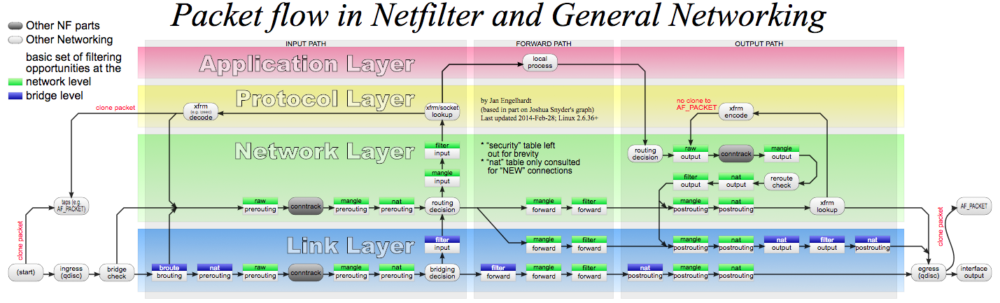

## iptables/netfilter

iptables是一个配置Linux内核防火墙的命令行工具，它基于内核的netfilter机制。


Netfilter是Linux操作系统核心层内部的一个数据包处理模块，它具有如下功能:
	1) 网络地址转换(Network Address Translate)
	2) 数据包内容修改
	3) 以及数据包过滤的防火墙功能

Netfilter平台中制定了五个数据包的挂载点(Hook Point，我们可以理解为回调函数点，数据包到达这些位置的时候会主动调用我们的函数，使我们有机会能在数据包路由的时候有机会改变它们的方向、内容)，这5个挂载点分别是
	1) PRE_ROUTING
	2) INPUT
	3) OUTPUT
	4) FORWARD
	5) POST_ROUTING

Iptables
Netfilter所设置的规则是存放在内核内存中的，Iptables是一个应用层(Ring3)的应用程序，它通过Netfilter放出的接口来对存放在内核内存中的Xtables(Netfilter的配置表)进行修改(这是一个典型的Ring3和Ring0配合的架构)


### netfilter

netfilter是Linux内核的包过滤框架，它提供了一系列的钩子（Hook）供其他模块控制包的流动。这些钩子包括：

- `NF_IP_PRE_ROUTING`：刚刚通过数据链路层解包进入网络层的数据包通过此钩子，它在路由之前处理
- `NF_IP_LOCAL_IN`：经过路由查找后，送往本机（目的地址在本地）的包会通过此钩子
- `NF_IP_FORWARD`：不是本地产生的并且目的地不是本地的包（即转发的包）会通过此钩子
- `NF_IP_LOCAL_OUT`：所有本地生成的发往其他机器的包会通过该钩子
- `NF_IP_POST_ROUTING`：在包就要离开本机之前会通过该钩子，它在路由之后处理



### iptables

iptables通过表和链来组织数据包的过滤规则，每一条规则都包括匹配和动作两个部分。默认情况下，每张表包括一些默认链，用户也可以添加自定义的链，这些链都是顺序排序的。这些表和链包括：

- **raw表**：用于**决定数据包**是否被**状态跟踪机制**处理，**内建PREROUTING和OUTPUT两个链**
- **filter表**：用于过滤，**内建INPUT（目的地是本地的包）、FORWARD（不是本地产生的并且目的地不是本地）和OUTPUT（本地生成的包）**等三个链
- **nat表**:用于网络地址转换，**内建PREROUTING（在包刚刚到达防火墙时改变它的目的地址）、INPUT、OUTPUT和POSTROUTING（要离开防火墙之前改变其源地址）**等链
- **mangle表**：用于**对报文进行修改**，内建PREROUTING、INPUT、FORWARD、OUTPUT和POSTROUTING等链。mangle表的主要功能是根据规则修改数据包的一些标志位，以便其他规则或程序可以利用这种标志对数据包进行过滤或策略路由。
- **security表**：用于**根据安全策略处理数据包**，内建INPUT、FORWARD和OUTPUT链

| Tables↓/Chains→               | PREROUTING | INPUT | FORWARD | OUTPUT | POSTROUTING |
| ----------------------------- | :--------: | :---: | :-----: | :----: | :---------: |
| (routing decision)            |            |       |         |   ✓    |             |
| **raw**                       |     ✓      |       |         |   ✓    |             |
| (connection tracking enabled) |     ✓      |       |         |   ✓    |             |
| **mangle**                    |     ✓      |   ✓   |    ✓    |   ✓    |      ✓      |
| **nat** (DNAT)                |     ✓      |       |         |   ✓    |             |
| (routing decision)            |     ✓      |       |         |   ✓    |             |
| **filter**                    |            |   ✓   |    ✓    |   ✓    |             |
| **security**                  |            |   ✓   |    ✓    |   ✓    |             |
| **nat** (SNAT)                |            |   ✓   |         |        |      ✓      |

所有链默认都是没有任何规则的，用户可以按需要添加规则。每条规则都包括匹配和动作两部分：

- **匹配**可以有多条，比如匹配端口、IP、数据包类型等。匹配还可以包括模块（如conntrack、recent等），实现更复杂的过滤。
- **动作**只能有一个，通过`-j`指定，如ACCEPT、DROP、RETURN、SNAT、DNAT等

这样，网络数据包通过iptables的过程为：


其规律为

1. 当一个数据包进入网卡时，数据包首先进入PREROUTING链，**在PREROUTING链中我们有机会修改数据包的DestIP(目的IP)，然后内核的"路由模块"根据"数据包目的IP"以及"内核中的路由表" 判断是否需要转送出去**(注意，<u>这个时候数据包的DestIP有可能已经被我们修改过了</u>)
2. 如果数据包就是进入本机的(即数据包的目的IP是本机的网口IP)，数据包就会沿着图向下移动，到达INPUT链。数据包到达INPUT链后，任何进程都会收到它
3. 本机上运行的程序也可以发送数据包，这些数据包经过OUTPUT链，然后到达POSTROTING链输出(注意，<u>这个时候数据包的SrcIP有可能已经被我们修改过了</u>)
4. 如果数据包是要转发出去的(即目的IP地址不再当前子网中)，且内核允许转发，数据包就会向右移动，经过FORWARD链，然后到达POSTROUTING链输出(选择对应子网的网口发送出去)


**3. Iptables规则编写原则**

我们前面说过，使用Iptables是一个非常灵活的过程，我们在写规则的时候，一定要时刻牢记上面的这张"数据包路由图"，明白在5个Hook点，3种"表"分别所处的位置，以及结合在这个5个Hook点可以实现的功能，来理解规则。理解规则的原理比强记规则本身效果要好得多

***0x1: 提出需求***

在正式编写Iptables规则之前，我们一定是有一个实现某个功能、目的的需求，我们必须先将它整理出来，为下一步抽象化作准备，这里我以我项目中的需求为例，大家在自己的实验中可以举一反三

```
1. 网口at0(10.0.0.1)是一个伪AP的网口，目标客户端连接到伪AP网口at0之后会发起DHCPDISCOVER过程，监听在at0上的DHCPD会进行回应，为客户端分配10.0.0.100的IP地址，并设置客户
端的默认网关为10.0.0.1(即at0的IP地址)、默认DNS服务器为10.0.0.1(即at0的IP地址)
2. 需要将网口at0(10.0.0.1)的入口流量牵引到真正连接外网的网卡接口eth0(192.168.159.254)上，做一个NAT服务
3. 对网口at0(10.0.0.1)的DHCP流量(目的端口67的广播数据包)予以放行，因为我们需要在伪AP所在的服务器上假设DHCP服务器
4. 对网口at0(10.0.0.1)的DNS流量(目的端口53)予以放行，因为我们需要在伪AP所在的服务器上假设DNS服务器
```

***0x2: 逐步抽象化我们的需求***

我们根据我们的需求进行抽象化，即用规则来抽象化描述我们的目的，在编写的过程中要注意不同的Hook点所能做的修改是不同的

```
//开启Linux路由转发开关，由于本机对数据包进行转发
echo "1" > /proc/sys/net/ipv4/ip_forward
//将客户端的HTTP流量进行NAT，改变数据包的SrcIP，注意，是在POSTROUTING(数据包即将发送出去之前进行修改)
iptables -t nat -A POSTROUTING -p tcp -s 10.0.0.0/24 --dport 80 -j SNAT --to-source 192.168.159.254
//将远程WEB服务器返回来的HTTP流量进行NAT，回引回客户端，注意，是在PREROUTING(数据包刚进入协议栈之后马上就修改)
iptables -t nat -A PREROUTING -p tcp -d 192.168.159.254 -j DNAT --to 10.0.0.100
```

我们在DHCP服务器中指定客户端的默认DNS服务器是10.0.0.1(本机)，即伪DNS，但我目前还没有在本机架设DNS，所以目前还需要将53号端口的DNS数据包NAT出去，牵引到谷歌的DNS: 8.8.8.8上去

```
iptables -t nat -A PREROUTING -p udp -s 10.0.0.0/24 --dport 53 -j DNAT --to 8.8.8.8
iptables -t nat -A POSTROUTING -p udp -s 10.0.0.0/24 --dport 53 -j SNAT --to-source 192.168.159.254

iptables -t nat -A PREROUTING -p udp -d 192.168.159.254 --sport 53 -j DNAT --to 10.0.0.100
iptables -t nat -A POSTROUTING -p udp -s 8.8.8.8 --sport 53 -j SNAT --to-source 10.0.0.1
```


### 语法

```shell
iptables(选项)(参数)
```

### 选项

```shell
-t, --table table 对指定的表 table 进行操作， table 必须是 raw， nat，filter，mangle 中的一个。如果不指定此选项，默认的是 filter 表。

# 通用匹配：源地址目标地址的匹配
-p：指定要匹配的数据包协议类型；
-s, --source [!] address[/mask] ：把指定的一个／一组地址作为源地址，按此规则进行过滤。当后面没有 mask 时，address 是一个地址，比如：192.168.1.1；当 mask 指定时，可以表示一组范围内的地址，比如：192.168.1.0/255.255.255.0。
-d, --destination [!] address[/mask] ：地址格式同上，但这里是指定地址为目的地址，按此进行过滤。
-i, --in-interface [!] <网络接口name> ：指定数据包的来自来自网络接口，比如最常见的 eth0 。注意：它只对 INPUT，FORWARD，PREROUTING 这三个链起作用。如果没有指定此选项， 说明可以来自任何一个网络接口。同前面类似，"!" 表示取反。
-o, --out-interface [!] <网络接口name> ：指定数据包出去的网络接口。只对 OUTPUT，FORWARD，POSTROUTING 三个链起作用。

# 查看管理命令
-L, --list [chain] 列出链 chain 上面的所有规则，如果没有指定链，列出表上所有链的所有规则。

# 规则管理命令
-A, --append chain rule-specification 在指定链 chain 的末尾插入指定的规则，也就是说，这条规则会被放到最后，最后才会被执行。规则是由后面的匹配来指定。
-I, --insert chain [rulenum] rule-specification 在链 chain 中的指定位置插入一条或多条规则。如果指定的规则号是1，则在链的头部插入。这也是默认的情况，如果没有指定规则号。
-D, --delete chain rule-specification -D, --delete chain rulenum 在指定的链 chain 中删除一个或多个指定规则。
-R num：Replays替换/修改第几条规则

# 链管理命令（这都是立即生效的）
-P, --policy chain target ：为指定的链 chain 设置策略 target。注意，只有内置的链才允许有策略，用户自定义的是不允许的。
-F, --flush [chain] 清空指定链 chain 上面的所有规则。如果没有指定链，清空该表上所有链的所有规则。
-N, --new-chain chain 用指定的名字创建一个新的链。
-X, --delete-chain [chain] ：删除指定的链，这个链必须没有被其它任何规则引用，而且这条上必须没有任何规则。如果没有指定链名，则会删除该表中所有非内置的链。
-E, --rename-chain old-chain new-chain ：用指定的新名字去重命名指定的链。这并不会对链内部照成任何影响。
-Z, --zero [chain] ：把指定链，或者表中的所有链上的所有计数器清零。

-j, --jump target <指定目标> ：即满足某条件时该执行什么样的动作。target 可以是内置的目标，比如 ACCEPT，也可以是用户自定义的链。
-h：显示帮助信息；
```

## 基本参数

| 参数        | 作用                                           |
| ----------- | ---------------------------------------------- |
| -P          | 设置默认策略:iptables -P INPUT (DROP           |
| -F          | 清空规则链                                     |
| -L          | 查看规则链                                     |
| -A          | 在规则链的末尾加入新规则                       |
| -I          | num 在规则链的头部加入新规则                   |
| -D          | num 删除某一条规则                             |
| -s          | 匹配来源地址IP/MASK，加叹号"!"表示除这个IP外。 |
| -d          | 匹配目标地址                                   |
| -i          | 网卡名称 匹配从这块网卡流入的数据              |
| -o          | 网卡名称 匹配从这块网卡流出的数据              |
| -p          | 匹配协议,如tcp,udp,icmp                        |
| --dport num | 匹配目标端口号                                 |
| --sport num | 匹配来源端口号                                 |

#### 命令选项输入顺序

```shell
iptables -t 表名 <-A/I/D/R> 规则链名 [规则号] <-i/o 网卡名> -p 协议名 <-s 源IP/源子网> --sport 源端口 <-d 目标IP/目标子网> --dport 目标端口 -j 动作
```

#### 工作机制

规则链名包括(也被称为五个钩子函数（hook functions）)：

- **INPUT链** ：处理输入数据包。
- **OUTPUT链** ：处理输出数据包。
- **FORWARD链** ：处理转发数据包。
- **PREROUTING链** ：用于目标地址转换（DNAT）。
- **POSTOUTING链** ：用于源地址转换（SNAT）。

#### 防火墙的策略

防火墙策略一般分为两种，一种叫`通`策略，一种叫`堵`策略，通策略，默认门是关着的，必须要定义谁能进。堵策略则是，大门是洞开的，但是你必须有身份认证，否则不能进。所以我们要定义，让进来的进来，让出去的出去，`所以通，是要全通，而堵，则是要选择`。当我们定义的策略的时候，要分别定义多条功能，其中：定义数据包中允许或者不允许的策略，filter过滤的功能，而定义地址转换的功能的则是nat选项。为了让这些功能交替工作，我们制定出了“表”这个定义，来定义、区分各种不同的工作功能和处理方式。

我们现在用的比较多个功能有3个：

1. filter 定义允许或者不允许的，只能做在3个链上：INPUT ，FORWARD ，OUTPUT
2. nat 定义地址转换的，也只能做在3个链上：PREROUTING ，OUTPUT ，POSTROUTING
3. mangle功能:修改报文原数据，是5个链都可以做：PREROUTING，INPUT，FORWARD，OUTPUT，POSTROUTING

我们修改报文原数据就是来修改TTL的。能够实现将数据包的元数据拆开，在里面做标记/修改内容的。而防火墙标记，其实就是靠mangle来实现的。

小扩展:

- 对于filter来讲一般只能做在3个链上：INPUT ，FORWARD ，OUTPUT
- 对于nat来讲一般也只能做在3个链上：PREROUTING ，OUTPUT ，POSTROUTING
- 而mangle则是5个链都可以做：PREROUTING，INPUT，FORWARD，OUTPUT，POSTROUTING

iptables/netfilter（这款软件）是工作在用户空间的，它可以让规则进行生效的，本身不是一种服务，而且规则是立即生效的。而我们iptables现在被做成了一个服务，可以进行启动，停止的。启动，则将规则直接生效，停止，则将规则撤销。

iptables还支持自己定义链。但是自己定义的链，必须是跟某种特定的链关联起来的。在一个关卡设定，指定当有数据的时候专门去找某个特定的链来处理，当那个链处理完之后，再返回。接着在特定的链中继续检查。

注意：规则的次序非常关键，`谁的规则越严格，应该放的越靠前`，而检查规则的时候，是按照从上往下的方式进行检查的。

表名包括：

- **raw** ：高级功能，如：网址过滤。
- **mangle** ：数据包修改（QOS），用于实现服务质量。
- **nat** ：地址转换，用于网关路由器。
- **filter** ：包过滤，用于防火墙规则。

动作包括：

- **ACCEPT** ：接收数据包。
- **DROP** ：丢弃数据包。
- **REDIRECT** ：重定向、映射、透明代理。
- **SNAT** ：源地址转换。
- **DNAT** ：目标地址转换。
- **MASQUERADE** ：IP伪装（NAT），用于ADSL。
- **LOG** ：日志记录。


### iptables示例

查看规则列表

```sh
iptables -nvL
```

允许22端口

```sh
iptables -A INPUT -p tcp --dport 22 -j ACCEPT
```

允许来自192.168.0.4的包

```sh
iptables -A INPUT -s 192.168.0.4 -j ACCEPT
```

允许现有连接或与现有连接关联的包

```sh
iptables -A INPUT -m state --state ESTABLISHED,RELATED -j ACCEPT
```

禁止ping包

```sh
iptables -A INPUT -p icmp --icmp-type echo-request -j DROP
```

禁止所有其他包

```sh
iptables -P INPUT DROP
iptables -P FORWARD DROP
```

MASQUERADE

```sh
iptables -t nat -I POSTROUTING -s 10.0.0.30/32 -j MASQUERADE
```

NAT

```sh
iptables -I FORWARD -m state --state RELATED,ESTABLISHED -j ACCEPT
iptables -I INPUT   -m state --state RELATED,ESTABLISHED -j ACCEPT
iptables -t nat -I OUTPUT -d 55.55.55.55/32 -j DNAT --to-destination 10.0.0.30
iptables -t nat -I PREROUTING -d 55.55.55.55/32 -j DNAT --to-destination 10.0.0.30
iptables -t nat -I POSTROUTING -s 10.0.0.30/32 -j SNAT --to-source 55.55.55.55
```

端口映射

```sh
iptables -t nat -I OUTPUT -d 55.55.55.55/32 -p tcp -m tcp --dport 80 -j DNAT --to-destination 10.10.10.3:80
iptables -t nat -I POSTROUTING -m conntrack ! --ctstate DNAT -j ACCEPT
iptables -t nat -I PREROUTING -d 55.55.55.55/32 -p tcp -m tcp --dport 80 -j DNAT --to-destination 10.10.10.3:80
```

重置所有规则

```sh
iptables -F
iptables -t nat -F
iptables -t mangle -F
iptables -X
```

## nftables

nftables 是从内核 3.13 版本引入的新的数据包过滤框架，旨在替代现用的 iptables 框架。nftables引入了一个新的命令行工具`nft`，取代了之前的iptables、ip6iptables、ebtables等各种工具。

跟iptables相比，nftables带来了一系列的好处

- 更易用易理解的语法
- 表和链是完全可配置的
- 匹配和目标之间不再有区别
- 在一个规则中可以定义多个动作
- 每个链和规则都没有内建的计数器
- 更好的动态规则集更新支持
- 简化IPv4/IPv6双栈管理
- 支持set/map等
- 支持级连（需要内核4.1+）

跟iptables类似，nftables也是使用表和链来管理规则。其中，表包括ip、arp、ip6、bridge、inet和netdev等6个类型。下面是一些简单的例子。

```sh
# 新建一个ip类型的表
nft add table ip foo

# 列出所有表
nft list tables

# 删除表
nft delete table ip foo

# 添加链
nft add table ip filter
nft add chain ip filter input { type filter hook input priority 0 \; }
nft add chain ip filter output { type filter hook output priority 0 \; }

# 添加规则
nft add rule filter output ip daddr 8.8.8.8 counter
nft add rule filter output tcp dport ssh counter
nft insert rule filter output ip daddr 192.168.1.1 counter

# 列出规则
nft list table filter

# 删除规则
nft list table filter -a # 查询handle是多少
nft delete rule filter output handle 5

# 删除链中所有规则
nft delete rule filter output

# 删除表中所有规则
nft flush table filter
```


# A Deep Dive into Iptables and Netfilter Architecture

### Introduction

[Firewalls](https://www.digitalocean.com/community/tutorials/what-is-a-firewall-and-how-does-it-work) are an important tool that can be configured to protect your servers and infrastructure. In the Linux ecosystem, `iptables` is a widely used firewall tool that interfaces with the kernel’s `netfilter` packet filtering framework. For users and administrators who don’t understand the architecture of these systems, creating reliable firewall policies can be daunting, not only due to challenging syntax, but also because of number of interrelated parts present in the framework.

In this guide, we will dive into the `iptables` architecture with the aim of making it more comprehensible for users who need to build their own firewall policies. We will discuss how `iptables` interacts with `netfilter` and how the various components fit together to provide a comprehensive filtering and mangling system.


## What Are IPTables and Netfilter?

The basic firewall software most commonly used in Linux is called `iptables`. The `iptables`firewall works by interacting with the packet filtering hooks in the Linux kernel’s networking stack. These kernel hooks are known as the `netfilter` framework.

Every packet that enters networking system (incoming or outgoing) will trigger these hooks as it progresses through the stack, allowing programs that register with these hooks to interact with the traffic at key points. The kernel modules associated with `iptables` register at these hooks in order to ensure that the traffic conforms to the conditions laid out by the firewall rules.


## Netfilter Hooks

There are five `netfilter` hooks that programs can register with. As packets progress through the stack, they will trigger the kernel modules that have registered with these hooks. The hooks that a packet will trigger depends on whether the packet is incoming or outgoing, the packet’s destination, and whether the packet was dropped or rejected at a previous point.

The following hooks represent various well-defined points in the networking stack:

- `NF_IP_PRE_ROUTING`: This hook will be triggered by any incoming traffic very soon after entering the network stack. This hook is processed before any routing decisions have been made regarding where to send the packet.
- `NF_IP_LOCAL_IN`: This hook is triggered after an incoming packet has been routed if the packet is destined for the local system.
- `NF_IP_FORWARD`: This hook is triggered after an incoming packet has been routed if the packet is to be forwarded to another host.
- `NF_IP_LOCAL_OUT`: This hook is triggered by any locally created outbound traffic as soon it hits the network stack.
- `NF_IP_POST_ROUTING`: This hook is triggered by any outgoing or forwarded traffic after routing has taken place and just before being put out on the wire.

Kernel modules that wish to register at these hooks must provide a priority number to help determine the order in which they will be called when the hook is triggered. This provides the means for multiple modules (or multiple instances of the same module) to be connected to each of the hooks with deterministic ordering. Each module will be called in turn and will return a decision to the `netfilter` framework after processing that indicates what should be done with the packet.


## IPTables Tables and Chains

The `iptables` firewall uses tables to organize its rules. These tables classify rules according to the type of decisions they are used to make. For instance, if a rule deals with network address translation, it will be put into the `nat` table. If the rule is used to decide whether to allow the packet to continue to its destination, it would probably be added to the `filter` table.

Within each `iptables` table, rules are further organized within separate “chains”. While tables are defined by the general aim of the rules they hold, the built-in chains represent the `netfilter`hooks which trigger them. Chains basically determine *when* rules will be evaluated.

As you can see, the names of the built-in chains mirror the names of the `netfilter` hooks they are associated with:

- `PREROUTING`: Triggered by the `NF_IP_PRE_ROUTING` hook.
- `INPUT`: Triggered by the `NF_IP_LOCAL_IN` hook.
- `FORWARD`: Triggered by the `NF_IP_FORWARD` hook.
- `OUTPUT`: Triggered by the `NF_IP_LOCAL_OUT` hook.
- `POSTROUTING`: Triggered by the `NF_IP_POST_ROUTING` hook.

Chains allow the administrator to control where in a packet’s delivery path a rule will be evaluated. Since each table has multiple chains, a table’s influence can be exerted at multiple points in processing. Because certain types of decisions only make sense at certain points in the network stack, every table will not have a chain registered with each kernel hook.

There are only five `netfilter` kernel hooks, so chains from multiple tables are registered at each of the hooks. For instance, three tables have `PREROUTING` chains. When these chains register at the associated `NF_IP_PRE_ROUTING` hook, they specify a priority that dictates what order each table’s `PREROUTING` chain is called. Each of the rules inside the highest priority `PREROUTING` chain is evaluated sequentially before moving onto the next `PREROUTING` chain. We will take a look at the specific order of each chain in a moment.


## Which Tables are Available?

Let’s step back for a moment and take a look at the different tables that `iptables` provides. These represent distinct sets of rules, organized by area of concern, for evaluating packets.

### The Filter Table

The filter table is one of the most widely used tables in `iptables`. **The `filter` table is used to make decisions about whether to let a packet continue to its intended destination or to deny its request.** In firewall parlance, this is known as “filtering” packets. This table provides the bulk of functionality that people think of when discussing firewalls.

### The NAT Table

The `nat` table is used to implement network address translation rules. **As packets enter the network stack, rules in this table will determine whether and how to modify the packet’s source or destination addresses in order to impact the way that the packet and any response traffic are routed**. This is often used to route packets to networks when direct access is not possible.

### The Mangle Table

The `mangle` table is used to **alter the IP headers of the packet in various ways.** For instance, you can adjust the TTL (Time to Live) value of a packet, either lengthening or shortening the number of valid network hops the packet can sustain. Other IP headers can be altered in similar ways.

This table can also **place an internal kernel “mark” on the packet for further processing in other tables and by other networking tools.** This mark does not touch the actual packet, but adds the mark to the kernel’s representation of the packet.

### The Raw Table

The `iptables` firewall is **stateful**, meaning that packets are evaluated in regards to their relation to previous packets. The **connection tracking features** built on top of the `netfilter` framework allow `iptables` to view packets as part of an ongoing connection or session instead of as a stream of discrete, unrelated packets. **The connection tracking logic is usually applied very soon after the packet hits the network interface.**

The `raw` table has a very narrowly defined function. **Its only purpose is to provide a mechanism for marking packets in order to opt-out of connection tracking.**

### The Security Table

The `security` table is used to set internal SELinux security context marks on packets, which will **affect how SELinux or other systems that can interpret SELinux security contexts handle the packets.** These marks can be applied on a per-packet or per-connection basis.


## Which Chains are Implemented in Each Table?

We have talked about tables and chains separately. Let’s go over which chains are available in each table. Implied in this discussion is a further discussion about the evaluation order of chains registered to the same hook. If three tables have `PREROUTING` chains, in which order are they evaluated?

The following table indicates the chains that are available within each `iptables` table when read from left-to-right. For instance, we can tell that the `raw` table has both `PREROUTING` and `OUTPUT`chains. When read from top-to-bottom, it also displays the order in which each chain is called when the associated `netfilter` hook is triggered.

A few things should be noted. In the representation below, the `nat` table has been split between `DNAT` operations (those that alter the destination address of a packet) and `SNAT` operations (those that alter the source address) in order to display their ordering more clearly. We have also include rows that represent points where routing decisions are made and where connection tracking is enabled in order to give a more holistic view of the processes taking place:

| Tables↓/Chains→               | PREROUTING | INPUT | FORWARD | OUTPUT | POSTROUTING |
| ----------------------------- | :--------: | :---: | :-----: | :----: | :---------: |
| (routing decision)            |            |       |         |   ✓    |             |
| **raw**                       |     ✓      |       |         |   ✓    |             |
| (connection tracking enabled) |     ✓      |       |         |   ✓    |             |
| **mangle**                    |     ✓      |   ✓   |    ✓    |   ✓    |      ✓      |
| **nat** (DNAT)                |     ✓      |       |         |   ✓    |             |
| (routing decision)            |     ✓      |       |         |   ✓    |             |
| **filter**                    |            |   ✓   |    ✓    |   ✓    |             |
| **security**                  |            |   ✓   |    ✓    |   ✓    |             |
| **nat** (SNAT)                |            |   ✓   |         |        |      ✓      |

As a packet triggers a `netfilter` hook, the associated chains will be processed as they are listed in the table above from top-to-bottom. The hooks (columns) that a packet will trigger depend on whether it is an incoming or outgoing packet, the routing decisions that are made, and whether the packet passes filtering criteria.

Certain events will cause a table’s chain to be skipped during processing. For instance, only the first packet in a connection will be evaluated against the NAT rules. Any `nat` decisions made for the first packet will be applied to all subsequent packets in the connection without additional evaluation. Responses to NAT'ed connections will automatically have the reverse NAT rules applied to route correctly.

### Chain Traversal Order

Assuming that the server knows how to route a packet and that the firewall rules permit its transmission, the following flows represent the paths that will be traversed in different situations:

- **Incoming packets destined for the local system**: `PREROUTING` -> `INPUT`
- **Incoming packets destined to another host**: `PREROUTING` -> `FORWARD` -> `POSTROUTING`
- **Locally generated packets**: `OUTPUT` -> `POSTROUTING`

If we combine the above information with the ordering laid out in the previous table, we can see that an incoming packet destined for the local system will first be evaluated against the `PREROUTING` chains of the `raw`, `mangle`, and `nat` tables. It will then traverse the `INPUT` chains of the `mangle`, `filter`, `security`, and `nat` tables before finally being delivered to the local socket.


## IPTables Rules

Rules are placed within a specific chain of a specific table. As each chain is called, the packet in question will be checked against each rule within the chain in order. Each rule has a matching component and an action component.

### Matching

The matching portion of a rule specifies the criteria that a packet must meet in order for the associated action (or “target”) to be executed.

The matching system is very flexible and can be expanded significantly with `iptables` extensions available on the system. Rules can be constructed to match by protocol type, destination or source address, destination or source port, destination or source network, input or output interface, headers, or connection state among other criteria. These can be combined to create fairly complex rule sets to distinguish between different traffic.

### Targets

**A target is the action** that are triggered when a packet meets the matching criteria of a rule. Targets are generally divided into two categories:

- **Terminating targets**: Terminating targets perform an action which terminates evaluation within the chain and returns control to the `netfilter` hook. **Depending on the return value provided, the hook might drop the packet or allow the packet to continue to the next stage of processing.**
- **Non-terminating targets**: Non-terminating targets perform an action and continue evaluation within the chain. Although each chain must eventually pass back a final terminating decision, any number of non-terminating targets can be executed beforehand.

The availability of each target within rules will depend on context. For instance, the table and chain type might dictate the targets available. The extensions activated in the rule and the matching clauses can also affect the availability of targets.

## Jumping to User-Defined Chains

We should mention a special class of non-terminating target: the jump target. Jump targets are actions that result in evaluation moving to a different chain for additional processing. We’ve talked quite a bit about the built-in chains which are intimately tied to the `netfilter` hooks that call them. However, `iptables` also allows administrators to create their own chains for organizational purposes.

Rules can be placed in user-defined chains in the same way that they can be placed into built-in chains. The difference is that user-defined chains can only be reached by “jumping” to them from a rule (they are not registered with a `netfilter` hook themselves).

User-defined chains act as simple extensions of the chain which called them. For instance, in a user-defined chain, evaluation will pass back to the calling chain if the end of the rule list is reached or if a `RETURN` target is activated by a matching rule. Evaluation can also jump to additional user-defined chains.

This construct allows for greater organization and provides the framework necessary for more robust branching.


## IPTables and Connection Tracking

We introduced the connection tracking system implemented on top of the `netfilter` framework when we discussed the `raw` table and connection state matching criteria. Connection tracking allows `iptables` to make decisions about packets viewed in the context of an ongoing connection. The connection tracking system provides `iptables` with the functionality it needs to perform “stateful” operations.

Connection tracking is applied very soon after packets enter the networking stack. The `raw` table chains and some basic sanity checks are the only logic that is performed on packets prior to associating the packets with a connection.

The system checks each packet against a set of existing connections. It will update the state of the connection in its store if needed and will add new connections to the system when necessary. Packets that have been marked with the `NOTRACK` target in one of the `raw` chains will bypass the connection tracking routines.

### Available States

Connections tracked by the connection tracking system will be in one of the following states:

- `NEW`: When a packet arrives that is not associated with an existing connection, but is not invalid as a first packet, a new connection will be added to the system with this label. This happens for both connection-aware protocols like TCP and for connectionless protocols like UDP.
- `ESTABLISHED`: A connection is changed from `NEW` to `ESTABLISHED` when it receives a valid response in the opposite direction. For TCP connections, this means a `SYN/ACK` and for UDP and ICMP traffic, this means a response where source and destination of the original packet are switched.
- `RELATED`: Packets that are not part of an existing connection, but are associated with a connection already in the system are labeled `RELATED`. This could mean a helper connection, as is the case with FTP data transmission connections, or it could be ICMP responses to connection attempts by other protocols.
- `INVALID`: Packets can be marked `INVALID` if they are not associated with an existing connection and aren’t appropriate for opening a new connection, if they cannot be identified, or if they aren’t routable among other reasons.
- `UNTRACKED`: Packets can be marked as `UNTRACKED` if they’ve been targeted in a `raw` table chain to bypass tracking.
- `SNAT`: A virtual state set when the source address has been altered by NAT operations. This is used by the connection tracking system so that **it knows to change the source addresses back in reply packets**.
- `DNAT`: A virtual state set when the destination address has been altered by NAT operations. This is used by the connection tracking system so that **it knows to change the destination address back when routing reply packets**.

The states tracked in the connection tracking system allow administrators to craft rules that target specific points in a connection’s lifetime. This provides the functionality needed for more thorough and secure rules.


