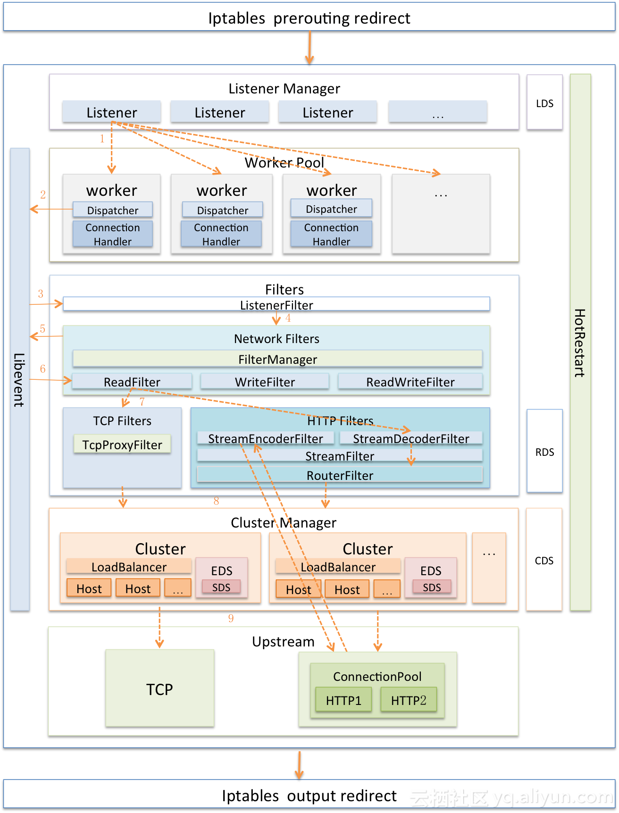
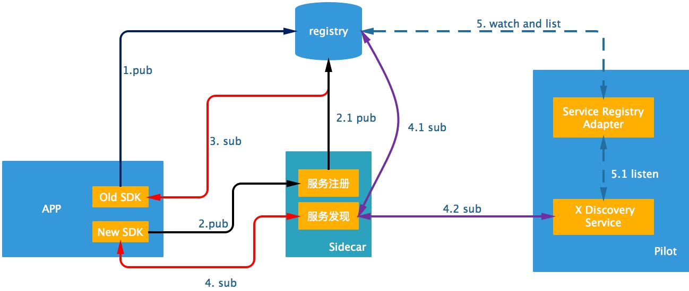
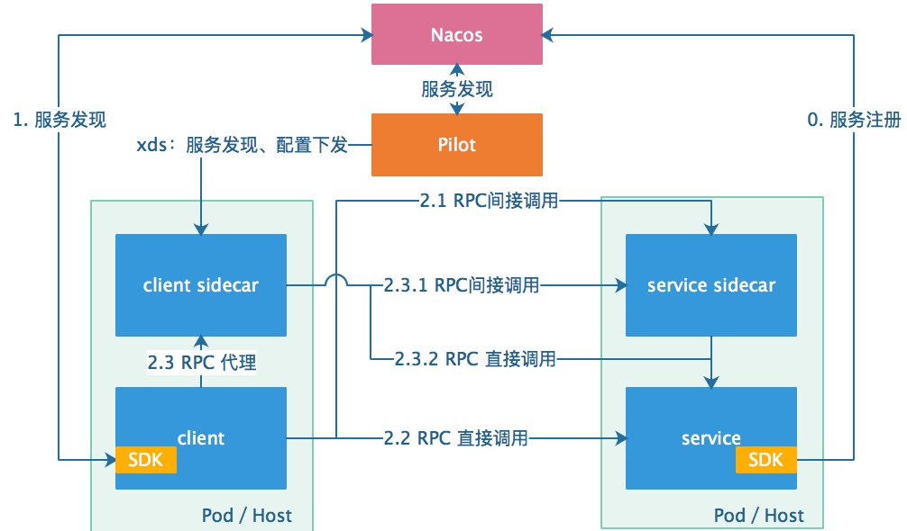
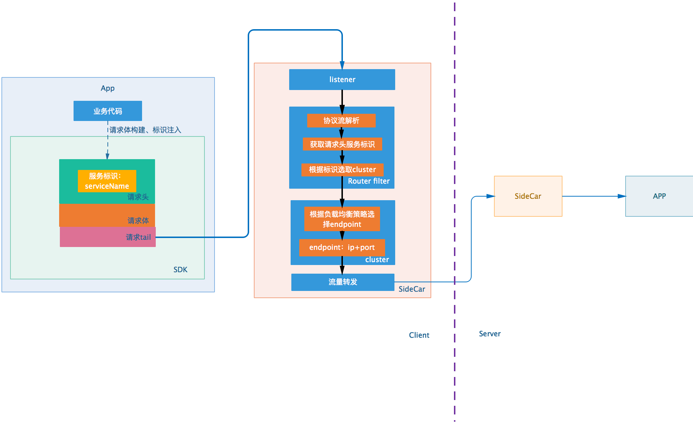
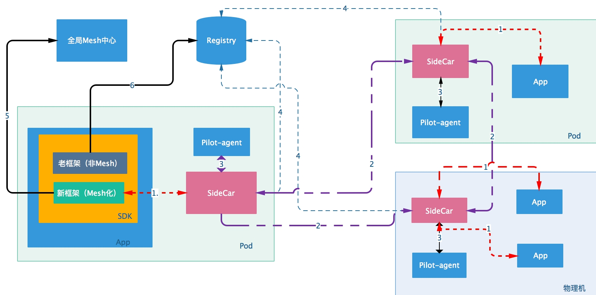
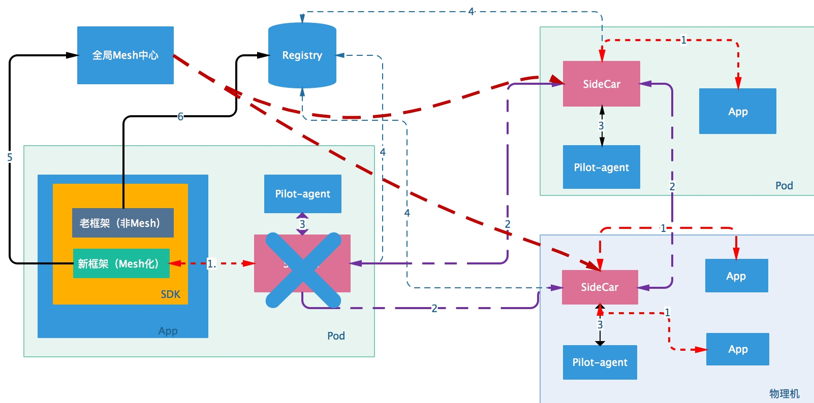
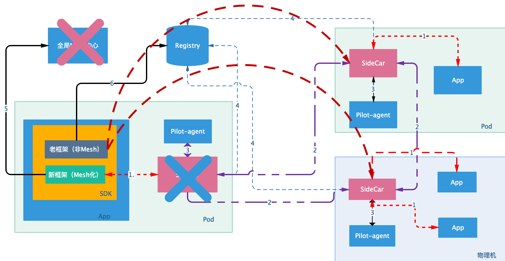
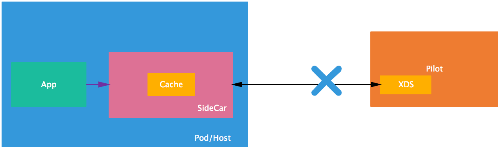
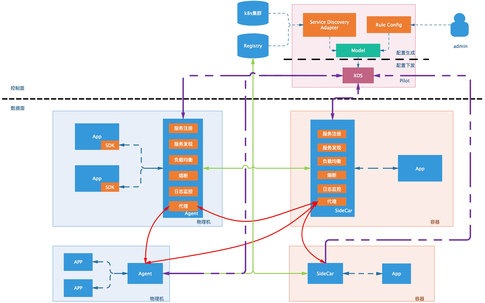

service mesh的具体落地方案设计，前面《Service Mesh调研》里面已经讲过落地过程中存在的一些问题，并且针对这些问题业内所采取的方案。

## 写在前面

首先，来回答下面的这些问题：

- 引入Service Mesh需要了解什么？
- 当前开源组件已经有的、还没有的功能，以及这些组件的优缺点？
- 为了实现Mesh化，我们需要做哪些改造的工作？
- 最终的实现是什么样的？

### 1. 引入Service Mesh需要知道些什么？（背景知识）

为了实现mesh化，我们首先想到的就是标准的Mesh架构：数据面+控制面；

**数据面**：负责根据配置进行流量的转发、路由、过滤、metric、熔断等；

**控制面**：整个mesh网格的"大脑"，负责各种配置的下发。

以ISTIO为例，讲述Service Mesh中的技术关键点：

和SDN一样，Service Mesh将服务请求的转发分为控制面和数据面，因而分析他，也是从数据面先分析转发的能力，然后再分析控制面如何下发命令。重点讲述两个组件Envoy和Pilot。

#### 数据面——Envoy简介

首先来看，如果没有融入Service Mesh，Envoy本身能够做什么事情呢？

**Envoy是一个高性能的C++写的proxy转发器**，那Envoy如何转发请求呢？需要定一些规则，然后按照这些规则进行转发。

规则可以是静态的，放在配置文件中的，启动的时候加载，要想重新加载，一般需要重新启动，但是Envoy支持热加载和热重启，一定程度上缓解了这个问题。

当然最好的方式是规则设置为动态的，放在统一的地方维护，这个统一的地方在Envoy眼中看来称为Discovery Service，过一段时间去这里拿一下配置，就修改了转发策略。

无论是静态的，还是动态的，在配置里面往往会配置四个东西。

1. **listener**，也即envoy既然是proxy，专门做转发，就得监听一个端口，接入请求，然后才能够根据策略转发，这个监听的端口称为listener。

2. **endpoint**，是目标的ip地址和端口，这个是proxy最终将请求转发到的地方。

3. **cluster**，一个cluster是具有完全相同行为的多个endpoint，也即如果有三个容器在运行，就会有三个IP和端口，但是部署的是完全相同的三个服务，他们组成一个Cluster，从cluster到endpoint的过程称为负载均衡，可以轮询等。

4. **route**，有时候多个cluster具有类似的功能，但是是不同的版本号，可以通过route规则，选择将请求路由到某一个版本号，也即某一个cluster。

这四个的静态配置的例子如下：

如图所示，listener被配置为监听本地127.0.0.1的10000接口，route配置为某个url的前缀转发到哪个cluster，cluster里面配置负载均衡策略，hosts里面是所有的endpoint。

如果你想简单的将envoy使用起来，不用什么service mesh，一个进程，加上这个配置文件，就可以了，就能够转发请求了。

对于动态配置，也应该配置发现中心，也即Discovery Service，对于上述四种配置，各对应相应的DS，所以有LDS, RDS, CDS, EDS。

动态配置的例子如下：

具体的实现架构如下：

#### 控制面——pilot简介

数据面envoy可以通过加装静态配置文件的方式运行，而动态信息，需要从Discovery Service去拿。

Discovery Service就是部署在控制面的，在istio中，是Pilot。

最下面一层是envoy的API，就是提供Discovery Service的API，这个API的规则由envoy定，但是不是Pilot调用Envoy，而是Envoy去主动调用Pilot的这个API。

**Pilot最上面一层称为Platform Adapter**。这一层不是Kubernetes, Mesos调用Pilot，而是Pilot通过调用Kubernetes来发现服务之间的关系。

pilot使用Kubernetes的Service，仅仅使用它的服务发现功能，而不使用它的转发功能，pilot通过在kubernetes里面注册一个controller来监听事件，从而获取Service和Kubernetes的Endpoint以及Pod的关系，但是在转发层面，就不会再使用kube-proxy根据service下发的iptables规则进行转发了，而是**将这些映射关系转换成为pilot自己的转发模型**，下发到envoy进行转发，**envoy不会使用kube-proxy的那些iptables规则**。

这样就把控制面和数据面彻底分离开来，服务之间的相互关系是管理面的事情，不要和真正的转发绑定在一起，而是绕到pilot后方。

**Pilot另外一个对外的接口是Rules API，这是给管理员的接口，管理员通过这个接口设定一些规则，这些规则往往是应用于Routes, Clusters, Endpoints的，而都有哪些Clusters和Endpoints，是由Platform Adapter这面通过服务发现得到的。**

**自动发现的这些Clusters和Endpoints，外加管理员设置的规则，形成了Pilot的数据模型**，其实就是他自己定义的一系列数据结构，然后通过envoy API暴露出去，等待envoy去拉取这些规则。

常见的一种人工规则是Routes，通过服务发现，Pilot可以从Kubernetes那里知道Service B有两个版本，一般是两个Deployment，属于同一个Service，管理员通过调用Pilot的Rules API，来设置两个版本之间的Route规则，一个占99%的流量，一个占1%的流量，这两方面信息形成Pilot的数据结构模型，然后通过Envoy API下发，Envoy就会根据这个规则设置转发策略了。

另一个常用的场景就是负载均衡，Pilot通过Kubernetes的Service发现Service B包含一个Deployment，但是有三个副本，于是通过Envoy API下发规则，使得Envoy在这三个副本之间进行负载均衡，而非通过Kubernetes本身Service的负载均衡机制。

#### 总结

- **控制面**通过各种Adapter（kubernetes、zk、consul、nacos等）进行服务发现，发现service相关的cluster以及该cluster下面的所有endpoints（包含版本信息）。
- **控制面**将自己发现的**Cluster+endpoints**和**用户根据这些cluster信息配置的Rules**，生成相关的路由配置数据，下发到数据面。
- **数据面**本质上是一个根据下发的路由规则、集群信息进行转发的工具。这些路由规则、集群信息，主要是从控制面主动获取而来。
- **数据面**除了转发功能之外还可以提供熔断、服务发现、服务注册、监控等功能。

### 2. 当前开源组件的优缺点？

#### Istio 

具体的组件前面已经提到，这里不再赘述。

**缺点**：

- 不支持公司的注册中心的服务发现
- 数据全量下发到数据面，浪费带宽、内存资源
- 不支持水平扩展，可扩展性较差

**优点**：

- 一个优秀的项目

#### mosn

**缺点：**

- 由于各公司注册中心不一致。mosn不支持服务的注册与发现，需要进行自定义开发。
- mosn的协议解析不支持公司的mainstay协议的request头里面的服务标识信息，需要自己实现：
  - 修改mainstay协议，加入服务标识。
  - 实现mosn协议解析接口x-protocol中，实现解析请求头数据获取服务标识（支持mainstay协议）。

**优点：**

- 蚂蚁按照envoy标准进行了二次开发，兼容istio。
- 性能做了很多优化
- 社区活跃

### 3. 我们需要考虑的问题

#### 1. 数据流

- 服务注册如何实现？
- 服务发现如何实现？
- 请求数据流路径是怎样的？

##### 服务注册如何实现？

**服务注册的实现方式有这么几个途径**：

1. SDK（老框架）直接发起注册请求到Registry中心（Nacos、consul等），如上图:**1.pub**

   缺点：需要自己维护注册中心的地址，注册中心升级、地址发生变化，应用升级不彻底。

2. SDK（新框架）通过sidecar来发送注册请求，如上图:**2.pub—>2.1 pub**

   将服务注册的实现下沉到sidecar来统一进行注册。优点：注册中心升级、改动对应用影响较小。

3. 通过Kubernetes来实现服务的注册，istio已经实现

   部署到集群上的服务可以通过pilot的kubernetes Adapter来实现service的自动注册。

**小结：**

当前采取第二种方案，将服务的注册下沉到sidecar来进行比较好。注册中心升级、改动对应用影响较小

除了上面三种途径之外，还可以这样实现（**基于Nacos的实现**）：

**服务注册、发现主要流程如下：**

1. **服务注册**：service端应用启动时，SDK调用Nacos的API，进行服务注册（如开启mesh，注册的port为sidecar监听的端口。否则，使用service自己的端口）。

2. **服务配置下发**：Nacos获取到服务的注册信息之后，Pilot会进行拉取同步并将最新的配置、服务信息（服务名称+ip列表）下发到相关的sidecar代理之中。

3. **服务发现／订阅**：Client端应用启动时，SDK向Nacos订阅相关的服务，获取相关的service ip的信息，并监听相关服务的变更。

   至此，服务注册、订阅相关的流程完成。

   

**客户端服务调用流程如下：**

**case1**:  **client未开启mesh功能**

客户端直接使用**服务发现／订阅**获取到的service ip进行RPC直接调用。

**case2:  client开启mesh功能**

RPC请求首先将service ip替换为localhost，并且将所调用的服务标识+原始的service ip注入到RPC的请求头中。client sidecar拦截到该RPC请求之后。首先，从请求头之中获取到服务的标识，用于从pilot下发的配置中，根据负载均衡等策略，获取需要转发到的目标地址。同时，进行metric统计。如果该步骤未能获取到相应的转发地址ip+port信息。使用兜底的service ip+port进行RPC调用。

注：

1. 如果服务端的sidecar不存在（非mesh化），直接调用service的ip+port；如上图2.2、2.3.2 RPC直接调用。
2. 如果服务端存在sidecar（mesh化），间接调用sidecar的ip+port，然后再转发到service的本地ip+port。如上图2.1、2.3.1 RPC间接调用。

##### 服务发现如何实现？

**服务的发现主要有下面几个途径**：

1. SDK直接请求注册中心，订阅相关服务。如上图：**3.sub**
2. SDK请求sidecar，sidecar请求注册中心订阅相关服务。如上图：**4.sub—>4.1 sub**
3. SDK请求sidecar，sidecar请求pilot的api，进行相关服务的订阅。如上图：**4.sub—>4.2 sub**

**小结：**

采用第3种方案，第一种方案和服务注册里第一种方案一样，注册中心升级对其影响较大。

**注意**：该方案需要修改pilot的xds服务、实现Adpater接口对接注册中心，增量下发订阅服务。避免sidecar里面有太多不必要的数据，减少带宽资源占用。

##### 请求数据流路径是怎样的？

**大致路径：**

client—>sidecar——>sidecar—>server

​		

**主要流程如下：**

- client将要访问的服务标识（group、服务接口等，用于辨识service）注入到协议头里面（http的请求header、mainstay请求协议头）
- 请求发送到sidecar。
- sidecar进行协议的解析，获取服务标识，sidecar根据表示获取到相应的cluster；
- 根据cluster相关的路由、负载、熔断配置，选出实际需要转发的endpoint的ip+port（对应server端的sidecar listener的ip+port、未使用sidecar server的mainstay的ip+port）。
- 当sidecar收到请求之后，经过一系列的filter，转发到本地的server端口。

##### 各种情况下的服务调用链路怎样？

- **理想路线：** sdk cilent——>sidecar(client side)———>sidecar(server side)———>server

​	

- **退化：**

  - **server无sidecar**：sdk cilent——>sidecar（client side）———>server

  

  - **client无sidecar**：old client——>sidecar(server side)———>server

  

  - **both side no sidecar**：old client———>server

  

#### 2. 高可用

##### 数据面挂了怎么办？

解决方案：（逻辑比较复杂，得好好设计实现）

1. 首先，部署时会有保活进程来监控sidecar的状态，负责它的升级、健康检查、重启等。
2. 其次，sdk里面缓存一个""全局Mesh中心”的地址，全局Mesh中心保存了全集群的clusters信息、配置信息。防止在单点sidecar挂掉之后服务部不可用。

数据面整体高可用结构如上图，路线说明如下：

- **路线1**:用于APP与sidecar之间的通信，主要负责请求的转发。
- **路线2**:sidecar之间的通信，主要包含数据流转发。
- **路线3**:保活进程与sidecar之间的交互，包含健康检查、热更新、热重启。
- **路线4**:sidecar与注册中心的交互，主要负责服务的注册。
- **路线5**:app的sdk新框架与全局mesh中心交互，在本地的sidecar挂了之后，与其交互代替本地sidecar的位置；
- **路线6**:本地sidecar挂了，全局Mesh中心也挂了。老框架与注册中心的交互

**正常情况下的线路：路线1(client side)—>路线2—>路线1(server side)**

**case1:  本地的sidecar挂了**

首先，**本地的pilot-agent进程**会进行保活，重新拉起。

其次，**pilot健康检查感知到服务下线（sidecar），配置下发到所有的数据面**。

在它不可用的时候，具体的流程如下：

- 新框架sdk检测到本地的sidecar挂了之后，将地址切换到「全局Mesh中心」（本质上也是一个sidecar，只是数据比较全），进行服务注册，该服务的请求打到这里。
- 请求从「全局Mesh中心」转发到目的地址。

**case2:  本地的sidecar+全局Mesh中心挂了**

如果「全局Mesh中心」也挂了，具体的流程如下：

- App切换到老的框架，从路线6和注册中心通信，进行服务的注册、订阅。
- 一切都会滚到老的框架，直接根据注册中心订阅的返回地址调用相关服务（sidecar的ip+port（server side）或者App本身的ip+port）。

 

##### 控制面挂了怎么办？

每个Sidecar里面会对数据进行缓存，可以保证在控制面挂了之后不会影响服务的可用性。

**小结**：

- 控制面、数据面监控必须做好，故障发生时可进行报警、自愈（理想）。
- 数据面：通过保活进程+全局Mesh中心保证高可用
- 控制面：通过sidecar里面缓存，保证在一个短时间内控制面挂了，整个系统可用。

#### 3. 兼容性

##### 和当前的mainstay如何兼容？

- 开发新的sdk，该sdk兼容新老两个框架。两个框架之间可以自由切换。
- 存量服务不升级也没有关系，不使用mesh功能。但服务会通过注册中心（nacos）同步到服务网格。

##### 如何兼容容器&非容器混合部署？

- 在物理机上面部署Agent（sidecar），类似于pod里面的sidecar。所有的服务走这个agent。该物理机上面的服务具有了mesh的功能，所有的能力下沉到了agent里面。
- 容器天然亲和sidecar。

##### 如何将老的服务加入到Mesh当中？

- 如果不在物理机上面部署agent，即这台物理机上面的服务不想要使用Mesh的功能（比较保守）。这些旧的服务还是和传统的一样，走注册中心。但是，注册中心的数据会同步到pilot里面，将这些服务加入整个mesh网格。

#### 4. 高性能

##### 流量劫持iptables方案在服务到达一定量的时候，性能差怎么办？

舍弃iptables的流量劫持方案，采用"面向localhost"的编程方式，直接连接到sidecar进行转发。

##### pilot下发到数据面的数据量很大怎么办？不是所有的数据我都需要？

二次开发pilot和mosn，针对sidecar订阅的服务进行部分数据下发。

可以参考蚂蚁金服的实现[控制面sofamesh性能优化](https://www.sofastack.tech/blog/service-mesh-practice-in-production-at-ant-financial-part7-control-plane/)  或者可以参考[美团OCTO2.0 ](https://tech.meituan.com/2019/12/12/meituan-octo.html) 数据下发部分。

##### 健康检查机制采用p2p机制，容易造成流量洪峰？

采用master模式的健康检查机制，优化减少网络压力。

可以参考[美团OCTO2.0 ](https://tech.meituan.com/2019/12/12/meituan-octo.html)

#### 5. 可扩展性

##### 当集群数量达到一定上限的时候，pilot可能成为瓶颈，如何扩展？

数据面的优化可以参考蚂蚁金服的实现[控制面sofamesh性能优化](https://www.sofastack.tech/blog/service-mesh-practice-in-production-at-ant-financial-part7-control-plane/)  .

如果更激进一点可以参考[美团OCTO2.0 ](https://tech.meituan.com/2019/12/12/meituan-octo.html)

# 一、设计

具体的关键点已经在上面提到了相关的解决方案，采用哪些，会议再讨论。

## 1. 整体架构

### 各模块功能

#### 控制面

1. Pilot组件

   **Service Discovery Adapter**：同步获取服务的信息；

   **RuleConfig**：用户配置、管理规则信息，比如路由、负载、熔断等；

2. Regitry组件

   服务的注册中心（Nacos、zk等）

3. kubernetes集群

   用于容器服务的发现注册到pilot。

#### 数据面

##### 1. 容器化应用

- sidecar组件

  数据面应用：

  - mosn进程：数据面，进行数据流的转发
  - pilot-agent进程：保活mosn，热更新、热重启。

- App组件

  - 业务代码
  - SDK：支持灰度
    - 新框架：mesh化框架
    - 老框架：传统mainstay sdk，非mesh化框架

##### 2. 物理机应用

和容器化应用应用一样，只不过一个sidecar agent提供给整个物理机上的应用使用。

## 二、改造实现

### 1. Mainstay改造（可参考开源项目：sofa-rpc中 meshClient的实现）

- 新框架开发：轻量级框架开发支持Mesh

  - 支持与sidecar agent的通信；
  - sidecar服务注册、发现接口实现；
  - 协议编解码；
  - 高可用：故障时降级到「全局Mesh中心」或者切换到老的框架

- 新旧框架动态切换（mesh和非mesh）

  

### 2. Mosn改造

- 实现服务的注册和发现接口，提供服务的注册、发现功能。

- 实现mainstay协议的解析，获取到服务标识符。用于cluster的选取。

  

### 3. Pilot改造（sofaMesh二次开发istio）

- 适配自己的服务注册中心（Nacos），将旧服务（未mesh化）信息同步到Pilot里面，用于下发到数据面（Mosn）
- 自定义控制台、提供openAPI接口，进行规则配置、下发。

### 4. 物理机上Agent的实现

Mosn在物理机上的运行，进行相关配置。

## 三、 落地计划

mosn大佬推荐：先数据面，再控制面。

会议之后再确定详细的计划。。。

### SideCar功能

#### 1. Service mesh

- load balance
- 熔断
- metric
- access log
- router
- filter

#### 2. Admin

- dynamic config update（listener、router、cluster、filter、endpoints）
- stream proxy
- logs

------

