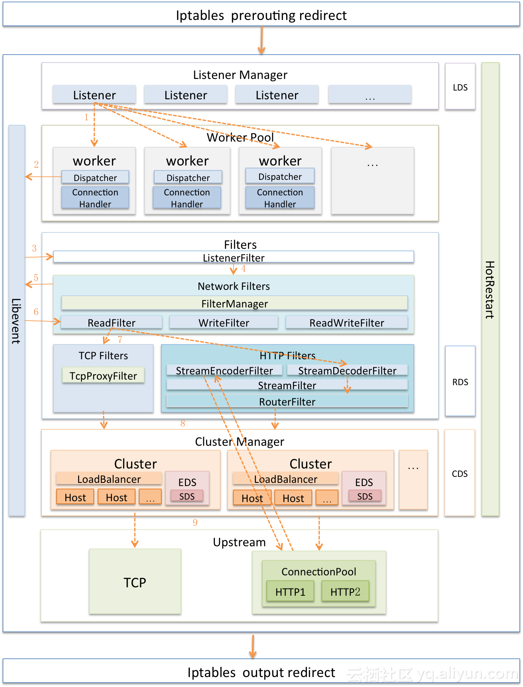
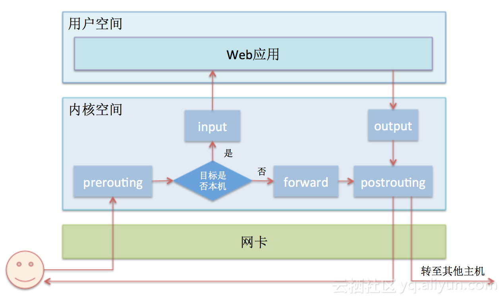

service mesh是未来cloud native的趋势，有必要花点时间和精力来学习一下他的实现原理，已经最新的大厂技术动态。国内相对比较厉害的蚂蚁金服开源了sofa-mesh、sofa-moson以及他们在支付宝的实践。看了之后，不觉明厉。内容真的很是丰富，特此学习、转发、分享、总结一下。

[博客地址](https://www.sofastack.tech/blog/)

[系列文章之一](https://www.sofastack.tech/blog/service-mesh-practice-in-production-at-ant-financial-part5-gateway/)


## 背景知识

Envoy快速入门：[入门文档](https://www.servicemesher.com/envoy/)

[官方文档（推荐）](https://www.envoyproxy.io/docs/envoy/latest/)

[envoy浅析](https://yq.aliyun.com/articles/606655)

在探究Envoy架构设计之前，我们先来看看Envoy自身是怎么描述其设计目标的，如下：

**Envoy并不是很慢（我们已经花了相当长的时间来优化关键路径）。基于模块化编码，易于测试，而不是性能最优。我们的观点是，在其他语言或者运行效率低很多的系统中，部署和使用Envoy能够带来很好的运行效率。**

非常有意思的表述，Envoy并没有把追求极致性能作为目标，那么其架构设计会弱化性能这块吗？

目前业内公认代理程序性能最好的是Nginx，其采用了per thread one eventloop模型，这种架构被业内普遍借鉴，那么Envoy呢？我们先看看下面的架构图：





看到里面Worker的工作方式是不是很熟悉，会不会有一点点困惑呢？Envoy采用了类Nginx的架构，方式是：多线程 + 非阻塞 + 异步IO（Libevent），虽然Envoy没有把极致性能作为目标，但不等于没有追求，只不过是相对于扩展性而言级别稍微低一点而已。

Envoy的另一特点是支持配置信息的热更新，其功能由XDS模块完成，XDS是个统称，具体包括ADS（Aggregated Discovery Service）、SDS（[Service Discovery Service](https://yq.aliyun.com/go/articleRenderRedirect?url=https%3A%2F%2Fwww.envoyproxy.cn%2FIntroduction%2FArchitectureoverview%2FDynamicconfiguration.html)）、EDS（[Endpoint Discovery Service](https://yq.aliyun.com/go/articleRenderRedirect?url=https%3A%2F%2Fwww.envoyproxy.cn%2FIntroduction%2FArchitectureoverview%2FDynamicconfiguration.html)）、CDS（[Cluster Discovery Service](https://yq.aliyun.com/go/articleRenderRedirect?url=https%3A%2F%2Fwww.envoyproxy.cn%2FIntroduction%2FArchitectureoverview%2FDynamicconfiguration.html)）、RDS（[Route Discovery Service](https://yq.aliyun.com/go/articleRenderRedirect?url=https%3A%2F%2Fwww.envoyproxy.cn%2FIntroduction%2FArchitectureoverview%2FDynamicconfiguration.html)）、LDS（[Listener Discovery Service](https://yq.aliyun.com/go/articleRenderRedirect?url=https%3A%2F%2Fwww.envoyproxy.cn%2FIntroduction%2FArchitectureoverview%2FDynamicconfiguration.html)）。XDS模块功能是向Istio的Pilot获取动态配置信息，拉取配置方式分为V1与V2版本，V1采用HTTP，V2采用gRPC。

**Envoy还支持热重启，即重启时可以做到无缝衔接，其基本实现原理是：**

1. 将统计信息与锁放到共享内存中。
2. **新老进程采用基本的RPC协议使用Unix Domain Socket通讯。**
3. **新进程启动并完成所有初始化工作后，向老进程请求监听套接字的副本。**
4. **新进程接管套接字后，通知老进程关闭套接字。**
5. 通知老进程终止自己。

Envoy同样也支持Lua编写的Filter，不过与Nginx一样，都是工作在HTTP层，具体实现原理都一样，不做赘述了。

到此为止我们看完了上面的架构图，如果你对其内部实现也有兴趣的话，可以看看下面的内部实现类图：


其内部实现为了灵活性，做了很多抽象封装，但基本上可以拆分为几个大的功能模块，具体如上图，不再赘述。

## Envoy性能谈

软件的世界从来就不存在什么银弹，虽然ServiceMesh优势很明显，甚至被尊称为服务间的通讯层，但不可否认的是ServiceMesh的到来确实对应用的性能带来了损耗，可以从两个方面看待此问题：

1. 数据面板中Sidecar的加入增加了业务请求的链路长度，必然会带来性能的损耗，由此延伸可知请求转发性能的高低必然会成为各个Sidecar能否最终胜出的关键点之一。
2. 控制面板采用的是集中式管理，统一负责请求的合法性校验、流控、遥测数据的收集与统计，而这要求Sidecar每转发一个请求，都需要与控制面板通讯，例如对应到Istio的架构中，这部分工作是由Mixer组件负责，那么可想而知这里必然会成为性能瓶颈之一，针对这个问题Istio官方给出了解决方案，即将Mixer的大部分工作下放到Sidecar中，对应到Envoy中就是新增一个MixerFilter来承担请求校验、流控、数据收集与统计工作，MixerFilter需要定时与Istio通讯以批量上报数据与拉取最新配置数据。这种方式在Istio之前微博的Motan、华为Mesher、唯品会的OSP中已经这么做了。

本节主要谈论Envoy在性能方面的努力及社区在性能方面呼声较高的一些内容。

Envoy作为Sidecar其提供的核心功能可以简单总结为以下三点：

1. 对业务透明的请求拦截。
2. 对拦截请求基于一定规则做校验、认证、统计、流量调度、路由等。
3. 将请求转发出去，在ServiceMesh中所有的流量出入都要经过Sidecar，即由Sidecar承担起所有的网络通讯职责，由此可知请求转出后的下一个接收方也必然是Sidecar，那么Sidecar之间通讯协议的高效与否对ServiceMesh整体性能也会产生较大影响。

从上述三点中我们试着分析下性能优化的关键点，其中第1、3点是与业务基本无关的，属于通用型功能，而第2点的性能是与业务复杂度呈现相关性的，比如请求校验规则的多与少、遥测数据的采集精细度、数据统计的维度多样性等，因此最有可能提升Sidecar性能的点就是对请求的拦截与Sidecar之间通讯协议的高效性。

针对**请求的拦截**，目前常规的做法是使用iptables，在部署Sidecar时配置好iptables的拦截规则，当请求来临后iptables会从规则表中从上至下顺序查找匹配规则，如果没遇到匹配的规则，就一条一条往下执行，如果遇到匹配的规则，那就执行本规则并根据本规则的动作(accept, reject, log等)，决定下一步执行的情况。为了更直观的展示iptables的执行过程，请看下图：




了解iptables的基本流程后，不难发现其性能瓶颈主要是两点：

1. 在规则配置较多时，由于其本身顺序执行的特性，性能会下滑严重。
2. 每个request的处理都要经过内核态--->用户态--->内核态的过程，这其中会带来数据从内核态拷贝到用户态的，再拷贝到内核态的性能消耗，单次请求来看这种消耗很少，但是作为流量进出的守门人，可想而知每秒进出的请求量必然是一个很高的数字，其累积的消耗也必然很高，再进一步分析由于网络中大量数据包的到来，会产生频繁的硬件中断、上下文切换，甚至是一个数据包在多个CPU核之间切换处理，这些因素叠加起来会对性能造成更大的损耗。

既然知道了iptables的缺陷，那么优化手段不外乎从这两点下手，而Linux社区与Envoy社区也正在计划对此做优化，具体如下：

1. Linux内核社区最近发布了bpfilter，一个使用Linux BPF提供的高性能网络过滤内核模块，计划用来替代netfilter作为iptables的内核底层实现，实现Linux用户向BPF过渡的换心手术。
2. Envoy社区目前正在推动官方重构其架构，目的是为了支持自定义的network socket实现，当然最终目的是为了添加VPP(Vector Packet Processing)、Cilium扩展支持，无论使用VPP或Cilium都可以实现数据包在纯用户态或者内核态的处理，避免内存的来回拷贝、上下文切换，且可以绕过Linux协议栈，以提高报文转发效率，进而达到提升请求拦截效率的目的。

为什么规避Linux正常协议处理过程中内核态与用户态的转换如此重要呢？就以对我们最直观的内存拷贝为例，正常情况下，一个网络数据包从网卡到应用程序需要经过如下的过程：数据从网卡通过 DMA 等方式传到内核开辟的缓冲区，然后从内核空间拷贝到用户态空间，在 Linux 内核协议栈中，这个耗时操作甚至占到了数据包整个处理流程的 57.1%。为了更直观的对内存拷贝消耗有所了解，画了一张简图，如下：


## 简说DPDK

DPDK全称Intel Data Plane Development Kit，是Intel提供的数据平面开发工具集，**为Intel Architecture（IA）处理器架构下用户空间高效的数据包处理提供库函数和驱动的支持**，它**不同于Linux系统以通用性设计为目的，而是专注于网络应用中数据包的高性能处理，它将数据包处理、内存管理、处理器调度等任务转移到用户空间完成**，而内核仅仅负责部分控制指令的处理。这样就**解决了处理数据包时的系统中断、上下文切换、系统调用、系统调度等问题。**

`VPP`是*the vector packet processor*的简称，是一套基于DPDK的网络帧处理解决方案，是一个可扩展框架，提供开箱即用的交换机/路由器功能。是Linux基金会下开源项目FD.io的一个子项目，由思科贡献的开源版本，目前是FD.io的最核心的项目。

整个DPDK还是非常复杂的，通过一两篇文章很难说清楚，且本文重点也不在DPDK，因此下面只简单介绍下其基本原理，让我们大致清楚为什么Envoy引入VPP后可以大幅提升请求处理转发效率。

为了说清楚DPDK是如何大幅提升了数据包的处理性能，我们先看一下普通的数据包在Linux中的收发过程，如下图：


通过上面两张图我们可以大致清楚数据包的一个完整的收发过程，可以看到**整个处理链路还是比较长的，且需要在内核态与用户态之间做内存拷贝、上下文切换、软硬件中断等**。

**虽然Linux设计初衷是以通用性为目的的，但随着Linux在服务器市场的广泛应用，其原有的网络数据包处理方式已很难跟上人们对高性能网络数据处理能力的诉求**。

在这种背景下DPDK应运而生，其**利用UIO技术，在Driver层直接将数据包导入到用户态进程，绕过了Linux协议栈，接下来由用户进程完成所有后续处理，再通过Driver将数据发送出去。**

**原有内核态与用户态之间的内存拷贝采用mmap将用户内存映射到内核，如此就规避了内存拷贝、上下文切换、系统调用等问题，然后再利用大页内存、CPU亲和性、无锁队列、基于轮询的驱动模式、多核调度充分压榨机器性能，从而实现高效率的数据包处理**。

说了这么多，接下来我们看下在DPDK中数据包的收发过程，如下图：


通过对比得知，**DPDK拦截中断，不触发后续中断流程，并绕过内核协议栈，通过UIO（Userspace I/O）技术将网卡收到的报文拷贝到应用层处理，报文不再经过内核协议栈。**

减少了中断，**DPDK的包全部在用户空间使用内存池管理，内核空间与用户空间的内存交互不用进行拷贝，只做控制权转移，减少报文拷贝过程，提高报文的转发效率**。

DPDK能够绕过内核协议栈，本质上是得益于 UIO 技术，UIO技术也不是DPDK创立的，是内核提供的一种运行在用户空间的[I/O](https://yq.aliyun.com/go/articleRenderRedirect?url=http%3A%2F%2Fbaike.baidu.com%2Fsubview%2F300881%2F11169495.htm)技术，[Linux](https://yq.aliyun.com/go/articleRenderRedirect?url=http%3A%2F%2Fbaike.baidu.com%2Fview%2F1634.htm)系统中一般的驱动设备都是运行在[内核](https://yq.aliyun.com/go/articleRenderRedirect?url=http%3A%2F%2Fbaike.baidu.com%2Fview%2F1366.htm)空间，在用户空间用的程序调用即可，UIO则是将[驱动](https://yq.aliyun.com/go/articleRenderRedirect?url=http%3A%2F%2Fbaike.baidu.com%2Fsubview%2F43111%2F5071586.htm)的很少一部分运行在内核空间，绝大多数功能在用户空间实现**，通过 UIO 能够拦截中断，并重设中断回调行为，从而绕过内核协议栈后续的处理流程**。

那么UIO是如何拦截中断的呢？我们先看看作为一个设备驱动的两个主要职责：

1. **存取设备的内存**。**UIO 核心实现了mmap可以处理物理内存、逻辑内存、虚拟内存。UIO驱动的编写是就不需要再考虑这些繁琐的细节**。
2. **处理设备产生的中断**。设备中断的应答是必须在内核空间的，因此**UIO只把非常小的一部分代码逻辑放在内核，剩余逻辑全部留给用户空间进程处理**。

UIO的实现机制其实是对用户空间暴露文件接口，比如当注册一个 UIO 设备 uioX，就会出现文件 /dev/uioX，对该文件的读写就是对设备内存的读写。除此之外，对设备的控制还可以通过 /sys/class/uio 下的各个文件的读写来完成。UIO架构及流程图如下，不再赘述。

说完了DPDK，那么Cilium又是如何提高报文转发效率呢？

既然[Cilium](https://yq.aliyun.com/go/articleRenderRedirect?url=https%3A%2F%2Fgithub.com%2Fcilium%2Fcilium) 是基于 eBPF 和 XDP 实现的，而XDP归根结底也是利用eBPF为Linux内核提供高性能、可编程的网络数据路径框架，既然核心是eBPF，那么我们先了解下eBPF是什么。

## 简说eBPF与XDP

`eBPF`（**extended Berkeley Packet Filter**）起源于BPF，它提供了内核的数据包过滤机制。Linux 3.15 开始引入 eBPF。其**扩充了 BPF 的功能，丰富了指令集。**它在内核提供了一个虚拟机，**用户态将过滤规则以虚拟机指令的形式传递到内核，由内核根据这些指令来过滤网络数据包。**直白地讲就是**我们可以让内核按照我们的规则来对数据包进行处理，包括未进入协议栈之前的处理哦**，**有没有瞬间觉得eBPF很牛逼**，既然都这么强大了，有没有什么最佳实践或者应用呢？请看下图：

我们可以看到**XDP**本身就是一个**eBPF**的最佳实践，由于其他内容跟本文档讨论内容无关，不再展开。作为eBPF是如何工作以提供强大的能力呢？请看下图：

**首先是将用户的.c文件编译后自动生成eBPF 字节码文件，也就是一堆的指令集合，其次通过系统调用将字节码注入到内核，然后内核验证合法性，通过校验后使用JIT将其run起来，用户程序与run起来的eBPF程序使用内核提供的标准Maps做数据交换。**

与DPDK的内存全部在用户空间来避免内存拷贝、上下文切换、系统调用等不同，eBPF都是在内核空间执行的。但**两者的核心都是通过避免数据包在内核态与用户态之间的往复来提升转发效率。**

说完了eBPF，接下来该XDP粉墨登场了。**XDP（eXpress Data Path）为Linux内核提供了高性能、可编程的网络数据路径**。**由于网络包在还未进入网络协议栈之前就处理，它给Linux网络带来了巨大的性能提升**（性能比DPDK还要高）。

**XDP在Linux内核4.8中引入，在数据包到达协议栈、分配sk_buff之前拦截**，不同于DPDK的是**XDP是作为内核功能的一部分，是与内核协同工作的**。其基本处理流程如下图：

**XDP同样将用户程序编译后生成eBPF字节码文件，注入内核执行包过滤。XDP包过滤是在数据包进入内核协议栈之前，如果判断数据包不需进一步处理可直接在内核态转发数据包，如果判断TX设备来不及处理会直接丢包，如果判断数据包需再处理则转给协议栈。**

而为什么会有XDP比DPDK更高效的结论呢？也许通过下面这张图你可以自己找到答案。

作为数据报文处理的新贵，其带来的性能优势是不言而喻，但XDP真的那么完美吗？

答案一定是否定的，其缺点有二：

1. XDP不提供缓存队列（qdisc），TX设备太慢时直接丢包，因而不要在RX比TX快的设备上使用XDP。
2. XDP程序是专用的，不具备网络协议栈的通用性。

聊了那么多关于eBPF与XDP的内容，其在业界存在最佳实践吗？是的，目前facebook开源的katran项目，使用的正是这两项技术，据称其**从IPVS转到eBPF后，使其性能提高了10倍。**Linux**社区中有人用XDP编写的一个简单的入口防火墙就可以轻松实现每秒处理1100万个数据包的性能。**

## 简说QUIC协议

说完了如何高效的转发请求，接下来我们聊聊Sidecar之间如何高效的通讯。

提到通讯那就一定要提及通讯协议了，作为我们耳熟能详的两大基本通讯协议TCP与UDP的优缺点这里就不再赘述了，那么我们是否能整合TCP与UDP两者的优点呢，这样既保证了TCP的可靠与安全性，又兼具UDP的速度与效率，不可否认的是往往正是出于人们对美好事物的向往，才持续不断的推动我们前进的脚本。QUIC在这种期许下诞生，旨在创建几乎等同于TCP的独立连接，但有着低延迟，并对类似SPDY的多路复用流协议有更好的支持。

QUIC协议本身就内置TLS栈，实现自己的[传输加密层](https://yq.aliyun.com/go/articleRenderRedirect?url=https%3A%2F%2Fdocs.google.com%2Fdocument%2Fd%2F1g5nIXAIkN_Y-7XJW5K45IblHd_L2f5LTaDUDwvZ5L6g%2Fedit)，而没有使用现有的TLS 1.2。同时QUIC还包含了部分HTTP/2的实现，因此QUIC的地位看起来是这样的：

QUIC协议的诞生就是为了降低网络延迟，开创性的使用了UDP协议作为底层传输协议，通过多种方式减少了网络延迟。因此带来了性能的极大提升，且具体的提升效果在Google旗下的YouTube已经验证。

既然QUIC协议相比现有其他的协议更具优势 ，那是否也可以将其应用到Envoy中呢？Envoy社区正在推动官方重构其架构的目的之一就是为了QUIC，最终目的是希望使用QUIC作为Sidecar之间的通讯协议。

试想一下如果Envoy应用了上述技术，性能会有怎样的提升呢？这个就留给各位看官自行脑补吧。

读到这里不知各位是否会产生这样的疑问，目前作为ServiceMesh中数据面板的Sidecar有好几个，为什么只有Envoy社区在性能方面呼声最高呢？这就牵扯到一个老掉牙的话题了，因为Envoy是C系语言编写的，在应用OS特性时有着先天优势。

## 杂谈

上节内容提到目前有与Envoy同类的几个程序，包括Linkerd、Conduit、NginMesh，下面就以个人所知简单描述下各自的特点，仅供诸位参考。

就个人而言，其实挺希望Conduit的壮大，正如其设计初衷说的那样：轻量化，相比Istio这种重部署模式来讲，非常适合小规模业务的快速上手，且Conduit与Linkerd系出同门，足以保证其设计理念的先进性，虽然Buoyant公司宣称Conduit与Linkerd的目标不同，但细想下来未尝Buoyant公司没有存在一丝不甘，希望推出一个完整的Service Mesh方案来颠覆Istio一家独大的局面，夺回Service Mesh开创者的殊荣。

下面是各自的特性简述。

**NginMesh**：

1. Golang实现。
2. Sidecar实现模式：agent + nginx，agent负责监听Istio的配置变化（例如路由规则、集群信息、服务发现等），并将其转换为nginx的配置，然后通过重启nginx应用配置。
3. 与istio、k8s强绑定，使用k8s的Initializer机制实现sidecar的自动注入。
4. 目前尚未在生产环境验证。
5. 虽然nginx也可以使用ngixscript/lua进行扩展，但大多局限于http处理上，对于L3L4的过滤上就无能无力了。
6. 部署图如下：
   

NginMesh给人的感觉更多的像是做了一个Istio的桥接器，只负责把Istio的配置信息翻译成Nginx所知的，通过重启Nginx的方式应用配置。给我的感觉仅仅是为了搭上ServiceMesh的顺风车而临时推出的一个方案。

**Linkerd**：

1. Scala语言开发，运行在Java虚拟机上，“Service Mesh”概念的缔造者，经生产环境验证可靠的。
2. 构建基于Netty、Finagle上，工作于RPC层。
3. 插入式的服务发现，例如File-based、Zookeeper、k8s。
4. 由于工作在RPC层，可根据实时观测到的RPC延迟、要处理请求队列大小决定如何分发请求，优于传统启发式负责均衡算法，例如LRU、TCP活动请求等。
5. 提供多种负载均衡算法如：Power of Two Choices (P2C): Least Loaded、Power of Two Choices: Peak EWMA、Aperture: Least Loaded、Heap: Least Loaded以及Round-Robin。
6. 数据流程图如下：
   

作为“Service Mesh”概念的缔造者、布道者，最终却在Service Mesh的大潮中，被由Google、IBM、Lft联手打造的Istio + Envoy打败，不得不感叹巨头的强大与初创公司的弱小与艰辛，由衷的希望看到Conduit的崛起，逆杀Istio。话说这是不是典型的弱者心态啊，哈哈。

**Conduit**：

1. 脱胎于Linkerd，针对Linkerd部署模型太重的问题，其秉承的设计目标是成为最快、最轻、最简单的Service Mesh，使用Rust构建数据平面，使用Go构建控制平面。与Linkerd同出Buoyant公司。
2. 不同于Envoy、Linkerd是数据平面，Istio是控制平面，Conduit中既包括数据平面，也包括控制平面，控制平面提供API，用户通过Conduit CLI与Web UI使用。
3. 只能运行在K8s上。
4. 目前发布了0.3版本，仍然处于初期开发阶段。
5. 对经过Conduit proxy的流量，产生一系列的监控指标，指标格式是Prometheus的，内容存放在proxy监控端口的metrics路径下面，Prometheus可以直接抓取指标内容，做聚合展示。
6. 利用Rust本身的语言安全特性来保证自身的安全性。


## 一些问题

- 和现有的服务注册中心如何整合
- 监听的链接是怎么管理的
- 是怎么热更新listener的、热重启mosn的
- 请求的数据流路径


带着这些问题，我们来深入探究一下mosn这个数据平面的实现原理。


### Mosn


​	


### 当前存在的痛点

本质上当前的mainstay服务治理框架并没有什么迫切的痛点需求，但是还存在着下面这些问题还是比较麻烦的：

- sdk升级困难，bug修复、新功能推广的迭代周期太长，版本管理困难。
- 公司属于java技术栈，多多语言的支持力度还是比较弱，很多java里面的功能，其他语言没有。
- zk和nacos混合部署作为注册中心，有时候数据同步存在不稳定性；

====》中间加一层sidecar，解决这些问题。


### 新SDK开发需要遵循的规则

1. 注册／发现／订阅（http—>localhost:port/xxx/(nacos服务相关接口)，主要功能代理nacos的服务发现）
2. 接口与nacos一致，请求、返回参数一致（http接口）
3. sdk功能精简：
   1. 连接池的维护
   2. thrift协议相关的编解码（可放在sidecar里面进行，SDK简化成普通的http接口，即HTTP与Thrift协议相关转换）
   3. 路由相关（下沉到sidecar，可兼容旧的SDK，只返回一个host，不构成旧SDK的路由策略。App—>sidecar(localhost)——>路由决策—>流量转发到Service）
   4. 存在的问题，之前xdcs filter下沉到哪里？
4. 支持多语言，可针对不同语言开发sdk。（本质上，可以抽象一个通用的协议，统一接口，兼容老的SDK的方式）

### 现有SDK的兼容性（mainstay sdk）

1. **流量劫持**：之前的SDK走的是zk、nacos的服务发现。
   1. 可使用iptables劫持访问zk的请求port，解析转换成sidecar支持的协议，并返回zk的格式。
   2. nacos也是劫持他的端口信息，格式转化，返回相应的数据。
2. **部署机制**：
   1. 每台物理机器上，运行相关的sidecar-agent实例+sidecar配合；
   2. 每个Pod上和物理机一致，流量劫持、运行sidecar；
3. 其实，接不劫持没有啥关系。本质上走的还是服务注册中心的套路；走劫持就是为了扩大service mesh的规模，实验特性；

### DP：需要具备的能力

1. 热重启、热更新；
2. Admin后台，查看当前DP的状态；
3. 服务发现服务，用于微服务的发布、订阅；
4. metric接口（prometheus采集数据，实时反馈）；
5. Proxy流量转发、不同协议之间的转换；
6. XDS服务发现，动态拉取配置信息（Clusters、Routes）
7. 其他，redis、mysql、mq等mesh

**解决方案**：

- 采用开源的Envoy。
  - **缺点**：不能够自定义一些功能，和当前的技术栈脱钩。理想与现实的问题（当前的mainstay服务注册不兼容，不接地气）
  - **优点**：社区维护，稳定，投入成本低。
- 基于mosn进行二次开发。提供精简的核心骨干功能。
  - **缺点**：和社区脱离，需要维护和社区的进度。
  - **优点**：自由度高，可进行定制化开发。

### CP：精简Istio pilot功能

1. 路由配置（手动、自动。自动：监测pod的annotaion动态配置）
2. Nacos服务发现整合

**解决方案**：

- **基于Istio进行二次开发**，服务发现、路由匹配，ads、cds、eds（xds服务）。主动下发。


#### 运维能力

- 动态升级
- DashBoard
- 事件记录
- 容器注入


### 0. 整体目标


**双模微服务平台**

『基于 SDK 的传统微服务』可以和『基于 Sidecar 的 Service Mesh 微服务』实现下列目标：

- 互联互通：两个体系中的应用可以相互访问；
- 平滑迁移：应用可以在两个体系中迁移，对于调用该应用的其他应用，做到透明无感知；
- 异构演进：在互联互通和平滑迁移实现之后，我们就可以根据实际情况进行灵活的应用改造和架构演进；

在控制面上，我们引入了 Pilot 实现配置的下发（如服务路由规则），在服务发现上保留了独立的 SOFA 服务注册中心。

在数据面上，我们使用了自研的 MOSN，不仅支持 SOFA 应用，同时也支持 Dubbo 和 Spring Cloud 应用。在部署模式上，我们不仅支持容器 /K8s，同时也支持虚拟机场景。


### 1. 服务发现


### 平滑迁移

平滑迁移可能是整个方案中最为重要的一个环节了，前面也提到，在目前任何一家公司都存在着大量的 Brownfield 应用，它们有些可能承载着公司最有价值的业务，稍有闪失就会给公司带来损失，有些可能是非常核心的应用，稍有抖动就会造成故障，所以对于 Service Mesh 这样一个大的架构改造，平滑迁移是一个必选项，同时还需要支持可灰度和可回滚。

得益于独立的服务注册中心，我们的平滑迁移方案也非常简单直白：

**1. 初始状态**

以一个服务为例，初始有一个服务提供者，有一个服务调用者。


**2. 透明迁移调用方**

在我们的方案中，对于先迁移调用方还是先迁移服务方没有任何要求，这里假设调用方希望先迁移到 Service Mesh 上，那么只要在调用方开启 Sidecar 的注入即可，服务方完全不感知调用方是否迁移了。所以调用方可以采用灰度的方式一台一台开启 Sidecar，如果有问题直接回滚即可。


**3. 透明迁移服务方**

假设服务方希望先迁移到 Service Mesh 上，那么只要在服务方开启 Sidecar 的注入即可，调用方完全不感知服务方是否迁移了。所以服务方可以采用灰度的方式一台一台开启 Sidecar，如果有问题直接回滚即可。


**4. 终态**


### 实现步骤

#### 基于单机Proxy+pilot的开发

- 实现核心的网络代理、路由转发、热更新重启功能
- 与pilot通信，基于xds协议的grpc双向通信
- 


### 代码分析

#### listener

```go
func (l *listener) Start(lctx context.Context, restart bool) {
	defer func() {
		if r := recover(); r != nil {
			log.DefaultLogger.Errorf("[network] [listener start] panic %v\n%s", r, string(debug.Stack()))
		}
	}()

	if l.bindToPort {
		ignore := func() bool {
			l.mutex.Lock()
			defer l.mutex.Unlock()
			switch l.state {
			case ListenerRunning:
				// if listener is running, ignore start
				return true
			case ListenerStopped:
				if !restart {
					return true
				}
				if err := l.listen(lctx); err != nil {
					// TODO: notify listener callbacks
					return true
				}
			default:
				// try start listener
				//call listen if not inherit
				if l.rawl == nil {
					if err := l.listen(lctx); err != nil {
						// TODO: notify listener callbacks
					}
				}
			}
			l.state = ListenerRunning
			return false
		}()
		if ignore {
			return
		}

		for {
			if err := l.accept(lctx); err != nil {
				if nerr, ok := err.(net.Error); ok && nerr.Timeout() {
					return
				} else if ope, ok := err.(*net.OpError); ok {
					// not timeout error and not temporary, which means the error is non-recoverable
					// stop accepting loop and log the event
					if !(ope.Timeout() && ope.Temporary()) {
						// accept error raised by sockets closing
						if ope.Op == "accept" {
							log.DefaultLogger.Infof("[network] [listener start] [accept] listener %s %s closed", l.name, l.Addr())
						} else {
			
						}
						return
					}
				} else {
				
				}
			}
		}
	}
}

if ignore {
			return
		}
		for {
			if err := l.accept(lctx); err != nil {
				if nerr, ok := err.(net.Error); ok && nerr.Timeout() {
					log.DefaultLogger.Infof("[network] [listener start] [accept] listener %s stop accepting connections by deadline", l.name)
					return
				} else if ope, ok := err.(*net.OpError); ok {
					// not timeout error and not temporary, which means the error is non-recoverable
					// stop accepting loop and log the event
					if !(ope.Timeout() && ope.Temporary()) {
						// accept error raised by sockets closing
						if ope.Op == "accept" {
							log.DefaultLogger.Infof("[network] [listener start] [accept] listener %s %s closed", l.name, l.Addr())
						} else {
							log.DefaultLogger.Errorf("[network] [listener start] [accept] listener %s occurs non-recoverable error, stop listening and accepting:%s", l.name, err.Error())
						}
						return
					}
				} else {
					log.DefaultLogger.Errorf("[network] [listener start] [accept] listener %s occurs unknown error while accepting:%s", l.name, err.Error())
				}
			}
		}
```


处理流程：

1. 判断当前的listener状态，决定是否start
2. 打开listen
3. 开始accept，loop循环监听

```go
func (l *listener) listen(lctx context.Context) error {
	var err error
	var rawl *net.TCPListener
	if rawl, err = net.ListenTCP("tcp", l.localAddress.(*net.TCPAddr)); err != nil {
		return err
	}
	l.rawl = rawl
	return nil
}
```


Accept获取当前listener的连接Conn，之后异步触发`ListenerEventListener`的Accept的监听事件，根据获取到的rawConn进行相关的处理：

```go
func (l *listener) accept(lctx context.Context) error {
   rawc, err := l.rawl.Accept()

   if err != nil {
      return err
   }

   // TODO: use thread pool
   utils.GoWithRecover(func() {
      l.cb.OnAccept(rawc, l.useOriginalDst, nil, nil, nil)
   }, nil)

   return nil
}
```


```go
//   The bunch of interfaces are structure skeleton to build a high performance, extensible network framework.
//
//   In mosn, we have 4 layers to build a mesh, net/io layer is the fundamental layer to support upper level's functionality.
//	 -----------------------
//   |        PROXY          |
//    -----------------------
//   |       STREAMING       |
//    -----------------------
//   |        PROTOCOL       |
//    -----------------------
//   |         NET/IO        |
//    -----------------------
//


//Stream layer leverages protocol's ability to do binary-model conversation. In detail, Stream uses Protocols's encode/decode facade method and DecodeFilter to receive decode event call.


//   Listener:
//   	- Event listener
// 			- ListenerEventListener
//      - Filter
// 			- ListenerFilter

//   Connection:
//		- Event listener
// 			- ConnectionEventListener
//		- Filter
// 			- ReadFilter
//			- WriteFilter

//
//   Below is the basic relation on listener and connection:
//    --------------------------------------------------
//   |                                      			      |
//   | 	  EventListener       EventListener     		    |
//   |        *|                   |*          		      |
//   |         |                   |       				      |
//   |        1|     1      *      |1          		    	|
// 	 |	    Listener --------- Connection      		    	|
//   |        1|      [accept]     |1          	    		|
//	 |         |                   |-----------         |
//   |        *|                   |*          |*       |
//   |	 ListenerFilter       ReadFilter  WriteFilter   |
//   |                                                  |
//    --------------------------------------------------

```


Core model in network layer are **listener** and **connection**. Listener listens specified port, waiting for new connections.

Both **listener** and **connection** have **a extension mechanism, implemented as listener and filter chain, which are used to fill in customized logic.**

**Event listeners** are used to **subscribe important event of Listener and Connection**. Method in listener will be called on event occur, but **not effect the control flow**.

**Filters are called on event occurs, it also returns a status to effect control flow.** Currently 2 states are used: `Continue` to let it go, `Stop` to stop the control flow.

**Filter** has **a callback handler** to interactive with core model. For example, `ReadFilterCallbacks` can be used to continue filter chain in connection, on which is in a stopped state.


**RequestInfo** has information for a request, include the basic information, the request's downstream information, ,the request's upstream information and the router information.

**Routers** defines and manages all router
**RouterManager** is a manager for all routers' config


**Core model in stream layer is stream, <u>which manages process of a round-trip, a request and a corresponding response</u>.**

**Event listeners** can be installed into a stream to monitor event.

**Stream** has two related models, **encoder** and **decoder**:

- **StreamSender**: a sender encodes request/response to binary and sends it out, flag 'endStream' means data is ready to sendout, no need to wait for further input.
- **StreamReceiveListener**: It's more like a decode listener to get called on a receiver receives binary and decodes to a request/response.
- **Stream** does not have a predetermined direction, so `StreamSender` could be a request encoder as a client or a response encoder as a server. It's just about the scenario, so does `StreamReceiveListener`.

//   Stream:
//      - Encoder
//           - StreamSender
//      - Decoder
//           - StreamReceiveListener

Event listeners:

- `StreamEventListener`: listen **stream** event: `reset`, `destroy`.

- `StreamConnectionEventListener`: listen **stream connection** event: `goaway`.

In order to meet the expansion requirements in the stream processing, `StreamSenderFilter` and `StreamReceiverFilter` are introduced as **a filter chain in encode/decode process**.
**Filter's method will be called on corresponding stream process stage and returns a status(Continue/Stop) to effect the control flow.**

**From an abstract perspective, stream represents a virtual process on underlying connection**. To make stream interactive with connection, some intermediate object can be used.
**StreamConnection** is the core model to connect connection system to stream system. 

**As a example, when proxy reads binary data from connection, it dispatches data to StreamConnection to do protocol decode.** 流主要用于协议的编解码。
Specifically, `ClientStreamConnection` uses a `NewStream` to exchange `StreamReceiveListener` with `StreamSender`.
`Engine` provides a callbacks(`StreamSenderFilterHandler`/`StreamReceiverFilterHandler`) to let filter interact with stream engine.
As a example, a encoder filter stopped the encode process, it can continue it by `StreamSenderFilterHandler`.`ContinueSending` later. Actually, a filter engine is a encoder/decoder itself.

#### 核心Model 接口定义

`Stream` 是一个通用的协议流，它是stream层里面的核心Model。

```go
// Stream is a generic protocol stream, it is the core model in stream layer
type Stream interface {
	// ID returns unique stream id during one connection life-cycle
  //ID表示一个连接生命周期里面的唯一表示
	ID() uint64

	// AddEventListener adds stream event listener
  // 添加流事件监听器
	AddEventListener(streamEventListener StreamEventListener)

	// RemoveEventListener removes stream event listener
  // 删除流事件的监听器
	RemoveEventListener(streamEventListener StreamEventListener)

	// ResetStream rests and destroys stream, called on exception cases like connection close.
	// Any registered StreamEventListener.OnResetStream and OnDestroyStream will be called.
  //根据流重置的原因，重置并销毁流 StreamEventListener.OnResetStream OnDestroyStream会被调用
	ResetStream(reason StreamResetReason)

	// DestroyStream destroys stream, called after stream process in client/server cases.
	// Any registered StreamEventListener.OnDestroyStream will be called.
  // 在client／server流处理完成之后，销毁流
	DestroyStream()
}
```

#### 1. 发送接口

`StreamSender` 编码并发送协议流。

- 在服务端场景，`StreamSender`发送返回响应
- 在客户端场景，`StreamSender`发送请求

```go
// StreamSender encodes and sends protocol stream
// On server scenario, StreamSender sends response
// On client scenario, StreamSender sends request
type StreamSender interface {
	// Append headers
	// endStream supplies whether this is a header only request/response
  //添加请求、返回的头
	AppendHeaders(ctx context.Context, headers HeaderMap, endStream bool) error

	// Append data
	// endStream supplies whether this is the last data frame
  //添加请求、返回的数据体，endStream表示是否是最后的数据帧
	AppendData(ctx context.Context, data IoBuffer, endStream bool) error

	// Append trailers, implicitly ends the stream.
	AppendTrailers(ctx context.Context, trailers HeaderMap) error

	// Get related stream
  //获取相关的流
	GetStream() Stream
}
```

#### 2. 接收接口

`StreamReceiveListener` 当数据接收时被调用，并进行解码。

- 在服务端场景，StreamReceiveListener 被用来处理请求参数。
- 在客户端场景，StreamReceiveListener被用来处理返回参数。

```go
// StreamReceiveListener is called on data received and decoded
// On server scenario, StreamReceiveListener is called to handle request
// On client scenario, StreamReceiveListener is called to handle response
type StreamReceiveListener interface {
	// OnReceive is called with decoded request/response
  //被解码的请求／返回参数调用
	OnReceive(ctx context.Context, headers HeaderMap, data IoBuffer, trailers HeaderMap)

	// OnDecodeError is called with when exception occurs
  //当异常发生时调用
	OnDecodeError(ctx context.Context, err error, headers HeaderMap)
}
```


### StreamConnection 

`StreamConnection` 本质上是一个connection连接，跑了很多的stream。

```go
// StreamConnection is a connection runs multiple streams
type StreamConnection interface {
	// Dispatch incoming data
	// On data read scenario, it connects connection and stream by dispatching read buffer to stream,
	// stream uses protocol decode data, and popup event to controller
  //调度收到的数据。在数据读取的场景，他链接来了connection和stream两个对象：分配读缓冲区buffer到stream；
  //stream使用相关的协议解码数据，并且发送event到controller。
	Dispatch(buffer IoBuffer)

	// Protocol on the connection
	Protocol() Protocol

	// Active streams count 激活的流数量
	ActiveStreamsNum() int

	// GoAway sends go away to remote for graceful shutdown
  //发送 go way到远端的服务，优雅关闭连接
	GoAway()

	// Reset underlying streams
  //重置底层的流
	Reset(reason StreamResetReason)
}


```

#### 1. ServerStreamConnection 服务端侧流连接

```go

// ServerStreamConnection is a server side stream connection.
type ServerStreamConnection interface {
	StreamConnection
}
```

#### 2. ClientStreamConnection 客户端侧流连接

```go
// ClientStreamConnection is a client side stream connection.
type ClientStreamConnection interface {
	StreamConnection

	// NewStream starts to create a new outgoing request stream and returns a sender to write data
	// responseReceiveListener supplies the response listener on decode event
	// StreamSender supplies the sender to write request data
  //创建了一个外向的请求流 并且返回一个sender来发送数据。
  //responseReceiveListener 提供了应用于解码事件的response监听器
  //StreamSender 提供了应写请求数据的sender
	NewStream(ctx context.Context, responseReceiveListener StreamReceiveListener) StreamSender
}
```


#### 3. 流过滤器相关


```go
// StreamFilterHandler is called by stream filter to interact with underlying stream
//当与底层的流交互的时候，触发的流Filter
type StreamFilterHandler interface {
	// Route returns a route for current stream
  //返回一个路由，用于当前流的路由
	Route() Route

	// RequestInfo returns request info related to the stream
  //返回相关流的请求信息
	RequestInfo() RequestInfo

	// Connection returns the originating connection
	Connection() Connection
}
```


```go
// StreamSenderFilter is a stream sender filter
//StreamSenderFilter ：流发送过滤器
type StreamSenderFilter interface {
	StreamFilterBase

	// Append encodes request/response
  //扩展 编码请求／返回参数
	Append(ctx context.Context, headers HeaderMap, buf IoBuffer, trailers HeaderMap) StreamFilterStatus

	// SetSenderFilterHandler sets the StreamSenderFilterHandler
  //设置流发送处理器Handler
	SetSenderFilterHandler(handler StreamSenderFilterHandler)
}

// StreamSenderFilterHandler is a StreamFilterHandler wrapper
//流发送处理器Handler:流过滤处理器Handler的封装
type StreamSenderFilterHandler interface {
	StreamFilterHandler

	// TODO :remove all of the following when proxy changed to single request @lieyuan
	// StreamFilters will modified headers/data/trailer in different steps
	// for example, maybe modify headers in AppendData
	GetResponseHeaders() HeaderMap
	SetResponseHeaders(headers HeaderMap)

	GetResponseData() IoBuffer
	SetResponseData(buf IoBuffer)

	GetResponseTrailers() HeaderMap
	SetResponseTrailers(trailers HeaderMap)
}

// StreamReceiverFilter is a StreamFilterBase wrapper
type StreamReceiverFilter interface {
	StreamFilterBase

	// OnReceive is called with decoded request/response
	OnReceive(ctx context.Context, headers HeaderMap, buf IoBuffer, trailers HeaderMap) StreamFilterStatus

	// SetReceiveFilterHandler sets decoder filter callbacks
	SetReceiveFilterHandler(handler StreamReceiverFilterHandler)
}

// StreamReceiverFilterHandler add additional callbacks that allow a decoding filter to restart
// decoding if they decide to hold data
type StreamReceiverFilterHandler interface {
	StreamFilterHandler

	// TODO: consider receiver filter needs AppendXXX or not

	// AppendHeaders is called with headers to be encoded, optionally indicating end of stream
	// Filter uses this function to send out request/response headers of the stream
	// endStream supplies whether this is a header only request/response
	AppendHeaders(headers HeaderMap, endStream bool)

	// AppendData is called with data to be encoded, optionally indicating end of stream.
	// Filter uses this function to send out request/response data of the stream
	// endStream supplies whether this is the last data
	AppendData(buf IoBuffer, endStream bool)

	// AppendTrailers is called with trailers to be encoded, implicitly ends the stream.
	// Filter uses this function to send out request/response trailers of the stream
	AppendTrailers(trailers HeaderMap)

	// SendHijackReply is called when the filter will response directly
	SendHijackReply(code int, headers HeaderMap)

	// SendDirectRespoonse is call when the filter will response directly
	SendDirectResponse(headers HeaderMap, buf IoBuffer, trailers HeaderMap)

	// TODO: remove all of the following when proxy changed to single request @lieyuan
	// StreamFilters will modified headers/data/trailer in different steps
	// for example, maybe modify headers in on receive data
	GetRequestHeaders() HeaderMap
	SetRequestHeaders(headers HeaderMap)

	GetRequestData() IoBuffer
	SetRequestData(buf IoBuffer)

	GetRequestTrailers() HeaderMap
	SetRequestTrailers(trailers HeaderMap)

	SetConvert(on bool)
}
```


## 实现方案

采用Iostio+mosn来支持service mesh的部署，其中：

- Isotio使用其中的Pilot来动态发现服务
- mosn定期查询pilot来获取最新的配置，动态更新配置信息。


需要解决的问题：

- 服务的发现如何整合现有的技术栈：mainstay、southgate==>pilot对接
- 控制平面后台的可视化
- sidecar部署的方式，如何整合
- macvlan不支持serviceIp怎么破？===》必须升级到calico


### 第一期

目标：

- 实现node、c++这些需要直连静态ip的微服务
- 通过虚拟的VIP或者域名，可以访问到相关的服务（即，本地访问需要有一个标识符，表明我要访问的是哪个服务）


概念映射

| 术语 | Mainstay     | service mesh（envoy） |
| ---- | ------------ | --------------------- |
| 集群 | group        | 集群                  |
| 实例 | 每个服务实例 | 集群下面的HOST        |
|      |              |                       |
|      |              |                       |
|      |              |                       |
|      |              |                       |
|      |              |                       |


应用起来之后，应用属于那个集群（包含应用的元信息：app、version，用于路由）；


## 


